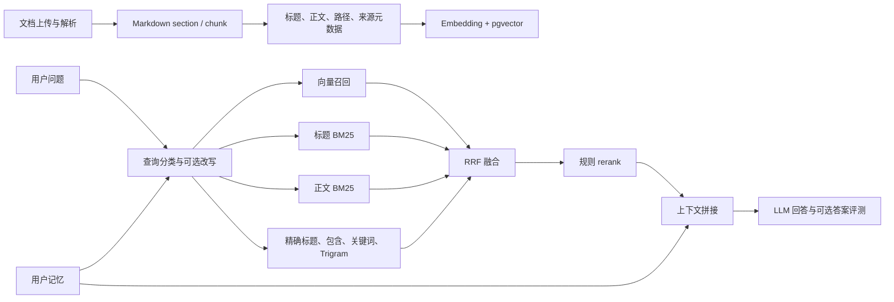
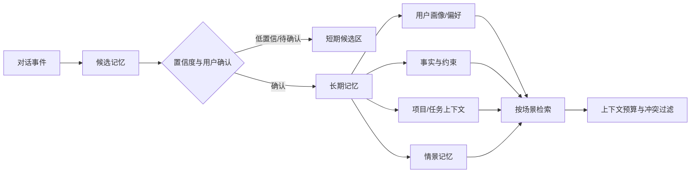

# JChatMind RAG 设计、效果评测与演进分析

> 文档性质：架构分析与后续建议，不修改业务代码。
> 
> 分析依据：仓库 README、`docs/reference/RAG评测框架架构设计.md`、`docs/reference/ai/rag-governance.md` 以及 `docs/records/rag/`、`docs/records/user-memory/` 下的阶段记录。

## 1. 结论摘要

JChatMind 当前的 RAG 已经具备较完整的工程骨架：文档切分与元数据、向量检索、标题和正文词法检索、多路召回、RRF 融合、规则重排序、查询改写、真实知识库小样本评测、线上 E2E 冒烟、跨文档 fixture、chunk 多样性指标和可选的 LLM-as-judge。

总体判断是“方向合理，评测与治理仍需收口”，而不是需要推倒重来。现有数据说明：

- 多路召回解决了单一向量检索对标题或词面场景的偏科问题。
- V4 规则 rerank 的主要收益体现在候选顺序前移：`Recall@10` 基本不变，但 `Recall@1`、`MRR@3` 明显提高，因此当前首要瓶颈更偏排序层。
- `query expansion` 在现有真实 KB 小样本上没有稳定净收益，LLM rewrite 不适合立即默认开启。
- 单文档 fixture 接近满分只能证明评测链路和基本逻辑正确，不能证明真实知识库泛化；多文档、长文档、主题相似文档和多轮追问才是更有价值的压力点。
- 记忆系统应继续作为可降级的辅助上下文层，不能成为聊天主链路的硬依赖。
- 目前不建议为了“看起来先进”立即引入多 Agent。应先把检索、排序、答案引用和记忆边界评测稳定，再在有明确职责和收益假设的地方拆分 Agent。

建议的总路线：先统一评测数据与指标，再做 rerank 和数据质量治理，然后补齐答案可验证性与记忆生命周期，最后再引入少量有边界的 Agent 协作。

## 2. 当前 RAG 设计梳理

### 2.1 已有链路

现有评测文档描述的主链路可以概括为：

该结构的关键设计取舍是：用向量检索覆盖语义表达，用词法通道补充专有名词、标题、编号和精确词面，再用 RRF 降低不同分数空间无法直接相加的问题，最后由 rerank 决定 Top1/TopK 顺序。

### 2.2 设计合理性

**多路召回是合理的。** 中文知识库通常同时存在自然语言描述、产品名、章节标题、编号、代码或专有术语。只使用 embedding 容易漏掉精确词面，只使用 BM25 又难以覆盖同义改写。当前通道组合覆盖面较好，RRF 也比未经校准的原始分数加权更稳妥。

**标题与正文信号分离是必要的。** 历史 V1/V2 结果显示，仅标题 embedding 的 `content_rewrite Recall@5` 约为 `0.2883`，加入正文后提升到约 `0.9632`，但标题精确召回下降。这证明标题和正文不是同一种信号，应在召回与排序阶段分别建模，而不宜继续靠机械增加标题重复次数解决全部问题。

**Top-10 候选再排序方向正确。** V3 到 V4 的记录显示，候选池的 `Recall@10` 未明显变化，而 `overall MRR@3` 从约 `0.7787` 提升到 `0.9104`，`content_rewrite MRR@3` 提升到约 `0.9593`。这符合“召回负责找得到，rerank 负责排得准”的职责分工。

**评测分层是合理的。** Multi-CPR 适合外部基准对比，内部 fixture/real 评测适合验证项目语料，online E2E 适合快速发现真实链路问题。三层评测比单一总分更能解释变化来源。

**记忆失败可降级是正确的。** 现有记录已明确长期记忆不是聊天主链路的必要条件。这个边界应保留，否则数据库迁移、embedding 服务或记忆查询故障会放大成全链路不可用。

### 2.3 当前风险与不足

1. **评测口径存在可比性风险。** 历史基线中有不同知识库、不同 section 数量和不同 gold 对齐策略。报告必须同时记录数据集版本、文档快照、chunking 版本、embedding 模型、召回深度和配置，否则分数变化可能只是评测尺子变化。
2. **fixture 满分不能代表真实效果。** 目前 fixture 多为人工构造、术语清晰、gold 唯一，容易得到 `Recall@K=1.0`。它适合回归，不适合估计线上质量。
3. **`excluded` 和 gold 对齐会影响总体分数。** `empty_rewrite_query`、重复正文、section 与 chunk 对不上时，如果只报告 evaluated 样本，可能掩盖数据管道问题。应把 coverage 作为一等指标，并将 excluded 按原因分层。
4. **当前 rerank 仍偏规则堆叠。** 局部 bonus 试验已出现对 `title_path`、`topic_switch_guard` 的副作用。继续增加 case-specific 权重容易过拟合，应该先固定排序目标和诊断切片。
5. **答案质量评测仍可能被 judge 偏置影响。** Faithfulness 和 Answer Relevancy 的 LLM-as-judge 适合趋势监控，不应作为唯一真值；需要人工小样本校准、结构化 JSON 输出和 judge 一致性检查。
6. **缺少拒答与引用正确性主指标。** 检索命中不等于答案可信。对无答案问题，系统是否能正确拒答；对有答案问题，回答是否引用正确 chunk、是否覆盖关键事实，都应进入验收。
7. **性能与成本尚未成为统一指标。** embedding、改写、rerank、答案生成的延迟、token、失败回退率和缓存命中率应随质量一起记录，否则容易用不可接受的成本换取小幅分数提升。
8. **多租户与权限边界需要在评测中显式验证。** 用户记忆和知识库检索都涉及用户/知识库范围。除功能正确性外，应增加“不可检索到其他用户或知识库内容”的负向测试。

## 3. RAG 效果如何量化

### 3.1 通用框架对比

| 工具/框架 | 主要用途 | 适合本项目的用法 | 注意点 |
| --- | --- | --- | --- |
| RAGAS | RAG 端到端评测，常见指标包括 Faithfulness、Answer Relevancy、Context Precision、Context Recall | 用作答案质量和上下文质量的指标定义参考 | 依赖 LLM judge；中文和领域术语需人工抽检 |
| DeepEval | Python 评测框架，支持 RAG、Agent、回归断言和自定义指标 | 在独立评测脚本中做 CI 门禁或实验对比 | 引入跨语言运行时和模型调用成本，先不必嵌入 Java 主工程 |
| TruLens | 记录调用链并评估 groundedness、context relevance、answer relevance | 做端到端 tracing 和反馈指标 | 更偏观测与实验平台，需要额外部署/接入 |
| Arize Phoenix | 开源 tracing、embedding 分布、检索和生成质量分析 | 诊断线上检索漂移、chunk 聚类和失败样本 | 适合后期观测，不是替代离线 gold set |
| LangSmith | 数据集、trace、评测和人工标注管理 | 若未来接受 SaaS/外部服务，可管理多轮 trace | 需要外部账号和数据合规评估 |
| BEIR / MTEB | 检索基准与 embedding 基准，不是完整 RAG 答案评测 | Multi-CPR 之外用于公开基准横向比较 | 不能替代项目真实知识库和答案评测 |

结论：对当前 Java 项目，不建议立即为引入某个框架而改造生产链路。更稳妥的做法是保留现有 JSON 报告格式，把 RAGAS 风格指标和自定义指标先接入独立评测层；当需要 tracing、人工标注或线上监控时，再评估 Phoenix、DeepEval 或 LangSmith。

### 3.2 推荐指标体系

**检索层：**

- `Recall@1/3/5/10`：gold 是否出现在前 K，衡量召回覆盖。
- `MRR@K`：第一个相关结果排名的倒数，衡量 Top1/早期排序。
- `nDCG@K`：适用于一个 query 有多个相关 chunk 或相关度分级的情况。
- `Hit@K`：线上冒烟和多轮 E2E 的直观指标。
- `Coverage`：可建立 gold 的 case 占全部 case 的比例，必须和 Recall 同时展示。
- `Duplicate / Diversity`：重复 chunk、重复路径、来源多样性，防止上下文被同一段落占满。

**上下文层：**

- `Context Precision`：返回的上下文中有多少与问题相关。
- `Context Recall`：回答所需事实是否被上下文覆盖。
- `Context Utilization`：最终答案真正使用了多少检索上下文，可通过引用或 judge 估计。
- `Citation Precision/Recall`：引用是否指向支持该事实的 chunk，以及关键事实是否都有引用。

**生成层：**

- `Faithfulness / Groundedness`：答案是否能被上下文支持。
- `Answer Relevancy`：是否直接回答问题。
- `Answer Correctness`：与人工参考答案或结构化事实是否一致。
- `Completeness`：多事实问题是否覆盖全部必要点。
- `Abstention Accuracy`：知识库无答案时是否拒答，避免幻觉。

**系统层：**

- p50/p95/p99 首 token 与完整响应延迟。
- 每次请求 embedding、rewrite、rerank、generation 的 token 和费用。
- embedding 缓存命中率、重试率、降级率、超时率。
- 检索结果权限违规率，目标应为零。

### 3.3 指标解释原则

- 召回指标和生成指标必须分开，不能用答案分数替代检索分数。
- `Recall@10` 高、`MRR@3` 低，通常是排序问题；不要优先扩充 query。
- `Recall@10` 低，才优先检查 chunk、embedding、召回通道和查询信息完整性。
- 任何总体均值都要附带 query 类型分桶和置信区间；小样本只用于诊断，不做强结论。
- LLM judge 至少保留 10% 人工复核集，定期计算 judge 与人工标签的一致性。

## 4. 建议的评测数据集与流程

### 4.1 数据集分层

建议维护四类数据集，并进行版本化：

| 数据集 | 内容 | 运行频率 |
| --- | --- | --- |
| Smoke fixture | 少量稳定 Markdown，覆盖基本标题、正文、路径和跨文档术语 | 每次提交 |
| Real small | 固定真实 KB 快照，限制文档数和 case 数 | 每日或每次 RAG 改动 |
| Real regression | 更大真实 KB，含历史 miss case 和 hard negative | 每周/阶段验收 |
| Public benchmark | Multi-CPR 等公开数据集 | 模型或检索策略变更时 |

每条 case 建议包含：`query`、`queryType`、`conversationContext`、`kbScope`、`goldChunkIds`、`goldFacts`、`shouldAbstain`、`difficulty`、`datasetVersion`。多轮 case 还要记录上一轮对话和预期主题，不能只把 follow-up 当成独立 query。

### 4.2 评测流程

1. 固定数据和配置：文档快照、解析器/chunk 版本、embedding 模型、top-K、rerank 开关。
2. 先跑 `full_chain`，再跑 `no_query_expansion`、`no_rerank` 等消融版本。
3. 输出总体、query 类型、文档来源、难度和多轮状态五类切片。
4. 自动保存 Top-K 结果、分数、metadata、miss case 和 rerank 特征，支持失败复盘。
5. 对候选上下文生成答案，抽样执行 LLM judge，并对固定人工集复核。
6. 与上一版本比较绝对差值、相对差值和新增/修复 miss case，最后才决定是否进入生产。

### 4.3 建议门禁

沿用现有治理文档中的主口径，并补充以下规则：

- `title_exact Recall@5`、`content_rewrite Recall@5` 不得超过既定回归阈值（当前文档建议最大下降 `0.02`）。
- `MRR@3` 作为排序层红线，主链路下降超过 `0.03` 需阻断合并。
- `Coverage` 不得因评测逻辑变化无说明地下降。
- `Faithfulness` 与 `Citation Precision` 不得以牺牲 `Abstention Accuracy` 为代价提升。
- 延迟和费用应设预算，任何质量收益都必须附带成本变化。

## 5. 优化方向与优先级

### P0：评测与数据治理

- 固定数据集快照和版本字段，避免跨版本误比。
- 把 `coverage`、excluded 原因、权限负向 case、无答案 case 纳入主报告。
- 建立历史 miss case 回归集，优先保证已修复问题不复发。
- 保存每个候选的通道排名、RRF 分数和 rerank 特征，支持可解释诊断。

### P1：排序层收口

这是当前最值得投入的方向。建议先做可解释、低风险的排序评估：

- 按 `title_exact`、`content_rewrite`、`follow_up`、`topic_switch` 分桶，分别观察 rerank 特征贡献。
- 采用固定的轻量学习排序或校准方法时，必须使用独立 train/dev/test，不能直接在回归集调权重。
- 对“同一路径重复 chunk”“父子 chunk 同时命中”“相邻 chunk 覆盖同一事实”增加去重和多样性约束。
- 评估 `cross-encoder reranker` 的离线收益、延迟和中文模型适配，再决定是否引入新模型；不建议仅凭单个 case 增加 bonus。

### P2：Chunk、元数据与索引

- 保留标题、父路径、来源、section 序号、时间和权限等结构化 metadata。
- 对长 section 采用父子 chunk 或语义切分，并保留 parent-child 关系用于上下文扩展。
- 对表格、代码、列表等结构化内容单独评测，避免纯文本 chunk 破坏语义。
- 记录 embedding 模型和维度，模型变更时使用新索引版本，避免混用向量空间。

### P3：Query rewrite

- 规则改写继续保留，但必须有触发条件、最大改写次数和原 query 保留。
- LLM rewrite 默认关闭，仅在高置信 follow-up、歧义实体或明显省略主语时试用。
- 用 `rewrite success rate`、误改写率、延迟和成本评估，而不只看 Recall。
- 对改写前后 query 同时检索并做候选集合对比，防止改写把原本可命中的词面删除。

### P4：答案生成与可信性

- 强制答案引用 chunk 或 contentPath，引用与事实绑定，而不是只在末尾列来源。
- 对知识库无证据的问题输出可解释拒答，并把拒答正确率纳入数据集。
- 对多跳问题区分“单 chunk 可回答”和“需要多个 chunk 合并”，分别设置 gold facts。
- LLM-as-judge 只做补充，关键业务场景保留人工标注集。

## 6. 记忆系统建议

### 6.1 当前定位是否合理

当前“LLM 自动生成候选记忆、候选状态管理、确认后持久化、cosine 相似度召回、失败可降级”的方向合理，尤其是把记忆查询失败与聊天主链路解耦。后续不应把所有历史对话直接向量化后永久召回，这会带来噪声、隐私和事实过期问题。

### 6.2 推荐的记忆分层

建议至少区分：

- **短期工作记忆**：当前会话和最近几轮，用于指代消解和任务连续性，按会话过期。
- **长期语义记忆**：稳定偏好、用户明确事实、长期项目背景，需要来源、时间和置信度。
- **情景记忆**：某次任务的过程和结果，默认低权重，只有相似任务才召回。
- **候选记忆**：LLM 提取但尚未确认的内容，不能与已确认事实同权。

### 6.3 记忆召回与治理

- 采用“场景过滤 + 结构化条件 + 向量相似度”的混合召回，不要只按 cosine 排序。
- 为每条记忆保存 `source`、`createdAt`、`updatedAt`、`confidence`、`importance`、`expiresAt`、`userConfirmed` 和冲突关系。
- 发生新事实与旧记忆冲突时，优先按时间、来源可信度和用户确认处理，并保留审计记录。
- 对敏感信息提供不记录、查看、编辑、删除和全部清空能力。
- 记忆注入必须有 token 预算和最大条数，防止长期记忆吞噬 RAG 上下文。

### 6.4 记忆效果指标

- `Memory Precision@K`：召回记忆中真正与当前任务有关的比例。
- `Memory Recall`：人工标注的必要记忆是否被召回。
- `Stale Rate`：过期或被新事实覆盖的记忆占比。
- `Contradiction Rate`：注入上下文中互相冲突的记忆比例。
- `User Correction Rate`：用户纠正或删除记忆的比例。
- `Memory-induced hallucination rate`：加入记忆后答案错误率是否上升。
- 延迟、token、存储增长和删除请求完成时间。

## 7. 多 Agent 是否值得引入

### 7.1 当前判断

当前不建议把现有单 Agent RAG 直接拆成多个自治 Agent。多 Agent 会增加状态同步、工具权限、重试、成本、延迟和评测维度；如果任务本身只是“检索若干 chunk 后回答”，拆分通常不会自动带来质量提升。

### 7.2 适合拆分的边界

当出现以下稳定需求时，再考虑引入有明确契约的 Agent：

1. **Retriever Agent**：负责查询分类、检索策略选择和候选解释；输出结构化候选，不直接生成最终答案。
2. **Answer Agent**：只基于候选上下文回答并绑定引用；没有证据时触发拒答。
3. **Verifier Agent**：对答案中的事实逐条检查引用支持、矛盾和越权内容；失败则要求重答或降级。
4. **Memory Agent**：从对话提取候选记忆、判断是否需要用户确认，不直接修改长期记忆。
5. **Tool/Workflow Agent**：仅用于需要邮件、数据库、MCP 或多步骤业务操作的任务，并受 Agent Harness 审批和熔断约束。

这些角色应优先实现为清晰的服务/策略边界，只有在需要独立模型、独立重试或独立权限时才升级为真正 Agent。

### 7.3 多 Agent 验收条件

引入前必须证明：

- 相同数据集上答案正确率或引用正确率有稳定提升，而非只增加 trace 数量。
- p95 延迟、token 和失败率在预算内。
- 每个 Agent 有输入输出 schema、超时、重试上限和降级路径。
- 工具调用权限可审计，跨用户/知识库访问为零。
- 单 Agent 版本保留为 fallback，并能通过相同回归集。

## 8. 推荐落地顺序

### 近期（1～2 周）

- 固化数据集和评测报告 schema，加入版本、成本、延迟、引用和拒答字段。
- 延续现有 `full_chain / no_query_expansion / no_rerank` 消融，优先分析 rerank。
- 扩充真实 KB hard negative、无答案、多文档和多轮样本。
- 将历史 miss case 变成不可回归的固定用例。

### 中期（3～6 周）

- 做父子 chunk、路径感知和重复上下文去重的独立 A/B。
- 评估中文 cross-encoder 或轻量学习排序，先离线再小流量。
- 增加答案引用、拒答和人工校准集。
- 将记忆分为短期、长期、候选三类，补齐过期、冲突和删除指标。

### 后期

- 引入 tracing/observability 平台，分析线上 query 分布漂移和失败聚类。
- 仅对确有多步骤工具编排需求的场景引入 Verifier 或 Workflow Agent。
- 在多 Agent 版本与单 Agent fallback 之间持续做成本、延迟和质量对照。

## 9. 最终建议

JChatMind 当前最有价值的下一步不是增加更多模型或 Agent，而是把已有能力变成可解释、可回归、可量化的系统：

1. 以 `Recall@K + MRR@3 + Coverage` 评估检索，以 `Faithfulness + Citation + Abstention` 评估答案。
2. 以 query 类型、文档来源、难度、多轮状态和权限边界进行分桶，不用单一 overall 分数做结论。
3. 先继续治理 rerank、chunk 和评测数据，再决定是否扩大 LLM rewrite。
4. 记忆系统保持可选、可编辑、可过期、可删除和可降级。
5. 多 Agent 只在能明确增加验证、工具编排或记忆治理价值时引入，并始终保留单 Agent fallback。

