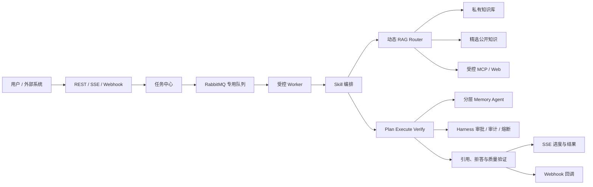

# 可信研发知识协作 Agent 升级总计划

> 状态：G1 L0/L1、隔离 PostgreSQL/RabbitMQ/HTTP/JWT/MCP L2、Edge Playwright L3、advisory lock/文件补偿、Rabbit 消费恢复、Markdown/HTML/PDF 结构化提取与真实 embedding、PDF 成功/损坏 golden case、外部 embedding 依赖失败后的 RabbitMQ 自动恢复、任务 SSE HTTP 多连接、单实例事件序号/有限回放及浏览器 Bearer SSE 重连、终态内存清理、真实模型驱动 Agent 工具调用、模型驱动会话临时范围收窄、生产业务库迁移和生产 MCP 主体协议调用均已完成；多实例 SSE/持久化恢复和图片/OCR 仍待独立验收
> 创建日期：2026-08-14  
> 产品定位：面向个人开发者和小型研发团队的可信知识协作 Agent。  
> 本文是当前唯一维护的跨模块计划，负责需求、设计、实施和验收的主索引。历史专项方案已归档；当前实施范围和验收以本文与现有 Spec 为准。

---

## 1. 目标与产品边界

### 1.1 核心问题

用户的项目资料分散于设计文档、接口说明、故障复盘、会议纪要、PDF、架构图和任务系统中。模型即使具备通用知识，也无法可靠获得这些私有、持续变化且需要权限控制的事实。

系统目标是：根据问题和证据状态，选择直接回答、私有知识库检索、受控公开资料检索或任务工作流；所有事实性结论均可追溯到证据，并对无证据、权限不足或高风险操作明确拒答、追问或请求审批。

### 1.2 一期范围

一期只服务“研发知识协作”场景，覆盖：

- 项目 Onboarding：基于架构、接口、运行手册回答系统设计问题。
- 故障排查：关联日志、故障复盘和版本记录，输出带证据的排查建议。
- 技术决策追溯：说明某项技术方案的结论、证据、替代方案和历史取舍。
- 文档处理任务：异步解析、索引、评测和报告生成，并向发起方反馈进度和结果。

### 1.3 非目标

- 不做通用搜索引擎，不抓取或长期存储整个互联网。
- 不允许用户上传任意可执行脚本作为 Skill；Skill 只能调用经登记、授权和审计的工具。
- 不将多 Agent 作为普通问答的默认执行方式。
- 不为了功能开发直接升级 Spring AI 大版本；当前 `Spring AI 1.1.0` 保持稳定，升级须作为独立兼容性验证任务。
- 不将未授权的付费课程、完整商业内容或敏感真实内部资料放入演示数据集。

## 2. 目标架构



设计原则：私有知识优先；所有外部来源独立标识；同一会话顺序一致、跨会话受控并发；任务可恢复、可观测、可评测；复杂协作由固定角色和结构化契约控制。

## 3. 知识与数据规范

### 3.1 知识源分层

| 层级 | 数据 | 使用方式 | 约束 |
| --- | --- | --- | --- |
| L1 私有知识 | 设计、复盘、会议、接口、代码说明、任务、私有 PDF/图片 | 默认优先，构成业务价值 | 强制用户/知识库权限隔离与删除能力 |
| L2 精选公开资料 | 官方文档、协议、Release Notes、明确许可的开源资料 | 通用技术问题或本地评测 | 保留许可证、版本、来源 URL 与抓取日期 |
| L3 实时外部资料 | 受控 Web/MCP 查询结果 | L1/L2 证据不足时按需调用 | 不默认入库；必须标记时效和来源 |

公开资料并非只用于测试，但不应替代私有知识库的主价值。演示和开发阶段可先用 L2 构建可复现数据集；对外展示时使用脱敏或模拟的 L1 团队资料证明私有知识治理能力。

### 3.1.1 检索范围与授权分层

RAG 检索必须受范围约束，但“Agent 手动选择知识库”只表示默认检索策略，不能替代资源授权。范围按以下三层收敛，后层只能缩小前层，不能扩大：

1. **硬权限范围**：当前已实现的是 `ownerId` 精确匹配的单用户私有模型。知识库 CRUD、文档访问、索引和检索均须在后端按当前用户校验；无权或不存在的知识库 ID 必须统一拒绝，不能静默忽略。团队/租户和 ACL 是未来扩展，尚未构成授权路径。
2. **Agent 默认范围**：关系表 `agent_knowledge_base` 的绑定必须是硬权限范围的子集，用于限定该 Agent 默认参与检索的业务域。API 的 `allowedKbs` 是关系表投影；创建或更新 Agent 时，服务端校验 ID 存在、去重且当前用户可访问。
3. **会话临时范围**：用户可在当前会话从 Agent 默认范围中继续缩小到项目或单一知识库；模型工具请求也只能在该收窄集合内生效，不能通过传入任意 `kbIds` 扩权。

JSONB `allowedKbs` 已从 `agent` 持久化模型移除，不能作为授权或绑定事实来源。`agent_knowledge_base` 已迁移为 Agent 默认范围的唯一持久化关系，并以 `agent_id`、`kb_id` 外键在删除 Agent/KB 时级联清理当前绑定；表中仅有当前绑定的操作者/时间，不替代完整审计。共享知识库、角色授权、tenant、绑定历史审计和通用 KB 物理级联仍须另行设计。G1 开始任何知识库、任务或 Router 实现前，必须先补齐硬权限范围及越权绑定、越权检索、删除后引用、空绑定和多知识库过滤的测试。

### 3.2 统一元数据

所有源文档、派生文本块和图片/表格资产至少保存：`sourceUrl`、`sourceTitle`、`publisher`、`license`、`fetchedAt`、`documentVersion`、`contentType`、`language`、`contentHash`、`tags`、`knowledgeBaseId`、`ownerId`、`visibility`。

多模态资产额外保存原文件、页码或坐标、OCR 文本/图片说明、所属文档和关联段落。答案引用必须能定位至文档路径，以及 PDF 页码、图片或表格位置（如适用）。

### 3.3 数据集与评测

构建独立于调参语料的评测集，首期目标 100 个人工复核 case，至少包含：精确术语、改写、多文档综合、多轮追问、图文/表格问答、无答案拒答和权限越界拒答。每个 case 记录 `query`、`queryType`、`goldChunkIds`、`goldFacts`、`shouldAbstain`、`kbScope` 和数据集版本。

## 4. 能力规格与依赖关系

### 4.1 异步任务中心与队列

使用现有 RabbitMQ，但与邮件任务隔离 exchange、queue 和 DLQ。长耗时工作不占用 HTTP 请求线程，包括文档解析/索引、批量 embedding、RAG 评测、报告生成和复杂 Skill。

任务实体的最小状态机：

```text
PENDING -> QUEUED -> RUNNING -> WAITING_APPROVAL -> SUCCEEDED
                              |                    |
                              +-> FAILED <----------+
                              +-> CANCELLED
```

每个任务必须包含任务类型、提交者、输入快照、Skill 版本、幂等键、进度、尝试次数、错误摘要、结果引用和创建/更新时间。Worker 必须受并发上限、超时、退避重试和死信治理；高风险步骤进入 `WAITING_APPROVAL`，不可绕过 Harness。

### 4.2 Skill

Skill 是可复用、可版本化、受权限控制的 Agent 工作流模板，不是任意代码执行入口。每个 Skill 的最小契约包括：

- 名称、版本、用途、输入/输出 JSON Schema。
- 系统指令、知识库范围、可用工具白名单和审批策略。
- 同步/异步执行模式、超时与并发预算。
- 引用、拒答或结构化结果要求，以及对应验证器。

首批候选 Skill：文档入库与索引、RAG 质量评测、技术方案对比、故障复盘总结、会议待办提取和项目周报生成。先以内置模板实现；只有出现用户可配置需求时才设计持久化的自定义 Skill。

### 4.3 动态 RAG Router

Router 只做结构化决策，不直接生成最终答案。其输出至少包括：`route`、`searchScope`、`rewriteMode`、`retrievalChannels`、`topK`、`rerankEnabled`、`needClarification` 和 `reason`。

首期 route 固定为：

- `DIRECT`：闲聊或无需外部事实的请求。
- `PRIVATE_RAG`：默认事实检索，限定可访问私有 KB。
- `HYBRID_RAG`：私有与精选公开资料联合检索，来源分组返回。
- `MULTIMODAL_RAG`：问题涉及 PDF、图片、表格或图文证据。
- `EXTERNAL_TOOL`：已有知识库证据不足且用户允许时，调用受控 MCP/Web 工具。
- `CLARIFY` / `ABSTAIN`：范围不明确、无证据、无权限或风险过高。

Router 必须与“全链路固定检索”做消融对比，按问题类型报告质量、p95 延迟和 token 成本；无稳定收益不得默认启用更复杂链路。

当前 `RagRouter` 已有规则实现和单元测试，但尚未由 `KnowledgeTools`、MCP 或 `RagService` 的生产入口消费；它不能据此被写作“动态路由已上线”。G2 要先把 Router 变成受 owner/Agent 默认范围/会话临时范围约束的检索计划输入，再决定是否调用私有检索、精选公开源或外部工具。路由不得自行扩大 `kbIds`，也不得以“无证据”为由绕过拒答和外部调用许可。

### 4.4 多模态摄入与检索

按 PDF/纯文本/HTML/图片的顺序扩展。表格要保留标题、行列与单元格关系；图片要通过 OCR/说明文本和位置元数据参与检索。视频、音频和通用视觉理解不在一期范围。

每新增一种格式都必须独立验证：解析正确性、重复入库幂等性、权限隔离、召回质量、引用定位和失败可重试。

G2 借鉴 [RAG-Anything](https://github.com/HKUDS/RAG-Anything) 的是“先保留文档层级、位置和元素关系，再按文本、图片、表格、公式分流处理并在检索时按证据类型排序”的方法，而不是直接引入 LightRAG、通用知识图谱或新的 Python 运行时。当前 PDF 仅有逐页文本和 `pageNumber`；图片/OCR、表格单元格关系、公式和可回跳的资产坐标仍未实现。下一步先定义同一文档下的资产及其与文本 chunk 的关系、稳定定位与引用契约，再逐项增加 OCR、表格和图像能力；图谱不是本阶段前置条件。RAG-Anything 也不替代本项目的用户长期记忆治理，记忆仍按 G3 的来源、确认、冲突和删除规则演进。

### 4.5 Plan-Execute-Verify 与多 Agent

现有 Think-Execute 循环保留。复杂任务先由 Planner 输出有限、可校验的执行计划，Executor 调用 Harness 包装的工具，Verifier 校验关键事实是否有证据、是否矛盾、越权或需要补检索。

多 Agent 只在以下职责稳定后引入：Router/Retriever、Workflow Executor、Verifier、Memory Agent。角色之间必须使用 JSON Schema 交换状态，具有最大轮数、超时、成本预算和单 Agent fallback；不采用自由对话式群体 Agent。

### 4.6 分层记忆与反思

记忆分为短期工作记忆、会话摘要、长期事实/偏好、任务情景记忆和待确认候选。长期记忆必须有来源、置信度、时间、过期时间、冲突关系和用户确认状态，并支持查看、编辑、删除和清空。

反思只在任务完成、验证失败或用户纠错后触发，提取“有效策略、失败原因、待跟进事项”等低权重情景记忆；禁止自动覆盖用户事实。先完成摘要上限、提取节流、语义去重和冲突处理，再增加反思能力。

### 4.7 Webhook

Webhook 服务于外部系统集成：入站触发文档索引或任务；出站通知索引完成、审批待处理、任务失败/完成。出站请求必须提供签名、事件 ID、超时、指数退避、投递日志和死信；入站请求必须校验签名、限制来源并映射到任务中心。Webhook 不承载长耗时业务逻辑。

### 4.8 并发、性能与可靠性

- 同一 `chatSessionId` 的 Agent 任务顺序执行；不同会话可并行，避免上下文和 SSE 事件交错。
- Agent 执行、工具调用、记忆提取、文档索引和 Webhook 投递使用隔离的有界线程池，不使用公共线程池承载阻塞 I/O。
- 仅并行执行相互独立、只读且通过 Harness 授权的工具；写操作、审批和存在依赖的步骤保持顺序。
- RAG 独立候选通道可在总超时预算内并发；先通过 tracing 确认瓶颈，再实施并行化。
- 缓存 Key 必须纳入权限范围、KB 集合、索引版本和检索配置；不得跨租户复用结果。
- 当前单机 `SseEmitter` 连接管理只适用于单实例。横向扩展前需引入事件分发、重连、事件序号恢复与会话黏性方案。

## 5. 分阶段路线图

| 阶段 | 目标 | 核心交付 | 退出条件 |
| --- | --- | --- | --- |
| G0 基线与观测 | 先保证现有主链路可验证 | 聊天/RAG/SSE/审批联调、Trace ID、延迟与错误指标 | 关键旅程可回归，已有 RAG 基线不退化 |
| G1 任务与摄入基础 | 长任务可恢复，知识库可扩展 | 任务中心、RabbitMQ Worker、PDF/文本/HTML、索引状态与 SSE 进度 | 上传不阻塞请求，失败可重试，文档可定位引用 |
| G2 自适应可信 RAG | 让检索策略由证据和问题驱动 | PostgreSQL 原生 BM25、校准的改写/RRF、生产 Router 接线、图文/表格证据模型、引用与拒答 | 相比固定链路有可复现收益，拒答和权限 case 通过 |
| G3 Skill 与记忆治理 | 任务可复用，长期上下文受控 | 内置 Skill、摘要收口、节流、去重、冲突和用户管理 UI | 记忆不阻断对话，任务结果满足输出 Schema |
| G4 验证与协作 | 复杂任务可被校验和审计 | Planner/Verifier、受限多 Agent、Webhook | 质量收益覆盖额外成本，工具权限和审计可追溯 |
| G5 扩展性收口 | 并发与多实例稳定 | 会话顺序调度、专用线程池、背压、缓存、SSE 分发与压测 | 通过约定负载下的延迟、错误率和恢复验收 |

G0 是其余阶段前置条件。G1-G3 为项目的核心简历主线；G4-G5 在有量化收益和时间预算时推进，不以“功能数量”作为完成标准。

### 5.1 G0 结项状态（2026-08-18）

当前代码已具备登录后发送拦截、`AI_CONTENT_DELTA` 回答分片、`AI_ERROR` 失败事件、执行轨迹与审批卡片。中转站的 `ChatResponse.getResult() == null` 空帧已由后端忽略，避免中断后续回答分片；无工具调用的最终 Assistant 消息会在 `AI_DONE` 丢失时主动收起“思考中”状态；两项行为均由回归测试固定。

本轮 G0 已按以下证据结项：

1. `TC-G0-01` 启动图、`TC-G0-02` 聊天消息/事件链路、`TC-G0-04` SSE 契约与 `TC-G0-05` Harness 审批、代理、熔断回归均已通过；命令与报告见第 6.4 节的 2026-08-18 行。
2. `TC-G0-03` 的 L0 指标、L1 冻结 replay 和本机 Ollama 的受控 fixture 链路已通过。四文档 fixture 的汇总 `Recall@5=1.0` 仅表示已知 gold chunk 在该受控集合的 Top-5 覆盖，不代表真实用户问题、真实知识库规模、权限隔离、引用准确性或答案忠实性已达标；为避免同一检索集重复三遍，验收命令关闭 A/B 诊断，但未缩小 fixture、未替换 embedding 或检索链路。
3. 已使用隔离测试账号完成普通回答逐段显示、RAG 命中与正文增长、`AI_ERROR`、审批批准/拒绝、最终状态收尾，以及新会话首条消息持久化和同会话轨迹恢复。`npm.cmd run lint` 与 `npm.cmd run build` 均通过，结论独立记录，lint 仅有依赖数据过期提示。
4. G0 阶段门禁现已满足。本结论不自动开始 G1；G1 的首个实现前置仍是知识库 owner/tenant/ACL 硬权限模型、对应 schema/fixture 与 RED 用例，详见本计划第 8 节和唯一 Spec。

### 5.2 G1 owner-only 硬权限与任务摄入 L0/L1 子项（2026-08-19）

本次完成 G1 的知识库硬权限、Agent 绑定迁移前置，以及任务中心和异步摄入的 L0/L1 契约；不等同于 G1 全部结项。模型选择为单用户私有 KB：新 KB 写入 `owner_id`，后端以当前用户和 owner 相等作为唯一可访问条件；本地库已完成历史清理和 `owner_id NOT NULL` 收紧，不存在自动归属给当前用户、管理员或 Agent 的兼容路径。

已完成的服务端约束：

1. KB CRUD、文档查询/创建/上传/更新/删除、Markdown 索引触发与文档删除前的 chunk 索引删除均先校验 KB owner。
2. `agent_knowledge_base` 是 Agent 默认 KB 范围的唯一持久化来源；Agent 创建和更新时，API `allowedKbs` 中每个传入 ID 必须存在且为当前用户可访问集合，重复 ID 被去重。显式空列表允许保存并表示该 Agent 不可检索私有 KB；未传该字段的局部更新保留既有关系绑定。
3. Agent 运行时再次校验 Agent owner，并从关系表读取后过滤失权或已删除的 KB；模型/会话传入的 `kbIds` 只能从这个过滤后的默认集合继续收窄。
4. MCP V1 已以独立主体凭据指纹解析单一内部 `user_id`，再复用 KB owner 校验；认证拒绝、允许检索和越权拒绝均写入追加式审计，且不记录原始凭据或查询正文。生产库已执行 MCP 主体访问迁移并为 `principal_id=1` 建立单一有效 grant（`user_id=10`）；未解析出主体的调用统一拒绝私有 KB，不信任调用方传入的 `kbIds`。
5. 本地迁移已执行 owner 外键/检查、`agent_knowledge_base` 迁移和 `owner_id NOT NULL` 收紧；保留 `RAG Recall Fixture KB` 及其 4 条评测文档、32 个 chunk，删除其余 17 个候选 KB、46,979 条文档、49,152 个 chunk 和候选文件目录。评测 KB 归属测试账号 `g0l3_20260817_114535`（`user_id=9`，凭据不入库）。
6. `ingestion_task` 已定义 owner 范围、owner + 幂等键唯一约束和状态机；上传请求必须携带 `Idempotency-Key`，在文档或文件写入前拒绝空键，成功时返回 `documentId` 和 `taskId`。预检以 PostgreSQL 事务级 advisory lock 串行化同一 owner+key，并由上传事务持有至任务创建结束；相同 owner、KB、文档和键重放同一任务，跨资源复用同一键拒绝。
7. 上传不再同步调用解析或 embedding；新提交和手动重试均在事务提交后发布消息。RabbitMQ 消费者领取任务后由处理器在数据库事务内清理旧 chunk、解析、embedding 并写回，任一 chunk 未写入即抛错回滚本次数据库替换；Markdown、HTML 按章节处理，PDF 由 PDFBox 按页提取文本并写入 `pageNumber` metadata，`txt` 或无章节内容退回单原文 chunk。消费者在领取、成功、重试和死信时发布任务进度事件；任务 SSE 连接先复用任务 owner 校验。取消只适用于 `QUEUED`、`RETRYING`，`RUNNING` 被拒绝；任务查询、取消、重试均按任务 owner 校验。前端已实现对活动任务的 Bearer `fetch + ReadableStream` 订阅、`Last-Event-ID` 重连及事件 `kbId` 校验，两秒轮询保留为跨实例/长断线兜底；隔离全栈的 Edge 用例已确认预先建立的第二条 Bearer SSE 在页面触发真实重试后收到 `RUNNING`，取消/重试失败仍有错误提示。

2026-08-19 已完成一项受限 L2 schema 验收：新建独立 PostgreSQL 验收库并只复制结构、未复制业务行；依序实际执行 owner、`agent_knowledge_base`、`ingestion_task` 与 MCP 五份迁移。两条不可登录测试用户验证旧 JSONB 只迁入同 owner 且去重的绑定；无 owner KB、同 owner 重复幂等键、同 MCP 主体第二条未撤销 grant 均被真实约束拒绝；删除测试 KB 后对应 `agent_knowledge_base`、文档、chunk、摄入任务均为 0 行。RabbitMQ 仅只读确认现有 `ingestion.queue`、`ingestion.retry.queue`、`ingestion.dlq` 的 DLX/TTL 拓扑及一个消费者，未向共享开发队列投递消息。

2026-08-19 的运行时检查曾记录业务库缺少任务/MCP 表；该历史结论已被本轮受控生产迁移和真实协议验收 supersede。当前业务库已存在 `agent_knowledge_base`、`ingestion_task`、`mcp_principal`、`mcp_principal_credential`、`mcp_principal_user_grant` 与 `mcp_access_audit`，四个依赖容器均运行。

已完成的隔离运行时 L2/L3 不覆盖 tenant、共享 ACL、角色授权、反向查询、完整绑定历史审计、KB 删除时文件的通用应用层物理级联或其他外部依赖故障路径。真实 HTTP/JWT 已验证 A/B 跨用户拒绝、同 owner 顺序幂等重放、RabbitMQ 投递/重试/死信及 MCP 主体授权；Edge Playwright 已验证登录、上传、轮询、当前 KB 隔离、跨账号无泄露和取消/重试冲突提示。Factory 运行时的隔离 Spring 探针进一步以真实 PostgreSQL 关系数据装配 `JChatMindFactory`；安全复审后的 `G1ModelDrivenSessionScopeRuntimeL2Test` 又以外部 DS Chat、真实 `JChatMindFactory`/`KnowledgeTools` 和独立 PostgreSQL 连续两次验证：Agent 绑定 A1/A2 而会话 `retrievalContext.kbId=A1` 时，模型实际发出的 `KnowledgeTool` 参数只有 `query`、没有 `kbIds`，记录到的有效范围仅为 A1，且持久化顺序为 `user -> assistant(tool call) -> tool -> assistant`；最后一个工具消息后的最终 Assistant 含 A1 证据标记且不含 A2 标记。测试数据源只接受 `jdbc:postgresql://127.0.0.1:<49152-65535>/g1_model_scope_<12 位十六进制 nonce>`，数据库名后缀必须与本次 `g1.pg.nonce` 精确相同；临时容器使用 trust 认证与固定 `g1scope` 用户名，不读取 PostgreSQL 用户名或密码。该用例以测试专用 `RagService` 隔离并记录范围，不能替代真实 embedding/召回质量或模型显式越权参数的独立验收。本轮已恢复外部聊天模型和 Ollama embedding 成功路径，生产 MCP 使用 `STREAMABLE` `/mcp` 协议完成 `initialize`、`tools/list` 和受限知识库 `tools/call`；原始凭据只在进程内使用，数据库仅保留指纹。Playwright 使用本机 Edge，不下载 Chromium；lint/build 从不作为 L3 功能证据。`agent_knowledge_base` 的外键只负责当前绑定级联；API `allowedKbs` 仍仅表示 Agent 默认范围，绝不是授权模型。受控 fixture 的 `Recall@5=1.0` 仍只代表 gold chunk 的 Top-5 覆盖与链路可回归，不证明真实 RAG 泛化或共享授权安全性。

**Ban 已确认的后续边界（2026-08-18）。** 共享暂不扩展，保持 owner-only，禁止隐式 tenant 或 ACL 放行。MCP V1 使用“独立、可轮换的主体凭据 -> 单个内部 `user_id`”映射，凭据仅存指纹/状态并追加审计；不能继续用共享 API Key 充当可审计主体。KB 删除仍需独立的受控删除任务：提交时先做 owner 授权和审计，数据库中的文档/chunk/绑定在受控事务内清理，文件使用可重试、幂等的异步清理；该删除语义尚未实现。验收补第二个隔离账号的 L2 跨用户测试及 Playwright L3。其他环境只允许人工认领 owner 后迁移，禁止自动回填或默认放行。

### 5.3 G1 真实成功摄入与进度发布子项（2026-08-20）

独立 PostgreSQL、独立 RabbitMQ 和独立上传目录中，`G1IngestionSuccessRuntimeL2Test` 先 RED 暴露 HTML 标题未结构化解析：任务虽成功但仅产生一个原始 HTML fallback chunk，而期望两个标题 chunk。最小修复仅为 `MarkdownParserService` 增加 HTML 标题解析，并由默认摄入处理器按 `filetype=html` 调用；随后 GREEN 三项真实运行时测试均通过。Markdown 和 HTML 均生成两个带结构 metadata 的 chunk，调用本机 Ollama `bge-m3:latest` 后持久化非空 1024 维 embedding，真实 Rabbit 消费者推进任务为 `SUCCEEDED` 且进程内进度服务记录最终 `ingestion-progress` 事件。脱敏结论位于 `backend_v2/target/g1-runtime-l2/ingestion-success-summary.txt`；隔离容器和上传目录已删除。

`G1IngestionTaskSseHttpRuntimeL2Test` 随后以真实嵌入式 HTTP、项目 JWT 拦截器、独立 PostgreSQL 和两条同 owner SSE 连接完成补验。它先 RED：两条连接均拿到 `QUEUED`，发布 `RUNNING` 后第一条五秒超时，证明任务到单 emitter 的覆盖缺陷；最小 GREEN 改为任务级 emitter 集合并精确注销连接。两项 HTTP 测试均通过：两条授权连接收到 `RUNNING`，另一 owner 的响应不含任务、KB 或文档标识。脱敏摘要为 `backend_v2/target/g1-runtime-l2/sse-http-summary.txt`，隔离容器已删除。

2026-08-20 已实现浏览器任务 SSE 并获得有效 RED：Edge 对真实隔离全栈执行 `node .\node_modules\@playwright\test\cli.js test tests/g1-runtime.spec.ts --project=edge --grep "retry progress published"`，在已建立并收到 `DEAD_LETTER` 快照的第二条 Bearer SSE 上由 UI 触发真实重试；15 秒内流仍只收到 `["DEAD_LETTER"]`、没有随后 `RUNNING`，而轮询 UI 已到 `RETRYING`，定位为 Spring 选择三参消费者构造器并注入空进度服务。最小修复仅将 `@Autowired` 移至四参生产构造器；前端使用 Bearer `fetch + ReadableStream`，生命周期以 `AbortController` 清理，两秒轮询仅为断线兜底。洁净重建时隔离 schema 缺少三个既有 UUID 主键默认值，先阻止 KB 创建；仅在临时库补齐默认值后，同一 Edge 命令在独立 PostgreSQL、独立 RabbitMQ、隔离后端和 Vite 中退出码 `0`，第二条已连接流收到随后 `RUNNING`。脱敏结论位于 `backend_v2/target/g1-runtime-l2/ui-sse-browser-summary.txt`；当前隔离容器、临时目录、进程和临时输出在本子项收尾删除。

这些证据证明单实例中消费者发布和已认证 HTTP 客户端接收 SSE，且 Edge 浏览器已在连接建立后接收真实重试事件；当前进度服务保留任务级有限事件历史，客户端可按 `Last-Event-ID` 请求缺失事件，但多实例分发、跨进程顺序恢复和持久化仍待对应阶段验收。2026-08-21 真实模型运行时使用隔离账号 `user_id=10`、Agent `cf4f1b88-c0ad-4656-b8fb-ec1958f07e09` 和会话 `04337853-d6a1-4883-89df-5b6d72de04b0`，实际完成知识库工具调用并在最终回答中返回 HTML 文档路径 `Codex Runtime Guide > Tool Calling` 与精确标记；同轮真实 MCP `STREAMABLE` 协议调用也完成初始化、工具发现和授权检索。生产迁移与主体 grant 已执行，凭据明文未写入文档或仓库。PDF 成功/损坏输入及外部 embedding 自动恢复的真实 golden case 已签收，图片/OCR 仍未签收。

### 5.4 PDF 摄入与单实例 SSE 恢复子项（2026-08-21）

`MarkdownParserServiceImpl` 现使用 Apache PDFBox 2.0.24 逐页提取文本；每个非空页生成一个结构化 chunk，标题为 `第 N 页`，并把 `pageNumber` 写入 chunk metadata，embedding 输入继续复用统一的路径/标题/正文拼接。损坏或加密 PDF 以稳定的 `IllegalArgumentException`/业务错误结束，交由既有 Rabbit 重试和死信状态机处理；已有 Markdown/HTML 行为保持不变。`DefaultIngestionTaskProcessorTest` 与 `MarkdownParserServiceImplTest` 固定了页码 metadata、双页文本和损坏文件拒答。

`IngestionTaskProgressEvent` 增加单调 `sequence`；进度服务以任务级锁串行化回放、连接注册和实时发送，对同一任务保留最多 64 条事件历史，终态且无连接 30 分钟后在后续任务活动时清理。SSE 帧写入标准 `id`，Controller 接受 `Last-Event-ID` 并回放其后的事件。首次连接为任务创建唯一初始快照，多个连接共享同一序号；前端只接收递增序号并在断线后重连，终态或取消时由 `AbortController` 停止。该实现明确为单实例内存语义，不宣称跨实例或进程重启后的恢复。

### 5.5 G1 外部 embedding 自动恢复子项（2026-08-21）

`G1EmbeddingRecoveryRuntimeL2Test` 使用随机命名的 PostgreSQL 数据库、RabbitMQ 容器/vhost/用户和上传目录；首次 `RagService.embed` 明确请求不可达端点，第二次及后续请求才连接本机 Ollama `bge-m3:latest`。真实消费者首次处理后任务进入 `RETRYING(1)`，retry queue 有消息、chunk 为 0 且物理文件仍为 1 份；测试不手工再次发送消息，由 RabbitMQ 的 TTL/DLX 自动回投。回投后任务最终为 `SUCCEEDED(1)`，两个 Markdown chunk 均有非空 1024 维 embedding，物理文件仍为 1 份。隔离容器、数据库、vhost、用户与目录均在 `finally` 中删除。

该用例覆盖“外部 embedding 短暂不可用后自动恢复”的端到端边界，不外推为所有外部服务故障、多实例 SSE、持久化事件恢复或图片/OCR 的验收。

### 5.6 G2 RAG 优化实施次序（尚未开始）

当前 RAG 已具备向量、标题精确/包含/关键词/Trigram、标题 BM25、正文 BM25、RRF 和规则 rerank；这不是 G2 的完成状态。代码复核后，下一阶段必须先解决以下问题：

1. `findTitleBm25Candidates` 与 `findContentBm25Candidates` 通过 Mapper 把授权 KB 的候选 chunk 拉回 JVM，再由应用计算 BM25。数据量随 KB 增长线性放大，且数据库无法利用原生倒排索引、按范围先过滤再取 Top-N。
2. `HARD` 会话上下文已下推到向量查询，但词法候选先按整个 KB 取 Top-N、RRF 后才过滤。全局高分 chunk 可挤掉上下文内候选，既浪费读取也会造成召回假阴性。
3. 改写后的多个向量查询与原问在 RRF 中等权；而标题/正文 BM25 固定使用原问。低信息追问既可能让改写通道过度影响排序，也无法让受控的 standalone query 补足正文词法召回。
4. `RagRouter` 目前没有生产调用点；单元测试通过只证明分类规则，不证明授权范围、外部许可、拒答和实际召回链路正确。
5. 多格式摄入已覆盖 Markdown/HTML/PDF 文本，但没有图片、表格或公式的独立资产、相对位置和跨元素关系，无法形成 RAG-Anything 所强调的可定位多模态证据。
6. 未传 `kbIds` 时，`KnowledgeTools` 会以会话上次命中的 `retrievalContext.kbId` 隐式收窄可搜 KB。这与“默认搜索 Agent 所有可访问 KB、会话仅提供偏置”的产品语义不同，会令跨 KB 的 topic switch 在改写器识别前已经不可能召回。安全收窄本身正确，但默认范围必须显式定义，不能由上一条结果悄然决定。
7. `RERANK_CANDIDATE_LIMIT` 未在 RRF 后实际截断，线性 rank penalty 会使深层候选即使词面和结构信号全满也永远无法升到 Top-1。多通道扩展后，该排序器并不具有预期的“重新排序”能力。
8. 有会话上下文的短新实体/标题可能被判为 `FOLLOW_UP`，进而关闭所有标题通道；任意 `/` 或 `\\` 又可能被判为导航并触发无上限的 title/path 候选扫描，还可能误施加 `HARD` 约束。
9. `KnowledgeTools` 在任何非空 Top-1 后都会覆盖 session retrieval context；低相关或无答案检索会把错误来源写回下一轮，形成 context 自我强化。

**BM25 目标与选型边界。** G2 要把标题和正文 BM25 迁为 PostgreSQL 内的原生倒排查询，应用层只接收 `chunkId`、通道、通道内 rank、可选 lexical score 与必要展示字段，继续使用 RRF 融合排名，不把 BM25 原始分数直接与向量距离比较。首个隔离 PoC 优先验证 ParadeDB 的 `pg_search`：其定位覆盖 PostgreSQL 内的全文、向量和混合检索；但其 AGPL-3.0 许可证、目标 PostgreSQL 版本、镜像中 pgvector 扩展和备份恢复兼容性必须在引入前完成审查。VectorChord-bm25 是备选原生 BM25 索引，需同样验证许可证、目标 PostgreSQL 版本、索引维护和运维包兼容性。不得同时把两个插件带入生产，也不得以长期双读/双写作为迁移方案；PoC 仅在隔离数据库对同一冻结数据集比较，达到门禁后选择唯一 provider 并删除 JVM 全量 BM25 路径。

原生 BM25 的 schema/查询契约如下：业务事实仍以 `chunk_bge_m3` 为唯一来源；如插件需要索引投影，投影字段必须在同一摄入事务内从 chunk 构造并带 `chunk/indexVersion`，不能形成第二份可独立写入的业务数据。索引必须可按 `kb_id`、`sourceName`、`sourceType` 和规范化 `contentPath` 过滤；`HARD` 上下文的全部过滤条件必须在 BM25 `LIMIT` 前执行。中文、英文、代码标识符、路径和版本号的 analyzer/预分词规则要先由冻结语料评测，不能假设任何插件的默认 tokenizer 满足中文技术文档。

| 顺序 | 改造与边界 | 完成判据 |
| --- | --- | --- |
| G2-0 | 冻结迁移前评测集、查询计划和延迟基线；新增中文术语/代码、标题、正文精确匹配、multi-turn follow-up、topic switch、无答案、越权和 PDF 页码 case。 | 数据集、gold、KB 范围、模型、检索配置和报告版本可复跑；不把现有 4 文档 fixture 当成真实规模结论。 |
| G2-1 | 在隔离 PostgreSQL 分别验证 `pg_search` 与 VectorChord-bm25 的最小索引、删除/重建、过滤、EXPLAIN、备份恢复和许可证/镜像兼容性，形成唯一 provider 决策。 | 正文与标题 lexical Top-N 不再调用 `select*LexicalCandidatesByKbIds` 全量取数；无 scope 泄露；数据库索引和查询计划证据可复查。 |
| G2-2 | 将唯一 provider 接入 Mapper，令 `HARD` 过滤先于每个词法通道的 Top-N；保留标题精确/Trigram 的独立行为，BM25 只替换应用内 BM25。 | 上下文外的全局高分 chunk 不能挤掉范围内 gold；owner/Agent/会话收窄语义不变；删除或重索引无 stale hit。 |
| G2-3 | 先冻结 KB 范围语义：推荐“未传 `kbIds` 搜索全部 Agent 已授权 KB，会话 context 只作排序偏置”；若产品需要 sticky scope，必须由显式会话/用户参数收窄，不能隐式沿用上一条 Top-1。随后把改写计划拆为原问、受控 standalone 补全和通道 provenance；原问始终保留，最多一个补充查询，只有明确 follow-up 标记与上下文证据同时成立时才进入正文/向量通道。 | 跨 KB topic switch 可在默认范围内召回；短新标题、代码标识符和 API 路径不会误关标题通道或触发导航扫描；改写失败、超时或越界时退回原问。 |
| G2-3a | 将同源标题通道与多 query 向量通道先做组内去重/校准，再参与跨组 RRF；RRF 后明确截断可 rerank 的候选数，rank penalty 改为有界函数或移除。保存 session context 前要求相关性阈值和 Top-1/Top-2 gap；无答案、拒答或低置信结果不更新。 | RRF 第 35 名的精确命中在候选预算内仍可被 rerank 提升；重复通道不会无限叠加投票；错误 Top-1 不污染下一轮。 |
| G2-4 | 将 Router 接入受控检索入口，完成 evidence threshold、拒答、外部许可和引用输出；再按资产契约扩展 OCR、表格和图像。 | Router 相对固定链路有可复现收益；权限、无答案和外部许可全通过；每个非文本引用可定位到文档、页码/坐标与关联文本。 |

## 6. 验收指标与门禁

每次影响检索、记忆、工具或数据模型的改动，必须同时报告版本、数据集、配置、成本和延迟。指标包括：

- 检索：`Recall@K`、`MRR@K`、Coverage、Diversity、权限违规率。
- 生成：Citation Precision/Recall、Faithfulness、Answer Correctness、Abstention Accuracy。
- 记忆：Memory Precision@K、Stale Rate、Contradiction Rate、User Correction Rate。
- 任务：排队时长、成功率、重试率、死信率、幂等重复执行率。
- 系统：首 token 和完整响应 p50/p95/p99、队列积压、线程池拒绝率、缓存命中率、token/费用、SSE 重连成功率。

### 6.1 测试分层与隔离环境

| 层级 | 范围 | 环境与副作用边界 |
| --- | --- | --- |
| L0 | 指标、状态机、路由、权限判断和序列化契约 | 纯 JUnit；不启动 Spring，不访问外部服务。 |
| L1 | Controller、Service、SSE、Harness 和消息边界 | Spring 集成测试；邮件、MCP/Web 等外部调用必须使用测试替身。 |
| L2 | 数据库、Redis、RabbitMQ、Ollama 与异步链路 | 隔离 Docker 环境；只使用测试账号、测试知识库和可清理测试数据。 |
| L3 | 浏览器关键用户旅程 | G0 使用 `npm run lint`、`npm run build` 与可重复手工旅程；G1 起引入 Playwright，禁止连接真实邮件、MCP/Web 或生产数据。 |

### 6.2 用例记录与统一门禁

每个用例必须记录 `TC-ID`、阶段、层级、隔离环境、前置数据版本、步骤、预期结果、执行入口、报告路径、执行日期、执行人和结论。用例未填齐上述字段或外部依赖不可用时不得标记为通过。

| 门禁 | 判定 |
| --- | --- |
| 基础构建 | 必需后端测试、`npm run lint`、`npm run build` 必须通过。 |
| RAG 回归 | fixture Recall@5 保持 `1.0`；真实 KB 结果必须与签收基线比较并解释波动。 |
| 性能与成本 | 固定 G0 环境基线后，p95 延迟最多增加 15%，token/调用成本最多增加 10%，错误率最多增加 1 个百分点。 |
| 外部边界 | 邮件、MCP/Web、生产数据不得被测试直接调用；必须以替身、签名校验或隔离测试资源验证。 |
| 阶段退出 | 本阶段所有必需 `TC-ID` 通过，且对应报告、数据集版本、配置版本和基线对比已回填本计划。 |

报告默认保存在 `backend_v2/target/surefire-reports/`、`backend_v2/target/rag-eval/` 或 Playwright 报告目录；本计划的“阶段验收证据”表只记录相对路径、日期、执行人和结论，不新建平行测试文档。

### 6.3 G0-G5 验收矩阵

下表定义阶段实现后必须具备的最小验收用例。尚未实现的能力标记为“待该阶段实现”，不得将计划中的用例视为已有测试覆盖。

| TC-ID | 阶段 / 层级 | 前置与步骤 | 预期结果 | 执行入口 |
| --- | --- | --- | --- | --- |
| TC-G0-01 | G0 / L1 | 使用最小测试配置启动应用上下文。 | Bean 图可启动；循环依赖或缺失必需配置导致明确失败。 | `CircularDependencyStartupTest` |
| TC-G0-02 | G0 / L1 | 发送测试消息，等待 Agent 完成并读取会话历史。 | 消息持久化，Agent 状态结束，历史顺序正确。 | 聊天链路集成测试；G0 手工旅程 |
| TC-G0-03 | G0 / L0-L1 | 运行指标公式、冻结 replay 与 fixture 检索评测。 | 指标计算正确；replay 报告可读；fixture Recall@5 为 `1.0`。 | `RagAsMetricsTest`、`RagFastRegressionEvaluatorTest`、`RagRecallEvaluationTest` |
| TC-G0-04 | G0 / L0-L3 | 模拟正文分片、空响应帧、SSE 发送失败和执行异常；重连/重复事件为后续边界。 | 空帧不阻断后续分片；`AI_CONTENT_DELTA` 顺序完整；`AI_ERROR` 可见；恢复/去重不在本次已签收范围。 | `SseMessageStreamingContractTest`、`JChatMindStreamingSseTest`、`JChatMindErrorSseTest`、`SseServiceImplTest`；G0 手工旅程 |
| TC-G0-05 | G0 / L1 | 对高风险工具分别执行批准、拒绝和超时路径。 | 状态进入并退出 `WAITING_APPROVAL`；工具不绕过 Harness；审计结果可追溯。 | `HarnessRunnerTest` 及审批相关测试 |
| TC-G0-06 | G0 / L3 | 在测试账号和测试知识库中执行创建 Agent、聊天、检索、审批和回答分片可见性旅程。 | 页面构建与静态契约通过；用户能看到消息、分片、正确结束的状态、失败提示和审批卡片；lint 需单独通过。 | `node ui/tests/chat-auth-guard.contract.mjs`、`node ui/tests/execution-trace.contract.mjs`、`node ui/tests/content-delta-rendering.contract.mjs`、`node ui/tests/final-content-status.contract.mjs`、`node ui/tests/hook-state-in-effect.contract.mjs`、`node ui/tests/new-chat-session.contract.mjs`、`node ui/tests/session-trace-cache.contract.mjs`、`npm.cmd run build`、`npm.cmd run lint`、手工清单 |
| TC-G1-01 | G1 / L0-L2 | 创建任务后覆盖排队、运行、取消、重试、失败和死信。 | 状态机只允许 `QUEUED`/`RETRYING` 取消，拒绝 `RUNNING` 取消；损坏 PDF/文件经处理器进入 `RETRYING`、预算耗尽后 `DEAD_LETTER` 和 DLQ。 | `IngestionTaskStateMachineTest`、`IngestionTaskLifecycleTest`、`IngestionTaskServiceImplTest`、`RabbitIngestionTaskPublisherTest`、`IngestionTaskControllerTest`；隔离 L2 记录。 |
| TC-G1-02 | G1 / L0-L2 | 同 owner 使用相同幂等键重复提交，或跨资源复用相同键。 | 真实 HTTP 顺序重放和独立 PostgreSQL 高并发均确认同资源返回同一文档/任务、跨 KB 拒绝；屏障与数据库可观测状态确认 advisory lock 确有竞争等待，回滚后释放且无持久化残留。 | `IngestionTaskServiceImplTest`、`IngestionTaskPersistenceContractTest`、`IngestionTaskMigrationContractTest`、`DocumentFacadeServiceImplTest`、`G1AdvisoryLockRuntimeL2Test`。 |
| TC-G1-03 | G1 / L0-L2 | 上传 Markdown、纯文本、HTML 与 PDF，或读取/解析失败。 | Markdown/HTML/PDF L0 结构化分块和页码 metadata 通过；真实 Markdown/HTML 均完成标题分块、1024 维 embedding 与 chunk 持久化；损坏 PDF 稳定失败并可重试。HTML 标题提取先 RED（单个原始 chunk）后 GREEN（两个结构化 chunk）。 | `DefaultIngestionTaskProcessorTest`、`MarkdownParserServiceImplTest`、`DocumentFacadeServiceImplTest`、`G1IngestionSuccessRuntimeL2Test`。 |
| TC-G1-04 | G1 / L0-L2 | 越权 KB/文档/任务访问、重复上传和跨用户范围。 | 两个隔离用户经真实 JWT 对 A 的读取、更新、删除、上传、任务查询和 Agent 绑定均收到统一拒绝且不泄露资源标识或内容；KB 删除后关联资源不可再访问。 | `DocumentFacadeServiceImplTest`、`IngestionTaskServiceImplTest`、`IngestionTaskControllerTest` 及隔离 HTTP L2。 |
| TC-G1-04a | G1 / L0-L1 | 对无 owner、非 owner、缺失、重复和已删除 KB 执行 Agent 绑定、KB/文档 CRUD、索引删除、Factory 和 MCP 检索；验证关系表迁移、替换绑定与空绑定。 | 服务端统一拒绝越权；空绑定不检索；运行时仅保留 owner 范围；无身份 MCP 不访问私有 KB；绑定不再持久化为 Agent JSONB。 | `McpKnowledgeToolTest`、`AgentFacadeServiceImplTest`、`AgentKnowledgeBaseBindingServiceTest`、`AgentKnowledgeBasePersistenceContractTest`、`AgentKnowledgeBaseMigrationContractTest`、`KnowledgeBaseFacadeServiceImplTest`、`DocumentFacadeServiceImplTest`、`JChatMindFactoryOwnershipTest`、`KnowledgeToolsScopeTest` |
| TC-G1-05 | G1 / L0-L3 | 前端上传、任务 SSE/轮询兜底、失败重试和查询。 | Edge Playwright 已真实登录、上传、轮询至 `DEAD_LETTER`、切换 KB、跨账号直达拒绝、取消/重试冲突错误提示；第二条已连接 Bearer SSE 在真实重试后收到 `RUNNING`。L0/L1 额外验证事件序号单调、`Last-Event-ID` 回放和断线重连；真实 HTTP SSE 已验证同 owner 多连接广播和跨 owner 无泄露。 | `ui/tests/g1-runtime.spec.ts`、`ui/playwright.config.ts`、`G1IngestionTaskSseHttpRuntimeL2Test`、`IngestionTaskProgressServiceTest`；静态契约、lint、build 仅作回归门禁。 |
| TC-G2-01 | G2 / L0-L1 | 为 `DIRECT`、`PRIVATE_RAG`、`HYBRID_RAG`、`MULTIMODAL_RAG`、`EXTERNAL_TOOL`、`CLARIFY`、`ABSTAIN` 提供固定输入。 | Router 输出合法 schema、预期 route、KB 范围和原因。该用例只签收规则组件，不代表已接入生产检索。 | `RagRouterTest`（已通过） |
| TC-G2-02 | G2 / L1-L2 | 在隔离 PostgreSQL 对 ParadeDB `pg_search` 与 VectorChord-bm25 执行正文/标题 BM25、删除/重建、`kb_id` 和上下文过滤、`EXPLAIN`，并复跑冻结数据。 | 选择唯一合规 provider；结果含 chunk/rank/provenance；不再由 `select*LexicalCandidatesByKbIds` 把整库文本拉到 JVM；许可证、镜像和恢复结论入报告。 | 待该阶段实现的插件集成测试、迁移脚本与基准报告 |
| TC-G2-03 | G2 / L1-L2 | 构造上下文外 chunk 全局 BM25 更高、上下文内 chunk 为 gold 的 `HARD` case，并覆盖 owner、Agent 默认范围和会话收窄。 | 所有 BM25 通道在 `LIMIT` 前过滤；范围内 gold 不被范围外候选挤掉，且无越权 chunk/元数据泄露。 | 待该阶段实现的 Mapper/真实 PostgreSQL 集成测试 |
| TC-G2-04 | G2 / L0-L2 | 覆盖原问、follow-up standalone 补全、改写超时/无效输出和 topic switch；记录向量、标题、正文 BM25 的 query provenance 与 RRF 贡献。 | 原问始终参与；补充 query 不超过预算；标题精确不被改写污染；RRF 不直接比较异构原始分数。 | 待该阶段实现的 `QueryRewriteServiceImpl`、`RagServiceImpl` 单元与冻结 replay |
| TC-G2-05 | G2 / L1-L2 | 从真实 `KnowledgeTools`/MCP 入口调用 Router，覆盖无权限、无证据和未授权外部调用，并与固定检索做消融比较。 | 不泄露私有来源；拒答/澄清/外部许可正确；质量、p95、token 成本和数据集版本进入报告，未证明收益不得默认切换。 | 待该阶段实现的授权集成测试、RAG 评测入口与 G2 对比报告 |
| TC-G2-06 | G2 / L2 | 对 PDF、图片、表格与公式 golden case 检索并生成引用。 | 召回、页码/坐标、资产-文本关系和来源层级正确；当前仅 PDF 文本/页码可作为前置，不得提前宣称图片/OCR 已覆盖。 | 待该阶段实现的多模态摄入、检索与引用评测 |
| TC-G2-07 | G2 / L0-L2 | 对默认多 KB 范围、显式会话收窄、跨 KB topic switch、短新标题/代码标识符、`/api/...` 和 Markdown 路径分别检索。 | 默认范围与产品契约一致；不以旧 Top-1 隐式缩窄；follow-up/导航误判不关闭标题通道、不触发无上限扫描或错误 `HARD` 过滤。 | 待该阶段实现的 `KnowledgeTools`、`QueryRewriteServiceImpl`、真实 PostgreSQL 回归测试 |
| TC-G2-08 | G2 / L0-L2 | 构造 RRF 深层精确候选、重复通道、低相关 Top-1 和后一轮 follow-up。 | rerank 候选预算明确且排名惩罚有界；组内重复不放大；低置信或无答案结果不更新 retrieval context。 | 待该阶段实现的 `RagServiceImpl`、`KnowledgeTools` 单元与会话集成测试 |
| TC-G3-01 | G3 / L0-L1 | 提交合法/非法 Skill 输入、超出白名单工具及审批策略。 | Schema 校验明确；未授权工具不可执行。 | 待该阶段实现的 Skill 契约测试 |
| TC-G3-02 | G3 / L0-L2 | 覆盖记忆节流、去重、冲突、过期、确认和删除。 | 不自动覆盖用户事实；候选状态、来源和隔离信息完整。 | 待该阶段实现的记忆生命周期测试 |
| TC-G3-03 | G3 / L3 | Playwright 执行查看、确认、编辑、删除和清空记忆。 | UI 与后端状态一致，且仅展示当前用户数据。 | G3 Playwright 测试 |
| TC-G3-04 | G3 / L1-L2 | 让记忆提取或持久化失败。 | 聊天主链路完成；失败记录可诊断且可重试。 | 待该阶段实现的异常集成测试 |
| TC-G4-01 | G4 / L1-L2 | Planner 产出计划，Executor 调工具，Verifier 检查证据、越权和矛盾。 | 无证据或越权时阻断；通过时保留可追溯验证结果。 | 待该阶段实现的工作流集成测试 |
| TC-G4-02 | G4 / L1 | 模拟角色超时、最大轮数耗尽和验证失败。 | 在预算内失败或进入单 Agent fallback，不无限循环。 | 待该阶段实现的协作边界测试 |
| TC-G4-03 | G4 / L1-L2 | 发送缺失/无效签名、重复事件和超时 Webhook。 | 入站拒绝无效请求；事件去重；失败进入重试或 DLQ。 | 待该阶段实现的 Webhook 测试 |
| TC-G4-04 | G4 / L2 | 模拟出站回调重试、最终失败和投递恢复。 | 签名、事件 ID、日志和死信记录完整；不重复执行业务。 | 待该阶段实现的回调集成测试 |
| TC-G5-01 | G5 / L2 | 同一会话并发提交、不同会话并发提交。 | 同会话严格有序；不同会话可并行且无串扰。 | 待该阶段实现的并发集成测试 |
| TC-G5-02 | G5 / L2 | 压满队列/线程池并触发超时与拒绝。 | 背压、拒绝、重试和监控指标符合配置；无无限积压。 | 待该阶段实现的负载测试 |
| TC-G5-03 | G5 / L2 | 使用不同用户、KB 集合、索引版本和检索配置访问缓存。 | 缓存 Key 隔离，无跨租户或跨版本命中。 | 待该阶段实现的缓存隔离测试 |
| TC-G5-04 | G5 / L2-L3 | 模拟多实例 SSE、事件序号恢复、断线和固定负载恢复。 | 事件不乱序、不重复；恢复后状态一致；性能满足基线门禁。 | 待该阶段实现的 SSE/负载测试 |

### 6.4 用例验收证据

每次执行均在对应 `TC-ID` 行补充数据/配置版本、报告路径、基线对比、日期、执行人和结论；不得合并多个用例的证据，也不得覆盖历史结论。

| TC-ID | 数据集/配置版本 | 报告路径 | 基线对比 | 执行日期 | 执行人 | 结论 |
| --- | --- | --- | --- | --- | --- | --- |
| TC-G0-01 | 最小 TestConfig；mock ChatClient/MCP callback | `backend_v2/target/surefire-reports/` | 最小 Bean 图启动通过；完整 ApplicationContext 基线待执行 | 2026-08-15 | Codex | 部分通过（CircularDependencyStartupTest） |
| TC-G0-02 | 待签收 | 待执行 | 建立基线 | 待执行 | 待指定 | 未验收 |
| TC-G0-03 | `fixture-fast-v1`; `ragas.enabled=false` | `backend_v2/target/surefire-reports/`; `backend_v2/target/rag-eval/fast/fixture-fast-v1-report.json` | L0 Context Precision/Recall、Recall@5 与既有冻结 replay 一致；L2 fixture 待执行 | 2026-08-15 | Codex | 部分通过（TC-G0-03a/03b；TC-G0-03c 待隔离 Docker） |
| TC-G0-04 | mock `SseEmitter`；无外部服务 | `backend_v2/target/surefire-reports/` | 未连接与发送 IOException 均安全处理；重连/去重事件 schema 未定义 | 2026-08-15 | Codex | 未验收（基础保护测试通过；恢复契约待补充） |
| TC-G0-04 | mock `ChatClient`、`SseService`；包含 `ChatResponse.getResult() == null` 空帧 | `backend_v2/target/surefire-reports/` | `AI_CONTENT_DELTA` 枚举、每个有效文本分块、完整消息持久化与 `AI_ERROR` 均通过；空帧此前稳定复现空指针，修复后被忽略 | 2026-08-17 | Codex | 部分通过（L0 流式与错误契约通过；L3 浏览器分片、重连/去重待验收） |
| TC-G0-04 | mock `ChatClient`、`SseService`；无外部服务 | `backend_v2/target/surefire-reports/` | 执行 `cd backend_v2; .\mvnw.cmd -q "-Dtest=SseMessageStreamingContractTest,JChatMindStreamingSseTest,JChatMindErrorSseTest,SseServiceImplTest" test`，退出码 `0`；错误分支日志为受控断言 | 2026-08-17 | Codex | 部分通过（定向 SSE 回归通过；L3 分片可见性、重连/去重仍待验收） |
| TC-G0-05 | 内存审批 store；`timeoutSeconds=0` | `backend_v2/target/surefire-reports/` | L0 批准/拒绝/超时状态符合 Harness 约束；ToolCallbackProxy L1 待执行 | 2026-08-15 | Codex | 部分通过（HarnessRunnerTest；代理执行路径待验收） |
| TC-G0-06 | `ui`；本地 Node/npm.cmd | `ui/dist/index.html` | `npm.cmd run lint`、`npm.cmd run build` 通过；隔离测试账号、知识库与后端手工旅程待执行 | 2026-08-16 | Codex | 部分通过（前端构建门禁已通过；L3 手工旅程待隔离环境） |
| TC-G0-06 | 隔离账号 `g0-e2e-20260816170837`；隔离 KB/Agent/文档；本地 Docker、Node/npm.cmd | `ui/dist/index.html`; `backend_v2/target/tc-g0-06-95301e96-1215-45ba-823c-61fd29aade6c-sse.log`; `backend_v2/target/g0-backend-mcp-disabled-v2.log` | Docker 与前后端端口可用；lint/build 与 SSE 事件类型契约通过；真实 SSE 已连接、用户消息已持久化，但 Java Agent 调用 DeepSeek POST 持续 `ConnectException`。无鉴权根路径 HEAD 返回 `401`，`/chat/completions` 的 HEAD/POST 均超时，故无检索回答或审批请求 | 2026-08-17 | Codex | 未验收（外部模型端点接入不可用；L3 手工聊天、检索与审批可见性待其恢复后重试） |
| TC-G0-06 | 隔离账号 `g0-e2e-20260816170837`；隔离 KB/Agent/文档；中转站 `/v1`；`deepseek-v4-flash` | `backend_v2/target/tc-g0-06-smartfan-flash-102c43a5-c0e4-42f3-adbf-7c5aad2ccf10-sse.log`; `backend_v2/target/tc-g0-06-approval-a45d8486-56ee-4dcc-9495-7ef0f8fa4c62-sse.log`; `backend_v2/target/g0-backend-smartfan-v1-flash.log` | `KnowledgeTool` 命中隔离文档并回答 `G0-06-RAG-ISOLATED-SUCCESS`、消息持久化且 `AI_DONE`；`databaseQuery` 先发出 `TOOL_APPROVAL_REQUIRED`、待审批 API 返回同一受限常量 SELECT，批准后工具结果和最终回答持久化。监听的 150 秒 `curl` 超时早于批准后的尾部 SSE；浏览器 EventSource 为 30 分钟。 | 2026-08-17 | Codex | 部分通过（真实 RAG、SSE、Harness 审批及错误事件已验证；L3 浏览器手工消息、状态、失败提示与审批卡片待操作签收） |
| TC-G0-06 | 本地 Node/npm.cmd；已登录隔离会话；中转站流式空帧和 `AI_DONE` 丢失场景 | `ui/dist/index.html`; `backend_v2/target/surefire-reports/`; `backend_v2/target/g0-backend-smartfan-v1-flash.log` | `npm.cmd run build` 通过；前端具备回答分片、执行轨迹、审批、错误状态与最终回答状态收尾静态契约。后端日志曾记录空帧空指针与 SSE 客户端断连；空帧已由 L0 回归覆盖，最终 Assistant 消息可独立清理残留状态。刷新后的浏览器真实分片尚待签收。`npm.cmd run lint` 仍有既有 Hook 规则失败。 | 2026-08-17 | Codex | 部分通过（构建与静态契约通过；浏览器流式复验和 lint 基线待完成） |
| TC-G0-06 | 本地 Node/npm.cmd；Docker PostgreSQL/Redis/RabbitMQ/Ollama 已运行 | `ui/dist/index.html`; `backend_v2/target/surefire-reports/` | 四项 G0 前端静态契约与 `hook-state-in-effect.contract.mjs`、`npm.cmd run lint`、`npm.cmd run build` 均退出码 `0`；lint 不再报告 Hook 规则问题，仅有依赖数据过期提示，未升级依赖。当前无前后端应用进程且无可交互浏览器工具，未执行隔离账号 L3 旅程。 | 2026-08-17 | Codex | 部分通过（前端静态、lint 与构建门禁通过；普通/RAG 分片、AI_ERROR、审批卡片和最终状态的浏览器签收待可用环境） |
| TC-G0-06 | 隔离账号 `g0l3_20260817_114535`（userId `9`）；KB `7005d6b2-85d8-4639-87ae-82740070dd27`；Agent `9b1c349a-270b-4972-aaec-7a58a6965367`；Markdown 文档 `505cd70f-0993-4d23-8524-4afa2aff6351` | API 回读：`/api/knowledge-bases`、`/api/agents`、`/api/documents/kb/7005d6b2-85d8-4639-87ae-82740070dd27` | Agent 仅绑定该 KB，唯一可选工具为 `dataBaseTool`；文档标记为 `G0-L3-RAG-20260817-114535`。资源可用于普通/RAG 分片、错误展示、审批与最终状态的浏览器旅程；尚未执行旅程或生成截图。凭据不写入仓库文档。 | 2026-08-17 | Codex | 前置数据已就绪（待 L3 手工签收；复用与非复用边界见 Spec 3.3.1） |
| TC-G0-06 | 隔离账号 `g0l3_20260817_114535`；KB/Agent/文档沿用上行资源 | `backend_v2/target/tc-g0-06-l3-rag-retrieval-20260817-114535.png`; `backend_v2/target/tc-g0-06-l3-approval-select-1-20260817-114535.png` | RAG 截图显示 `KnowledgeTool` 命中隔离 KB 文档并返回标记 `G0-L3-RAG-20260817-114535`。审批截图显示执行轨迹从“等待审批: databaseQuery”继续到 `databaseQuery` 的 `SELECT 1` 结果，并以 `terminate` 完成。截图只记录完成态，未单独证明逐段渲染；未覆盖拒绝审批和 `AI_ERROR`。 | 2026-08-17 | Ban | 部分通过（RAG 检索与审批后只读执行可见；普通回答分片、RAG 分片过程、拒绝、错误提示及最终状态收尾仍待签收） |
| TC-G0-06 | 隔离账号 `g0l3_20260817_114535`；KB/Agent/文档沿用上行资源 | `backend_v2/target/tc-g0-06-l3-approval-rejected-20260817-114535.png` | 拒绝审批后，页面显示 `[APPROVAL_REJECTED]`，最终回答明确 `SELECT 1` 未执行，执行轨迹以“完成 / 任务完成”结束。该图签收拒绝分支和工具未绕过审批；不替代审批卡片待决态、回答分片过程或 `AI_ERROR` 的截图。 | 2026-08-17 | Ban | 部分通过（拒绝审批可见；其余 L3 项仍待签收） |
| TC-G0-06 | 前端聊天路由；隔离账号/KB/Agent 可供复验 | `node ui/tests/new-chat-session.contract.mjs`；Ban 手工签收（未截图） | 新会话 bug 根因是 React Router 复用聊天视图实例，`initProcessedRef` 与执行轨迹跨会话保留，导致首条初始化消息未持久化且旧轨迹显示在空会话中。契约先 RED 后 GREEN；`/chat` 与 `/chat/:chatSessionId` 现按会话 ID 重挂载视图。Ban 于 2026-08-18 手工确认新会话首条消息已持久化，且不显示旧会话轨迹；本项不保存截图。 | 2026-08-18 | Ban | 通过（自动契约与 L3 浏览器复验已签收） |
| TC-G0-06 | 前端会话轨迹缓存；隔离账号/KB/Agent 可供复验 | `node ui/tests/session-trace-cache.contract.mjs`; `node ui/tests/new-chat-session.contract.mjs`; `node ui/tests/execution-trace.contract.mjs`; `ui` 的 `npm.cmd run lint`、`npm.cmd run build`；Ban 手工签收（未截图） | 原先会话 ID 重挂载会清空仅由 SSE 保存的 `agentTrace`。契约先 RED 后 GREEN；布局现按会话 ID 缓存已收到的轨迹，切回同一会话恢复轨迹，发送新一轮消息仅清空当前会话，新会话不会继承旧轨迹。离开期间的 SSE 不回放，刷新页面不保留内存缓存。Ban 于 2026-08-18 手工确认 RAG 会话 A 切至新会话 B 再返回 A 后，A 恢复已收到轨迹且 B 不显示 A 的轨迹；新会话首条消息也已持久化；本项不保存截图。 | 2026-08-18 | Ban | 通过（静态契约、lint、构建与浏览器复验已签收） |
| TC-G0-06 | 隔离账号 `g0l3_20260817_114535`；KB/Agent/文档沿用上行资源 | `backend_v2/target/tc-g0-06-l3-rag-marker-final-20260817-114535.png`; `backend_v2/target/tc-g0-06-l3-rag-retrieval-detail-20260817-114535.png`; `backend_v2/target/tc-g0-06-l3-approval-pending-20260817-114535.png`; `backend_v2/target/tc-g0-06-l3-approval-approved-progress-20260817-114535.png`; `backend_v2/target/tc-g0-06-l3-thinking-before-answer-20260817-114535.png`; `backend_v2/target/tc-g0-06-l3-rag-tool-executing-20260817-114535.png`; `backend_v2/target/tc-g0-06-l3-rag-redis-final-20260817-114535.png` | `KnowledgeTool` 已检索隔离文档并显示唯一标记，展开明细可见命中文档内容；审批卡片在待决态展示“批准/拒绝”，批准后工具结果出现并继续思考。普通问题和 RAG 图均只到“思考中”或“执行中”，未显示 Assistant 正文逐段追加；Redis 回答图显示 RAG 后完整回答，但不单独证明逐段渲染或显式完成轨迹。 | 2026-08-17 | Ban | 部分通过（RAG 检索、审批卡片待决与批准后继续执行可见；普通/RAG 正文分片、`AI_ERROR`、新会话浏览器复验仍待签收） |
| TC-G0-06 | 隔离账号 `g0l3_20260817_114535`；普通问答 `Kafka是什么` | `backend_v2/target/tc-g0-06-l3-normal-streaming-early-20260817-114535.png`; `backend_v2/target/tc-g0-06-l3-normal-streaming-mid-20260817-114535.png`; `backend_v2/target/tc-g0-06-l3-normal-final-kafka-20260817-114535.png` | 同一回答按时间从首段定义扩展到核心概念，再扩展到应用场景和对比结论，证明 Assistant 正文在页面逐段追加。完成图未包含回答末尾的状态区域，不能单独签收“思考中”已收起。 | 2026-08-17 | Ban | 部分通过（普通正文分片已签收；RAG 正文分片、最终状态收尾、`AI_ERROR`、新会话浏览器复验仍待签收） |
| TC-G0-06 | 隔离账号 `g0l3_20260817_114535`；同一 RAG 会话 `G0 L3 隔离检索验收标记是什么？` | `backend_v2/target/tc-g0-06-l3-rag-lifecycle-thinking-20260817-114535.png`; `backend_v2/target/tc-g0-06-l3-rag-lifecycle-tool-20260817-114535.png`; `backend_v2/target/tc-g0-06-l3-rag-lifecycle-final-20260817-114535.png` | 同一会话依次显示“思考中”、`KnowledgeTool` 执行后的“思考中”、带唯一标记的最终回答和执行轨迹“完成 / 任务完成”。最终图没有残留“思考中”，签收 RAG 工具链后的最终状态收尾；中间未显示正在增长的 Assistant 正文，不能替代 RAG 正文分片证据。 | 2026-08-17 | Ban | 部分通过（最终状态收尾已签收；RAG 正文分片、`AI_ERROR`、新会话浏览器复验仍待签收） |
| TC-G0-06 | 隔离账号 `g0l3_20260817_114535`；临时 Agent `agent`；普通问答 `只回复 OK` | `backend_v2/target/tc-g0-06-l3-ai-error-20260817-114535.png` | 页面显示“Agent 执行失败，请稍后重试” toast、执行轨迹“失败”及错误状态气泡；该状态替换了此前“思考中”，未显示 `AI_DONE`。 | 2026-08-17 | Ban | 部分通过（`AI_ERROR` 浏览器可见性已签收；RAG 正文分片和新会话浏览器复验仍待签收） |
| TC-G0-06 | 隔离账号 `g0l3_20260817_114535`；同一 RAG 问题 `请只根据知识库，分五点完整说明 G0-L3-RAG-20260817-114535 的含义、用途、隔离边界、验证步骤和注意事项。` | `backend_v2/target/tc-g0-06-l3-rag-streaming-final-20260818.png`；Ban 手工连续观察（未保存中间阶段截图） | 同一会话先后两次调用 `KnowledgeTool` 并命中隔离文档；Ban 观察到 `terminate` 最终回答气泡从部分正文持续增长至五点完整回答。归档截图记录最终态、知识库来源和“完成 / 任务完成”；它不单独冒充中间分片截图。 | 2026-08-18 | Ban | 通过（RAG 正文分片与最终状态收尾已手工签收） |
| TC-G0-01 | `test` profile；最小 Bean 图与完整应用上下文 | `backend_v2/target/surefire-reports/` | 执行 G0 后端组合命令，启动、循环依赖保护均通过。 | 2026-08-18 | Codex | 通过 |
| TC-G0-02 | 真实 `ApplicationEventPublisher`；mock Mapper/Converter/Agent/记忆服务 | `backend_v2/target/surefire-reports/` | `ChatMessageFacadeServiceImplTest`、`ChatEventListenerTest`、`ChatMessageEventFlowIntegrationTest` 断言会话归属、消息持久化、事件字段、历史顺序、Agent 执行和 Agent 失败后的记忆提取；三项合并命令退出码 `0`。 | 2026-08-18 | Codex | 通过 |
| TC-G0-03 | `rag-eval`；四文档受控 fixture；本机 Ollama `bge-m3:latest`；MCP client 禁用；A/B 诊断禁用 | `backend_v2/target/rag-eval/report.json`；`backend_v2/target/surefire-reports/TEST-com.kama.jchatmind.rag.RagRecallEvaluationTest.xml` | `RagAsMetricsTest`、`RagEvaluationDatasetLoaderTest`、`RagFastRegressionEvaluatorTest` 退出码 `0`。`RagRecallEvaluationTest` 使用本机真实 embedding 运行 1357.197 秒，fixture `total=64`、`evaluated=56`、`excluded=8`（预期空 rewrite）、`Recall@5=1.0`、无 miss；该指标仅验收受控 gold 覆盖和链路可回归，不宣称真实 RAG 效果。Surefire `failures=0/errors=0`。 | 2026-08-18 | Codex | 通过 |
| TC-G0-04 | mock `ChatClient`、`SseService`、`SseEmitter` | `backend_v2/target/surefire-reports/` | `SseMessageStreamingContractTest`、`JChatMindStreamingSseTest`、`JChatMindErrorSseTest`、`SseServiceImplTest` 与 G0 后端组合命令退出码 `0`。空帧、顺序分片、`AI_ERROR` 与发送失败均为受控断言；L3 可见性已由既有 Ban 签收补齐。 | 2026-08-18 | Codex | 通过（重连/去重仍为 G5 范围） |
| TC-G0-05 | 内存审批/审计/熔断存储；mock 工具回调 | `backend_v2/target/surefire-reports/` | `HarnessRunnerTest`、`InMemoryApprovalStoreTest`、`CircuitBreakerTest`、`CircuitBreakerInterceptorTest`、`HarnessExecutionContextHolderTest`、`HarnessToolCallbackProxyTest` 与 G0 后端组合命令退出码 `0`。批准、拒绝、超时、代理上下文与熔断均受覆盖；L3 批准/拒绝已由 Ban 签收。 | 2026-08-18 | Codex | 通过 |
| TC-G0-06 | 隔离账号/KB/Agent/文档；本地 Node/npm.cmd | `ui/dist/index.html`；`backend_v2/target/tc-g0-06-l3-rag-streaming-final-20260818.png` | 7 项 Node 静态契约、`npm.cmd run lint`、`npm.cmd run build` 均退出码 `0`。lint 仅有 `baseline-browser-mapping` 数据过期提示；L3 普通/RAG 分片、`AI_ERROR`、审批、收尾、新会话隔离与轨迹恢复均沿用上方 Ban 签收证据。 | 2026-08-18 | Codex / Ban | 通过 |
| TC-G1-01 | mock Mapper/Publisher/RabbitTemplate；无真实队列或数据库 | `backend_v2/target/surefire-reports/` | RED 已确认任务状态机、任务服务和控制器入口缺失；GREEN 组合命令覆盖状态迁移、领取/取消/重试/死信和脱敏任务查询，退出码 `0`。 | 2026-08-18 | Codex | 部分通过（L0/L1；不替代 L2 消费或恢复验收） |
| TC-G1-02 | mock Mapper/Publisher；任务 SQL/Mapper 文本契约；无真实数据库 | `backend_v2/target/surefire-reports/` | RED 已确认同键重放、跨资源冲突和持久化契约缺失；GREEN 组合命令覆盖 owner + 幂等键冲突回读和迁移唯一键，退出码 `0`。 | 2026-08-18 | Codex | 部分通过（L0/L1；未执行真实并发/L2） |
| TC-G1-03 | 临时 txt 文件；mock Storage/Parser/RAG/Mapper；无真实模型 | `backend_v2/target/surefire-reports/` | RED 已确认默认处理器缺失及无标题纯文本不会入 chunk；GREEN 覆盖旧 chunk 删除、文本回退单 chunk、Markdown section 写入，退出码 `0`。 | 2026-08-18 | Codex | 部分通过（L0/L1；PDF、损坏文件、真实模型/L2 未验收） |
| TC-G1-04 | mock owner/文档/任务服务；无第二隔离账号或真实数据库 | `backend_v2/target/surefire-reports/` | RED 已确认跨 owner 任务查询与空幂等键写入前保护缺失；GREEN 覆盖任务 owner 拒绝和上传前拒绝空键，退出码 `0`。 | 2026-08-18 | Codex | 部分通过（与 TC-G1-04a 共同覆盖 L0/L1；跨用户 L2 未验收） |
| TC-G1-04a | mock Mapper/Converter/Storage/RAG；迁移脚本文本契约；无真实模型或网络 | `backend_v2/target/surefire-reports/` | RED 已分别确认 MCP 未拒绝、Agent 未校验/去重、KB/文档全局访问、文档未清 chunk、Factory 可加载越权 KB，以及 Agent JSONB/关系表缺失。GREEN 命令为 `cd backend_v2; .\mvnw.cmd -q "-Dtest=AgentKnowledgeBaseBindingServiceTest,AgentKnowledgeBasePersistenceContractTest,AgentKnowledgeBaseMigrationContractTest,AgentFacadeServiceImplTest,JChatMindFactoryOwnershipTest,KnowledgeToolsScopeTest" test`，退出码 `0`。 | 2026-08-18 | Codex | 通过（L0/L1 owner-only 硬权限与关系表迁移；不替代 TC-G1-04 的 L2 幂等/跨用户真实库验收） |
| TC-G1-04b | mock MCP 主体/KB/RAG；MCP 迁移与 Mapper 源码契约；无真实凭据、数据库或网络 | `backend_v2/target/surefire-reports/` | RED 已确认主体审计入口、允许/拒绝检索审计及关联 ID 缺失；GREEN 命令为 `cd backend_v2; .\mvnw.cmd -q "-Dtest=McpPrincipalMigrationContractTest,McpPrincipalAccessPersistenceContractTest,McpPrincipalAccessServiceTest,McpAccessAuditPersistenceContractTest,McpPrincipalAuditServiceContractTest,McpServerConfigTest,McpKnowledgeToolAuthorizationContractTest,McpKnowledgeToolTest" test`，退出码 `0`。 | 2026-08-18 | Codex | 通过（L0/L1 MCP 主体映射、owner-only 检索和追加审计；迁移未执行，不替代 L2） |
| TC-G1-05 | Node 静态契约；本地 TypeScript/Vite；无浏览器或真实后端 | `ui/dist/` | `document-upload-idempotency.contract.mjs` 和 `ingestion-task-progress.contract.mjs` 先 RED 后 GREEN；`npm.cmd run lint`、`npm.cmd run build` 退出码 `0`。当前 UI 轮询任务，不产生 SSE 进度。 | 2026-08-18 | Codex | 部分通过（L0 前端契约和静态构建；Playwright L3 未验收） |
| TC-G1-05 | 本机 `@playwright/test 1.62.1`；已安装 Edge；本地 UI `http://127.0.0.1:5173` | Playwright Node 冒烟命令；`ui/package.json`、`ui/package-lock.json` | Playwright 以 `msedge` channel 无头访问 UI，响应 `200`、标题 `JChatMind`；Chromium 托管二进制下载未完成，未登录、未上传、未执行 G1 功能旅程。 | 2026-08-19 | Codex | 部分通过（浏览器运行入口通过；非 L3 功能验收） |
| TC-G1-01 | 独立 PostgreSQL `g1_l2`、独立 RabbitMQ vhost、`18080` 隔离后端；临时用户和 PDF 均在验收后清理 | 临时 L2 脚本运行输出；隔离任务/队列计数 | 真实 HTTP 上传进入隔离 RabbitMQ；不支持 PDF 依次到 `RETRYING` 与 `DEAD_LETTER`，`attemptCount=3`，DLQ 可见消息。此前消费者接收 JSON 字符串 UUID 导致任务停在 `QUEUED`，先 RED 后修复解包并回归。 | 2026-08-19 | Codex | 通过（真实消费、重试和死信；不替代正常 embedding 成功路径） |
| TC-G1-02 | 同上 | 临时 L2 脚本运行输出 | 同 owner 同 key 重放返回同一 `documentId/taskId`；同 owner 跨 KB 重用同 key 被拒绝。此前 `pg_advisory_xact_lock` 映射到 `void` 触发 MyBatis 500，先 RED 后返回锁哨兵值。 | 2026-08-19 | Codex | 通过（真实顺序重放；未做高并发阻塞/回滚测量） |
| TC-G1-03 | 同上 | 隔离任务状态、RabbitMQ DLQ 计数 | 不支持 PDF 的真实处理失败被记录为受控错误摘要并重试至死信；未调用外部模型或网络。 | 2026-08-19 | Codex | 部分通过（失败通路；Markdown/HTML 正常 embedding 与 chunk 成功路径未执行） |
| TC-G1-04 | 两个临时用户 A/B、各自 KB；临时文档、任务和 Agent | 临时 HTTP/JWT L2 脚本运行输出 | B 对 A 的文档读/写/删/上传、任务读取和 Agent 绑定均被统一拒绝且无资源身份或内容泄露；A 删除 KB 后文档、chunk、任务、绑定无 orphan。 | 2026-08-19 | Codex | 通过（HTTP/JWT owner 隔离与删除级联；Agent 聊天模型驱动工具调用未执行） |
| TC-G1-04b | 生产 PostgreSQL `mcp_principal*`/`mcp_access_audit`；MCP `STREAMABLE` `/mcp`；主体 `1 -> user_id=10`；凭据仅存指纹 | 本轮受控协议脚本控制台摘要（原始凭据不输出） | 无效凭据返回 `401`；有效主体 `initialize`、`tools/list`、`mcpKnowledgeQuery` 均返回 `200`；工具结果包含 HTML 路径和精确标记；认证与知识检索审计追加成功。 | 2026-08-21 | Codex | 通过（生产迁移、主体授权、真实 MCP 协议和受限检索） |
| TC-G1-05 | 独立后端 `18080`、Vite `5174`、本机 Edge；临时 A/B/C 用户与 KB | `backend_v2/target/g1-playwright/report/`、`backend_v2/target/g1-playwright/test-results/` | `ui/tests/g1-runtime.spec.ts` 先 RED（缺失项目配置与新建 KB 后详情页陈旧列表），后 GREEN：登录、上传、任务轮询至死信、当前 KB 不显示前一 KB 文档、跨账号直达 A 的 KB 无泄露、取消/重试双击冲突的错误提示均实际通过。 | 2026-08-19 | Codex | 通过（Edge 功能旅程；不是 Chromium 冒烟、静态契约、lint 或 build） |
| TC-G1-05 | 独立 PostgreSQL、独立 RabbitMQ、隔离后端 `18084`、隔离 Vite `5178`、本机 Edge；临时账号/文件均在收尾删除 | `backend_v2/target/g1-runtime-l2/ui-sse-browser-summary.txt` | `node .\node_modules\@playwright\test\cli.js test tests/g1-runtime.spec.ts --project=edge --grep "retry progress published"` 先 RED：已连接第二条 Bearer SSE 在真实重试后仅保留 `DEAD_LETTER`；四参消费者注入修复后，临时 schema 补齐 UUID 默认值并重跑，退出码 `0`，该流收到后续 `RUNNING`。 | 2026-08-20 | Codex | 通过（浏览器连接后真实重试事件；不覆盖重连、多实例或持久化恢复） |
| TC-G1-06 | 独立 PostgreSQL、独立 RabbitMQ、真实 listener/MyBatis/Spring 事务；PostgreSQL trigger 受控制造旧 chunk 删除失败 | `backend_v2/target/g1-runtime-l2/rabbit-consumer-recovery-summary.txt` | `G1RabbitConsumerDatabaseRecoveryRuntimeL2Test` 两次真实运行均 `1 test, 0 failures, 0 errors`：数据库失败回滚后任务依次为 `RETRYING(1/2)`、`DEAD_LETTER(3)`；文档/任务/chunk/物理文件保持单份，retry queue 与 DLQ 均有消息。前置测试配置曾因未注册 pgvector handler、JDK 代理注入失败，修正后业务 RED 未复现，未修改生产代码。 | 2026-08-20 | Codex | 通过（真实消费者数据库失败恢复；不替代正常 embedding 成功、模型驱动 Agent 或跨外部模型/embedding 端到端恢复） |
| TC-G1-07 | 独立 PostgreSQL、独立 RabbitMQ、真实 listener/MyBatis/Spring 事务、本机 Ollama `bge-m3:latest`、独立上传目录 | `backend_v2/target/g1-runtime-l2/ingestion-success-summary.txt`；`backend_v2/target/g1-runtime-l2/pdf-ingestion-l2-summary.txt` | HTML 先 RED：标题未解析导致仅 1 个原始 chunk；最小 GREEN 后 Markdown/HTML 均持久化 2 个结构化 chunk 和非空 1024 维 embedding。两页 PDF 直调断言两个 chunk、非空 embedding 和 `pageNumber=1/2`；Rabbit 摄入另断言 `sourceType=pdf`、1024 维 embedding 和 `SUCCEEDED`。损坏 PDF 首次真实投递到 `RETRYING(1)` 且 retry queue 有消息，测试手工重投到真实消费者后观察 `RETRYING(2)` 和 `DEAD_LETTER(3)`，DLQ 有消息且文档、任务、物理文件均单份、chunk 为 0；未验证 retry TTL/DLX 自动回投。 | 2026-08-21 | Codex | 通过（PDF 成功/失败 golden case 已签收；不替代跨外部模型/embedding 恢复） |
| TC-G1-08 | 独立 PostgreSQL、嵌入式 HTTP、项目 JWT 拦截器、同 owner 两条 SSE 连接；单实例内存进度服务 | `backend_v2/target/g1-runtime-l2/ingestion-success-summary.txt`；`backend_v2/target/g1-runtime-l2/sse-http-summary.txt`；Surefire `IngestionTaskProgressServiceTest` | 消费者领取和完成任务后发布 `ingestion-progress`，真实成功摄入断言最终事件为 `SUCCEEDED`；HTTP RED 先观察单 emitter 覆盖导致第一连接超时，GREEN 后两条授权连接均收到 `RUNNING`，另一 owner 不收到资源标识。新增 L0 边界断言终态、无连接且超过 30 分钟的任务会在下一次活动时清理 latest/history/sequence/lock。 | 2026-08-21 | Codex | 通过（单实例消费者到已认证 HTTP 客户端及终态内存清理；多实例和持久化恢复不在本项范围） |
| TC-G1-09 | 生产 PostgreSQL；真实外部聊天模型；本机 Ollama `bge-m3:latest`；隔离账号/Agent/会话 | `backend_v2/target/codex-real-runtime.log`；MCP 协议控制台摘要 | 真实 Agent 实际发起 `KnowledgeTool` 调用并按 `user -> assistant(tool call) -> tool -> assistant` 持久化；HTML 摄入生成结构化 chunk 与 1024 维 embedding；MCP `STREAMABLE` `initialize`、`tools/list`、`tools/call` 成功且不泄露原始凭据。 | 2026-08-21 | Codex | 通过（真实模型、HTML 结构化提取、embedding 成功路径和生产 MCP 主体协议） |
| TC-G1-09 | 独立临时 PostgreSQL；外部 DS Chat；Agent 绑定 A1/A2；会话 `retrievalContext.kbId=A1`；测试专用记录型 `RagService` | `backend_v2/target/surefire-reports/com.kama.jchatmind.agent.G1ModelDrivenSessionScopeRuntimeL2Test.txt` | 两次独立运行均为 `1 test, 0 failures, 0 errors`；模型工具参数仅有 `query`，有效 KB 仅 A1，消息顺序为 `user -> assistant(tool call) -> tool -> assistant`，工具与最终回答不含 A2 证据标记 | 2026-08-21 | Codex | 通过（真实 DS 工具调用下的会话临时范围收窄；不替代真实向量召回、模型显式越权参数或跨组件恢复验收） |
| TC-G1-10 | 随机 PostgreSQL 数据库、RabbitMQ 容器/vhost/用户、上传目录；首次 embedding 不可达，后续连接本机 Ollama `bge-m3:latest` | `backend_v2/target/surefire-reports/com.kama.jchatmind.ingestion.G1EmbeddingRecoveryRuntimeL2Test.txt` | 首次真实消费者处理进入 `RETRYING(1)`，retry queue 有消息且无 chunk；测试不手工重投，由 TTL/DLX 自动回投。回投后 `SUCCEEDED(1)`，两个 chunk 均持久化非空 1024 维 embedding，物理文件仍为 1 份；退出码 `0`。 | 2026-08-21 | Codex | 通过（外部 embedding 短暂不可用后的自动恢复；不替代其他外部依赖、多实例 SSE 或持久化恢复） |
| TC-G2-01 | 待该阶段实现 | 待执行 | 对比 G0 | 待执行 | 待指定 | 未验收 |
| TC-G2-02 | 待该阶段实现 | 待执行 | 对比 G0 | 待执行 | 待指定 | 未验收 |
| TC-G2-03 | 待该阶段实现 | 待执行 | 对比 G0 | 待执行 | 待指定 | 未验收 |
| TC-G2-04 | 待该阶段实现 | 待执行 | 对比 G0 | 待执行 | 待指定 | 未验收 |
| TC-G2-05 | 待该阶段实现 | 待执行 | 对比 G0 | 待执行 | 待指定 | 未验收 |
| TC-G2-06 | 待该阶段实现 | 待执行 | 对比 G0 | 待执行 | 待指定 | 未验收 |
| TC-G2-07 | 待该阶段实现 | 待执行 | 对比 G0 | 待执行 | 待指定 | 未验收 |
| TC-G2-08 | 待该阶段实现 | 待执行 | 对比 G0 | 待执行 | 待指定 | 未验收 |
| TC-G3-01 | 待该阶段实现 | 待执行 | 对比 G0 | 待执行 | 待指定 | 未验收 |
| TC-G3-02 | 待该阶段实现 | 待执行 | 对比 G0 | 待执行 | 待指定 | 未验收 |
| TC-G3-03 | 待该阶段实现 | 待执行 | 对比 G0 | 待执行 | 待指定 | 未验收 |
| TC-G3-04 | 待该阶段实现 | 待执行 | 对比 G0 | 待执行 | 待指定 | 未验收 |
| TC-G4-01 | 待该阶段实现 | 待执行 | 对比 G0 | 待执行 | 待指定 | 未验收 |
| TC-G4-02 | 待该阶段实现 | 待执行 | 对比 G0 | 待执行 | 待指定 | 未验收 |
| TC-G4-03 | 待该阶段实现 | 待执行 | 对比 G0 | 待执行 | 待指定 | 未验收 |
| TC-G4-04 | 待该阶段实现 | 待执行 | 对比 G0 | 待执行 | 待指定 | 未验收 |
| TC-G5-01 | 待该阶段实现 | 待执行 | 对比 G0 | 待执行 | 待指定 | 未验收 |
| TC-G5-02 | 待该阶段实现 | 待执行 | 对比 G0 | 待执行 | 待指定 | 未验收 |
| TC-G5-03 | 待该阶段实现 | 待执行 | 对比 G0 | 待执行 | 待指定 | 未验收 |
| TC-G5-04 | 待该阶段实现 | 待执行 | 对比 G0 | 待执行 | 待指定 | 未验收 |

### 6.5 完备性审核结论

本计划已为 G0-G5 的每项交付定义正向、失败/拒绝或恢复/边界测试，并将每个阶段退出条件绑定到 `TC-ID`、隔离环境和通过判定。RAG 指标细则由现有 Spec 维护；任务、Router、记忆、Webhook、并发和多实例 SSE 的测试均明确为对应阶段实现后的必需交付。

当前 `TC-G0-01` 至 `TC-G0-06` 已按各自门禁完成验收，G0 基线已签收。G1 已完成隔离 PostgreSQL/RabbitMQ/HTTP/JWT/MCP 的 L2 子项和 Edge Playwright L3 功能旅程；真实运行时发现并修复了 advisory lock 结果映射、Rabbit UUID JSON 字符串解包、MCP 根路径过滤、新建 KB 后详情页陈旧列表、Factory 加载会话时 `BIGINT user_id` 的参数类型错误，以及任务 SSE 单 emitter 覆盖前一连接与 Spring 误选三参消费者构造器的缺陷。后两项分别由同 owner HTTP 多连接及浏览器已连接流的真实重试 GREEN 验证，跨 owner 不泄露资源。`TC-G1-06` 进一步以真实 Rabbit 消费入口和 PostgreSQL 受控失败验证处理器事务回滚、任务重试/死信及无重复持久化副作用；`TC-G1-07` 已验证 Markdown/HTML/PDF 真实 embedding 成功、HTML 结构化提取、PDF 页码 metadata 与损坏 PDF 的真实重试/死信；`TC-G1-08` 已覆盖单实例终态内存清理边界；`TC-G1-09` 已验证真实模型 Agent 工具调用、模型不传 `kbIds` 时的会话 A1 范围收窄、生产业务库迁移、生产主体授权和 `STREAMABLE` MCP 协议调用。2026-08-21 的全量后端回归为 `222 tests, 0 failures, 2 errors, 20 skipped`；L2 专用配置不再被默认 Spring Boot 配置发现，未再出现 ApplicationContext Bean 重名错误。仅剩的两个错误仍是 `MultiCprEvaluationTest` 与 `RagRecallEvaluationTest` 创建 fixture KB 时缺失 `owner_id` 的既有基线，不属于本轮 G1 变更。跨组件故障恢复、多实例 SSE 分发、重连恢复和持久化事件恢复仍待对应阶段验收。G2-G5 仍未实现或未验收。

## 7. 风险与决策规则

| 风险 | 规则 |
| --- | --- |
| 历史 KB 无可靠 owner | 本地已按 Ban 确认删除 17 个候选 KB，仅为评测 KB 明确 owner 后收紧 `NOT NULL`；其他环境不得自动回填或默认放行，必须先人工认领或清理。 |
| MCP 私有检索身份不明 | V1 只接受有效主体凭据指纹解析出的单一 `user_id`，再走 owner-only 校验；生产主体已建立并通过 `STREAMABLE` `/mcp` 实测，无有效 grant 时仍拒绝私有 KB，不能从工具参数取得主体。 |
| 多 Agent 只增加复杂度 | 先以服务/验证器实现职责；固定评测证明收益后再拆 Agent |
| 公开资料污染私有结论 | 路由、检索结果和回答引用均显式标识来源层级 |
| 异步任务无限堆积 | 有界队列、并发配额、拒绝策略、超时、重试和 DLQ 必须同时具备 |
| 多模态质量不可控 | 每种格式独立建立 golden case，不以 OCR 文本存在即视为可用 |
| 记忆误写或过期 | 候选与确认分离，冲突保留审计，敏感信息默认不自动持久化 |
| Spring AI 大版本迁移破坏现有链路 | 单开升级分支，完成依赖、启动、MCP、工具调用和回归兼容性矩阵后才合并 |
| 真实模型与外部依赖波动 | 外部聊天模型和 Ollama embedding 的 Markdown/HTML/PDF 成功路径已在隔离账号/文档上实测，损坏 PDF 的真实重试/死信也已签收；模型驱动会话收窄、跨组件故障恢复和多实例恢复仍需独立故障注入与恢复语义验收。 |

## 8. 关联文档与更新规则

- 当前架构：[项目架构与关键链路.md](../../项目架构与关键链路.md)。
- 当前实施 Spec：[trusted-knowledge-agent-spec.md](../../spec/trusted-knowledge-agent-spec.md)。
- 历史专项方案、完成计划、评测资料和故障记录：[归档区](../../archive/2026-08-15/)。归档内容只用于追溯，不作为新的维护入口。

更新本计划时：直接在本文补充阶段目标、依赖、风险、决策和验收证据；实施范围、数据 schema、配置或测试口径变化时更新现有 Spec；当前实现变化时同步更新架构文档。不得在 `plans/active/` 新增平行总计划。

### 决策记录

| 日期 | 决策 | 原因 |
| --- | --- | --- |
| 2026-08-14 | 定位为可信研发知识协作 Agent | 能将现有 RAG、记忆、MCP 和 Harness 组织为真实业务闭环 |
| 2026-08-14 | 私有知识库优先，公开资料分层使用 | 私有、时效、权限和可追溯事实才是 RAG 的核心价值 |
| 2026-08-14 | 任务中心先于 Skill、Webhook 和多 Agent | 任务状态、恢复、权限和可观测性是后续编排的基础 |
| 2026-08-14 | 多 Agent 不作为默认路径 | 普通问答无法证明多角色协作的额外成本合理 |
| 2026-08-18 | G1 先采用 owner-only KB 硬隔离 | 当前没有 tenant、成员或 ACL 数据模型；历史 KB 无可靠归属，故 fail-closed，`allowedKbs` 仅保留默认范围；无用户映射的 MCP 私有检索拒绝。 |
| 2026-08-18 | Agent 默认 KB 范围迁移为关系表 | `agent_knowledge_base` 支持数据库级绑定清理和最小绑定元数据；API `allowedKbs` 仅作投影，不能承担资源授权、共享 ACL 或完整审计。 |
| 2026-08-18 | Ban 确认后续 G1 边界 | 共享保持 owner-only；MCP V1 使用每主体独立可轮换凭据映射单一 `user_id` 并审计；删除采用后续异步文件清理；补 L2/L3；其他环境只人工 owner 认领后迁移。 |
| 2026-08-18 | G1 任务与摄入先交付 L0/L1 | `ingestion_task`、RabbitMQ 路由、Worker、幂等、脱敏任务 API 与前端轮询均有契约测试；迁移未执行，PDF、SSE 进度、真实队列/模型、L2 与 Playwright 不宣称完成。 |
| 2026-08-18 | MCP V1 映射与追加审计落地 | `mcp_principal*` 与 `mcp_access_audit` 的迁移、指纹解析、Filter 主体传播、owner-only 检索和允许/拒绝审计均有 L0/L1 覆盖；迁移未执行，未创建真实凭据或审计数据。 |
| 2026-08-19 | G1 隔离 L2/L3 验收 | 独立 PostgreSQL/RabbitMQ、隔离后端和本机 Edge 完成真实 HTTP/JWT、RabbitMQ 重试/DLQ、MCP 和浏览器旅程；测试数据、凭据、容器、进程和临时日志已清理，不触及业务库。 |
| 2026-08-20 | G1 Rabbit 消费数据库失败恢复验收 | `G1RabbitConsumerDatabaseRecoveryRuntimeL2Test` 在独立 PostgreSQL/RabbitMQ 以真实 listener、MyBatis 和 Spring 事务触发旧 chunk 删除失败；两次运行均观察到事务回滚、`RETRYING` 两次后 `DEAD_LETTER`、retry/DLQ 消息和文档/任务/chunk/物理文件单份。前置测试配置问题修正后业务 RED 未复现，未修改生产代码；容器、队列、临时目录和测试凭据已精确清理。 |
| 2026-08-20 | G1 任务 SSE HTTP 多连接验收 | `G1IngestionTaskSseHttpRuntimeL2Test` 在独立 PostgreSQL、嵌入式 HTTP、真实项目 JWT 拦截器下先 RED：同任务第二条 SSE 连接覆盖第一条，发布状态后第一连接五秒超时。最小 GREEN 将单 emitter 改为任务级并发集合并按连接注销；两条授权连接均收到 `RUNNING`，另一 owner 响应不含资源标识。容器和原始报告在收尾删除。 |
| 2026-08-20 | G1 浏览器任务 SSE 连接后事件验收 | Edge 严格用例先 RED：已建立并收到 `DEAD_LETTER` 快照的第二条 Bearer SSE 在页面触发真实 RabbitMQ 重试后 15 秒内未收到 `RUNNING`；根因为 Spring 选择三参消费者构造器。`@Autowired` 移至四参生产构造器后，洁净隔离全栈补齐缺失的临时 UUID 默认值并重跑同一用例，退出码 `0`，第二条已连接流收到 `RUNNING`。多实例、重连与持久化恢复不在本项范围。 |
| 2026-08-21 | G1 真实模型、生产迁移与 MCP 主体协议验收 | 生产业务库执行任务/MCP 迁移并建立 `principal_id=1 -> user_id=10` 的单一有效 grant；真实外部聊天模型驱动 Agent 完成 `KnowledgeTool` 调用，HTML/embedding 成功路径已签收；Spring AI 显式使用 `STREAMABLE` `/mcp`，真实 `initialize`、`tools/list`、`tools/call` 成功。原始凭据只在进程内轮换使用，数据库仅存指纹；跨组件恢复、多实例 SSE、重连、PDF/损坏文件和会话范围收窄仍不在本项范围。 |
| 2026-08-21 | G1 PDF golden case 与终态内存清理验收 | 真实两页 PDF 在独立 PostgreSQL/RabbitMQ/Ollama 和上传目录中，直调断言两个 chunk、非空 embedding 与 `pageNumber=1/2`；Rabbit 摄入另验证 `sourceType=pdf`、1024 维 embedding 和 `SUCCEEDED`。损坏 PDF 首次投递进入 retry queue，测试手工重投到真实消费者后观察第二次重试和最终死信，DLQ 有消息且不留下重复持久化副作用；不外推为 retry TTL/DLX 自动回投。`IngestionTaskProgressServiceTest` 同时固定单实例终态无连接 30 分钟后的惰性内存清理。模型驱动会话收窄、多实例和持久化恢复不在本项范围。 |

| 2026-08-19 | G1 advisory lock 与文件补偿强化验收 | `G1AdvisoryLockRuntimeL2Test` 在独立 PostgreSQL 以真实 MyBatis/事务连接观察同一 owner+key 的 advisory waiter；提交后两请求只保留一个任务，跨资源复用键拒绝；触发器回滚后任务/幂等无残留且同键可继续。`G1FileCompensationRuntimeL2Test` 让真实上传文件先落盘、再由任务插入触发器失败，确认统一内部错误响应不泄露路径，目录与文档/任务/chunk 均清空；移除触发器后同键重试成功且重放不误删文件。两项 GREEN Surefire 均为失败/错误 `0`，隔离容器、临时目录和 fixture 已删除。 |
| 2026-08-19 | G1 文件中途写入补偿强化验收 | `G1FileCompensationRuntimeL2Test` 以真实 PostgreSQL、Spring 事务和 `DocumentStorageServiceImpl` 构造输入流首段已写入、随后 `IOException` 的稳定 RED：数据库事务回滚，但临时目录遗留一个物理文件。最小 GREEN 仅在 `Files.copy` 异常分支删除该次目标文件，并在为空时删除本次文档目录和 KB 目录；同一真实测试 2 项均通过（失败/错误 `0`）。它补齐复制中断的物理补偿，不等同于消费者/RabbitMQ/embedding 的端到端恢复。 |
