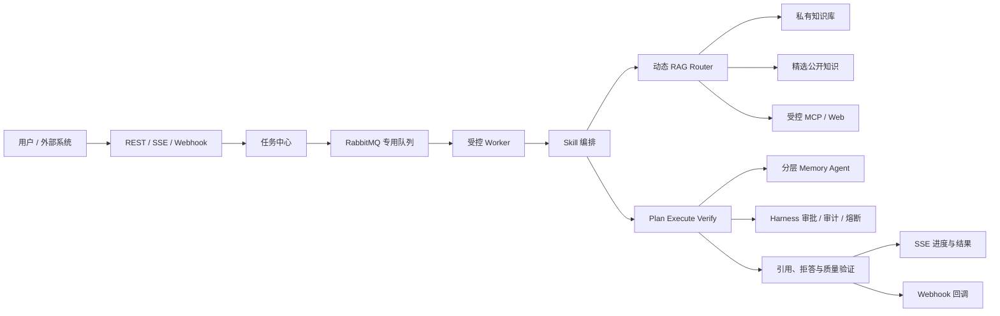

# 可信研发知识协作 Agent 升级总计划

> 状态：规划中（持续更新）  
> 创建日期：2026-08-14  
> 产品定位：面向个人开发者和小型研发团队的可信知识协作 Agent。  
> 本文是当前唯一维护的跨模块计划，负责需求、设计、实施和验收的主索引。历史专项方案已归档；当前实施范围和验收以本文与现有 Spec 为准。

---

## 1. 目标与产品边界

### 1.1 核心问题

用户的项目资料分散于设计文档、接口说明、故障复盘、会议纪要、PDF、架构图和任务系统中。模型即使具备通用知识，也无法可靠获得这些私有、持续变化且需要权限控制的事实。

系统目标是：根据问题和证据状态，选择直接回答、私有知识库检索、受控公开资料检索或任务工作流；所有事实性结论均可追溯到证据，并对无证据、权限不足或高风险操作明确拒答、追问或请求审批。

### 1.2 一期范围

一期只服务“研发知识协作”场景，覆盖：

- 项目 Onboarding：基于架构、接口、运行手册回答系统设计问题。
- 故障排查：关联日志、故障复盘和版本记录，输出带证据的排查建议。
- 技术决策追溯：说明某项技术方案的结论、证据、替代方案和历史取舍。
- 文档处理任务：异步解析、索引、评测和报告生成，并向发起方反馈进度和结果。

### 1.3 非目标

- 不做通用搜索引擎，不抓取或长期存储整个互联网。
- 不允许用户上传任意可执行脚本作为 Skill；Skill 只能调用经登记、授权和审计的工具。
- 不将多 Agent 作为普通问答的默认执行方式。
- 不为了功能开发直接升级 Spring AI 大版本；当前 `Spring AI 1.1.0` 保持稳定，升级须作为独立兼容性验证任务。
- 不将未授权的付费课程、完整商业内容或敏感真实内部资料放入演示数据集。

## 2. 目标架构



设计原则：私有知识优先；所有外部来源独立标识；同一会话顺序一致、跨会话受控并发；任务可恢复、可观测、可评测；复杂协作由固定角色和结构化契约控制。

## 3. 知识与数据规范

### 3.1 知识源分层

| 层级 | 数据 | 使用方式 | 约束 |
| --- | --- | --- | --- |
| L1 私有知识 | 设计、复盘、会议、接口、代码说明、任务、私有 PDF/图片 | 默认优先，构成业务价值 | 强制用户/知识库权限隔离与删除能力 |
| L2 精选公开资料 | 官方文档、协议、Release Notes、明确许可的开源资料 | 通用技术问题或本地评测 | 保留许可证、版本、来源 URL 与抓取日期 |
| L3 实时外部资料 | 受控 Web/MCP 查询结果 | L1/L2 证据不足时按需调用 | 不默认入库；必须标记时效和来源 |

公开资料并非只用于测试，但不应替代私有知识库的主价值。演示和开发阶段可先用 L2 构建可复现数据集；对外展示时使用脱敏或模拟的 L1 团队资料证明私有知识治理能力。

### 3.1.1 检索范围与授权分层

RAG 检索必须受范围约束，但“Agent 手动选择知识库”只表示默认检索策略，不能替代资源授权。范围按以下三层收敛，后层只能缩小前层，不能扩大：

1. **硬权限范围**：由知识库的 `ownerId`、团队/租户和 ACL 计算。知识库 CRUD、文档访问、索引和检索均须在后端按当前用户校验；无权或不存在的知识库 ID 必须明确拒绝，不能静默忽略。
2. **Agent 默认范围**：Agent 的 `allowedKbs` 必须是硬权限范围的子集，用于限定该 Agent 默认参与检索的业务域。创建或更新 Agent 时，服务端须校验 ID 存在、去重且当前用户可访问。
3. **会话临时范围**：用户可在当前会话从 Agent 默认范围中继续缩小到项目或单一知识库；模型工具请求也只能在该收窄集合内生效，不能通过传入任意 `kbIds` 扩权。

当前 JSONB `allowedKbs` 可作为个人开发者和小团队 MVP 的 Agent 默认范围实现；出现共享知识库、角色授权、反向查询、审计或删除级联需求时，迁移为 `agent_knowledge_base` 关系表。G1 开始任何知识库、任务或 Router 实现前，必须先补齐硬权限范围及越权绑定、越权检索、删除后引用、空绑定和多知识库过滤的测试。

### 3.2 统一元数据

所有源文档、派生文本块和图片/表格资产至少保存：`sourceUrl`、`sourceTitle`、`publisher`、`license`、`fetchedAt`、`documentVersion`、`contentType`、`language`、`contentHash`、`tags`、`knowledgeBaseId`、`ownerId`、`visibility`。

多模态资产额外保存原文件、页码或坐标、OCR 文本/图片说明、所属文档和关联段落。答案引用必须能定位至文档路径，以及 PDF 页码、图片或表格位置（如适用）。

### 3.3 数据集与评测

构建独立于调参语料的评测集，首期目标 100 个人工复核 case，至少包含：精确术语、改写、多文档综合、多轮追问、图文/表格问答、无答案拒答和权限越界拒答。每个 case 记录 `query`、`queryType`、`goldChunkIds`、`goldFacts`、`shouldAbstain`、`kbScope` 和数据集版本。

## 4. 能力规格与依赖关系

### 4.1 异步任务中心与队列

使用现有 RabbitMQ，但与邮件任务隔离 exchange、queue 和 DLQ。长耗时工作不占用 HTTP 请求线程，包括文档解析/索引、批量 embedding、RAG 评测、报告生成和复杂 Skill。

任务实体的最小状态机：

```text
PENDING -> QUEUED -> RUNNING -> WAITING_APPROVAL -> SUCCEEDED
                              |                    |
                              +-> FAILED <----------+
                              +-> CANCELLED
```

每个任务必须包含任务类型、提交者、输入快照、Skill 版本、幂等键、进度、尝试次数、错误摘要、结果引用和创建/更新时间。Worker 必须受并发上限、超时、退避重试和死信治理；高风险步骤进入 `WAITING_APPROVAL`，不可绕过 Harness。

### 4.2 Skill

Skill 是可复用、可版本化、受权限控制的 Agent 工作流模板，不是任意代码执行入口。每个 Skill 的最小契约包括：

- 名称、版本、用途、输入/输出 JSON Schema。
- 系统指令、知识库范围、可用工具白名单和审批策略。
- 同步/异步执行模式、超时与并发预算。
- 引用、拒答或结构化结果要求，以及对应验证器。

首批候选 Skill：文档入库与索引、RAG 质量评测、技术方案对比、故障复盘总结、会议待办提取和项目周报生成。先以内置模板实现；只有出现用户可配置需求时才设计持久化的自定义 Skill。

### 4.3 动态 RAG Router

Router 只做结构化决策，不直接生成最终答案。其输出至少包括：`route`、`searchScope`、`rewriteMode`、`retrievalChannels`、`topK`、`rerankEnabled`、`needClarification` 和 `reason`。

首期 route 固定为：

- `DIRECT`：闲聊或无需外部事实的请求。
- `PRIVATE_RAG`：默认事实检索，限定可访问私有 KB。
- `HYBRID_RAG`：私有与精选公开资料联合检索，来源分组返回。
- `MULTIMODAL_RAG`：问题涉及 PDF、图片、表格或图文证据。
- `EXTERNAL_TOOL`：已有知识库证据不足且用户允许时，调用受控 MCP/Web 工具。
- `CLARIFY` / `ABSTAIN`：范围不明确、无证据、无权限或风险过高。

Router 必须与“全链路固定检索”做消融对比，按问题类型报告质量、p95 延迟和 token 成本；无稳定收益不得默认启用更复杂链路。

### 4.4 多模态摄入与检索

按 PDF/纯文本/HTML/图片的顺序扩展。表格要保留标题、行列与单元格关系；图片要通过 OCR/说明文本和位置元数据参与检索。视频、音频和通用视觉理解不在一期范围。

每新增一种格式都必须独立验证：解析正确性、重复入库幂等性、权限隔离、召回质量、引用定位和失败可重试。

### 4.5 Plan-Execute-Verify 与多 Agent

现有 Think-Execute 循环保留。复杂任务先由 Planner 输出有限、可校验的执行计划，Executor 调用 Harness 包装的工具，Verifier 校验关键事实是否有证据、是否矛盾、越权或需要补检索。

多 Agent 只在以下职责稳定后引入：Router/Retriever、Workflow Executor、Verifier、Memory Agent。角色之间必须使用 JSON Schema 交换状态，具有最大轮数、超时、成本预算和单 Agent fallback；不采用自由对话式群体 Agent。

### 4.6 分层记忆与反思

记忆分为短期工作记忆、会话摘要、长期事实/偏好、任务情景记忆和待确认候选。长期记忆必须有来源、置信度、时间、过期时间、冲突关系和用户确认状态，并支持查看、编辑、删除和清空。

反思只在任务完成、验证失败或用户纠错后触发，提取“有效策略、失败原因、待跟进事项”等低权重情景记忆；禁止自动覆盖用户事实。先完成摘要上限、提取节流、语义去重和冲突处理，再增加反思能力。

### 4.7 Webhook

Webhook 服务于外部系统集成：入站触发文档索引或任务；出站通知索引完成、审批待处理、任务失败/完成。出站请求必须提供签名、事件 ID、超时、指数退避、投递日志和死信；入站请求必须校验签名、限制来源并映射到任务中心。Webhook 不承载长耗时业务逻辑。

### 4.8 并发、性能与可靠性

- 同一 `chatSessionId` 的 Agent 任务顺序执行；不同会话可并行，避免上下文和 SSE 事件交错。
- Agent 执行、工具调用、记忆提取、文档索引和 Webhook 投递使用隔离的有界线程池，不使用公共线程池承载阻塞 I/O。
- 仅并行执行相互独立、只读且通过 Harness 授权的工具；写操作、审批和存在依赖的步骤保持顺序。
- RAG 独立候选通道可在总超时预算内并发；先通过 tracing 确认瓶颈，再实施并行化。
- 缓存 Key 必须纳入权限范围、KB 集合、索引版本和检索配置；不得跨租户复用结果。
- 当前单机 `SseEmitter` 连接管理只适用于单实例。横向扩展前需引入事件分发、重连、事件序号恢复与会话黏性方案。

## 5. 分阶段路线图

| 阶段 | 目标 | 核心交付 | 退出条件 |
| --- | --- | --- | --- |
| G0 基线与观测 | 先保证现有主链路可验证 | 聊天/RAG/SSE/审批联调、Trace ID、延迟与错误指标 | 关键旅程可回归，已有 RAG 基线不退化 |
| G1 任务与摄入基础 | 长任务可恢复，知识库可扩展 | 任务中心、RabbitMQ Worker、PDF/文本/HTML、索引状态与 SSE 进度 | 上传不阻塞请求，失败可重试，文档可定位引用 |
| G2 自适应可信 RAG | 让检索策略由证据和问题驱动 | Router、精选公开源、图文/表格检索、引用与拒答 | 相比固定链路有可复现收益，拒答和权限 case 通过 |
| G3 Skill 与记忆治理 | 任务可复用，长期上下文受控 | 内置 Skill、摘要收口、节流、去重、冲突和用户管理 UI | 记忆不阻断对话，任务结果满足输出 Schema |
| G4 验证与协作 | 复杂任务可被校验和审计 | Planner/Verifier、受限多 Agent、Webhook | 质量收益覆盖额外成本，工具权限和审计可追溯 |
| G5 扩展性收口 | 并发与多实例稳定 | 会话顺序调度、专用线程池、背压、缓存、SSE 分发与压测 | 通过约定负载下的延迟、错误率和恢复验收 |

G0 是其余阶段前置条件。G1-G3 为项目的核心简历主线；G4-G5 在有量化收益和时间预算时推进，不以“功能数量”作为完成标准。

### 5.1 G0 当前续作入口（2026-08-17）

当前代码已具备登录后发送拦截、`AI_CONTENT_DELTA` 回答分片、`AI_ERROR` 失败事件、执行轨迹与审批卡片。中转站的 `ChatResponse.getResult() == null` 空帧已由后端忽略，避免中断后续回答分片；无工具调用的最终 Assistant 消息会在 `AI_DONE` 丢失时主动收起“思考中”状态；两项行为均由回归测试固定。

新会话继续实施时，按以下顺序执行，不得提前进入 G1：

1. 先在 `backend_v2` 运行 `.\mvnw.cmd -q "-Dtest=SseMessageStreamingContractTest,JChatMindStreamingSseTest,JChatMindErrorSseTest,SseServiceImplTest" test`，再在 `ui` 运行 `npm.cmd run build`，确认 G0 当前代码基线。
2. 使用已登录的隔离测试账号，在聊天页重新验证普通回答的逐段显示、知识库检索回答、`AI_ERROR` 提示、审批卡片的批准/拒绝；把截图和日志相对路径回填 `TC-G0-06`，不得用普通用户或真实业务数据。
3. 单独复现并修复当前 `npm.cmd run lint` 的既有 Hook 规则失败，再更新前端门禁结论；不能把构建通过当作 lint 通过。
4. 继续补齐 `TC-G0-01` 至 `TC-G0-05` 的未验收边界和 G0 L3 手工签收。全部 G0 必需用例及证据满足第 6 节后，才可为 G1 补充 schema、fixture 和 RED 用例。

## 6. 验收指标与门禁

每次影响检索、记忆、工具或数据模型的改动，必须同时报告版本、数据集、配置、成本和延迟。指标包括：

- 检索：`Recall@K`、`MRR@K`、Coverage、Diversity、权限违规率。
- 生成：Citation Precision/Recall、Faithfulness、Answer Correctness、Abstention Accuracy。
- 记忆：Memory Precision@K、Stale Rate、Contradiction Rate、User Correction Rate。
- 任务：排队时长、成功率、重试率、死信率、幂等重复执行率。
- 系统：首 token 和完整响应 p50/p95/p99、队列积压、线程池拒绝率、缓存命中率、token/费用、SSE 重连成功率。

### 6.1 测试分层与隔离环境

| 层级 | 范围 | 环境与副作用边界 |
| --- | --- | --- |
| L0 | 指标、状态机、路由、权限判断和序列化契约 | 纯 JUnit；不启动 Spring，不访问外部服务。 |
| L1 | Controller、Service、SSE、Harness 和消息边界 | Spring 集成测试；邮件、MCP/Web 等外部调用必须使用测试替身。 |
| L2 | 数据库、Redis、RabbitMQ、Ollama 与异步链路 | 隔离 Docker 环境；只使用测试账号、测试知识库和可清理测试数据。 |
| L3 | 浏览器关键用户旅程 | G0 使用 `npm run lint`、`npm run build` 与可重复手工旅程；G1 起引入 Playwright，禁止连接真实邮件、MCP/Web 或生产数据。 |

### 6.2 用例记录与统一门禁

每个用例必须记录 `TC-ID`、阶段、层级、隔离环境、前置数据版本、步骤、预期结果、执行入口、报告路径、执行日期、执行人和结论。用例未填齐上述字段或外部依赖不可用时不得标记为通过。

| 门禁 | 判定 |
| --- | --- |
| 基础构建 | 必需后端测试、`npm run lint`、`npm run build` 必须通过。 |
| RAG 回归 | fixture Recall@5 保持 `1.0`；真实 KB 结果必须与签收基线比较并解释波动。 |
| 性能与成本 | 固定 G0 环境基线后，p95 延迟最多增加 15%，token/调用成本最多增加 10%，错误率最多增加 1 个百分点。 |
| 外部边界 | 邮件、MCP/Web、生产数据不得被测试直接调用；必须以替身、签名校验或隔离测试资源验证。 |
| 阶段退出 | 本阶段所有必需 `TC-ID` 通过，且对应报告、数据集版本、配置版本和基线对比已回填本计划。 |

报告默认保存在 `backend_v2/target/surefire-reports/`、`backend_v2/target/rag-eval/` 或 Playwright 报告目录；本计划的“阶段验收证据”表只记录相对路径、日期、执行人和结论，不新建平行测试文档。

### 6.3 G0-G5 验收矩阵

下表定义阶段实现后必须具备的最小验收用例。尚未实现的能力标记为“待该阶段实现”，不得将计划中的用例视为已有测试覆盖。

| TC-ID | 阶段 / 层级 | 前置与步骤 | 预期结果 | 执行入口 |
| --- | --- | --- | --- | --- |
| TC-G0-01 | G0 / L1 | 使用最小测试配置启动应用上下文。 | Bean 图可启动；循环依赖或缺失必需配置导致明确失败。 | `CircularDependencyStartupTest` |
| TC-G0-02 | G0 / L1 | 发送测试消息，等待 Agent 完成并读取会话历史。 | 消息持久化，Agent 状态结束，历史顺序正确。 | 聊天链路集成测试；G0 手工旅程 |
| TC-G0-03 | G0 / L0-L1 | 运行指标公式、冻结 replay 与 fixture 检索评测。 | 指标计算正确；replay 报告可读；fixture Recall@5 为 `1.0`。 | `RagAsMetricsTest`、`RagFastRegressionEvaluatorTest`、`RagRecallEvaluationTest` |
| TC-G0-04 | G0 / L0-L3 | 模拟正文分片、空响应帧、SSE 发送失败和执行异常；重连/重复事件为后续边界。 | 空帧不阻断后续分片；`AI_CONTENT_DELTA` 顺序完整；`AI_ERROR` 可见；恢复/去重不在本次已签收范围。 | `SseMessageStreamingContractTest`、`JChatMindStreamingSseTest`、`JChatMindErrorSseTest`、`SseServiceImplTest`；G0 手工旅程 |
| TC-G0-05 | G0 / L1 | 对高风险工具分别执行批准、拒绝和超时路径。 | 状态进入并退出 `WAITING_APPROVAL`；工具不绕过 Harness；审计结果可追溯。 | `HarnessRunnerTest` 及审批相关测试 |
| TC-G0-06 | G0 / L3 | 在测试账号和测试知识库中执行创建 Agent、聊天、检索、审批和回答分片可见性旅程。 | 页面构建与静态契约通过；用户能看到消息、分片、正确结束的状态、失败提示和审批卡片；lint 需单独通过。 | `node ui/tests/chat-auth-guard.contract.mjs`、`node ui/tests/execution-trace.contract.mjs`、`node ui/tests/content-delta-rendering.contract.mjs`、`node ui/tests/final-content-status.contract.mjs`、`npm.cmd run build`、`npm.cmd run lint`、手工清单 |
| TC-G1-01 | G1 / L0-L2 | 创建任务后依次覆盖排队、运行、取消、重试、失败和死信。 | 状态机合法；重试上限、错误摘要和 DLQ 一致。 | 待该阶段实现的任务中心测试 |
| TC-G1-02 | G1 / L1-L2 | 使用相同幂等键重复提交，随后重放已完成任务。 | 只产生一个业务结果；重复请求返回同一任务或明确冲突。 | 待该阶段实现的幂等集成测试 |
| TC-G1-03 | G1 / L2 | 分别上传 PDF、纯文本、HTML 与损坏文件。 | 正常文件可解析、索引并定位引用；损坏文件失败可重试。 | 待该阶段实现的摄入集成测试 |
| TC-G1-04 | G1 / L2 | 重复上传及跨用户/跨知识库访问相同文档。 | 重复入库幂等；资源与检索结果严格隔离。 | 待该阶段实现的权限与幂等测试 |
| TC-G1-05 | G1 / L3 | Playwright 执行上传、索引进度、失败重试和查询。 | UI 与 SSE 进度一致；索引完成后可查询并展示来源。 | G1 引入的 Playwright 测试 |
| TC-G2-01 | G2 / L0-L1 | 为 `DIRECT`、`PRIVATE_RAG`、`HYBRID_RAG`、`MULTIMODAL_RAG`、`EXTERNAL_TOOL`、`CLARIFY`、`ABSTAIN` 提供固定输入。 | Router 输出合法 schema、预期 route、KB 范围和原因。 | 待该阶段实现的 Router 契约测试 |
| TC-G2-02 | G2 / L1-L2 | 覆盖无权限、无证据和未授权外部调用。 | 不泄露私有来源；返回拒答/澄清；不调用外部工具。 | 待该阶段实现的权限与拒答测试 |
| TC-G2-03 | G2 / L2 | 在冻结数据集比较固定检索与 Router 链路。 | 质量、p95、token 成本和数据集版本进入报告；未证明收益不得默认切换。 | RAG 评测入口与 G2 对比报告 |
| TC-G2-04 | G2 / L2 | 对 PDF、图片和表格 golden case 检索并生成引用。 | 召回、页码/坐标定位和来源层级正确。 | 待该阶段实现的多模态评测 |
| TC-G2-05 | G2 / L1-L2 | 对无答案及权限越界 case 生成响应。 | 拒答准确，不伪造引用或越权事实。 | 待该阶段实现的拒答评测 |
| TC-G3-01 | G3 / L0-L1 | 提交合法/非法 Skill 输入、超出白名单工具及审批策略。 | Schema 校验明确；未授权工具不可执行。 | 待该阶段实现的 Skill 契约测试 |
| TC-G3-02 | G3 / L0-L2 | 覆盖记忆节流、去重、冲突、过期、确认和删除。 | 不自动覆盖用户事实；候选状态、来源和隔离信息完整。 | 待该阶段实现的记忆生命周期测试 |
| TC-G3-03 | G3 / L3 | Playwright 执行查看、确认、编辑、删除和清空记忆。 | UI 与后端状态一致，且仅展示当前用户数据。 | G3 Playwright 测试 |
| TC-G3-04 | G3 / L1-L2 | 让记忆提取或持久化失败。 | 聊天主链路完成；失败记录可诊断且可重试。 | 待该阶段实现的异常集成测试 |
| TC-G4-01 | G4 / L1-L2 | Planner 产出计划，Executor 调工具，Verifier 检查证据、越权和矛盾。 | 无证据或越权时阻断；通过时保留可追溯验证结果。 | 待该阶段实现的工作流集成测试 |
| TC-G4-02 | G4 / L1 | 模拟角色超时、最大轮数耗尽和验证失败。 | 在预算内失败或进入单 Agent fallback，不无限循环。 | 待该阶段实现的协作边界测试 |
| TC-G4-03 | G4 / L1-L2 | 发送缺失/无效签名、重复事件和超时 Webhook。 | 入站拒绝无效请求；事件去重；失败进入重试或 DLQ。 | 待该阶段实现的 Webhook 测试 |
| TC-G4-04 | G4 / L2 | 模拟出站回调重试、最终失败和投递恢复。 | 签名、事件 ID、日志和死信记录完整；不重复执行业务。 | 待该阶段实现的回调集成测试 |
| TC-G5-01 | G5 / L2 | 同一会话并发提交、不同会话并发提交。 | 同会话严格有序；不同会话可并行且无串扰。 | 待该阶段实现的并发集成测试 |
| TC-G5-02 | G5 / L2 | 压满队列/线程池并触发超时与拒绝。 | 背压、拒绝、重试和监控指标符合配置；无无限积压。 | 待该阶段实现的负载测试 |
| TC-G5-03 | G5 / L2 | 使用不同用户、KB 集合、索引版本和检索配置访问缓存。 | 缓存 Key 隔离，无跨租户或跨版本命中。 | 待该阶段实现的缓存隔离测试 |
| TC-G5-04 | G5 / L2-L3 | 模拟多实例 SSE、事件序号恢复、断线和固定负载恢复。 | 事件不乱序、不重复；恢复后状态一致；性能满足基线门禁。 | 待该阶段实现的 SSE/负载测试 |

### 6.4 用例验收证据

每次执行均在对应 `TC-ID` 行补充数据/配置版本、报告路径、基线对比、日期、执行人和结论；不得合并多个用例的证据，也不得覆盖历史结论。

| TC-ID | 数据集/配置版本 | 报告路径 | 基线对比 | 执行日期 | 执行人 | 结论 |
| --- | --- | --- | --- | --- | --- | --- |
| TC-G0-01 | 最小 TestConfig；mock ChatClient/MCP callback | `backend_v2/target/surefire-reports/` | 最小 Bean 图启动通过；完整 ApplicationContext 基线待执行 | 2026-08-15 | Codex | 部分通过（CircularDependencyStartupTest） |
| TC-G0-02 | 待签收 | 待执行 | 建立基线 | 待执行 | 待指定 | 未验收 |
| TC-G0-03 | `fixture-fast-v1`; `ragas.enabled=false` | `backend_v2/target/surefire-reports/`; `backend_v2/target/rag-eval/fast/fixture-fast-v1-report.json` | L0 Context Precision/Recall、Recall@5 与既有冻结 replay 一致；L2 fixture 待执行 | 2026-08-15 | Codex | 部分通过（TC-G0-03a/03b；TC-G0-03c 待隔离 Docker） |
| TC-G0-04 | mock `SseEmitter`；无外部服务 | `backend_v2/target/surefire-reports/` | 未连接与发送 IOException 均安全处理；重连/去重事件 schema 未定义 | 2026-08-15 | Codex | 未验收（基础保护测试通过；恢复契约待补充） |
| TC-G0-04 | mock `ChatClient`、`SseService`；包含 `ChatResponse.getResult() == null` 空帧 | `backend_v2/target/surefire-reports/` | `AI_CONTENT_DELTA` 枚举、每个有效文本分块、完整消息持久化与 `AI_ERROR` 均通过；空帧此前稳定复现空指针，修复后被忽略 | 2026-08-17 | Codex | 部分通过（L0 流式与错误契约通过；L3 浏览器分片、重连/去重待验收） |
| TC-G0-05 | 内存审批 store；`timeoutSeconds=0` | `backend_v2/target/surefire-reports/` | L0 批准/拒绝/超时状态符合 Harness 约束；ToolCallbackProxy L1 待执行 | 2026-08-15 | Codex | 部分通过（HarnessRunnerTest；代理执行路径待验收） |
| TC-G0-06 | `ui`；本地 Node/npm.cmd | `ui/dist/index.html` | `npm.cmd run lint`、`npm.cmd run build` 通过；隔离测试账号、知识库与后端手工旅程待执行 | 2026-08-16 | Codex | 部分通过（前端构建门禁已通过；L3 手工旅程待隔离环境） |
| TC-G0-06 | 隔离账号 `g0-e2e-20260816170837`；隔离 KB/Agent/文档；本地 Docker、Node/npm.cmd | `ui/dist/index.html`; `backend_v2/target/tc-g0-06-95301e96-1215-45ba-823c-61fd29aade6c-sse.log`; `backend_v2/target/g0-backend-mcp-disabled-v2.log` | Docker 与前后端端口可用；lint/build 与 SSE 事件类型契约通过；真实 SSE 已连接、用户消息已持久化，但 Java Agent 调用 DeepSeek POST 持续 `ConnectException`。无鉴权根路径 HEAD 返回 `401`，`/chat/completions` 的 HEAD/POST 均超时，故无检索回答或审批请求 | 2026-08-17 | Codex | 未验收（外部模型端点接入不可用；L3 手工聊天、检索与审批可见性待其恢复后重试） |
| TC-G0-06 | 隔离账号 `g0-e2e-20260816170837`；隔离 KB/Agent/文档；中转站 `/v1`；`deepseek-v4-flash` | `backend_v2/target/tc-g0-06-smartfan-flash-102c43a5-c0e4-42f3-adbf-7c5aad2ccf10-sse.log`; `backend_v2/target/tc-g0-06-approval-a45d8486-56ee-4dcc-9495-7ef0f8fa4c62-sse.log`; `backend_v2/target/g0-backend-smartfan-v1-flash.log` | `KnowledgeTool` 命中隔离文档并回答 `G0-06-RAG-ISOLATED-SUCCESS`、消息持久化且 `AI_DONE`；`databaseQuery` 先发出 `TOOL_APPROVAL_REQUIRED`、待审批 API 返回同一受限常量 SELECT，批准后工具结果和最终回答持久化。监听的 150 秒 `curl` 超时早于批准后的尾部 SSE；浏览器 EventSource 为 30 分钟。 | 2026-08-17 | Codex | 部分通过（真实 RAG、SSE、Harness 审批及错误事件已验证；L3 浏览器手工消息、状态、失败提示与审批卡片待操作签收） |
| TC-G0-06 | 本地 Node/npm.cmd；已登录隔离会话；中转站流式空帧和 `AI_DONE` 丢失场景 | `ui/dist/index.html`; `backend_v2/target/surefire-reports/`; `backend_v2/target/g0-backend-smartfan-v1-flash.log` | `npm.cmd run build` 通过；前端具备回答分片、执行轨迹、审批、错误状态与最终回答状态收尾静态契约。后端日志曾记录空帧空指针与 SSE 客户端断连；空帧已由 L0 回归覆盖，最终 Assistant 消息可独立清理残留状态。刷新后的浏览器真实分片尚待签收。`npm.cmd run lint` 仍有既有 Hook 规则失败。 | 2026-08-17 | Codex | 部分通过（构建与静态契约通过；浏览器流式复验和 lint 基线待完成） |
| TC-G1-01 | 待该阶段实现 | 待执行 | 对比 G0 | 待执行 | 待指定 | 未验收 |
| TC-G1-02 | 待该阶段实现 | 待执行 | 对比 G0 | 待执行 | 待指定 | 未验收 |
| TC-G1-03 | 待该阶段实现 | 待执行 | 对比 G0 | 待执行 | 待指定 | 未验收 |
| TC-G1-04 | 待该阶段实现 | 待执行 | 对比 G0 | 待执行 | 待指定 | 未验收 |
| TC-G1-05 | 待该阶段实现 | 待执行 | 对比 G0 | 待执行 | 待指定 | 未验收 |
| TC-G2-01 | 待该阶段实现 | 待执行 | 对比 G0 | 待执行 | 待指定 | 未验收 |
| TC-G2-02 | 待该阶段实现 | 待执行 | 对比 G0 | 待执行 | 待指定 | 未验收 |
| TC-G2-03 | 待该阶段实现 | 待执行 | 对比 G0 | 待执行 | 待指定 | 未验收 |
| TC-G2-04 | 待该阶段实现 | 待执行 | 对比 G0 | 待执行 | 待指定 | 未验收 |
| TC-G2-05 | 待该阶段实现 | 待执行 | 对比 G0 | 待执行 | 待指定 | 未验收 |
| TC-G3-01 | 待该阶段实现 | 待执行 | 对比 G0 | 待执行 | 待指定 | 未验收 |
| TC-G3-02 | 待该阶段实现 | 待执行 | 对比 G0 | 待执行 | 待指定 | 未验收 |
| TC-G3-03 | 待该阶段实现 | 待执行 | 对比 G0 | 待执行 | 待指定 | 未验收 |
| TC-G3-04 | 待该阶段实现 | 待执行 | 对比 G0 | 待执行 | 待指定 | 未验收 |
| TC-G4-01 | 待该阶段实现 | 待执行 | 对比 G0 | 待执行 | 待指定 | 未验收 |
| TC-G4-02 | 待该阶段实现 | 待执行 | 对比 G0 | 待执行 | 待指定 | 未验收 |
| TC-G4-03 | 待该阶段实现 | 待执行 | 对比 G0 | 待执行 | 待指定 | 未验收 |
| TC-G4-04 | 待该阶段实现 | 待执行 | 对比 G0 | 待执行 | 待指定 | 未验收 |
| TC-G5-01 | 待该阶段实现 | 待执行 | 对比 G0 | 待执行 | 待指定 | 未验收 |
| TC-G5-02 | 待该阶段实现 | 待执行 | 对比 G0 | 待执行 | 待指定 | 未验收 |
| TC-G5-03 | 待该阶段实现 | 待执行 | 对比 G0 | 待执行 | 待指定 | 未验收 |
| TC-G5-04 | 待该阶段实现 | 待执行 | 对比 G0 | 待执行 | 待指定 | 未验收 |

### 6.5 完备性审核结论

本计划已为 G0-G5 的每项交付定义正向、失败/拒绝或恢复/边界测试，并将每个阶段退出条件绑定到 `TC-ID`、隔离环境和通过判定。RAG 指标细则由现有 Spec 维护；任务、Router、记忆、Webhook、并发和多实例 SSE 的测试均明确为对应阶段实现后的必需交付。

当前仅 G0 的部分后端、前端静态契约与 RAG 测试入口已存在，G0 基线尚未签收；最新续作顺序见第 5.1 节。G1-G5 的能力和测试均未实现。任何“待该阶段实现”项目在真实代码、执行命令和报告路径补齐前均不得标记为已覆盖。

## 7. 风险与决策规则

| 风险 | 规则 |
| --- | --- |
| 多 Agent 只增加复杂度 | 先以服务/验证器实现职责；固定评测证明收益后再拆 Agent |
| 公开资料污染私有结论 | 路由、检索结果和回答引用均显式标识来源层级 |
| 异步任务无限堆积 | 有界队列、并发配额、拒绝策略、超时、重试和 DLQ 必须同时具备 |
| 多模态质量不可控 | 每种格式独立建立 golden case，不以 OCR 文本存在即视为可用 |
| 记忆误写或过期 | 候选与确认分离，冲突保留审计，敏感信息默认不自动持久化 |
| Spring AI 大版本迁移破坏现有链路 | 单开升级分支，完成依赖、启动、MCP、工具调用和回归兼容性矩阵后才合并 |

## 8. 关联文档与更新规则

- 当前架构：[项目架构与关键链路.md](../../项目架构与关键链路.md)。
- 当前实施 Spec：[trusted-knowledge-agent-spec.md](../../spec/trusted-knowledge-agent-spec.md)。
- 历史专项方案、完成计划、评测资料和故障记录：[归档区](../../archive/2026-08-15/)。归档内容只用于追溯，不作为新的维护入口。

更新本计划时：直接在本文补充阶段目标、依赖、风险、决策和验收证据；实施范围、数据 schema、配置或测试口径变化时更新现有 Spec；当前实现变化时同步更新架构文档。不得在 `plans/active/` 新增平行总计划。

### 决策记录

| 日期 | 决策 | 原因 |
| --- | --- | --- |
| 2026-08-14 | 定位为可信研发知识协作 Agent | 能将现有 RAG、记忆、MCP 和 Harness 组织为真实业务闭环 |
| 2026-08-14 | 私有知识库优先，公开资料分层使用 | 私有、时效、权限和可追溯事实才是 RAG 的核心价值 |
| 2026-08-14 | 任务中心先于 Skill、Webhook 和多 Agent | 任务状态、恢复、权限和可观测性是后续编排的基础 |
| 2026-08-14 | 多 Agent 不作为默认路径 | 普通问答无法证明多角色协作的额外成本合理 |
