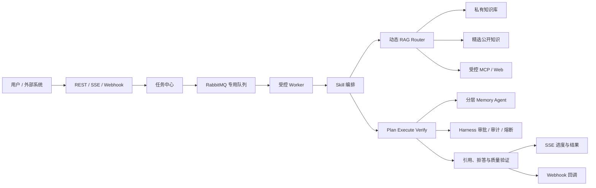

# 可信研发知识协作 Agent 升级总计划

> 状态：规划中（持续更新）  
> 创建日期：2026-08-14  
> 产品定位：面向个人开发者和小型研发团队的可信知识协作 Agent。  
> 本文是后续需求、设计、实施和验收的主索引；已有 RAG、记忆、MCP 和联调方案继续作为专项细节的权威来源，不在此重复实现细节。

---

## 1. 目标与产品边界

### 1.1 核心问题

用户的项目资料分散于设计文档、接口说明、故障复盘、会议纪要、PDF、架构图和任务系统中。模型即使具备通用知识，也无法可靠获得这些私有、持续变化且需要权限控制的事实。

系统目标是：根据问题和证据状态，选择直接回答、私有知识库检索、受控公开资料检索或任务工作流；所有事实性结论均可追溯到证据，并对无证据、权限不足或高风险操作明确拒答、追问或请求审批。

### 1.2 一期范围

一期只服务“研发知识协作”场景，覆盖：

- 项目 Onboarding：基于架构、接口、运行手册回答系统设计问题。
- 故障排查：关联日志、故障复盘和版本记录，输出带证据的排查建议。
- 技术决策追溯：说明某项技术方案的结论、证据、替代方案和历史取舍。
- 文档处理任务：异步解析、索引、评测和报告生成，并向发起方反馈进度和结果。

### 1.3 非目标

- 不做通用搜索引擎，不抓取或长期存储整个互联网。
- 不允许用户上传任意可执行脚本作为 Skill；Skill 只能调用经登记、授权和审计的工具。
- 不将多 Agent 作为普通问答的默认执行方式。
- 不为了功能开发直接升级 Spring AI 大版本；当前 `Spring AI 1.1.0` 保持稳定，升级须作为独立兼容性验证任务。
- 不将未授权的付费课程、完整商业内容或敏感真实内部资料放入演示数据集。

## 2. 目标架构



设计原则：私有知识优先；所有外部来源独立标识；同一会话顺序一致、跨会话受控并发；任务可恢复、可观测、可评测；复杂协作由固定角色和结构化契约控制。

## 3. 知识与数据规范

### 3.1 知识源分层

| 层级 | 数据 | 使用方式 | 约束 |
| --- | --- | --- | --- |
| L1 私有知识 | 设计、复盘、会议、接口、代码说明、任务、私有 PDF/图片 | 默认优先，构成业务价值 | 强制用户/知识库权限隔离与删除能力 |
| L2 精选公开资料 | 官方文档、协议、Release Notes、明确许可的开源资料 | 通用技术问题或本地评测 | 保留许可证、版本、来源 URL 与抓取日期 |
| L3 实时外部资料 | 受控 Web/MCP 查询结果 | L1/L2 证据不足时按需调用 | 不默认入库；必须标记时效和来源 |

公开资料并非只用于测试，但不应替代私有知识库的主价值。演示和开发阶段可先用 L2 构建可复现数据集；对外展示时使用脱敏或模拟的 L1 团队资料证明私有知识治理能力。

### 3.2 统一元数据

所有源文档、派生文本块和图片/表格资产至少保存：`sourceUrl`、`sourceTitle`、`publisher`、`license`、`fetchedAt`、`documentVersion`、`contentType`、`language`、`contentHash`、`tags`、`knowledgeBaseId`、`ownerId`、`visibility`。

多模态资产额外保存原文件、页码或坐标、OCR 文本/图片说明、所属文档和关联段落。答案引用必须能定位至文档路径，以及 PDF 页码、图片或表格位置（如适用）。

### 3.3 数据集与评测

构建独立于调参语料的评测集，首期目标 100 个人工复核 case，至少包含：精确术语、改写、多文档综合、多轮追问、图文/表格问答、无答案拒答和权限越界拒答。每个 case 记录 `query`、`queryType`、`goldChunkIds`、`goldFacts`、`shouldAbstain`、`kbScope` 和数据集版本。

## 4. 能力规格与依赖关系

### 4.1 异步任务中心与队列

使用现有 RabbitMQ，但与邮件任务隔离 exchange、queue 和 DLQ。长耗时工作不占用 HTTP 请求线程，包括文档解析/索引、批量 embedding、RAG 评测、报告生成和复杂 Skill。

任务实体的最小状态机：

```text
PENDING -> QUEUED -> RUNNING -> WAITING_APPROVAL -> SUCCEEDED
                              |                    |
                              +-> FAILED <----------+
                              +-> CANCELLED
```

每个任务必须包含任务类型、提交者、输入快照、Skill 版本、幂等键、进度、尝试次数、错误摘要、结果引用和创建/更新时间。Worker 必须受并发上限、超时、退避重试和死信治理；高风险步骤进入 `WAITING_APPROVAL`，不可绕过 Harness。

### 4.2 Skill

Skill 是可复用、可版本化、受权限控制的 Agent 工作流模板，不是任意代码执行入口。每个 Skill 的最小契约包括：

- 名称、版本、用途、输入/输出 JSON Schema。
- 系统指令、知识库范围、可用工具白名单和审批策略。
- 同步/异步执行模式、超时与并发预算。
- 引用、拒答或结构化结果要求，以及对应验证器。

首批候选 Skill：文档入库与索引、RAG 质量评测、技术方案对比、故障复盘总结、会议待办提取和项目周报生成。先以内置模板实现；只有出现用户可配置需求时才设计持久化的自定义 Skill。

### 4.3 动态 RAG Router

Router 只做结构化决策，不直接生成最终答案。其输出至少包括：`route`、`searchScope`、`rewriteMode`、`retrievalChannels`、`topK`、`rerankEnabled`、`needClarification` 和 `reason`。

首期 route 固定为：

- `DIRECT`：闲聊或无需外部事实的请求。
- `PRIVATE_RAG`：默认事实检索，限定可访问私有 KB。
- `HYBRID_RAG`：私有与精选公开资料联合检索，来源分组返回。
- `MULTIMODAL_RAG`：问题涉及 PDF、图片、表格或图文证据。
- `EXTERNAL_TOOL`：已有知识库证据不足且用户允许时，调用受控 MCP/Web 工具。
- `CLARIFY` / `ABSTAIN`：范围不明确、无证据、无权限或风险过高。

Router 必须与“全链路固定检索”做消融对比，按问题类型报告质量、p95 延迟和 token 成本；无稳定收益不得默认启用更复杂链路。

### 4.4 多模态摄入与检索

按 PDF/纯文本/HTML/图片的顺序扩展。表格要保留标题、行列与单元格关系；图片要通过 OCR/说明文本和位置元数据参与检索。视频、音频和通用视觉理解不在一期范围。

每新增一种格式都必须独立验证：解析正确性、重复入库幂等性、权限隔离、召回质量、引用定位和失败可重试。

### 4.5 Plan-Execute-Verify 与多 Agent

现有 Think-Execute 循环保留。复杂任务先由 Planner 输出有限、可校验的执行计划，Executor 调用 Harness 包装的工具，Verifier 校验关键事实是否有证据、是否矛盾、越权或需要补检索。

多 Agent 只在以下职责稳定后引入：Router/Retriever、Workflow Executor、Verifier、Memory Agent。角色之间必须使用 JSON Schema 交换状态，具有最大轮数、超时、成本预算和单 Agent fallback；不采用自由对话式群体 Agent。

### 4.6 分层记忆与反思

记忆分为短期工作记忆、会话摘要、长期事实/偏好、任务情景记忆和待确认候选。长期记忆必须有来源、置信度、时间、过期时间、冲突关系和用户确认状态，并支持查看、编辑、删除和清空。

反思只在任务完成、验证失败或用户纠错后触发，提取“有效策略、失败原因、待跟进事项”等低权重情景记忆；禁止自动覆盖用户事实。先完成摘要上限、提取节流、语义去重和冲突处理，再增加反思能力。

### 4.7 Webhook

Webhook 服务于外部系统集成：入站触发文档索引或任务；出站通知索引完成、审批待处理、任务失败/完成。出站请求必须提供签名、事件 ID、超时、指数退避、投递日志和死信；入站请求必须校验签名、限制来源并映射到任务中心。Webhook 不承载长耗时业务逻辑。

### 4.8 并发、性能与可靠性

- 同一 `chatSessionId` 的 Agent 任务顺序执行；不同会话可并行，避免上下文和 SSE 事件交错。
- Agent 执行、工具调用、记忆提取、文档索引和 Webhook 投递使用隔离的有界线程池，不使用公共线程池承载阻塞 I/O。
- 仅并行执行相互独立、只读且通过 Harness 授权的工具；写操作、审批和存在依赖的步骤保持顺序。
- RAG 独立候选通道可在总超时预算内并发；先通过 tracing 确认瓶颈，再实施并行化。
- 缓存 Key 必须纳入权限范围、KB 集合、索引版本和检索配置；不得跨租户复用结果。
- 当前单机 `SseEmitter` 连接管理只适用于单实例。横向扩展前需引入事件分发、重连、事件序号恢复与会话黏性方案。

## 5. 分阶段路线图

| 阶段 | 目标 | 核心交付 | 退出条件 |
| --- | --- | --- | --- |
| G0 基线与观测 | 先保证现有主链路可验证 | 聊天/RAG/SSE/审批联调、Trace ID、延迟与错误指标 | 关键旅程可回归，已有 RAG 基线不退化 |
| G1 任务与摄入基础 | 长任务可恢复，知识库可扩展 | 任务中心、RabbitMQ Worker、PDF/文本/HTML、索引状态与 SSE 进度 | 上传不阻塞请求，失败可重试，文档可定位引用 |
| G2 自适应可信 RAG | 让检索策略由证据和问题驱动 | Router、精选公开源、图文/表格检索、引用与拒答 | 相比固定链路有可复现收益，拒答和权限 case 通过 |
| G3 Skill 与记忆治理 | 任务可复用，长期上下文受控 | 内置 Skill、摘要收口、节流、去重、冲突和用户管理 UI | 记忆不阻断对话，任务结果满足输出 Schema |
| G4 验证与协作 | 复杂任务可被校验和审计 | Planner/Verifier、受限多 Agent、Webhook | 质量收益覆盖额外成本，工具权限和审计可追溯 |
| G5 扩展性收口 | 并发与多实例稳定 | 会话顺序调度、专用线程池、背压、缓存、SSE 分发与压测 | 通过约定负载下的延迟、错误率和恢复验收 |

G0 是其余阶段前置条件。G1-G3 为项目的核心简历主线；G4-G5 在有量化收益和时间预算时推进，不以“功能数量”作为完成标准。

## 6. 验收指标与门禁

每次影响检索、记忆、工具或数据模型的改动，必须同时报告版本、数据集、配置、成本和延迟。指标包括：

- 检索：`Recall@K`、`MRR@K`、Coverage、Diversity、权限违规率。
- 生成：Citation Precision/Recall、Faithfulness、Answer Correctness、Abstention Accuracy。
- 记忆：Memory Precision@K、Stale Rate、Contradiction Rate、User Correction Rate。
- 任务：排队时长、成功率、重试率、死信率、幂等重复执行率。
- 系统：首 token 和完整响应 p50/p95/p99、队列积压、线程池拒绝率、缓存命中率、token/费用、SSE 重连成功率。

基础门禁沿用现有 RAG 回归和前端 lint/build；每阶段补充对应的单元、集成和端到端用例。不得以更高延迟、成本或权限风险交换未证实的质量提升。

## 7. 风险与决策规则

| 风险 | 规则 |
| --- | --- |
| 多 Agent 只增加复杂度 | 先以服务/验证器实现职责；固定评测证明收益后再拆 Agent |
| 公开资料污染私有结论 | 路由、检索结果和回答引用均显式标识来源层级 |
| 异步任务无限堆积 | 有界队列、并发配额、拒绝策略、超时、重试和 DLQ 必须同时具备 |
| 多模态质量不可控 | 每种格式独立建立 golden case，不以 OCR 文本存在即视为可用 |
| 记忆误写或过期 | 候选与确认分离，冲突保留审计，敏感信息默认不自动持久化 |
| Spring AI 大版本迁移破坏现有链路 | 单开升级分支，完成依赖、启动、MCP、工具调用和回归兼容性矩阵后才合并 |

## 8. 关联文档与更新规则

- [下一阶段系统规划](next-phase-system-roadmap-2026-05-25.md)：现有系统联调和基础差距。
- [RAG 优化路线图](rag-optimization-roadmap.md)：检索链路专项实验与收口。
- [记忆系统改进方案](memory-system-improvement.md)：摘要、节流和去重的既定问题。
- [MCP 双向集成开发方案](mcp.md)：外部 MCP 工具边界。
- `docs/reference/ai/rag-governance.md` 与 RAG 评测文档：数据和指标治理。

更新本计划时：阶段开始前补充该阶段 spec；发生取舍时追加决策记录；完成后登记指标、测试证据和遗留风险，并将细化设计放入 `docs/spec/` 或相应专项计划。本文只维护跨模块目标、依赖和边界。

### 决策记录

| 日期 | 决策 | 原因 |
| --- | --- | --- |
| 2026-08-14 | 定位为可信研发知识协作 Agent | 能将现有 RAG、记忆、MCP 和 Harness 组织为真实业务闭环 |
| 2026-08-14 | 私有知识库优先，公开资料分层使用 | 私有、时效、权限和可追溯事实才是 RAG 的核心价值 |
| 2026-08-14 | 任务中心先于 Skill、Webhook 和多 Agent | 任务状态、恢复、权限和可观测性是后续编排的基础 |
| 2026-08-14 | 多 Agent 不作为默认路径 | 普通问答无法证明多角色协作的额外成本合理 |
