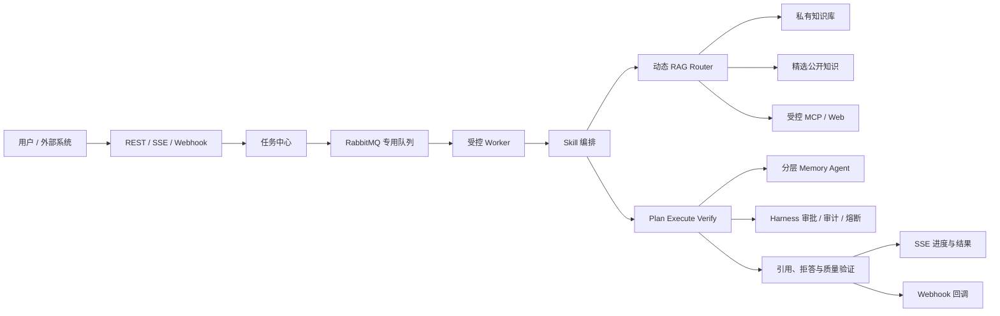

# 可信研发知识协作 Agent 升级总计划

> 状态：G1 L0/L1、隔离 PostgreSQL/RabbitMQ/HTTP/JWT/MCP L2、Edge Playwright L3、advisory lock/文件补偿、Rabbit 消费恢复、摄入 Worker 固定并发/单条预取、Markdown/HTML/PDF 结构化提取与真实 embedding、PDF 成功/损坏 golden case、外部 embedding 依赖失败后的 RabbitMQ 自动恢复、任务 SSE HTTP 多连接、单实例事件序号/有限回放及浏览器 Bearer SSE 重连、终态内存清理、真实模型驱动 Agent 工具调用、模型驱动会话临时范围收窄、生产业务库迁移、生产 MCP 主体协议调用、Router 生产入口计划执行、PDF 页文本与 Markdown `TABLE` 资产候选 L0/L1 接线、受控 KB 删除任务 L0/L1、G3 摘要上限/提取节流/确认时语义去重/冲突关系持久化/过期治理，以及 G5 单实例会话执行互斥和 Agent 专用有界执行池均已完成；KB 删除任务 L2/L3、多实例 SSE/持久化恢复、工具/索引/Webhook 专用执行池、图片/OCR、公式及 G2 冻结集/真实运行时验收仍待独立完成
> 创建日期：2026-08-14  
> 产品定位：面向个人开发者和小型研发团队的可信知识协作 Agent。  
> 本文是当前唯一维护的跨模块计划，负责需求、设计、实施和验收的主索引。历史专项方案已归档；当前实施范围和验收以本文与现有 Spec 为准。

---

## 1. 目标与产品边界

### 1.1 核心问题

用户的项目资料分散于设计文档、接口说明、故障复盘、会议纪要、PDF、架构图和任务系统中。模型即使具备通用知识，也无法可靠获得这些私有、持续变化且需要权限控制的事实。

系统目标是：根据问题和证据状态，选择直接回答、私有知识库检索、受控公开资料检索或任务工作流；所有事实性结论均可追溯到证据，并对无证据、权限不足或高风险操作明确拒答、追问或请求审批。

### 1.2 一期范围

一期只服务“研发知识协作”场景，覆盖：

- 项目 Onboarding：基于架构、接口、运行手册回答系统设计问题。
- 故障排查：关联日志、故障复盘和版本记录，输出带证据的排查建议。
- 技术决策追溯：说明某项技术方案的结论、证据、替代方案和历史取舍。
- 文档处理任务：异步解析、索引、评测和报告生成，并向发起方反馈进度和结果。

### 1.3 非目标

- 不做通用搜索引擎，不抓取或长期存储整个互联网。
- 不允许用户上传任意可执行脚本作为 Skill；Skill 只能调用经登记、授权和审计的工具。
- 不将多 Agent 作为普通问答的默认执行方式。
- 不为了功能开发直接升级 Spring AI 大版本；当前 `Spring AI 1.1.0` 保持稳定，升级须作为独立兼容性验证任务。
- 不将未授权的付费课程、完整商业内容或敏感真实内部资料放入演示数据集。

## 2. 目标架构



设计原则：私有知识优先；所有外部来源独立标识；同一会话顺序一致、跨会话受控并发；任务可恢复、可观测、可评测；复杂协作由固定角色和结构化契约控制。

## 3. 知识与数据规范

### 3.1 知识源分层

| 层级 | 数据 | 使用方式 | 约束 |
| --- | --- | --- | --- |
| L1 私有知识 | 设计、复盘、会议、接口、代码说明、任务、私有 PDF/图片 | 默认优先，构成业务价值 | 强制用户/知识库权限隔离与删除能力 |
| L2 精选公开资料 | 官方文档、协议、Release Notes、明确许可的开源资料 | 通用技术问题或本地评测 | 保留许可证、版本、来源 URL 与抓取日期 |
| L3 实时外部资料 | 受控 Web/MCP 查询结果 | L1/L2 证据不足时按需调用 | 不默认入库；必须标记时效和来源 |

公开资料并非只用于测试，但不应替代私有知识库的主价值。演示和开发阶段可先用 L2 构建可复现数据集；对外展示时使用脱敏或模拟的 L1 团队资料证明私有知识治理能力。

### 3.1.1 检索范围与授权分层

RAG 检索必须受范围约束，但“Agent 手动选择知识库”只表示默认检索策略，不能替代资源授权。范围按以下三层收敛，后层只能缩小前层，不能扩大：

1. **硬权限范围**：当前已实现的是 `ownerId` 精确匹配的单用户私有模型。知识库 CRUD、文档访问、索引和检索均须在后端按当前用户校验；无权或不存在的知识库 ID 必须统一拒绝，不能静默忽略。团队/租户和 ACL 是未来扩展，尚未构成授权路径。
2. **Agent 默认范围**：关系表 `agent_knowledge_base` 的绑定必须是硬权限范围的子集，用于限定该 Agent 默认参与检索的业务域。API 的 `allowedKbs` 是关系表投影；创建或更新 Agent 时，服务端校验 ID 存在、去重且当前用户可访问。
3. **会话临时范围**：用户可在当前会话从 Agent 默认范围中继续缩小到项目或单一知识库；模型工具请求也只能在该收窄集合内生效，不能通过传入任意 `kbIds` 扩权。

JSONB `allowedKbs` 已从 `agent` 持久化模型移除，不能作为授权或绑定事实来源。`agent_knowledge_base` 已迁移为 Agent 默认范围的唯一持久化关系，并以 `agent_id`、`kb_id` 外键在删除 Agent/KB 时级联清理当前绑定；表中仅有当前绑定的操作者/时间，不替代完整审计。共享知识库、角色授权、tenant、绑定历史审计和通用 KB 物理级联仍须另行设计。G1 开始任何知识库、任务或 Router 实现前，必须先补齐硬权限范围及越权绑定、越权检索、删除后引用、空绑定和多知识库过滤的测试。

### 3.2 统一元数据

所有源文档、派生文本块和图片/表格资产至少保存：`sourceUrl`、`sourceTitle`、`publisher`、`license`、`fetchedAt`、`documentVersion`、`contentType`、`language`、`contentHash`、`tags`、`knowledgeBaseId`、`ownerId`、`visibility`。

多模态资产额外保存原文件、页码或坐标、OCR 文本/图片说明、所属文档和关联段落。答案引用必须能定位至文档路径，以及 PDF 页码、图片或表格位置（如适用）。

### 3.3 数据集与评测

构建独立于调参语料的评测集，首期目标 100 个人工复核 case，至少包含：精确术语、改写、多文档综合、多轮追问、图文/表格问答、无答案拒答和权限越界拒答。每个 case 记录 `query`、`queryType`、`goldChunkIds`、`goldFacts`、`shouldAbstain`、`kbScope` 和数据集版本。

#### 3.3.1 外部基准接入（mMARCO 与 CRUD-RAG）

首次外部基准测评采用两个互补数据集，分别回答“多语言检索是否有效”和“中文 RAG 在多类任务上的检索与生成表现如何”两个问题：

- **mMARCO**：官方仓库为 `https://github.com/unicamp-dl/mMARCO`，数据入口为 `https://huggingface.co/datasets/unicamp-dl/mmarco`；作为多语言 passage retrieval 基准，保留官方语言、query、正例/负例和 split。首轮只测 Retriever/RAG 的候选召回，不把英文或其他语言的结果合并为一个无语义总分。报告至少分语言记录 `Recall@K`、`MRR@K`、`nDCG@K`、样本数和 p95 检索延迟。仓库代码带 Apache-2.0 LICENSE，但 mMARCO 由 MS MARCO 翻译而来，数据再分发仍需同时核对数据集页和 MS MARCO 条款。
- **CRUD-RAG**：官方仓库为 `https://github.com/IAAR-Shanghai/CRUD_RAG`，论文入口为 `https://arxiv.org/abs/2401.17043`；它是中文 RAG 综合基准，仓库包含 `data/crud/`、`data/crud_split/` 和 `data/80000_docs/`，覆盖问答、摘要、续写和事实修改/幻觉等任务。README 展示 Apache-2.0 徽章，但仓库当前没有可被 GitHub 自动识别的 LICENSE 文件，执行前必须保留 README/论文版本并人工核对数据条款。应按官方数据划分和任务脚本执行，重点报告检索候选质量与官方任务指标；不得把名称中的 CRUD 解释为本项目的 Create/Read/Update/Delete 事件回放。

外部数据集不能直接写入或覆盖真实业务库。执行前必须建立独立 PostgreSQL/VectorChord 测试库和独立上传目录，记录官方来源 URL、版本/发布日期、许可证、下载文件 SHA-256、预处理脚本版本、语言或事件过滤条件，以及映射到本项目 `kb_id`/`doc_id`/`chunk_id` 的映射清单。评测集不得参与 embedding、BM25 词典或 RRF 参数调优；需要调参时必须另行划分 development split，并保留 untouched test split。

**2026-08-24 准备状态。** [docker-compose.rag-eval.yml](../../../docker-compose.rag-eval.yml) 已创建独立的本机回环 PostgreSQL/VectorChord 运行时、卷和 `rag-eval/uploads/` 目录；运行时已验证 `vchord_bm25 0.3.0` 与 `vector 0.8.2`。[002-evaluation-schema.sql](../../../rag-eval/init/002-evaluation-schema.sql) 已应用到该隔离库，显式创建 `public.knowledge_base`、`public.document` 和 `public.chunk_bge_m3`；每条记录的 `evaluation_namespace` 均被默认值和约束固定为 `rag-eval`，并已由 [verify-isolated-schema.ps1](../../../rag-eval/verify-isolated-schema.ps1) 实测 `vector(1024)` 与两条 VectorChord BM25 索引。官方来源、修订、许可证证据、再分发判定和数据文件 SHA-256 规则统一登记在 [rag-eval/external-benchmark-registry.json](../../../rag-eval/external-benchmark-registry.json)：mMARCO 官方仓库和数据集卡均声明 Apache-2.0，但因其 MS MARCO 血缘仍须在再分发前复核上游条款；CRUD-RAG README 只有 Apache 徽章且 GitHub license API 返回 `404`，在权利人给出明确数据许可前禁止下载或处理其数据。两套基准尚未下载，因而没有可登记的数据文件 SHA-256。

两个基准分别出报告并与同一配置下的 G0 fixture、G2 pre-BM25 基线和当前 VectorChord 链路对比；不做跨数据集平均，不以单一 Recall 数值宣称 G2 已完成。mMARCO 主要支撑公开多语言检索能力的横向比较，CRUD-RAG 主要支撑中文 RAG 任务覆盖；二者都不能替代本项目的 owner/Agent/会话授权、拒答、动态更新一致性和引用准确性冻结集。

#### 3.3.2 本机 mMARCO 中文抽样与 BGE rerank 对比计划（2026-08-25）

本轮先在本机执行 `mMARCO-zh-sampled` 诊断评测，目标是验证当前 `BGE-M3 embedding + VectorChord BM25 + RRF` 链路接入 TEI `BAAI/bge-reranker-v2-m3` 后的增益与延迟代价。该数据集不加载全量 mMARCO collection，结果只能用于本项目回归和 rerank 选型，报告不得写成全量 mMARCO 官方分数。全量官方基准仍按本节原有契约在 GPU 评测节点执行。

**2026-08-26 实现与交接状态。** 本轮已完成测试作用域的本地评测工具：`MmarcoZhSampledDatasetFreezer` 直接读取四份 TSV 输入并冻结 query、gold、官方 hard negative 和固定随机干扰；manifest 固定记录 zh 语言、上游 revision `6d039c4638c0ba3e46a9cb7b498b145e7edc6230`、四份输入 SHA-256、预处理和映射版本。首次 `mmarco-zh-sampled-v1` 的 49,691 candidate 导入未产生报告：单条请求触发 30 秒上限，后续批量请求又暴露默认 256 KiB 解码上限，均在 JDBC 写入前失败或停止，不得参与比较。`mmarco-zh-sampled-v2` 保留同一 300 query（development 200、untouched test 100）、全部 316 qrels positive、每 query 1 条官方 verified hard negative 与 20,000 条固定 distractor，共 20,616 candidate；该候选选择不同于 v1，故独立 datasetVersion，不能与 v1 尝试混用。v2 在本机 CPU 上以每批 64 条导入时，候选 embedding 预计耗时约 19 小时，未产生报告。当前执行版本为 `mmarco-zh-sampled-v3-local-diagnostic`：保留同一 revision、四份输入 SHA-256、300 query 划分、316 qrels positive、300 official hard negative、随机种子和 mappingVersion，只将固定 distractor 降为 500，得到 1,116 candidate，并将导入 batch 降为 8。v3 是本机 CPU 受限的可复现 rerank 诊断例外，不满足常规 20,000-50,000 candidate 规模；它只允许在相同 v3 manifest、embedding、BM25/RRF、Top-K、超时和有效 query 分母上比较 A/B/C，不能与 v1/v2、全量 mMARCO 或候选规模不同的报告比较绝对检索难度。`MmarcoZhSampledIsolatedImporter` / `MmarcoZhSampledManifestImporter` 将冻结候选写入 `rag-eval` 隔离库；`MmarcoZhSampledRuntimeReplayRunner`、`MmarcoZhSampledReplayCollector`、`MmarcoZhSampledEvaluator`、`MmarcoZhSampledReportWriter` 与 `MmarcoZhSampledEvaluationRunner` 负责真实检索 replay、指标、`C - B` bootstrap 和逐 query rank 报告。候选导入使用 `MmarcoZhSampledOllamaBatchEmbedder` 保留输入/向量位置一一对应并拒绝不完整响应；它的 300 秒导入专用超时、4 MiB 解码上限与批大小均写入运行 `configSha`，不改变检索或 TEI 超时。`MmarcoZhSampledManifestImporter` 在同一显式 JDBC 事务内逐批 embedding、BM25 投影和写入，任一失败整体回滚。显式开启的 `MmarcoZhSampledRuntimeEvaluationTest` 在同一隔离索引上随机顺序运行 A/B/C 各两次，默认 development split；它在 TEI 调用前校验 50 个唯一候选/分数，并从 `RagServiceImpl` 的回退日志将 C 臂 query 标记为 `invalid_tei_fallback`。该测试默认跳过，避免常规单测访问数据库。它们均不构成生产接口，也不调用 Python `mmarco.py`；后者只是上游 Hugging Face 数据集加载说明，不能作为 Java 评测运行时依赖。

**2026-08-28 50 条 development 运行记录。** v3 的 300 条 query 是冻结池（development 200、untouched test 100），本机每次实际 A/B/C 执行固定只使用其中同一份 50 条 development query，后续不扩样本。三臂使用同一 `querySetSha256`、`candidateManifestSha256`、`configSha256`、Top-K `10` 和候选预算 `50`，各有 50 条有效 replay、无重复 query。A `RRF only` 的 `Recall@1/10`、`MRR@10`、`nDCG@10`、p95 分别为 `0.5400/0.9400`、`0.7267`、`0.7814`、`4,297ms`；B 本地规则 rerank 为 `0.5200/0.9600`、`0.7208`、`0.7809`、`4,767ms`；C TEI BGE 为 `0.8200/1.0000`、`0.9050`、`0.9308`、`285,816ms`。C 的 TEI 成功率为 `1.0` 且无回退，B/C 的 1,000 次 bootstrap 差值为 MRR `+0.18417`（95% CI `[+0.09333,+0.27917]`）和 nDCG `+0.14996`（95% CI `[+0.07927,+0.22318]`）。质量提升明确，但 C 的 p95 远超 B 的 15% 延迟门禁，汇总报告状态为 `inconclusive`；默认 `rag.rerank.enabled` 和 R0 检索结构均保持不变。原始报告为 `backend_v2/target/rag-eval/external/mmarco-zh-sampled-v3-local-diagnostic/tei-serial-batches-v1/mmarco-zh-sampled-v3-local-diagnostic-retrieval-ab.json`，只代表本机 CPU 受限的 v3 诊断，不代表全量 mMARCO 分数。

##### v3 本机 50 条诊断：完整过程、条数含义与留档（2026-08-28）

本记录解释各处“条数”的对象，避免把 query 数、候选 passage 数和 rerank 输入数混在一起。这里的 `passage` 是 mMARCO collection 的一条原始检索文本；为保持 qrels 对齐，它在本评测中一对一成为一个 document/chunk，不做 Markdown/PDF 式的数据清洗或二次切块。

| 名称 | 固定数量 | 本次含义 |
| --- | ---: | --- |
| 上游输入 | 4 个 TSV | 中文 collection、queries、qrels、官方 BM25 run；固定 revision 为 `6d039c4638c0ba3e46a9cb7b498b145e7edc6230`，四份 SHA-256 已写入 manifest。 |
| 冻结 query 池 | 300 条 query | 这是题目池，不是一次运行的样本数；development 200 条、untouched test 100 条，ID 不重叠。 |
| 本次 A/B/C 样本 | 50 条 development query | “50 条评测”指 50 个问题。三臂复用同一 `querySetSha256`，后续本机运行不得扩样本；untouched test 尚未运行。 |
| 冻结候选库 | 1,116 条 passage/chunk | `316` 条 qrels 正例 + `300` 条官方 hard negative + `500` 条固定随机干扰，合并去重后得到。每个 query 均在同一已导入索引中检索这些候选。 |
| B/C rerank 输入 | 每个 query 前 50 条候选 | 向量/BM25/RRF 先在 1,116 条候选库中检索；全局 RRF 前 50 才交给本地规则或 TEI，不是“50 条 query”。A 不执行 rerank。 |
| 指标输出 | 每个 query 前 10 条 | `Recall@1/3/5/10`、`MRR@10`、`nDCG@10` 和 ID-based Context Precision/Recall 都基于最终 Top-10。 |
| TEI C 臂请求 | 100 次 rerank | 50 条 query 的 C 臂独立运行两次，故为 `50 x 2`；A、B、C 均各保留两次运行产物，执行顺序文件记录随机顺序。 |

实际执行顺序如下：

1. 先修复冻结器输入哈希校验和 `RagEvalTestConfig` 中缺少 `VchordBm25QueryService` 的基线问题；未通过前不导入候选库、不写质量结论。
2. 物化四个 Git LFS 输入，核对上游 revision、LFS OID、文件 SHA-256、语言 `zh` 和官方 run；LFS pointer、缺失文件或哈希不符都会在冻结前以 `blocked_input_integrity` 停止。
3. 以固定随机种子冻结 300 个带 qrels 的 query，并按上表规则产生 v3 的 1,116 条唯一 passage。每条 passage 的逻辑 ID 固定为 `mmarco:zh:<passageId>`，runtime UUID 为该逻辑 ID UTF-8 字节的 `UUID.nameUUIDFromBytes(...)`；metadata 保存 dataset、manifest、映射、passage 和来源类型。
4. 仅向 `127.0.0.1:55432/jchatmind_rag_eval` 的隔离评测命名空间导入；导入器在显式 JDBC 事务内按批 embedding、写入和建立 BM25 投影，任何批次失败整体回滚，不写入业务库或生产索引。
5. 在 C 臂前执行 TEI `/rerank` 健康检查，要求 50 个输入候选得到 50 个唯一索引和非空分数。运行中任何 TEI 超时、HTTP/解析错误、重复/缺失索引或本地回退都会将整条 C replay 标为 `invalid_tei_fallback`，并使 C 臂无效。
6. 对同一 50 个 development query 随机顺序运行 A `RRF only`、B 本地规则 rerank、C TEI `BAAI/bge-reranker-v2-m3` rerank，各独立两次；query expansion 关闭，embedding、BM25/RRF、Top-K、候选预算和超时一致。六份逐 query replay 与执行顺序文件保留在 `tei-serial-batches-v1`；汇总报告按 runner 固定规则使用第 2 次执行，首轮产物仍保留用于审计。
7. 仅在相同有效 query 分母上计算检索指标、ID-based Context Precision/Recall、p50/p95 和逐 query 排名变化；B/C 使用 1,000 次逐 query `C - B` bootstrap 计算 `MRR@10` 与 `nDCG@10` 的 95% CI。本轮没有生成回答或调用 LLM judge，故没有把 ID-based 指标冒充为 Faithfulness、Response Relevancy 或 Answer Correctness。

| 实验臂 | 有效 query | Recall@1/3/5/10 | MRR@10 | nDCG@10 | ID-based CP/CR | p50 / p95 |
| --- | ---: | --- | ---: | ---: | --- | --- |
| A：RRF only | 50 | `.54/.90/.94/.94` | `.7267` | `.7814` | `.7250/.94` | `3,857 / 4,297ms` |
| B：本地规则 rerank | 50 | `.52/.92/.94/.96` | `.7208` | `.7809` | `.7175/.96` | `4,156 / 4,767ms` |
| C：TEI BGE rerank | 50 | `.82/.98/1.00/1.00` | `.9050` | `.9308` | `.9067/1.00` | `237,387 / 285,816ms` |

C 臂 `teiSuccessRate=1.0`、无 fallback；相对 B 的 bootstrap 差值为 MRR `+0.18417`（95% CI `[+0.09333,+0.27917]`）和 nDCG `+0.14996`（95% CI `[+0.07927,+0.22318]`）。这说明 BGE rerank 的排序质量增益为正，但 p95 约为 B 的 60 倍，远超 15% 延迟门禁；结论严格为 `inconclusive`，不得默认开启 TEI。B 对 A 只有 Recall@10 的小幅提升，MRR/nDCG 略低，也不足以支持默认开启本地规则 rerank。

本次证据链由 v3 manifest、六份 replay、执行顺序文件、汇总报告和定向单测组成；报告的 `sampleSize=50`、`candidateBudget=50`、`topK=10`、`querySetSha256`、`candidateManifestSha256`、`sourceSha256`、`configSha256` 与 mappingVersion 必须同时一致才可比较。它只证明本机 CPU 上该固定 v3 子集的诊断结果，不代表全量 mMARCO、未运行的 untouched test，或生产默认开关。

每个 passage 的逻辑 ID 固定为 `mmarco:zh:<passageId>`，运行时 chunk ID 固定为该逻辑 ID 的 UTF-8 `UUID.nameUUIDFromBytes(...)` 结果。导入器显式写入该 UUID，因为现有 `ChunkBgeM3Mapper.insert` 不会保留调用方设置的 `id`；一条原始 passage 仍只导入一个 document/chunk，不二次切块。candidate metadata 必须包含 `datasetVersion`、`candidateManifestSha256`、`mappingVersion`、`logicalChunkId`、`passageId` 和 `candidateSourceType`。

本机上游 clone 位于 `datasets/mmarco`，其 `HEAD` 已核对为固定 revision `6d039c4638c0ba3e46a9cb7b498b145e7edc6230`。中文 collection、queries、qrels 与 BM25 run 在该 revision 中均为 Git LFS 对象；只有 LFS 对象已完整物化、内容 SHA-256 与 LFS OID 对应、并写入 manifest 后，才视为可用输入。LFS 指针、未完成传输、无 source SHA-256 manifest 或认证失败均为前置门禁失败，不得导入、运行 A/B/C 或写质量结论。不得将 Token、代理地址、认证 URL 或任何凭据写入 Git 配置、报告、文档或命令日志。固定 revision 的 README 声明 Apache-2.0，而仓库 `LICENSE` 文件为 CC-BY-4.0；开始任何再分发前必须连同 mMARCO/MS MARCO 上游条款复核这一差异。

**v1/v2 历史交接记录（不再作为当前执行指令）。** 以下四项说明 v1/v2 为什么没有形成报告；受本机 CPU 约束，当前不再执行 v2 的 20,616 候选导入或扩大 query 样本。当前可审计执行基线是上文的 v3、50 条 development query 和 1,116 条候选库。

1. 完成四个 LFS 对象的本地物化，并验证对象 OID、文件大小和 SHA-256；不得以 LFS 指针作为 TSV 输入。
2. 将已验证的四份原始输入复制到独立评测输入目录；原 clone 工作树状态异常时，不重置、覆盖或依赖该工作树 checkout，应从已验证的本地 LFS 对象物化副本。
3. 运行冻结器生成当前 `mMARCO-zh-sampled-v2` manifest，核验 300 条 query、development/untouched test 不重叠、全部 gold、每 query 至少一条官方 hard negative 与 20,000 条固定随机干扰。
4. 仅连接 `127.0.0.1:55432/jchatmind_rag_eval` 导入候选；完成 50 候选 TEI 健康检查后，按同一冻结输入运行 A/B/C。mMARCO 自然 query 不得用于 TC-G2-10 的 R2 结论，三路结构消融仍须使用项目内含非原问 replay 的冻结 follow-up 集。

执行前置条件：先修复冻结 corpus 校验和 RAG 评测 TestConfig 中缺少 `VchordBm25QueryService` 的既有失败；下载前记录 zh 语言 collection、query、qrels 和可用官方 run 输入的精确 SHA-256；TEI `/rerank` 健康检查必须返回与输入候选等长、索引完整且分数非空的结果。任一前置条件不满足时只记录阻塞原因，不输出质量结论。

实际 v3 运行只连接 `127.0.0.1:55432/jchatmind_rag_eval`，以 `rag.eval.mmarco.enabled=true` 显式启动 `MmarcoZhSampledRuntimeEvaluationTest`；该测试先冻结/导入，再生成六份 replay、执行顺序文件和 `mmarco-zh-sampled-v3-local-diagnostic-retrieval-ab.json`。本轮只运行 development 的固定 50 条 query；untouched test 未运行，且不得把未运行的 test split 推断为质量结论。

数据与索引按以下规则冻结：

1. 从已登记版本的 zh 语言评测 split 中，以公开写入 manifest 的随机种子抽取 300 条带 qrels 的查询；development 与 untouched test 使用不同种子和不重叠 query ID。若上游只提供一个可用 split，必须在报告中声明这是固定本地切分，不能标称官方 dev/test。
2. 候选语料包含每条查询的全部 qrels 正例、每条最多 100 条来自已校验官方 run 或可复现 BM25 run 的 hard negative，以及 20,000 条固定随机干扰 passage。去重后目标规模为 20,000 至 50,000 passage；run 输入不可获得时不得以未记录来源的启发式候选替代 hard negative。
3. 每个 passage 映射为一个隔离的评测 document/chunk，逻辑 ID 固定为 `mmarco:zh:<passageId>`，不执行会改变 qrels 对齐关系的二次分块。candidate manifest 必须记录 query ID、passage ID、来源类别、语言、选择规则、随机种子和所有输入/输出 SHA-256。
4. 导入一次后复用同一独立 PostgreSQL/VectorChord 库、同一 `bge-m3` embedding、同一 BM25 词典和同一 RRF 参数；任何导入、embedding、索引或映射差异均需建立新数据集版本，不能与旧报告直接比较。

实验固定执行三个臂，顺序随机化且每臂至少独立运行两次：

| 实验臂 | 固定配置 | 目的 |
| --- | --- | --- |
| A：RRF only | `rag.eval.disable-rerank=true`、`rag.rerank.enabled=false` | 量化任何 rerank 的总体价值。 |
| B：本地规则 rerank | `rag.eval.disable-rerank=false`、`rag.rerank.enabled=false` | 当前 TEI 不启用时的生产回退排序基线。 |
| C：TEI BGE rerank | `rag.eval.disable-rerank=false`、`rag.rerank.enabled=true`，TEI 使用 `BAAI/bge-reranker-v2-m3` | 主对比臂，验证模型对 RRF 前 50 个候选的重排效果。 |

三臂使用相同 query、KB 范围、Top-K、超时、embedding、BM25/RRF 参数和 query rewrite 设置；主对比默认关闭 query expansion，消除模型改写随机性。需要代表完整链路时，另建确认性运行并冻结每条查询的改写结果，不能将不同改写输出混入 rerank 对比。TEI 超时、HTTP 异常、返回数量/索引不完整或回退到本地规则时，该查询在 C 臂标记 `invalid_tei_fallback`，整臂不得宣称 BGE 优于 B；修复服务后必须完整重跑 C 臂。

每臂必须分别报告 `Recall@1/3/5/10`、`MRR@10`、`nDCG@10`、RAGAS `IDBasedContextPrecision` / `IDBasedContextRecall`、p50/p95 单查询延迟、TEI 调用成功率及每条 query 的 rank 变化。以 B 与 C 的逐查询差值做 1,000 次 bootstrap 置信区间；只有 `nDCG@10` 与 `MRR@10` 的点估计均不下降、p95 增幅不超过现有 15% 上限、且 TEI 无回退时，才允许提出“可进入后续全量验证”的结论。A、B、C 结果均为抽样诊断，不自动改变默认 `rag.rerank.enabled`。

端到端 RAGAS 另从 untouched test 抽取 100 条固定样本，使用同一回答模型、temperature=0、相同检索上下文和独立的 judge 配置计算 Faithfulness 与 Response Relevancy。mMARCO qrels 不提供答案正确性 gold，因此这两项只能说明回答对上下文和问题的支持程度，不能替代人工 Answer Correctness。检索报告与 judge 报告分开落盘到 `backend_v2/target/rag-eval/external/mmarco-zh-sampled-<version>-retrieval-ab.json` 与 `backend_v2/target/rag-eval/external/mmarco-zh-sampled-<version>-ragas-ab.json`；每份报告都要包含数据版本、输入 SHA-256、模型/服务版本、配置哈希、样本数、有效/无效样本和失效原因。

#### 3.3.3 独立三路召回实施与结构消融记录（G2-3b）

本轮把“Dense 向量、Sparse 词法/BM25、Multi-Query”从平铺通道重构为三个独立分支，而不是把每个改写 query 当作额外 RRF 票。第一阶段不新增依赖、数据库 schema、索引 provider 或高扇出 query 生成器，复用当前 VectorChord-bm25、pgvector、受控 standalone/LLM rewrite、权限范围和 rerank 预算。设计细节以架构文档 `4.4.1` 为准。

已执行的 G2-3b 落地顺序如下：

1. 先恢复冻结 corpus 校验和 RAG TestConfig 的既有失败；未 GREEN 前不修改检索策略，也不生成新的质量结论。
2. 在 development split 先完成分支内 rank 融合、chunk 去重、分支 provenance、`HARD` 谓词下推及总候选预算；外层 RRF 只消费三个分支的排名。此阶段关闭 rerank，避免排序器掩盖召回结构差异。
3. 使用冻结的 query rewrite replay 做结构消融；规则或 LLM 不得在每次运行时重新生成扩展 query。原问始终保留，第三路只使用 replay 中 `source != original` 的 query。
4. 仅在结构消融选出候选后，才对同一获选链路执行 `3.3.2` 的 A/B/C rerank 诊断；不把 rerank 收益写成三路召回收益。

| 变体 | 分支结构 | query 使用边界 | 目的 |
| --- | --- | --- | --- |
| R0：`current-flat` | 当前 `vector_*`、`title_*`、`content_bm25` 分组和 RRF | 使用冻结 replay，保持当前“扩展 query 仅进入向量”的语义 | 可回退基线。 |
| R1：`two-branch-original` | Dense-original + Sparse-original，外层 RRF | 仅原问；扩展 query 不参与 | 量化原问双路检索的净收益。 |
| R2：`three-branch-expanded` | Dense-original + Sparse-original + Expanded-query，外层 RRF | 第三路只处理非原问的 standalone/LLM query，分支内可同时检索 dense/sparse | 验证独立 Multi-Query 分支是否有增益。 |

**2026-08-28 真实运行结果。** G2 冻结集使用 9 个 case（7 个可回答、2 个拒答）和 7 个 fixture chunk，在隔离库的真实 MyBatis/VectorChord/BM25/Ollama embedding 链路中运行 R0/R1/R2；rerank 关闭，mMARCO 自然 query 没有混入本结构结论。R0 `current-flat` 的 `Recall@1/10`、`MRR@10`、`nDCG@10`、p95 为 `1.0000/1.0000`、`1.0000`、`1.0000`、`7,487ms`；R1 `two-branch-original` 为 `.7143/1.0000`、`.8571`、`.8946`、`3,873ms`；R2 `three-branch-expanded` 为 `.7143/1.0000`、`.8571`、`.8946`、`7,582ms`。三臂均有 2 个拒答违规、无权限违规；R2 的 MRR/nDCG 低于 R0，且拒答门禁不为零，故结构结论为 `inconclusive`，R0 保持默认。当前 `RagIndependentBranchEvaluator` 还会在生成结果前拒绝三臂输入指纹、gold、拒答标签、Top-K、候选预算或 ranked chunk 去重不一致的比较，避免将 rerank、不同分母或重复 chunk 计分混入三路结论。

R0/R1/R2 必须使用相同的 KB 范围、gold、Top-K、embedding、VectorChord 版本、BM25 词典、`RRF_K`、超时、候选总预算与有效 query 分母。每次报告都记录每个分支的候选数、去重数、命中 gold 的分支、外层 RRF 前后 rank、p50/p95，以及 `Recall@1/3/5/10`、`MRR@10`、`nDCG@10`、无答案误召回和越权结果数。评测输入、replay、配置和报告分别计算 SHA-256。

项目内冻结集必须补足带授权会话上下文的 follow-up、topic switch、标题/正文精确术语、中文/代码、无答案和越权 case；只有非原问扩展 query 占比非零时，R2 才有资格作为三路实验。`mMARCO-zh-sampled` 的自然 query 通常不含会话上下文，若 frozen replay 没有扩展 query，它只能验证 Dense/Sparse/RRF 与 rerank，不能作为第三路收益证据。

通过门槛沿用本计划与 Spec 的性能、安全边界：三个变体的授权和拒答断言必须全绿；R2 必须与 R0 使用同一有效 query 集，且不低于 R0 的 `Recall@5`、`MRR@10`、`nDCG@10`，p95 增幅不超过 15%。development 允许参数选择；untouched test 只允许一次冻结运行。任一门槛失败时保留 R0，并把 R2 报告为 `inconclusive` 或 `rejected`，不得默认启用。

#### 3.3.4 LongMemEval 30 题记忆系统诊断计划（G3，待实施）

LongMemEval 用于诊断用户长期记忆设计，不替代研发知识库的 RAG 冻结集，也不得把 30 题结果表述为完整公开基准成绩。当前主链路是“候选提取 -> 用户确认 -> 长期记忆 -> 语义召回 -> Agent 注入”；因此实验必须区分候选/确认门控与提取、检索、回答能力，不能只报告最终准确率。

执行前从 LongMemEval 官方发布仓库 `https://github.com/xiaowu0162/LongMemEval` 获取数据与官方评测器，并在下载后记录来源 URL、仓库 revision、许可证证据、数据文件 SHA-256 和评测器版本。所有数据只能进入独立的 `longmemeval-eval` 数据库、上传目录和报告目录，禁止导入真实业务库、复用真实用户 ID 或将基准会话写入线上审计日志。

30 个 case 由官方 test split 分层、一次性冻结：信息提取 6 题（单会话 3、跨会话 3）、多会话推理 6 题、知识更新 6 题、时间推理 6 题、拒答 6 题。抽样使用公开固定随机种子，`longmemeval-30-v1` manifest 必须包含 `caseId`、官方类别、源版本、会话/消息 ID、标准答案、支撑证据会话/消息、抽样种子和不可变输入哈希。选题完成后不得根据运行结果换题；数据、prompt、回答或参考答案均不得反向参与提取、召回和参数调优。

每个 case 在独立的虚拟用户与清空的评测命名空间中，按原始时间顺序回放目标问题之前的会话及其 session 边界；目标问题只在长期记忆召回完成后执行。评测 runner 必须复用实际的候选提取、确认、长期记忆读取和 Agent 注入服务，禁止把 gold fact、reference answer 或人工整理后的记忆直接写入 `user_memory`。若原始会话时间不能透过现有测试链路保留，时间推理题仍照常执行，但报告必须标记为“现行时态 provenance 能力诊断”，不能把失败归咎于 Top-K 或 embedding 参数。

每题执行以下三个配对实验臂，generation、提取和 embedding 模型版本及其可配置采样参数保持一致；模型或外部服务失败只记录为无效样本，不得静默替换模型或回填答案：

| 实验臂 | 记忆策略 | 回答的问题 |
| --- | --- | --- |
| M0：无长期记忆 | 禁止长期记忆读取与注入，保留同一会话窗口和回答模型。 | 长期记忆没有参与时的基线。 |
| M1：机械确认研究模式 | 对实际产生的全部 `PENDING` 候选执行确认；该模式不代表生产用户体验。 | 候选提取、持久化、检索和利用记忆的端到端上限。 |
| M2：人工盲审确认 | 审核员仅查看候选与其 evidence 消息，确认或丢弃，不得查看目标问题、标准答案或 judge 结果。 | 当前候选确认门控在产品语义下的净收益和审核负担。 |

官方答案评测器是主判分来源；其输入仅限问题、参考答案和系统回答，不得包含候选、已召回记忆或模型内部提示。每条运行还必须记录候选的类型/重要度/evidence/状态、确认后的记忆、召回排名和距离、实际注入文本、最终回答、判分、耗时、token/调用次数、代码 commit、模型/服务版本和配置哈希。失败按 `未提取`、`未确认`、`未召回`、`召回错误`、`已召回未利用`、`更新未覆盖旧事实`、`时态信息缺失`、`错误拒答` 分类，避免把所有问题归为“模型回答错误”。

报告至少分别提供总体和五类的 Answer Accuracy、拒答类正确拒答率、Memory Recall@K、Candidate Precision、知识更新正确率、时态题正确率、p50/p95 延迟及单题成本；M0/M1/M2 必须列出逐题配对差异。30 题的总体比例步长为 3.3%，类别仅 6 题，故结果只支持方向性设计决策，不报告为统计显著或总体领先结论。建议继续投入的初步门槛是 M2 相对 M0 至少净增 4 个正确 case、拒答类最多新增 1 个幻觉错误、无跨虚拟用户泄露，并且失败分类能指向明确改造项；否则保持现有设计，不以个别成功样例推动默认策略变更。

本项交付依次为：冻结 manifest 与数据来源登记；只写隔离环境的 replay/报告 runner；M0/M1/M2 三臂运行产物；人工盲审记录；逐题差异与失败归因报告。报告写入 `backend_v2/target/memory-eval/longmemeval-30-v1/`，历史结果归档；只有持续有效的结论才回填本计划、当前架构或 Spec。首次报告应重点判定当前“每 3 条新用户消息提取、最近 8 条消息窗口、`更新：` 冲突标记、365 天到期治理”在上述五类中的具体瓶颈，不在报告前预设需要改写哪一项。

## 4. 能力规格与依赖关系

### 4.1 异步任务中心与队列

使用现有 RabbitMQ，但与邮件任务隔离 exchange、queue 和 DLQ。长耗时工作不占用 HTTP 请求线程，包括文档解析/索引、批量 embedding、RAG 评测、报告生成和复杂 Skill。

任务实体的最小状态机：

```text
PENDING -> QUEUED -> RUNNING -> WAITING_APPROVAL -> SUCCEEDED
                              |                    |
                              +-> FAILED <----------+
                              +-> CANCELLED
```

每个任务必须包含任务类型、提交者、输入快照、Skill 版本、幂等键、进度、尝试次数、错误摘要、结果引用和创建/更新时间。Worker 必须受并发上限、超时、退避重试和死信治理；高风险步骤进入 `WAITING_APPROVAL`，不可绕过 Harness。

**2026-08-25 G1 摄入 Worker 并发子项。** `IngestionTaskConsumer` 显式使用 `ingestionRabbitListenerContainerFactory`：该工厂先复用既有 Spring Boot Listener 配置，再固定每个实例两个消费者、每消费者预取一条未确认消息，因此一次最多处理两项摄入任务且不会在单个阻塞解析/embedding 任务后继续囤积消息。该容器只限定本地 Rabbit 消费并发和未确认消息数，不实现任务执行超时、动态扩缩、队列长度监控、跨实例协调或额外的重试/死信策略。`IngestionWorkerConcurrencyConfigTest` 先 RED 证明命名容器工厂缺失，再 GREEN 固定工厂参数、Bootstrap 配置继承和消费者注解绑定；现有状态机、重试与 DLQ 回归保持通过。

### 4.2 Skill

Skill 是可复用、可版本化、受权限控制的 Agent 工作流模板，不是任意代码执行入口。每个 Skill 的最小契约包括：

- 名称、版本、用途、输入/输出 JSON Schema。
- 系统指令、知识库范围、可用工具白名单和审批策略。
- 同步/异步执行模式、超时与并发预算。
- 引用、拒答或结构化结果要求，以及对应验证器。

首批候选 Skill：文档入库与索引、RAG 质量评测、技术方案对比、故障复盘总结、会议待办提取和项目周报生成。先以内置模板实现；只有出现用户可配置需求时才设计持久化的自定义 Skill。

**2026-08-25 G3 内置 Skill L0/L1 子项。** `BuiltinSkillRegistry` 先以 `technical-decision-comparison@v1` 固定第一个纯服务端内置模板：输入只接受必填 `question` 与可选 `kbIds`，后者只能从调用方已经授权的范围继续收窄；`tools` 或其他未登记字段均拒绝。模板只允许只读 `KnowledgeTool`，声明同步 30 秒、并发 2、且不主动申请审批；全局 Harness 仍可施加审批或熔断，模板不能降低该门禁。`BuiltinSkillExecutor` 复用该契约，只在 `HarnessRunner` 放行后经 `HarnessToolCallbackProxy` 调用绑定到本次 KB 子集的 `KnowledgeTools.retrieveKnowledge`；熔断、审批拒绝/超时和检索异常均收束为结构化 `abstained/reason`，且拒绝路径沿用既有合成审计。正常输出必须含 `conclusion` 和至少一条拥有 `chunkId`/范围内 `kbId` 的 `evidence`；无证据同样拒答。`BuiltinSkillRegistryTest`、`BuiltinSkillExecutorTest` 与 `HarnessedSkillKnowledgeToolExecutorTest` 分别固定范围/Schema、输出收束及代理成功、熔断/审批过期审计。本项不提供自定义脚本、动态工具、Controller、队列任务、Agent/模型总结或独立预算调度；因此只签收 `TC-G3-01` 的本地 L0/L1 接线，L2 与用户旅程仍待后续阶段。

### 4.3 动态 RAG Router

Router 只做结构化决策，不直接生成最终答案。其输出至少包括：`route`、`searchScope`、`rewriteMode`、`retrievalChannels`、`topK`、`rerankEnabled`、`needClarification` 和 `reason`。

首期 route 固定为：

- `DIRECT`：闲聊或无需外部事实的请求。
- `PRIVATE_RAG`：默认事实检索，限定可访问私有 KB。
- `HYBRID_RAG`：私有与精选公开资料联合检索，来源分组返回。
- `MULTIMODAL_RAG`：问题涉及 PDF、图片、表格或图文证据。
- `EXTERNAL_TOOL`：已有知识库证据不足且用户允许时，调用受控 MCP/Web 工具。
- `CLARIFY` / `ABSTAIN`：范围不明确、无证据、无权限或风险过高。

Router 必须与“全链路固定检索”做消融对比，按问题类型报告质量、p95 延迟和 token 成本；无稳定收益不得默认启用更复杂链路。

当前 `RagRouter` 已由 `KnowledgeTools` 与 `McpKnowledgeTool` 在其各自完成 owner/Agent 默认范围/会话临时范围收窄后消费：计划的 `topK` 进入私有检索，`ABSTAIN`、`CLARIFY`、`DIRECT` 与未授权 `EXTERNAL_TOOL` 在检索前返回，`MULTIMODAL_RAG` 依次触发 Markdown `TABLE` 和 PDF 页文本资产候选。路由不得自行扩大 `kbIds`，也不得以“无证据”为由绕过拒答和外部调用许可。该生产接线只证明入口按规则计划执行，不表示相对固定链路的质量、p95 或成本收益已通过冻结集验收，也不表示存在可执行的受控外部工具。

### 4.4 多模态摄入与检索

按 PDF/纯文本/HTML/图片的顺序扩展。表格要保留标题、行列与单元格关系；图片要通过 OCR/说明文本和位置元数据参与检索。视频、音频和通用视觉理解不在一期范围。

每新增一种格式都必须独立验证：解析正确性、重复入库幂等性、权限隔离、召回质量、引用定位和失败可重试。

G2 借鉴 [RAG-Anything](https://github.com/HKUDS/RAG-Anything) 的是“先保留文档层级、位置和元素关系，再按文本、图片、表格、公式分流处理并在检索时按证据类型排序”的方法，而不是直接引入 LightRAG、通用知识图谱或新的 Python 运行时。当前 PDF 已有逐页文本、`pageNumber` 和 `PDF_PAGE_TEXT` 资产；Markdown 已从 `TableBlock` 提取原始表格和行号，写入 `TABLE` 资产并关联同文档 chunk。`MULTIMODAL_RAG` 通过 `chunk_bge_m3 -> document_asset_chunk -> document_asset` 查询 `READY` 的 `TABLE` 与 `PDF_PAGE_TEXT` 向量候选，保留 KB、来源、类型和路径的 `HARD` 范围；Agent/MCP 按表格、PDF、普通检索顺序去重合并，并返回候选资产的稳定 ID 与表格行号或 PDF 页码。这只是 PDF 页文本和 Markdown 表格的 L0/L1 候选通道，不代表图片/OCR、表格单元格关系、公式、可回跳的图片/表格坐标或真实运行时召回已实现。下一步按同一资产与文本关系逐项增加 OCR 和图像能力；图谱不是本阶段前置条件。RAG-Anything 也不替代本项目的用户长期记忆治理，记忆仍按 G3 的来源、确认、冲突和删除规则演进。

### 4.5 Plan-Execute-Verify 与多 Agent

现有 Think-Execute 循环保留。复杂任务先由 Planner 输出有限、可校验的执行计划，Executor 调用 Harness 包装的工具，Verifier 校验关键事实是否有证据、是否矛盾、越权或需要补检索。

多 Agent 只在以下职责稳定后引入：Router/Retriever、Workflow Executor、Verifier、Memory Agent。角色之间必须使用 JSON Schema 交换状态，具有最大轮数、超时、成本预算和单 Agent fallback；不采用自由对话式群体 Agent。

**2026-08-25 G4 工作流验证 L0/L1 子项。** `WorkflowPlanVerifier` 为未来 Planner 输出提供确定性前置校验：`WorkflowPlan` 的声明步骤预算为 1 至 20、超时为 1 至 30 秒，实际步骤数不能超过声明预算；每个步骤必须有唯一 ID、白名单内且无首尾空白的工具名、事实键、声明和同事实键的非空证据。白名单比较可以规范化名称，但任何通过验证的工具名必须与 Harness 策略精确匹配。相同事实键产生不同声明时拒绝，未授权工具、缺证据和超预算均返回违反项。20 步/30 秒与当前 `JChatMind` 的既有执行边界保持一致。`WorkflowPlanExecutor` 只消费已验证的计划，按声明顺序为每步创建 `HarnessContext`；只有 Harness `ALLOW` 才经 `HarnessToolCallbackProxy` 进入调用方的受控执行器。无效计划不创建 Harness 调用；熔断或审批过期等拒绝分别写 `CIRCUIT_OPEN`/`EXPIRED` 合成审计并以 `BLOCKED` 停止，执行器异常由代理审计为 `ERROR` 并以 `FAILED` 停止，绝不执行后续步骤。`WorkflowPlanVerifierTest` 与 `WorkflowPlanExecutorTest` 分别固定验证边界以及成功、拒绝、异常停止与审计。本项不生成 Planner、不提供 HTTP/队列任务、结果持久化、单 Agent fallback、成本预算、多 Agent 协作或可中断角色超时；`timeoutSeconds` 当前只为验证门槛，不能表述为实际超时取消。它签收 `TC-G4-01` 本地 L0/L1，不提前签收 `TC-G4-02` 的超时/fallback。

**2026-08-25 G4 入站 Webhook L0 子项。** `InboundWebhookVerifier` 在任务映射前以调用方提供的预匹配来源和签名密钥验证 `sourceId`、`eventId`、Unix 秒级整秒 `timestamp`、`signature` 与 UTF-8 原始 `payload`。签名原文是固定版本字节、三个文本各自的 4 字节大端有符号 UTF-8 字节长度与内容，以及 8 字节大端有符号 Unix 秒值；HMAC-SHA256 以小写十六进制输出并使用常量时间比较，因此 `.` 等正文或事件 ID 字符不能改变字段边界。Spec 固定一个跨系统 HMAC 向量，测试直接验证该常量而不是由生产编码推导。来源必须精确匹配，时间戳偏差不得超过正负 5 分钟，非整秒时间戳拒绝。验签与时间窗通过后才在同一 JVM 内占用 `(sourceId, eventId)`，重复事件返回固定拒绝状态，失败事件不占用 ID；代码不保留或输出密钥、签名和正文。`InboundWebhookVerifierTest` 先 RED 证明类型缺失，随后 RED 复现分隔符重解释和同秒纳秒篡改，再 GREEN 覆盖有效签名、来源不匹配、无效签名不占用 ID、重复 ID 以及正负 5 分钟边界。本项仅补充 `TC-G4-03` 的 L0 安全门禁，不包含来源配置、Controller、任务中心映射、出站 HTTP、重试、投递日志、DLQ 或跨实例持久化幂等。

### 4.6 分层记忆与反思

记忆分为短期工作记忆、会话摘要、长期事实/偏好、任务情景记忆和待确认候选。长期记忆必须有来源、置信度、时间、过期时间、冲突关系和用户确认状态，并支持查看、编辑、删除和清空。

反思只在任务完成、验证失败或用户纠错后触发，提取“有效策略、失败原因、待跟进事项”等低权重情景记忆；禁止自动覆盖用户事实。先完成摘要上限、提取节流、语义去重和冲突处理，再增加反思能力。

**2026-08-24 G3 候选确认与忽略入口子项。** 既有记忆提取不再把中高重要度候选自动写入 `user_memory`：满足既有保留规则时只留下 `PENDING` 候选，低价值候选仍收束为 `DISCARDED`。`POST /api/users/memory-candidates/{candidateId}/confirm` 与 `/discard` 均通过当前请求用户读取候选；缺失、越权或非 `PENDING` 状态统一拒绝。确认事务先以 owner + `PENDING` 条件更新领取候选，随后写入或复用同内容长期记忆；写入失败会回滚候选状态。忽略仅以同一条件将候选转换为 `DISCARDED`，不物理删除候选，也不写入长期记忆。`getUserMemoryCandidates` 只返回当前用户的 `PENDING` 行，前端提供确认保存与二次确认后的忽略操作。`UserMemoryFacadeServiceImplTest` 覆盖提取不自动持久化、候选筛选、确认和忽略成功、越权/缺失与终态拒绝；`UserMemoryControllerTest` 覆盖两个 POST 映射与委派，`ui/tests/user-memory-candidate-discard.contract.mjs` 固定前端 API、确认和刷新契约，均不访问模型、数据库或网络。该子项不包含候选编辑、过期、冲突关系持久化、摘要节流、Skill 或记忆 Playwright 旅程，G3 保持部分开始状态。

**2026-08-24 G3 本人长期记忆清空子项。** `DELETE /api/users/memories` 仅使用当前请求用户 ID 删除 `user_memory` 中归属该用户的行；它不读取、转换或删除 `user_memory_candidate`，因此 `PENDING`、`PERSISTED` 和 `DISCARDED` 候选均保持不变。空集合删除同样返回成功。前端只在当前用户有长期记忆时显示“清空”，并在二次确认成功后刷新长期记忆和候选列表。`UserMemoryFacadeServiceImplTest` 固定 owner-only 删除与候选隔离，`UserMemoryControllerTest` 固定 DELETE 映射和委派，`ui/tests/user-memory-clear.contract.mjs` 固定 API、二次确认与刷新契约。该局部交付补齐删除/清空的一部分用户管理能力；过期、冲突、节流、去重、Skill 或记忆 Playwright 旅程仍待后续 G3。

**2026-08-24 G3 本人长期记忆编辑子项。** `PATCH /api/users/memories/{memoryId}` 只接受新的 `content`，服务先规范化并拒绝空内容，再以当前用户读取记忆；更新 SQL 同时带 `id + user_id`，只修改内容、embedding 和更新时间。新内容会使用既有 `RagService` 重新生成 embedding；依赖不可用时沿用已有降级写入 `null`，不保留与正文不一致的旧向量。记忆类型、来源会话、证据、重要度及所有候选均不变。前端以受控弹窗编辑，空白内容不可提交，成功后刷新列表。`UserMemoryFacadeServiceImplTest`、`UserMemoryControllerTest` 与 `ui/tests/user-memory-edit.contract.mjs` 分别固定 owner-only/空内容、PATCH 路由和前端编辑刷新契约。该交付不实现冲突关系、语义去重、过期、节流、Skill 或 Playwright 旅程。

**2026-08-24 G3 会话摘要上限子项。** `JChatMind` 在会话消息累计达到既有 8000 字符压缩阈值后，仍保留最近 8 条消息且不拆开工具调用对；合并出的 `conversationSummary` 固定至多 4000 字符，超出时仅保留末尾的新近内容。决策提示和下一轮摘要提示均读取同一受限摘要，避免已淘汰的旧前缀重新进入模型上下文。`JChatMindMemoryCompressionTest` 先 RED 固定无界追加和无界摘要模型提示，再 GREEN 验证长度上限与最新摘要保留；复审后补充直接决策提示回归，固定该入口同样不读取旧前缀。测试使用替身 ChatClient，不访问模型、数据库或网络。该子项不实现提取节流、语义去重、冲突关系、反思、Skill 或记忆 Playwright 旅程，G3 仍为部分开始状态。

**2026-08-24 G3 会话记忆提取节流子项。** `ChatEventListener` 保持在 Agent 主执行的 `finally` 调用提取，但 `UserMemoryFacadeServiceImpl` 先经 owner-checked `ChatMessageFacadeService.countUserMessagesBySessionId` 读取会话累计 `role='user'` 数，首次立即提取，此后仅在累计至少 3 条新用户消息时再次进入 LLM/关键词提取；满足条件才读取既有最近 8 条窗口，因此窗口饱和不会冻结后续提取。删除历史使计数下降时视为会话历史已变更并立即重提取，随后以本次成功的总数重新建立阈值。相同 session 在单实例内由会话状态锁串行，未捕获的读取或持久化失败不会推进已提取计数，保留下一事件重试。`UserMemoryFacadeServiceImplTest` 先 RED 观察顺序 4 次和并发 2 次模型调用，再 GREEN 固定总数 8-11 而窗口始终为 8 的第 8/11 条触发、删除后计数回退、候选写入失败重试和受阻并发单次边界；`ChatMessageFacadeServiceImplTest` 固定计数前的 owner 校验与 Mapper 委派。状态仅驻留当前进程，不提供跨实例分发、进程重启恢复或时间防抖；冲突关系、反思、Skill 和记忆 Playwright 旅程仍待后续 G3。

**2026-08-25 G3 会话提取状态回收子项。** `ChatSessionFacadeServiceImpl.deleteChatSession` 复用 `ChatSessionExecutionCoordinator` 与 Agent 运行/提取互斥；仅在同 owner 会话主表删除成功后发布 `ChatSessionDeletedEvent`。`UserMemoryFacadeServiceImpl` 监听该事件并移除相同 `sessionId` 的节流状态。若删除前已提交的异步事件随后在 owner-checked 用户消息计数处失败，服务也只条件移除该状态后原样抛出异常，因此监听器仍按现有规则记录失败，而下一次合法会话的首次提取不会受残留计数抑制。`UserMemoryFacadeServiceImplTest` 先 RED 固定删除后状态未释放及计数读取失败后首次提取被抑制，`ChatSessionFacadeServiceImplTest` 先 RED 固定删除成功前错误发布事件或未进入协调器；GREEN 回归为 `cd backend_v2 && .\mvnw.cmd -q "-Dtest=UserMemoryFacadeServiceImplTest,ChatSessionFacadeServiceImplTest,ChatEventListenerTest,ChatSessionExecutionCoordinatorTest" test`。该项不引入 TTL、跨实例协调、持久化节流状态或过期/冲突关系语义。

**2026-08-25 G3 确认时语义去重子项。** 用户确认普通 `PENDING` 候选后，服务先保留既有精确文本去重，再只在同一用户、同一 `memoryType` 的已有长期记忆中计算余弦距离；候选向量与同维、分量有限且非零的已有向量距离不大于 `0.05` 时，候选仍转为 `PERSISTED`，但不新插入重复 `user_memory`。候选本身不会在提取阶段被语义丢弃，用户仍可查看和确认；不同类型、超过阈值、缺向量/无效向量或维度不一致，以及 embedding、读取失败时继续正常写入，避免去重依赖阻断记忆治理。`更新：` 冲突候选继续走既有冲突处理，不参与本项去重。普通确认只生成一次候选正文 embedding，并复用于判断和写入。`UserMemoryFacadeServiceImplTest` 先 RED 固定同类型同向向量不得插入、不同类型和超阈值仍插入，再 GREEN 固定有限大幅值向量、embedding 不可用不阻断确认与单次生成向量。该子项不新增候选 embedding、自动合并、跨类型关联、冲突关系持久化、阈值配置或评测；冲突处理、反思、Skill 和记忆 Playwright 旅程仍待后续 G3。

**2026-08-25 G3 冲突关系持久化子项。** 确认以 `更新：` 开头的 `PENDING` 候选时，仍选择同一用户、同一类型且按既有 `updated_at DESC` 返回的当前首条记忆作为替代目标；服务先插入新的长期记忆，随后以 `superseded_by_memory_id` 将旧行指向新行，而不物理删除旧行。`selectByIdAndUserId`、`selectByUserId`、精确文本去重与向量召回均固定 `superseded_by_memory_id IS NULL`，因此 UI、编辑、删除、精确去重和 Agent 召回继续只见当前记忆。替代标记带未替代条件，写入失败时确认事务回滚；删除当前记忆通过自引用 `ON DELETE CASCADE` 一并删除其历史，避免旧内容重新可见。迁移 `sql/user-memory/2026-08-25-add-user-memory-superseded-by.sql` 只添加关系字段和幂等自引用约束，不补设过期时间。`UserMemoryFacadeServiceImplTest` 先 RED 固定旧行不得物理删除，再 GREEN 固定新行 ID 被写入旧行的替代关系；定向 Maven 测试通过。该项不增加历史查询 API、自动合并、TTL、跨类型冲突或任何评测工作，G3 仍为部分开始状态。

**2026-08-25 G3 记忆过期治理子项。** `user_memory.expires_at` 对历史数据仍可为空，但新确认记忆、`更新：` 产生的新当前版本和正文编辑均从操作时刻设置为 365 天后到期；`PATCH /api/users/memories/{memoryId}/expiration` 只允许本人为当前记忆设定明确的未来时间，不再接受 `null` 清除期限。过期记录不物理删除，仍出现在本人管理页并可重新设定期限、删除或随清空删除；历史空期限记录不自动回填，界面标为“未设置（历史记录）”。Agent 上下文、检索回退、精确文本去重和向量召回只读取 `expires_at IS NULL OR expires_at > NOW()` 的当前行，因而不会将到期内容注入新对话或抑制新候选。该项不推断候选 TTL、不启用后台清理、不过滤历史冲突审计，也不触及任何评测工作。`UserMemoryFacadeServiceImplTest`、`UserMemoryControllerTest`、`UserMemoryExpirationContractTest` 和 `ui/tests/user-memory-expiration.contract.mjs` 先 RED 固定活跃查询、过去时间和空期限拒绝、三条 365 天写入路径、迁移/Mapper 与前端路由，再 GREEN 通过定向 Maven 与前端构建。

**2026-08-25 G3 记忆提取失败诊断与下一事件重试子项。** `UserMemoryFacadeService.extractMemoryCandidates` 现在显式返回 `EXTRACTED` 或 `SKIPPED`：只有节流通过、消息读取完成且候选提取/持久化完成才返回前者；空会话、未达阈值或没有用户消息都为后者。LLM 空白或无效 JSON 会进入既有关键词提取回退，回退成功后仍为 `EXTRACTED`，不再静默丢弃可提取候选；回退日志只输出稳定异常类型，禁止模型原文、异常 message 和堆栈。无法完成回退的提取异常或候选持久化异常才向监听器抛出，既有节流状态只在成功后推进，因此下一条同会话聊天事件会再次尝试。`ChatEventListener` 在原有 finally 内捕获记忆异常，记录进程内线程安全的 `(userId, sessionId)` 失败诊断；诊断只含稳定异常类型、累计次数和最后失败时间，不保存异常 message、用户正文或其他敏感载荷。仅一次实际 `EXTRACTED` 清除旧记录，`SKIPPED` 保留它，且记忆异常不会遮蔽成功 Agent 主链路或覆盖 Agent 原始异常。`MemoryExtractionFailureRegistryTest`、`ChatEventListenerTest`、`UserMemoryFacadeServiceImplTest` 和 `ChatMessageEventFlowIntegrationTest` 先 RED 固定缺失类型/依赖、`void` 结果契约和空白或无效模型响应静默丢弃，再 GREEN 通过。该 L0/L1 交付没有 Controller/UI、数据库诊断、跨实例同步、定时或指数退避自动重试、DLQ；进程重启后诊断不保留。

### 4.7 Webhook

Webhook 服务于外部系统集成：入站触发文档索引或任务；出站通知索引完成、审批待处理、任务失败/完成。出站请求必须提供签名、事件 ID、超时、指数退避、投递日志和死信；入站请求必须校验签名、限制来源并映射到任务中心。Webhook 不承载长耗时业务逻辑。

### 4.8 并发、性能与可靠性

- 单实例内 [ChatSessionExecutionCoordinator.java](../../../backend_v2/src/main/java/com/kama/jchatmind/event/listener/ChatSessionExecutionCoordinator.java) 按 `chatSessionId` 互斥执行 `ChatEventListener` 的 Agent 运行及其 finally 中的记忆提取；不同会话可并行，避免上下文和 SSE 事件交错。协调器在任务等待前保留会话引用，执行结束后无等待者即移除锁；它不承诺跨 `@Async` 线程到达协调器前的提交顺序，也不提供多实例、重启或持久化队列恢复。
- `ChatEventListener` 使用 `agentTaskExecutor`（core=2、max=4、queue=50、`agent-event-` 线程前缀）承载 Agent 运行及 finally 中的候选记忆提取，并沿用现有请求上下文传播；它与未限定 `@Async` 使用的 `taskExecutor` 分离，邮件阻塞 I/O 不会占用 Agent 执行容量。工具调用、文档索引和 Webhook 投递的专用有界线程池尚未实现。
- 仅并行执行相互独立、只读且通过 Harness 授权的工具；写操作、审批和存在依赖的步骤保持顺序。
- RAG 独立候选通道可在总超时预算内并发；先通过 tracing 确认瓶颈，再实施并行化。
- 缓存 Key 必须纳入权限范围、KB 集合、索引版本和检索配置；不得跨租户复用结果。
- 当前单机 `SseEmitter` 连接管理只适用于单实例。横向扩展前需引入事件分发、重连、事件序号恢复与会话黏性方案。

## 5. 分阶段路线图

| 阶段 | 目标 | 核心交付 | 退出条件 |
| --- | --- | --- | --- |
| G0 基线与观测 | 先保证现有主链路可验证 | 聊天/RAG/SSE/审批联调、Trace ID、延迟与错误指标 | 关键旅程可回归，已有 RAG 基线不退化 |
| G1 任务与摄入基础 | 长任务可恢复，知识库可扩展 | 任务中心、RabbitMQ Worker、PDF/文本/HTML、索引状态与 SSE 进度 | 上传不阻塞请求，失败可重试，文档可定位引用 |
| G2 自适应可信 RAG | 让检索策略由证据和问题驱动 | PostgreSQL 原生 BM25、校准的改写/RRF、生产 Router 接线、图文/表格证据模型、引用与拒答 | 相比固定链路有可复现收益，拒答和权限 case 通过 |
| G3 Skill 与记忆治理 | 任务可复用，长期上下文受控 | 内置 Skill、摘要收口、节流、去重、冲突和用户管理 UI | 记忆不阻断对话，任务结果满足输出 Schema |
| G4 验证与协作 | 复杂任务可被校验和审计 | Planner/Verifier、受限多 Agent、Webhook | 质量收益覆盖额外成本，工具权限和审计可追溯 |
| G5 扩展性收口 | 并发与多实例稳定 | 会话顺序调度、专用线程池、背压、缓存、SSE 分发与压测 | 通过约定负载下的延迟、错误率和恢复验收 |

G0 是其余阶段前置条件。G1-G3 为项目的核心简历主线；G4-G5 在有量化收益和时间预算时推进，不以“功能数量”作为完成标准。

### 5.1 G0 结项状态（2026-08-18）

当前代码已具备登录后发送拦截、`AI_CONTENT_DELTA` 回答分片、`AI_ERROR` 失败事件、执行轨迹与审批卡片。中转站的 `ChatResponse.getResult() == null` 空帧已由后端忽略，避免中断后续回答分片；无工具调用的最终 Assistant 消息会在 `AI_DONE` 丢失时主动收起“思考中”状态；两项行为均由回归测试固定。

本轮 G0 已按以下证据结项：

1. `TC-G0-01` 启动图、`TC-G0-02` 聊天消息/事件链路、`TC-G0-04` SSE 契约与 `TC-G0-05` Harness 审批、代理、熔断回归均已通过；命令与报告见第 6.4 节的 2026-08-18 行。
2. `TC-G0-03` 的 L0 指标、L1 冻结 replay 和本机 Ollama 的受控 fixture 链路已通过。四文档 fixture 的汇总 `Recall@5=1.0` 仅表示已知 gold chunk 在该受控集合的 Top-5 覆盖，不代表真实用户问题、真实知识库规模、权限隔离、引用准确性或答案忠实性已达标；为避免同一检索集重复三遍，验收命令关闭 A/B 诊断，但未缩小 fixture、未替换 embedding 或检索链路。
3. 已使用隔离测试账号完成普通回答逐段显示、RAG 命中与正文增长、`AI_ERROR`、审批批准/拒绝、最终状态收尾，以及新会话首条消息持久化和同会话轨迹恢复。`npm.cmd run lint` 与 `npm.cmd run build` 均通过，结论独立记录，lint 仅有依赖数据过期提示。
4. G0 阶段门禁现已满足。本结论不自动开始 G1；G1 的首个实现前置仍是知识库 owner/tenant/ACL 硬权限模型、对应 schema/fixture 与 RED 用例，详见本计划第 8 节和唯一 Spec。

### 5.2 G1 owner-only 硬权限与任务摄入 L0/L1 子项（2026-08-19）

本次完成 G1 的知识库硬权限、Agent 绑定迁移前置，以及任务中心和异步摄入的 L0/L1 契约；不等同于 G1 全部结项。模型选择为单用户私有 KB：新 KB 写入 `owner_id`，后端以当前用户和 owner 相等作为唯一可访问条件；本地库已完成历史清理和 `owner_id NOT NULL` 收紧，不存在自动归属给当前用户、管理员或 Agent 的兼容路径。

已完成的服务端约束：

1. KB CRUD、文档查询/创建/上传/更新/删除、Markdown 索引触发与文档删除前的 chunk 索引删除均先校验 KB owner。
2. `agent_knowledge_base` 是 Agent 默认 KB 范围的唯一持久化来源；Agent 创建和更新时，API `allowedKbs` 中每个传入 ID 必须存在且为当前用户可访问集合，重复 ID 被去重。显式空列表允许保存并表示该 Agent 不可检索私有 KB；未传该字段的局部更新保留既有关系绑定。
3. Agent 运行时再次校验 Agent owner，并从关系表读取后过滤失权或已删除的 KB；模型/会话传入的 `kbIds` 只能从这个过滤后的默认集合继续收窄。
4. MCP V1 已以独立主体凭据指纹解析单一内部 `user_id`，再复用 KB owner 校验；认证拒绝、允许检索和越权拒绝均写入追加式审计，且不记录原始凭据或查询正文。生产库已执行 MCP 主体访问迁移并为 `principal_id=1` 建立单一有效 grant（`user_id=10`）；未解析出主体的调用统一拒绝私有 KB，不信任调用方传入的 `kbIds`。
5. 本地迁移已执行 owner 外键/检查、`agent_knowledge_base` 迁移和 `owner_id NOT NULL` 收紧；保留 `RAG Recall Fixture KB` 及其 4 条评测文档、32 个 chunk，删除其余 17 个候选 KB、46,979 条文档、49,152 个 chunk 和候选文件目录。评测 KB 归属测试账号 `g0l3_20260817_114535`（`user_id=9`，凭据不入库）。
6. `ingestion_task` 已定义 owner 范围、owner + 幂等键唯一约束和状态机；上传请求必须携带 `Idempotency-Key`，在文档或文件写入前拒绝空键，成功时返回 `documentId` 和 `taskId`。预检以 PostgreSQL 事务级 advisory lock 串行化同一 owner+key，并由上传事务持有至任务创建结束；相同 owner、KB、文档和键重放同一任务，跨资源复用同一键拒绝。
7. 上传不再同步调用解析或 embedding；新提交和手动重试均在事务提交后发布消息。RabbitMQ 消费者领取任务后由处理器在数据库事务内清理旧 chunk、解析、embedding 并写回，任一 chunk 未写入即抛错回滚本次数据库替换；Markdown、HTML 按章节处理，PDF 由 PDFBox 按页提取文本并写入 `pageNumber` metadata，`txt` 或无章节内容退回单原文 chunk。消费者在领取、成功、重试和死信时发布任务进度事件；任务 SSE 连接先复用任务 owner 校验。取消只适用于 `QUEUED`、`RETRYING`，`RUNNING` 被拒绝；任务查询、取消、重试均按任务 owner 校验。前端已实现对活动任务的 Bearer `fetch + ReadableStream` 订阅、`Last-Event-ID` 重连及事件 `kbId` 校验，两秒轮询保留为跨实例/长断线兜底；隔离全栈的 Edge 用例已确认预先建立的第二条 Bearer SSE 在页面触发真实重试后收到 `RUNNING`，取消/重试失败仍有错误提示。
8. KB 删除改为独立 `knowledge_base_deletion_task`：请求 owner 先以事务 advisory lock 查询稳定幂等键，重放直接返回原任务；首次请求在同一事务内写入带输入快照、结果引用、进度和状态的任务及 `DELETE_REQUESTED` 审计，再以 `id + owner_id` 删除 KB，由既有外键清理文档、chunk、绑定和摄入任务。任务进度为 `QUEUED=0`、`RUNNING=50`、`SUCCEEDED=100`。提交后才发布独立 Rabbit queue；单消费者领取后删除受控的 `document.storage.base-path/<kbId>` 目录，目录缺失成功，失败依次进入 `RETRYING` 和 `DEAD_LETTER`。`DELETE /knowledge-bases/{id}` 返回 `deletionTaskId`，`GET /knowledge-base-deletion-tasks/{taskId}` 仅向任务 owner 返回脱敏状态、进度、尝试和错误摘要。迁移尚未在业务库执行，尚无真实 Rabbit/PostgreSQL、跨账号或 Playwright 验收。

2026-08-19 已完成一项受限 L2 schema 验收：新建独立 PostgreSQL 验收库并只复制结构、未复制业务行；依序实际执行 owner、`agent_knowledge_base`、`ingestion_task` 与 MCP 五份迁移。两条不可登录测试用户验证旧 JSONB 只迁入同 owner 且去重的绑定；无 owner KB、同 owner 重复幂等键、同 MCP 主体第二条未撤销 grant 均被真实约束拒绝；删除测试 KB 后对应 `agent_knowledge_base`、文档、chunk、摄入任务均为 0 行。RabbitMQ 仅只读确认现有 `ingestion.queue`、`ingestion.retry.queue`、`ingestion.dlq` 的 DLX/TTL 拓扑及一个消费者，未向共享开发队列投递消息。

2026-08-19 的运行时检查曾记录业务库缺少任务/MCP 表；该历史结论已被本轮受控生产迁移和真实协议验收 supersede。当前业务库已存在 `agent_knowledge_base`、`ingestion_task`、`mcp_principal`、`mcp_principal_credential`、`mcp_principal_user_grant` 与 `mcp_access_audit`，四个依赖容器均运行。

已完成的隔离运行时 L2/L3 不覆盖 tenant、共享 ACL、角色授权、反向查询、完整绑定历史审计、KB 删除任务或其他外部依赖故障路径。真实 HTTP/JWT 已验证 A/B 跨用户拒绝、同 owner 顺序幂等重放、RabbitMQ 投递/重试/死信及 MCP 主体授权；Edge Playwright 已验证登录、上传、轮询、当前 KB 隔离、跨账号无泄露和取消/重试冲突提示。Factory 运行时的隔离 Spring 探针进一步以真实 PostgreSQL 关系数据装配 `JChatMindFactory`；安全复审后的 `G1ModelDrivenSessionScopeRuntimeL2Test` 又以外部 DS Chat、真实 `JChatMindFactory`/`KnowledgeTools` 和独立 PostgreSQL 连续两次验证：Agent 绑定 A1/A2 而会话 `retrievalContext.kbId=A1` 时，模型实际发出的 `KnowledgeTool` 参数只有 `query`、没有 `kbIds`，记录到的有效范围仅为 A1，且持久化顺序为 `user -> assistant(tool call) -> tool -> assistant`；最后一个工具消息后的最终 Assistant 含 A1 证据标记且不含 A2 标记。测试数据源只接受 `jdbc:postgresql://127.0.0.1:<49152-65535>/g1_model_scope_<12 位十六进制 nonce>`，数据库名后缀必须与本次 `g1.pg.nonce` 精确相同；临时容器使用 trust 认证与固定 `g1scope` 用户名，不读取 PostgreSQL 用户名或密码。该用例以测试专用 `RagService` 隔离并记录范围，不能替代真实 embedding/召回质量或模型显式越权参数的独立验收。本轮已恢复外部聊天模型和 Ollama embedding 成功路径，生产 MCP 使用 `STREAMABLE` `/mcp` 协议完成 `initialize`、`tools/list` 和受限知识库 `tools/call`；原始凭据只在进程内使用，数据库仅保留指纹。Playwright 使用本机 Edge，不下载 Chromium；lint/build 从不作为 L3 功能证据。`agent_knowledge_base` 的外键只负责当前绑定级联；API `allowedKbs` 仍仅表示 Agent 默认范围，绝不是授权模型。受控 fixture 的 `Recall@5=1.0` 仍只代表 gold chunk 的 Top-5 覆盖与链路可回归，不证明真实 RAG 泛化或共享授权安全性。

**2026-08-25 受控 KB 删除任务 L0/L1。** 共享继续保持 owner-only，不引入 tenant 或 ACL。`knowledge_base_deletion_task` 不关联即将删除的 KB 外键，但关联提交 owner；它保存任务类型、确定性幂等键、JSON 输入快照、结果引用、进度、状态、重试计数和错误摘要，进度为 `QUEUED=0`、`RUNNING=50`、`SUCCEEDED=100`，`knowledge_base_deletion_audit` 追加 `DELETE_REQUESTED`。请求以 owner + 幂等键 advisory lock 串行化，已存在任务即使 KB 主表已删也返回原任务；首次任务、审计和 `id + owner_id` 最终删除在一个事务内完成。提交后独立 RabbitMQ queue 处理受控 KB 目录，缺失目录视为成功，失败最多三次并进入死信；查询只对 owner 返回任务状态。`KnowledgeBaseDeletionTaskContractTest`、`KnowledgeBaseDeletionTaskServiceImplTest`、`KnowledgeBaseDeletionTaskConsumerTest`、`DocumentStorageServiceImplTest` 与 Controller/Facade 契约先 RED 后 GREEN。迁移、真实 Rabbit/PostgreSQL、第二隔离账号和 Playwright 验收仍待，其他环境继续只允许人工 owner 认领后迁移，禁止自动回填或默认放行。

### 5.3 G1 真实成功摄入与进度发布子项（2026-08-20）

独立 PostgreSQL、独立 RabbitMQ 和独立上传目录中，`G1IngestionSuccessRuntimeL2Test` 先 RED 暴露 HTML 标题未结构化解析：任务虽成功但仅产生一个原始 HTML fallback chunk，而期望两个标题 chunk。最小修复仅为 `MarkdownParserService` 增加 HTML 标题解析，并由默认摄入处理器按 `filetype=html` 调用；随后 GREEN 三项真实运行时测试均通过。Markdown 和 HTML 均生成两个带结构 metadata 的 chunk，调用本机 Ollama `bge-m3:latest` 后持久化非空 1024 维 embedding，真实 Rabbit 消费者推进任务为 `SUCCEEDED` 且进程内进度服务记录最终 `ingestion-progress` 事件。脱敏结论位于 `backend_v2/target/g1-runtime-l2/ingestion-success-summary.txt`；隔离容器和上传目录已删除。

`G1IngestionTaskSseHttpRuntimeL2Test` 随后以真实嵌入式 HTTP、项目 JWT 拦截器、独立 PostgreSQL 和两条同 owner SSE 连接完成补验。它先 RED：两条连接均拿到 `QUEUED`，发布 `RUNNING` 后第一条五秒超时，证明任务到单 emitter 的覆盖缺陷；最小 GREEN 改为任务级 emitter 集合并精确注销连接。两项 HTTP 测试均通过：两条授权连接收到 `RUNNING`，另一 owner 的响应不含任务、KB 或文档标识。脱敏摘要为 `backend_v2/target/g1-runtime-l2/sse-http-summary.txt`，隔离容器已删除。

2026-08-20 已实现浏览器任务 SSE 并获得有效 RED：Edge 对真实隔离全栈执行 `node .\node_modules\@playwright\test\cli.js test tests/g1-runtime.spec.ts --project=edge --grep "retry progress published"`，在已建立并收到 `DEAD_LETTER` 快照的第二条 Bearer SSE 上由 UI 触发真实重试；15 秒内流仍只收到 `["DEAD_LETTER"]`、没有随后 `RUNNING`，而轮询 UI 已到 `RETRYING`，定位为 Spring 选择三参消费者构造器并注入空进度服务。最小修复仅将 `@Autowired` 移至四参生产构造器；前端使用 Bearer `fetch + ReadableStream`，生命周期以 `AbortController` 清理，两秒轮询仅为断线兜底。洁净重建时隔离 schema 缺少三个既有 UUID 主键默认值，先阻止 KB 创建；仅在临时库补齐默认值后，同一 Edge 命令在独立 PostgreSQL、独立 RabbitMQ、隔离后端和 Vite 中退出码 `0`，第二条已连接流收到随后 `RUNNING`。脱敏结论位于 `backend_v2/target/g1-runtime-l2/ui-sse-browser-summary.txt`；当前隔离容器、临时目录、进程和临时输出在本子项收尾删除。

这些证据证明单实例中消费者发布和已认证 HTTP 客户端接收 SSE，且 Edge 浏览器已在连接建立后接收真实重试事件；当前进度服务保留任务级有限事件历史，客户端可按 `Last-Event-ID` 请求缺失事件，但多实例分发、跨进程顺序恢复和持久化仍待对应阶段验收。2026-08-21 真实模型运行时使用隔离账号 `user_id=10`、Agent `cf4f1b88-c0ad-4656-b8fb-ec1958f07e09` 和会话 `04337853-d6a1-4883-89df-5b6d72de04b0`，实际完成知识库工具调用并在最终回答中返回 HTML 文档路径 `Codex Runtime Guide > Tool Calling` 与精确标记；同轮真实 MCP `STREAMABLE` 协议调用也完成初始化、工具发现和授权检索。生产迁移与主体 grant 已执行，凭据明文未写入文档或仓库。PDF 成功/损坏输入及外部 embedding 自动恢复的真实 golden case 已签收，图片/OCR 仍未签收。

### 5.4 PDF 摄入与单实例 SSE 恢复子项（2026-08-21）

`MarkdownParserServiceImpl` 现使用 Apache PDFBox 2.0.24 逐页提取文本；每个非空页生成一个结构化 chunk，标题为 `第 N 页`，并把 `pageNumber` 写入 chunk metadata，embedding 输入继续复用统一的路径/标题/正文拼接。损坏或加密 PDF 以稳定的 `IllegalArgumentException`/业务错误结束，交由既有 Rabbit 重试和死信状态机处理；已有 Markdown/HTML 行为保持不变。`DefaultIngestionTaskProcessorTest` 与 `MarkdownParserServiceImplTest` 固定了页码 metadata、双页文本和损坏文件拒答。

`IngestionTaskProgressEvent` 增加单调 `sequence`；进度服务以任务级锁串行化回放、连接注册和实时发送，对同一任务保留最多 64 条事件历史，终态且无连接 30 分钟后在后续任务活动时清理。SSE 帧写入标准 `id`，Controller 接受 `Last-Event-ID` 并回放其后的事件。首次连接为任务创建唯一初始快照，多个连接共享同一序号；前端只接收递增序号并在断线后重连，终态或取消时由 `AbortController` 停止。该实现明确为单实例内存语义，不宣称跨实例或进程重启后的恢复。

### 5.5 G1 外部 embedding 自动恢复子项（2026-08-21）

`G1EmbeddingRecoveryRuntimeL2Test` 使用随机命名的 PostgreSQL 数据库、RabbitMQ 容器/vhost/用户和上传目录；首次 `RagService.embed` 明确请求不可达端点，第二次及后续请求才连接本机 Ollama `bge-m3:latest`。真实消费者首次处理后任务进入 `RETRYING(1)`，retry queue 有消息、chunk 为 0 且物理文件仍为 1 份；测试不手工再次发送消息，由 RabbitMQ 的 TTL/DLX 自动回投。回投后任务最终为 `SUCCEEDED(1)`，两个 Markdown chunk 均有非空 1024 维 embedding，物理文件仍为 1 份。隔离容器、数据库、vhost、用户与目录均在 `finally` 中删除。

该用例覆盖“外部 embedding 短暂不可用后自动恢复”的端到端边界，不外推为所有外部服务故障、多实例 SSE、持久化事件恢复或图片/OCR 的验收。

### 5.6 G2 RAG 优化实施次序（局部先行，主链路尚未完成）

**2026-08-21 局部实现记录。** 按 G2-3a 的候选排序契约，`RagServiceImpl` 现已在 RRF 与 `HARD` 过滤后将可 rerank 候选限制为前 50 个，并把原先随排名线性增长的 penalty 封顶为 `0.15`；预算外候选保留 RRF 顺序。这只修复深层精确候选无法翻盘和 rerank 无界计算两个局部边界，不代表同源通道组内去重/校准、冻结集或真实运行时检索质量已完成。`RagServiceImplTest.shouldLetDeepExactCandidateRiseWithinBoundedRerankBudget` 已先 RED 后 GREEN，固定第 35 名精确候选可在预算内升至首位。

**2026-08-24 G2-3a 局部收口记录。** 提交 `1e96e44` 在跨组 RRF 前将 `vector_*` 查询通道和 `title_*` 标题通道分别归并为同源组；同一 chunk 在组内多次命中只保留最佳 rank，因此每个同源组最多贡献一次 RRF 投票，`content_bm25` 仍作为独立跨组信号。`RagRetrievalResult.retrievalProvenance` 保留通道与 query source（例如 `vector_original`、`vector_standalone`、`title_exact`），并在跨组融合时按稳定顺序合并。`RagServiceImplTest` 的 3 个新增 RED/GREEN 用例与原有 5 个用例共 8/8 通过；独立代码审查无 P0/P1/P2。尚未覆盖同组重复命中最佳 rank 的精确贡献、不同首次出现顺序下的稳定排序和标题/BM25 provenance 全并集，这些是非阻断补强项；会话 context 置信门禁已由后续子项落实，真实运行时检索质量仍待验收。后续 Router 接线和 PDF 页文本资产候选已由本轮子项另行落实。

**2026-08-24 G2-3 范围与改写局部收口记录。** 提交 `4a57d34` 冻结了入口语义：未传 `kbIds` 时总是搜索 Agent 的全部授权 KB，只有工具请求中的显式 `kbIds` 才能收窄；已撤销的历史 KB context 仍被清除。入口将有效历史 context 复制为瞬时 `sessionContextBias`，改写器在该标记下固定 `SOFT`，因此不会对 KB、来源或路径施加 `HARD` 过滤，但明确 follow-up 仍保留一个受控 standalone query 与原问。短新标题（包括与旧路径仅部分词重叠的标题）改判为 `FACTOID` 并保留标题通道，避免误归为 `FOLLOW_UP`。该阶段先后修复独立审查发现的 context 未标记、部分重叠标题误判和 soft-bias 丢失 standalone 三个 P1；最终 `QueryRewriteServiceImplTest` 17/17、`KnowledgeToolsScopeTest` 14/14，共 31/31 通过，复审无 P0/P1/P2。它不覆盖任意 `/` 或 `\\` 导航误判、真实运行时引用质量或外部基准，G2 未整体完成；Router 生产接线和 PDF 页文本资产候选已由后续子项落实。

**2026-08-24 G2-4 Router 入口计划局部收口记录。** `KnowledgeTools` 与 `McpKnowledgeTool` 已有 Router 拒答、无证据、外部许可和稳定引用输出的入口调用；本轮先 RED 固定此前遗漏的计划执行：Agent 多模态路由应传 `topK=5`（旧实现固定 `3`），MCP 私有路由应传 `topK=3`（旧实现固定 `5`）。最小 GREEN 统一改为 `route.topK()`，不触碰既有授权、审计、拒答或格式化逻辑。独立审查发现 MCP 普通私有查询测试不足以防止退化为固定 `3` 的 P2，已改为多模态 `topK=5`，并断言关联 ID 审计仍为 `ALLOW/retrieved`；复核无 P0/P1/P2。最终 `RagRouterTest` 4/4、`KnowledgeToolsScopeTest` 15/15、`McpKnowledgeToolTest` 8/8、`RagServiceImplTest` 8/8、`QueryRewriteServiceImplTest` 17/17，共 52/52 通过。该局部收口不代表 Router 相对固定链路的冻结集收益、成本/p95 对比已完成，也不代表外部工具执行、OCR、图片、表格、公式或可回跳资产引用已实现。

**2026-08-25 G2-4d Markdown 表格资产局部收口记录。** `MarkdownParserService` 先 RED 后 GREEN 固定 Flexmark `TableBlock` 原始 Markdown 与稳定行号提取；默认摄入处理器对 Markdown 重摄入删除旧资产，并在同一事务批次创建 `TABLE/table-{ordinal}/READY/markdown-table-v1` 资产、行号 locator、SHA-256 和同文档 chunk 关系。资产与 chunk 共享一个写入时间戳。`RagService.retrieveMarkdownTableAssets` 与 PDF 通道复用改写、embedding 缓存、RRF、授权 KB 和 `HARD` 范围，Mapper 只返回 `TABLE + READY`，并覆盖候选 metadata 的资产 ID、类型和 locator。`MULTIMODAL_RAG` 的 Agent/MCP 先合并表格，再合并 PDF 页文本和普通检索；表格候选异常不阻断普通私有检索、拒答或审计。`MarkdownParserServiceImplTest`、`DefaultIngestionTaskProcessorTest`、`RagServiceImplTest`、`KnowledgeToolsScopeTest`、`McpKnowledgeToolTest`、PDF/表格 Mapper 契约测试均已 RED/GREEN。该局部收口不覆盖表格单元格级索引、图片/OCR、公式、坐标回跳、真实数据库多模态召回、冻结集、外部基准或参数调优。

**2026-08-24 G2-3 导航判定局部收口记录。** 初始 RED 证明 `/api/v1/agents` 因任意 slash 被错误归为 `NAVIGATION`；最小 GREEN 将章节导航缩为 `>`，`.md`/`.markdown` 文档定位保持导航。首轮独立审查发现 P1：显式 context 下 API/代码路径仍可能被低信息 follow-up 升为 `HARD`，且 LLM 可能改写。后续将“可导航章节”与“结构化路径形态”拆分：`>` 仅控制导航与标题路径候选，`>`、`/`、`\\` 均禁止低信息 follow-up 和 LLM 改写。API 与 Windows 代码路径在 active context 下均固定为 `FACTOID/SOFT`、保留原问、不调用 LLM；API 路径也断言零 title/path Mapper 扫描，Markdown 文档定位仍为 `NAVIGATION`。`QueryRewriteServiceImplTest` 21/21、`RagServiceImplTest` 8/8、`KnowledgeToolsScopeTest` 15/15，共 44/44 通过；P1 修复复审无 P0/P1/P2。它只排除 slash/backslash 误触发，合法导航仍使用现有标题路径候选读取，尚未在冻结集或真实 PostgreSQL 度量其范围、Recall 和 p95。

**2026-08-25 G2-3b 独立三路召回重启决策（待实施）。** 下一轮不把 Multi-Query 当作与向量、BM25 平级的新索引，而是以原问 Dense、原问 Sparse 和仅含非原问扩展 query 的 Expanded-query 三个分支产出独立排名，再做外层 RRF。Dense/Sparse/Expanded 各自按 chunk 去重并只贡献一次；第三路为空时不回填原问。所有叶子查询继续复用 owner/Agent 范围、`HARD` 谓词下推、VectorChord-bm25 与现有总 rerank 预算。实现前先完成 `TC-G2-09/10` 的 RED，用冻结 replay 将 R0/R1/R2 与 rerank A/B/C 分开评测；在项目内 follow-up 集和非空扩展 query replay 未就绪前，不对 mMARCO 自然 query 宣称第三路收益。

当前 RAG 已具备向量、标题精确/包含/关键词/Trigram、标题 BM25、正文 BM25、RRF 和规则 rerank；这不是 G2 的完成状态。代码复核后，下一阶段必须先解决以下问题：

1. `findTitleBm25Candidates` 与 `findContentBm25Candidates` 通过 Mapper 把授权 KB 的候选 chunk 拉回 JVM，再由应用计算 BM25。数据量随 KB 增长线性放大，且数据库无法利用原生倒排索引、按范围先过滤再取 Top-N。
2. `HARD` 会话上下文已下推到向量查询，但词法候选先按整个 KB 取 Top-N、RRF 后才过滤。全局高分 chunk 可挤掉上下文内候选，既浪费读取也会造成召回假阴性。
3. 改写后的多个向量查询与原问在 RRF 中等权；而标题/正文 BM25 固定使用原问。低信息追问既可能让改写通道过度影响排序，也无法让受控的 standalone query 补足正文词法召回。
4. Router 已在 Agent 与 MCP 检索入口执行拒答、无证据、未授权外部拦截和 `topK` 路由计划；`MULTIMODAL_RAG` 已接入 Markdown `TABLE` 和 PDF 页文本资产候选。仍缺同一冻结集下相对固定链路的收益、p95 与成本对比，且没有可执行的受控外部工具。
5. 多格式摄入已覆盖 Markdown/HTML/PDF 文本，PDF 页文本和 Markdown 表格已有独立资产候选；图片/OCR、公式、表格单元格关系和可回跳坐标仍未实现，尚不能形成 RAG-Anything 所强调的完整可定位多模态证据。
6. 默认多 KB 范围、历史 context 的 soft-bias 与显式 `kbIds` 收窄已按 `4a57d34` 固定；仍需在冻结集验证跨 KB topic switch 的 Recall、p95 和 context 更新质量。
7. 同源标题通道与多 query 向量通道已完成组内去重/校准并记录 provenance；仍需在冻结集验证校准对 Recall/MRR、p95 和来源诊断的影响。
8. 短新实体/标题、API 与 Windows 代码路径的 follow-up/导航误判已按 `4a57d34` 及导航判定子项处理；合法章节或 Markdown 文档导航仍读取标题路径候选，需在冻结集/真实 PostgreSQL 验证其范围、Recall 与 p95。
9. `KnowledgeTools` 仅在 RRF 分数可比较、Top-1 相关性达标且与 Top-2 保持最小 gap 时更新 session retrieval context；无答案、低置信、RRF 不可比较或仅 rerank 展示顺序变化均 fail-closed，不能污染下一轮。

**BM25 目标与选型边界。** G2 要把标题和正文 BM25 迁为 PostgreSQL 内的原生倒排查询，应用层只接收 `chunkId`、通道、通道内 rank、可选 lexical score 与必要展示字段，继续使用 RRF 融合排名，不把 BM25 原始分数直接与向量距离比较。首个隔离 PoC 优先验证 ParadeDB 的 `pg_search`：其定位覆盖 PostgreSQL 内的全文、向量和混合检索；但其 AGPL-3.0 许可证、目标 PostgreSQL 版本、镜像中 pgvector 扩展和备份恢复兼容性必须在引入前完成审查。VectorChord-bm25 是备选原生 BM25 索引，需同样验证许可证、目标 PostgreSQL 版本、索引维护和运维包兼容性。不得同时把两个插件带入生产，也不得以长期双读/双写作为迁移方案；PoC 仅在隔离数据库对同一冻结数据集比较，达到门禁后选择唯一 provider 并删除 JVM 全量 BM25 路径。

原生 BM25 的 schema/查询契约如下：业务事实仍以 `chunk_bge_m3` 为唯一来源；如插件需要索引投影，投影字段必须在同一摄入事务内从 chunk 构造并带 `chunk/indexVersion`，不能形成第二份可独立写入的业务数据。索引必须可按 `kb_id`、`sourceName`、`sourceType` 和规范化 `contentPath` 过滤；`HARD` 上下文的全部过滤条件必须在 BM25 `LIMIT` 前执行。中文、英文、代码标识符、路径和版本号的 analyzer/预分词规则要先由冻结语料评测，不能假设任何插件的默认 tokenizer 满足中文技术文档。

**2026-08-22 G2-0 基线记录。** `g2-pre-bm25-v1` 冻结集含 9 个合成技术 case（7 个可回答、2 个拒答），覆盖中文术语、代码标识符、标题/正文精确匹配、follow-up、topic switch、无答案、越权及 PDF 页码语义；PDF fixture 不宣称 OCR、图片、表格或公式能力。`RagG2PreBm25BaselineL2Test` 在名称固定为 `g2ragbaseline` 的隔离 PostgreSQL 14.22 数据库中插入 5,000 个候选，执行 `ANALYZE`、一次不计入统计的预热读取及 20 次 JDBC 全量候选读取。该次运行报告为 `target/rag-eval/g2-pre-bm25-v1-pre-migration-l2.json`：p95 为 22ms，`EXPLAIN (ANALYZE, BUFFERS, FORMAT JSON)` 为 `Seq Scan -> Sort -> WindowAgg`，估算 4,975 行、实际 5,000 行。该基线只刻画迁移前全量候选扫描，不能外推为 Agent、embedding、生成或生产业务库的端到端性能；后续 G2-1/G2-2 必须以同一冻结集比较并保留等价证据。

**2026-08-22 G2-1 隔离原生 BM25 PoC 记录。** `ParadeDbBm25ProviderPocL2Test` 与 `VectorChordBm25ProviderPocL2Test` 仅在已命名的隔离容器 `g2-paradedb-poc/g2paradedb` 和 `g2-vchord-poc/g2vchord` 运行；辅助类在 DDL 前核对容器 image ID 与 `current_database()`，测试结束清理所有 `g2_*_provider_poc` 表。两个容器的固定 image ID 分别为 `sha256:82d0c8bb...8c383ac5` 与 `sha256:8c106fde...c175abd`；VectorChord 扩展预置于第二个隔离容器，当前仓库未包含创建该容器或安装该扩展的脚本，因此该 PoC 不是可独立 bootstrap 的生产部署工件。

两套 scope fixture 均含 20 条范围外高分干扰项。先以无 scope 的全局 Top-N 执行 RED：ParadeDB 的 Top-1 属于 `id>100` 的范围外行且在同一原生排序中高于 `id=2`，VectorChord 同样返回范围外行且其 `<&>` 距离低于 `id=2`；GREEN 固定为负向反例。标题与正文均为独立查询通道：ParadeDB 使用同时索引这两个字段的复合 BM25 索引，VectorChord 使用独立 token-ID 投影和索引。查询同时约束 `kb_id`、`source_name`、`source_type` 和由 `A>B>C` 归一为 `A > B > C` 的 `content_path`。ParadeDB 默认计划为 `Limit -> Custom Scan (ParadeDB Base Scan)`，Tantivy Query 已包含四项过滤；VectorChord 默认计划为 `Limit -> Sort -> Seq Scan`，Filter 包含四项过滤，未使用 `enable_seqscan=off` 人为伪造索引收益。两者均验证删除无 stale hit、删除后重建索引恢复查询、`pg_dump --table` 后删除表并经 `psql` 恢复仍可查询和索引定义。定向 GREEN 命令为 `mvn.cmd "-Dtest=ParadeDbBm25ProviderPocL2Test,VectorChordBm25ProviderPocL2Test" "-Dg2.native-bm25.poc.l2=true" test`，当前为 8 tests、0 failure/error；可复查运行报告在 `backend_v2/target/rag-eval/g2-paradedb-provider-poc-l2.json`、`g2-paradedb-frozen-analyzer-l2.json`、`g2-vchord-provider-poc-l2.json`、`g2-vchord-frozen-projection-l2.json`、`g2-vchord-scale-default-plan-l2.json`。

ParadeDB 为 PostgreSQL 18.6、`pg_search 0.25.3`、`pgvector 0.8.4`，与项目 PostgreSQL 14 基线不相容；它在同一 `g2-pre-bm25-v1` 冻结集的中文技术术语 case `001` 由默认 analyzer 错误返回 `JVM 词法候选边界`，而非 gold `PostgreSQL 原生 BM25 迁移`，故不具备生产候选资格。VectorChord 为 PostgreSQL 14.22、`vchord_bm25 0.3.0`，复用现有 `RetrievableTitleLexicalizer` 生成应用侧 token-ID `bm25vector` 投影后，通过同一冻结集的中文、代码标识符、标题、API 路径和 PDF 页码 lexical case（`001/002/003/006/009`）。22 行 scope fixture 的默认计划是顺扫；与 G2-0 同为 5,000 候选、并保留范围内 gold 与 20 条范围外高分干扰项的 `VectorChordBm25ProviderPocL2Test` 则在默认计划中使用 `Index Scan`，单次数据库侧执行时间与计划均写入 `target/rag-eval/g2-vchord-scale-default-plan-l2.json`。该单次数据库侧计划不能与 G2-0 的 JDBC p95 作绝对比较，G2-2 必须用等价应用查询继续度量；Ban 已授权选择 VectorChord 作为唯一生产 Provider，ParadeDB 不进入后续迁移。

**2026-08-23 G2-2a 投影写入准备记录。** `docker/postgres/Dockerfile` 基于固定 digest 的 PostgreSQL 14 pgvector 镜像，安装已纳入仓库且 SHA-256 固定的 `postgresql-14-vchord-bm25` 0.3.0 离线包。包控制元数据的维护者为 Tensorchord、主页为 `https://github.com/tensorchord/VectorChord-bm25/`、许可证字段为 AGPL-3.0-only 或 Elastic-2.0；Ban 已选择 `Elastic-2.0`，版本、维护者、主页、离线工件 SHA-256 和采用边界已写入根目录 `THIRD_PARTY_NOTICES.md`。构建时再次校验哈希；标准 `docker compose` PostgreSQL 服务因此具备 `vchord_bm25` 运行时，不再依赖隔离 PoC 容器。`2026-08-22-add-vchord-bm25-index.sql` 在业务唯一来源 `chunk_bge_m3` 增加可空的标题/正文 `bm25_catalog.bm25vector` 与正数 `bm25_index_version`，并建立双通道 BM25 索引；完整性约束要求两个向量和版本要么全部为空（历史 chunk），要么全部有效（新投影）。

`rag_bm25_token_dictionary` 只保存稳定 token ID，`Bm25TokenDictionaryMapper` 使用单条 `INSERT ... ON CONFLICT ... RETURNING` 为新增与既有 token 原子返回映射；`VchordBm25ProjectionService` 复用 `RetrievableTitleLexicalizer`，按确定字典序去重后写入词典、再把重复 token 汇总为按 token ID 排序的 `{tokenId:frequency}` 投影，从而避免反向 token 集合的唯一键锁序死锁。`DefaultIngestionTaskProcessor` 在已有 `@Transactional` 内先完成 embedding，再在插入新 chunk 前写入标题/正文投影与版本，避免词典行锁跨外部 embedding 调用；仍不创建第二份业务 chunk 数据。

`VectorChordBm25MigrationContractTest`、`VchordBm25ProjectionServiceTest`、`Bm25TokenDictionaryMapperContractTest`、`VectorChordRuntimeImageContractTest`、`VectorChordLicenseContractTest`、`ChunkBgeM3Test` 与 `DefaultIngestionTaskProcessorTest` 共 21 项 L0/L1 通过。受 `g2.vchord.projection.l2=true` 显式启用的 `VectorChordBm25ProjectionL2Test` 在指定 `g2-vchord-poc/g2vchord` 容器内以 `assertIsolation()` 后的真实迁移验证稳定 token ID、可查询向量、历史空投影、不完整投影拒绝、显式事务回滚和经真实 MyBatis 投影服务的反向 token 并发写入，4 项通过。`G2VchordBm25ProjectionTransactionRuntimeL2Test` 通过真实 Spring AOP 事务与受控 chunk 写入失败，确认新 chunk、词典与投影共同回滚。受 `g2.vchord.runtime.image.l2=true` 显式启用的 `VectorChordRuntimeImageL2Test` 重新构建固定镜像、等待 PostgreSQL 最终 PID 1 进程就绪、创建扩展并断言 `vchord_bm25 0.3.0`，结束时自动删除无卷临时容器；`docker compose config -q` 也通过。因此本项有 6 项 L2 验收。VectorChord 的 `to_bm25query` 还要求同一会话的 `search_path` 包含 `bm25_catalog`，G2-2b 的 Mapper 原生查询必须在同一连接中满足该契约。此项只签收增量写入准备；旧 chunk 重索引、原生 BM25 查询、`HARD` 范围在 `LIMIT` 前下推和 `TC-G2-02/03` 验收仍待 G2-2b。

**2026-08-24 G2-2b 历史投影回填记录。** `VchordBm25BackfillService` 是唯一显式入口，调用方必须传入 `1..500` 的批量大小；未添加 `@Scheduled`、`CommandLineRunner`、`ApplicationRunner` 或启动期调用。专用 `VchordBm25BackfillMapper` 在事务内以 `FOR UPDATE SKIP LOCKED` 领取 `bm25_index_version IS NULL` 且 embedding、正文有效的历史 chunk，再复用既有投影服务及稳定词典生成完整标题/正文投影，更新仍以 `bm25_index_version IS NULL` 作为条件，避免并发重复处理。历史 metadata 优先复用已保存的 `retrievableTitleSearchText`，缺失时按当前标题、路径和来源规则重建；无法解析的 metadata 或更新行数异常会回滚整批，不能静默标记完成。

`VchordBm25BackfillServiceTest` 先 RED 后 GREEN，固定批量上限、显式调用、完整投影更新及更新拒绝。受 `g2.vchord.backfill.l2=true` 显式启用的 `VchordBm25BackfillServiceL2Test` 在 `g2-vchord-poc/g2vchord` 隔离容器中以真实 Spring AOP、MyBatis、PostgreSQL 和 VectorChord 验证：回填后的标题/正文可被原生 BM25 检索，未投影历史行不误命中，删除并重建两条索引后无 stale hit，两个并发 worker 对同一行只有一个成功领取；受控 update 失败同时回滚词典和 chunk 投影。该子项不替代完整 `TC-G2-02/03`：冻结集等价性能比较、owner/Agent/会话范围全路径验收及生产调用链仍待 G2 后续步骤。

**2026-08-22 G2-4a 资产持久化契约记录。** `2026-08-22-create-document-asset.sql` 新增版本化 `document_asset` 与 `document_asset_chunk` 迁移；资产保存稳定定位、页码/坐标、内容哈希、解析版本和状态，关系表以双文档 ID、相等检查和复合外键保证关联资产与 chunk 归属同一文档，且已关联对象不能换文档。`DocumentAssetMigrationContractTest` 与受 `g2.asset.contract.l2=true` 显式启用的 `DocumentAssetMigrationL2Test` 先以缺少双文档关系字段的迁移验证 RED：L0 缺少字段，L2 写关联行报列不存在；最小 GREEN 命令 `mvn.cmd "-Dtest=DocumentAssetMigrationL2Test,DocumentAssetMigrationContractTest" "-Dg2.asset.contract.l2=true" test` 在隔离数据库 `g2assetcontract` 中通过 3 个测试、0 failure/error。L2 单独验证小写 SHA-256、页码、状态和资产类型约束，跨文档拒绝、关联后换文档拒绝及删除级联。该记录仅表示当时 G2-4a 数据库契约完成；后续 G2-4d 已补充 Markdown `TABLE` 的解析、资产写入、检索和引用 L0/L1。图片/OCR、公式和真实运行时多模态验收仍未完成。

**2026-08-22 G2-4b PDF 页文本资产摄入记录。** `DefaultIngestionTaskProcessor` 当时仅在 `filetype=pdf` 时，在同一事务内先删除该文档的旧资产、重建 chunk，再以 `PDF_PAGE_TEXT/page-{pageNumber}` 写入页文本资产，并用小写 SHA-256、`pdf-text-v1`、`READY`、`{\"pageNumber\":n}` locator 和双文档 ID 的关系行关联新 chunk；当时 Markdown、HTML、TXT 不触碰资产 Mapper。`DefaultIngestionTaskProcessorTest` 固定 PDF 资产字段、关系和写入失败行为，并验证非 PDF 零资产交互。`G2PdfAssetTransactionRuntimeL2Test` 在独立 `g2pdfassettx` 数据库通过受控 trigger 制造新资产写入失败，验证 Spring AOP 事务代理回滚新 chunk、并恢复旧 chunk、资产及关系；测试配置的连接仅指向本机隔离库，破坏性 DDL 前核验 `current_database()`，密码只由运行时系统属性提供。G1 摄入成功 L2 只接受 `jdbc:postgresql://127.0.0.1:<49152-65535>/g1_ingestion_<12位十六进制nonce>`，在任何清理 DDL 前拒绝业务库、固定端口和 nonce 不匹配。关联回归为处理器 L1 10 项、资产契约 3 项、G1 数据源隔离守卫 4 项和事务 L2 1 项，均为 0 failure/error。2026-08-24 追加 `KnowledgeToolsScopeTest`、`McpKnowledgeToolTest` 与处理器 L1 回归：每个 PDF chunk metadata 写入与关系表同一 `asset.id`、`asset.type=PDF_PAGE_TEXT` 和页码 locator；Agent/MCP 返回 `引用: <chunkId> | 资产: PDF_PAGE_TEXT:<assetId> | 页码: <n>`，形成已摄入 PDF 页资产的稳定证据引用。后续 G2-4d 将 Markdown `TABLE` 作为明确例外；该历史记录仍只签收 PDF 页文本资产摄入、原子替换与引用输出。OCR、图片、公式、表格单元格语义与图片/表格坐标回跳未实现，`TC-G2-06` 保持部分通过。

| 顺序 | 改造与边界 | 完成判据 |
| --- | --- | --- |
| G2-0 | 冻结迁移前评测集、查询计划和延迟基线；新增中文术语/代码、标题、正文精确匹配、multi-turn follow-up、topic switch、无答案、越权和 PDF 页码 case。 | 数据集、gold、KB 范围、模型、检索配置和报告版本可复跑；不把现有 4 文档 fixture 当成真实规模结论。 |
| G2-1 | 在隔离 PostgreSQL 分别验证 `pg_search` 与 VectorChord-bm25 的最小索引、删除/重建、过滤、EXPLAIN、备份恢复和许可证/镜像兼容性，形成唯一 provider 决策。 | 正文与标题 lexical Top-N 不再调用 `select*LexicalCandidatesByKbIds` 全量取数；无 scope 泄露；数据库索引和查询计划证据可复查。 |
| G2-2 | 将唯一 provider 接入 Mapper，令 `HARD` 过滤先于每个词法通道的 Top-N；保留标题精确/Trigram 的独立行为，BM25 只替换应用内 BM25。 | 上下文外的全局高分 chunk 不能挤掉范围内 gold；owner/Agent/会话收窄语义不变；删除或重索引无 stale hit。 |
| G2-3 | 先冻结 KB 范围语义：推荐“未传 `kbIds` 搜索全部 Agent 已授权 KB，会话 context 只作排序偏置”；若产品需要 sticky scope，必须由显式会话/用户参数收窄，不能隐式沿用上一条 Top-1。随后把改写计划拆为原问、受控 standalone 补全和通道 provenance；原问始终保留，最多一个补充查询，只有明确 follow-up 标记与上下文证据同时成立时才进入正文/向量通道。 | 跨 KB topic switch 可在默认范围内召回；短新标题、代码标识符和 API 路径不会误关标题通道或触发导航扫描；改写失败、超时或越界时退回原问。 |
| G2-3a | 将同源标题通道与多 query 向量通道先做组内去重/校准，再参与跨组 RRF；RRF 后明确截断可 rerank 的候选数，rank penalty 改为有界函数或移除。保存 session context 前要求相关性阈值和 Top-1/Top-2 gap；无答案、拒答或低置信结果不更新。 | RRF 第 35 名的精确命中在候选预算内仍可被 rerank 提升；重复通道不会无限叠加投票；错误 Top-1 不污染下一轮。 |
| G2-3b | 拆分 Dense-original、Sparse-original 与 Expanded-query 三个独立分支；第三路只消费非原问扩展 query，分支内去重后才进入外层 RRF。 | R0/R1/R2 使用同一冻结范围、gold、query replay 和候选预算可复跑；每个 chunk 在每支路最多一票，R2 不退化且无权限/拒答回归。 |
| G2-4 | 将 Router 接入受控检索入口，完成 evidence threshold、拒答、外部许可和引用输出；再按资产契约扩展 OCR、表格和图像。 | Router 相对固定链路有可复现收益；权限、无答案和外部许可全通过；每个非文本引用可定位到文档、页码/坐标与关联文本。 |

## 6. 验收指标与门禁

每次影响检索、记忆、工具或数据模型的改动，必须同时报告版本、数据集、配置、成本和延迟。指标包括：

- 检索：`Recall@K`、`MRR@K`、Coverage、Diversity、权限违规率。
- 生成：Citation Precision/Recall、Faithfulness、Answer Correctness、Abstention Accuracy。
- 记忆：Memory Precision@K、Stale Rate、Contradiction Rate、User Correction Rate。
- 任务：排队时长、成功率、重试率、死信率、幂等重复执行率。
- 系统：首 token 和完整响应 p50/p95/p99、队列积压、线程池拒绝率、缓存命中率、token/费用、SSE 重连成功率。

### 6.1 测试分层与隔离环境

| 层级 | 范围 | 环境与副作用边界 |
| --- | --- | --- |
| L0 | 指标、状态机、路由、权限判断和序列化契约 | 纯 JUnit；不启动 Spring，不访问外部服务。 |
| L1 | Controller、Service、SSE、Harness 和消息边界 | Spring 集成测试；邮件、MCP/Web 等外部调用必须使用测试替身。 |
| L2 | 数据库、Redis、RabbitMQ、Ollama 与异步链路 | 隔离 Docker 环境；只使用测试账号、测试知识库和可清理测试数据。 |
| L3 | 浏览器关键用户旅程 | G0 使用 `npm run lint`、`npm run build` 与可重复手工旅程；G1 起引入 Playwright，禁止连接真实邮件、MCP/Web 或生产数据。 |

### 6.2 用例记录与统一门禁

每个用例必须记录 `TC-ID`、阶段、层级、隔离环境、前置数据版本、步骤、预期结果、执行入口、报告路径、执行日期、执行人和结论。用例未填齐上述字段或外部依赖不可用时不得标记为通过。

| 门禁 | 判定 |
| --- | --- |
| 基础构建 | 必需后端测试、`npm run lint`、`npm run build` 必须通过。 |
| RAG 回归 | fixture Recall@5 保持 `1.0`；真实 KB 结果必须与签收基线比较并解释波动。 |
| 性能与成本 | 固定 G0 环境基线后，p95 延迟最多增加 15%，token/调用成本最多增加 10%，错误率最多增加 1 个百分点。 |
| 外部边界 | 邮件、MCP/Web、生产数据不得被测试直接调用；必须以替身、签名校验或隔离测试资源验证。 |
| 阶段退出 | 本阶段所有必需 `TC-ID` 通过，且对应报告、数据集版本、配置版本和基线对比已回填本计划。 |

报告默认保存在 `backend_v2/target/surefire-reports/`、`backend_v2/target/rag-eval/` 或 Playwright 报告目录；本计划的“阶段验收证据”表只记录相对路径、日期、执行人和结论，不新建平行测试文档。

#### 6.2.1 外部基准执行门禁

| 基准 | 最小执行范围 | 必须记录 | 不得据此宣称 |
| --- | --- | --- | --- |
| mMARCO | 按官方语言和 split 对 query-passage 检索；至少运行原问向量、VectorChord BM25 和融合链路三种配置 | 数据集版本、语言、split、样本数、gold 定义、`Recall@K`/`MRR@K`/`nDCG@K`、p95、索引/embedding 版本、配置 SHA | 私有知识库权限、中文业务术语、答案忠实性或引用准确性已验收 |
| CRUD-RAG | 按官方 `crud`/`crud_split` 数据和任务脚本执行；至少固定数据划分、文档库构建、问答/摘要/续写/事实修改任务的输入输出 | 数据集版本、任务与 split、样本数、gold/参考答案定义、检索指标、官方任务指标、p95、数据库/索引/模型版本 | 通用多语言检索、私有知识库授权或 G2 全部 `TC-G2-02` 至 `TC-G2-08` 已完成 |

若官方许可证、版本或字段语义尚未核对，测试只能标记为“准备中”，不能提交数据文件或标记通过。报告必须把下载、预处理、入库、索引构建和查询执行分成可审计步骤；任何失败、跳过或无法映射的 case 都要记录原因。

### 6.3 G0-G5 验收矩阵

下表定义阶段实现后必须具备的最小验收用例。尚未实现的能力标记为“待该阶段实现”，不得将计划中的用例视为已有测试覆盖。

| TC-ID | 阶段 / 层级 | 前置与步骤 | 预期结果 | 执行入口 |
| --- | --- | --- | --- | --- |
| TC-G0-01 | G0 / L1 | 使用最小测试配置启动应用上下文。 | Bean 图可启动；循环依赖或缺失必需配置导致明确失败。 | `CircularDependencyStartupTest` |
| TC-G0-02 | G0 / L1 | 发送测试消息，等待 Agent 完成并读取会话历史。 | 消息持久化，Agent 状态结束，历史顺序正确。 | 聊天链路集成测试；G0 手工旅程 |
| TC-G0-03 | G0 / L0-L1 | 运行指标公式、冻结 replay 与 fixture 检索评测。 | 指标计算正确；replay 报告可读；fixture Recall@5 为 `1.0`。 | `RagAsMetricsTest`、`RagFastRegressionEvaluatorTest`、`RagRecallEvaluationTest` |
| TC-G0-04 | G0 / L0-L3 | 模拟正文分片、空响应帧、SSE 发送失败和执行异常；重连/重复事件为后续边界。 | 空帧不阻断后续分片；`AI_CONTENT_DELTA` 顺序完整；`AI_ERROR` 可见；恢复/去重不在本次已签收范围。 | `SseMessageStreamingContractTest`、`JChatMindStreamingSseTest`、`JChatMindErrorSseTest`、`SseServiceImplTest`；G0 手工旅程 |
| TC-G0-05 | G0 / L1 | 对高风险工具分别执行批准、拒绝和超时路径。 | 状态进入并退出 `WAITING_APPROVAL`；工具不绕过 Harness；审计结果可追溯。 | `HarnessRunnerTest` 及审批相关测试 |
| TC-G0-06 | G0 / L3 | 在测试账号和测试知识库中执行创建 Agent、聊天、检索、审批和回答分片可见性旅程。 | 页面构建与静态契约通过；用户能看到消息、分片、正确结束的状态、失败提示和审批卡片；lint 需单独通过。 | `node ui/tests/chat-auth-guard.contract.mjs`、`node ui/tests/execution-trace.contract.mjs`、`node ui/tests/content-delta-rendering.contract.mjs`、`node ui/tests/final-content-status.contract.mjs`、`node ui/tests/hook-state-in-effect.contract.mjs`、`node ui/tests/new-chat-session.contract.mjs`、`node ui/tests/session-trace-cache.contract.mjs`、`npm.cmd run build`、`npm.cmd run lint`、手工清单 |
| TC-G1-01 | G1 / L0-L2 | 创建任务后覆盖排队、运行、取消、重试、失败和死信。 | 状态机只允许 `QUEUED`/`RETRYING` 取消，拒绝 `RUNNING` 取消；损坏 PDF/文件经处理器进入 `RETRYING`、预算耗尽后 `DEAD_LETTER` 和 DLQ。 | `IngestionTaskStateMachineTest`、`IngestionTaskLifecycleTest`、`IngestionTaskServiceImplTest`、`RabbitIngestionTaskPublisherTest`、`IngestionTaskControllerTest`；隔离 L2 记录。 |
| TC-G1-02 | G1 / L0-L2 | 同 owner 使用相同幂等键重复提交，或跨资源复用相同键。 | 真实 HTTP 顺序重放和独立 PostgreSQL 高并发均确认同资源返回同一文档/任务、跨 KB 拒绝；屏障与数据库可观测状态确认 advisory lock 确有竞争等待，回滚后释放且无持久化残留。 | `IngestionTaskServiceImplTest`、`IngestionTaskPersistenceContractTest`、`IngestionTaskMigrationContractTest`、`DocumentFacadeServiceImplTest`、`G1AdvisoryLockRuntimeL2Test`。 |
| TC-G1-03 | G1 / L0-L2 | 上传 Markdown、纯文本、HTML 与 PDF，或读取/解析失败。 | Markdown/HTML/PDF L0 结构化分块和页码 metadata 通过；真实 Markdown/HTML 均完成标题分块、1024 维 embedding 与 chunk 持久化；损坏 PDF 稳定失败并可重试。HTML 标题提取先 RED（单个原始 chunk）后 GREEN（两个结构化 chunk）。 | `DefaultIngestionTaskProcessorTest`、`MarkdownParserServiceImplTest`、`DocumentFacadeServiceImplTest`、`G1IngestionSuccessRuntimeL2Test`。 |
| TC-G1-04 | G1 / L0-L2 | 越权 KB/文档/任务访问、重复上传和跨用户范围。 | 两个隔离用户经真实 JWT 对 A 的读取、更新、删除、上传、任务查询和 Agent 绑定均收到统一拒绝且不泄露资源标识或内容；KB 删除后关联资源不可再访问。 | `DocumentFacadeServiceImplTest`、`IngestionTaskServiceImplTest`、`IngestionTaskControllerTest` 及隔离 HTTP L2。 |
| TC-G1-04a | G1 / L0-L1 | 对无 owner、非 owner、缺失、重复和已删除 KB 执行 Agent 绑定、KB/文档 CRUD、索引删除、Factory 和 MCP 检索；验证关系表迁移、替换绑定与空绑定。 | 服务端统一拒绝越权；空绑定不检索；运行时仅保留 owner 范围；无身份 MCP 不访问私有 KB；绑定不再持久化为 Agent JSONB。 | `McpKnowledgeToolTest`、`AgentFacadeServiceImplTest`、`AgentKnowledgeBaseBindingServiceTest`、`AgentKnowledgeBasePersistenceContractTest`、`AgentKnowledgeBaseMigrationContractTest`、`KnowledgeBaseFacadeServiceImplTest`、`DocumentFacadeServiceImplTest`、`JChatMindFactoryOwnershipTest`、`KnowledgeToolsScopeTest` |
| TC-G1-05 | G1 / L0-L3 | 前端上传、任务 SSE/轮询兜底、失败重试和查询。 | Edge Playwright 已真实登录、上传、轮询至 `DEAD_LETTER`、切换 KB、跨账号直达拒绝、取消/重试冲突错误提示；第二条已连接 Bearer SSE 在真实重试后收到 `RUNNING`。L0/L1 额外验证事件序号单调、`Last-Event-ID` 回放和断线重连；真实 HTTP SSE 已验证同 owner 多连接广播和跨 owner 无泄露。 | `ui/tests/g1-runtime.spec.ts`、`ui/playwright.config.ts`、`G1IngestionTaskSseHttpRuntimeL2Test`、`IngestionTaskProgressServiceTest`；静态契约、lint、build 仅作回归门禁。 |
| TC-G1-11 | G1 / L0 | 创建摄入专用 Listener 容器并检查消费者入口绑定。 | 每个实例固定两个摄入消费者，每消费者最多预取一条未确认消息；不宣称任务超时、队列监控、动态扩缩或跨实例协调。 | `IngestionWorkerConcurrencyConfigTest` |
| TC-G2-01 | G2 / L0-L1 | 为 `DIRECT`、`PRIVATE_RAG`、`HYBRID_RAG`、`MULTIMODAL_RAG`、`EXTERNAL_TOOL`、`CLARIFY`、`ABSTAIN` 提供固定输入。 | Router 输出合法 schema、预期 route、KB 范围和原因。规则组件与生产入口接线分别验收，入口证据见 `TC-G2-05`。 | `RagRouterTest`（已通过） |
| TC-G2-02 | G2 / L1-L2 | 在隔离 PostgreSQL 对 ParadeDB `pg_search` 与 VectorChord-bm25 执行正文/标题 BM25、删除/重建、`kb_id` 和上下文过滤、`EXPLAIN`，并复跑冻结数据。 | 选择唯一合规 provider；结果含 chunk/rank/provenance；不再由 `select*LexicalCandidatesByKbIds` 把整库文本拉到 JVM；许可证、镜像和恢复结论入报告。 | 待该阶段实现的插件集成测试、迁移脚本与基准报告 |
| TC-G2-03 | G2 / L1-L2 | 构造上下文外 chunk 全局 BM25 更高、上下文内 chunk 为 gold 的 `HARD` case，并覆盖 owner、Agent 默认范围和会话收窄。 | 所有 BM25 通道在 `LIMIT` 前过滤；范围内 gold 不被范围外候选挤掉，且无越权 chunk/元数据泄露。 | 待该阶段实现的 Mapper/真实 PostgreSQL 集成测试 |
| TC-G2-04 | G2 / L0-L2 | 覆盖原问、follow-up standalone 补全、改写超时/无效输出和 topic switch；记录向量、标题、正文 BM25 的 query provenance 与 RRF 贡献。 | 原问始终参与；补充 query 不超过预算；标题精确不被改写污染；RRF 不直接比较异构原始分数。 | 待该阶段实现的 `QueryRewriteServiceImpl`、`RagServiceImpl` 单元与冻结 replay |
| TC-G2-05 | G2 / L1-L2 | 从真实 `KnowledgeTools`/MCP 入口调用 Router，覆盖无权限、无证据和未授权外部调用，并与固定检索做消融比较。 | 不泄露私有来源；拒答/澄清/外部许可正确；质量、p95、token 成本和数据集版本进入报告，未证明收益不得默认切换。 | 待该阶段实现的授权集成测试、RAG 评测入口与 G2 对比报告 |
| TC-G2-06 | G2 / L0-L2 | 对 PDF、图片、表格与公式 golden case 检索并生成引用。 | PDF 页文本已完成 `READY` 资产关系、范围受限向量候选、资产优先合并与稳定资产/页码引用的 L0/L1 契约；真实数据库/黄金集及图片、OCR、表格、公式、坐标回跳仍待独立验收。 | `RagServiceImplTest`、`KnowledgeToolsScopeTest`、`McpKnowledgeToolTest`、`ChunkBgeM3MapperPdfAssetCandidateContractTest`；后续多模态运行时测试 |
| TC-G2-07 | G2 / L0-L2 | 对默认多 KB 范围、显式会话收窄、跨 KB topic switch、短新标题/代码标识符、`/api/...` 和 Markdown 路径分别检索。 | 默认范围与产品契约一致；不以旧 Top-1 隐式缩窄；follow-up/导航误判不关闭标题通道、不触发无上限扫描或错误 `HARD` 过滤。 | 待该阶段实现的 `KnowledgeTools`、`QueryRewriteServiceImpl`、真实 PostgreSQL 回归测试 |
| TC-G2-08 | G2 / L0-L2 | 构造 RRF 深层精确候选、重复通道、低相关 Top-1 和后一轮 follow-up。 | rerank 候选预算明确且排名惩罚有界；组内重复不放大；低置信或无答案结果不更新 retrieval context。 | `RagServiceImplTest`、`KnowledgeToolsScopeTest` 已覆盖 L0/L1；冻结集 replay 与真实运行时 L2 仍待。 |
| TC-G3-01 | G3 / L0-L1 | 提交合法/非法 Skill 输入、超出白名单工具及审批策略。 | `technical-decision-comparison@v1` 已在 L0 固定输入字段、授权 KB 收窄、只读 `KnowledgeTool` 白名单、声明预算与结构化输出/拒答验证；L1 已固定通过 Harness 代理执行、成功审计及熔断时不检索。HTTP/队列、模型总结、独立预算调度与 L2 仍待。 | `BuiltinSkillRegistryTest`、`BuiltinSkillExecutorTest`、`HarnessedSkillKnowledgeToolExecutorTest` |
| TC-G3-02 | G3 / L0-L2 | 覆盖记忆节流、确认、编辑、单条删除、本人清空、语义去重、冲突关系、过期治理及会话删除后的节流状态回收。 | 已确认候选不自动写入；确认/忽略、编辑、单条删除和本人清空均按当前用户隔离，编辑更新 matching embedding，清空不影响候选；单实例节流、同类型语义去重、同类型冲突替代关系和查询时过期隔离已签收，会话删除或计数读取失败不会残留节流状态。L2/L3 仍待实现。 | `UserMemoryFacadeServiceImplTest`、`UserMemoryControllerTest`、`UserMemoryExpirationContractTest`、`ChatSessionFacadeServiceImplTest`、`ui/tests/user-memory-candidate-discard.contract.mjs`、`ui/tests/user-memory-clear.contract.mjs`、`ui/tests/user-memory-edit.contract.mjs`、`ui/tests/user-memory-expiration.contract.mjs` |
| TC-G3-03 | G3 / L3 | Playwright 执行查看、确认、编辑、删除和清空记忆。 | UI 与后端状态一致，且仅展示当前用户数据。 | G3 Playwright 测试 |
| TC-G3-04 | G3 / L1-L2 | 让记忆提取或持久化失败。 | 聊天主链路完成；进程内失败记录可诊断，后续同会话事件可重试。 | `MemoryExtractionFailureRegistryTest`、`ChatEventListenerTest`、`UserMemoryFacadeServiceImplTest`、`ChatMessageEventFlowIntegrationTest` 已覆盖 L0/L1；跨实例或持久化 L2 不在本项范围。 |
| TC-G4-01 | G4 / L1-L2 | Planner 产出计划，Executor 调工具，Verifier 检查证据、越权和矛盾。 | L0 已固定计划的证据、工具白名单与矛盾拒绝；L1 已固定验证后的顺序 Executor、Harness 代理执行、拒绝/异常停止与内存审计。Planner、HTTP/队列和可追溯持久化验证结果仍待 L2。 | `WorkflowPlanVerifierTest`、`WorkflowPlanExecutorTest` |
| TC-G4-02 | G4 / L1 | 模拟角色超时、最大轮数耗尽和验证失败。 | 声明 20 步/30 秒和实际步骤不超过声明预算已固定；无效计划不进入 Harness 的验证失败边界已覆盖。角色可中断超时、单 Agent fallback 和协作执行仍待 L1。 | `WorkflowPlanVerifierTest`、`WorkflowPlanExecutorTest` |
| TC-G4-03 | G4 / L0-L2 | 发送缺失/无效签名、重复事件和超时 Webhook。 | L0 已在本地拒绝来源不匹配、无效签名、重解释签名及非整秒或正负 5 分钟外时间戳，并对已验签事件进行进程内 ID 去重；任务映射、重试/DLQ 和跨实例持久化仍待 L1/L2。 | `InboundWebhookVerifierTest` |
| TC-G4-04 | G4 / L2 | 模拟出站回调重试、最终失败和投递恢复。 | 签名、事件 ID、日志和死信记录完整；不重复执行业务。 | 待该阶段实现的回调集成测试 |
| TC-G5-01 | G5 / L0-L2 | 同一会话并发执行、不同会话并发执行，并验证 Agent 入口的隔离有界执行器。 | 当前 L0/L1 固定单实例内同会话不重叠、不同会话可并行，且锁覆盖 Agent 与 finally 中的记忆提取；`ChatEventListener` 使用 core=2、max=4、queue=50 的专用池。跨 `@Async` 提交顺序、多实例、重启恢复、工具/索引/Webhook 专用池和真实负载仍待 L2。 | `AsyncConfigTest`、`ChatSessionExecutionCoordinatorTest`、`ChatEventListenerTest`；后续并发集成测试 |
| TC-G5-02 | G5 / L2 | 压满队列/线程池并触发超时与拒绝。 | 背压、拒绝、重试和监控指标符合配置；无无限积压。 | 待该阶段实现的负载测试 |
| TC-G5-03 | G5 / L2 | 使用不同用户、KB 集合、索引版本和检索配置访问缓存。 | 缓存 Key 隔离，无跨租户或跨版本命中。 | 待该阶段实现的缓存隔离测试 |
| TC-G5-04 | G5 / L2-L3 | 模拟多实例 SSE、事件序号恢复、断线和固定负载恢复。 | 事件不乱序、不重复；恢复后状态一致；性能满足基线门禁。 | 待该阶段实现的 SSE/负载测试 |

### 6.4 用例验收证据

每次执行均在对应 `TC-ID` 行补充数据/配置版本、报告路径、基线对比、日期、执行人和结论；不得合并多个用例的证据，也不得覆盖历史结论。

| TC-ID | 数据集/配置版本 | 报告路径 | 基线对比 | 执行日期 | 执行人 | 结论 |
| --- | --- | --- | --- | --- | --- | --- |
| TC-G0-01 | 最小 TestConfig；mock ChatClient/MCP callback | `backend_v2/target/surefire-reports/` | 最小 Bean 图启动通过；完整 ApplicationContext 基线待执行 | 2026-08-15 | Codex | 部分通过（CircularDependencyStartupTest） |
| TC-G0-02 | 待签收 | 待执行 | 建立基线 | 待执行 | 待指定 | 未验收 |
| TC-G0-03 | `fixture-fast-v1`; `ragas.enabled=false` | `backend_v2/target/surefire-reports/`; `backend_v2/target/rag-eval/fast/fixture-fast-v1-report.json` | L0 Context Precision/Recall、Recall@5 与既有冻结 replay 一致；L2 fixture 待执行 | 2026-08-15 | Codex | 部分通过（TC-G0-03a/03b；TC-G0-03c 待隔离 Docker） |
| TC-G0-04 | mock `SseEmitter`；无外部服务 | `backend_v2/target/surefire-reports/` | 未连接与发送 IOException 均安全处理；重连/去重事件 schema 未定义 | 2026-08-15 | Codex | 未验收（基础保护测试通过；恢复契约待补充） |
| TC-G0-04 | mock `ChatClient`、`SseService`；包含 `ChatResponse.getResult() == null` 空帧 | `backend_v2/target/surefire-reports/` | `AI_CONTENT_DELTA` 枚举、每个有效文本分块、完整消息持久化与 `AI_ERROR` 均通过；空帧此前稳定复现空指针，修复后被忽略 | 2026-08-17 | Codex | 部分通过（L0 流式与错误契约通过；L3 浏览器分片、重连/去重待验收） |
| TC-G0-04 | mock `ChatClient`、`SseService`；无外部服务 | `backend_v2/target/surefire-reports/` | 执行 `cd backend_v2; .\mvnw.cmd -q "-Dtest=SseMessageStreamingContractTest,JChatMindStreamingSseTest,JChatMindErrorSseTest,SseServiceImplTest" test`，退出码 `0`；错误分支日志为受控断言 | 2026-08-17 | Codex | 部分通过（定向 SSE 回归通过；L3 分片可见性、重连/去重仍待验收） |
| TC-G0-05 | 内存审批 store；`timeoutSeconds=0` | `backend_v2/target/surefire-reports/` | L0 批准/拒绝/超时状态符合 Harness 约束；ToolCallbackProxy L1 待执行 | 2026-08-15 | Codex | 部分通过（HarnessRunnerTest；代理执行路径待验收） |
| TC-G0-06 | `ui`；本地 Node/npm.cmd | `ui/dist/index.html` | `npm.cmd run lint`、`npm.cmd run build` 通过；隔离测试账号、知识库与后端手工旅程待执行 | 2026-08-16 | Codex | 部分通过（前端构建门禁已通过；L3 手工旅程待隔离环境） |
| TC-G0-06 | 隔离账号 `g0-e2e-20260816170837`；隔离 KB/Agent/文档；本地 Docker、Node/npm.cmd | `ui/dist/index.html`; `backend_v2/target/tc-g0-06-95301e96-1215-45ba-823c-61fd29aade6c-sse.log`; `backend_v2/target/g0-backend-mcp-disabled-v2.log` | Docker 与前后端端口可用；lint/build 与 SSE 事件类型契约通过；真实 SSE 已连接、用户消息已持久化，但 Java Agent 调用 DeepSeek POST 持续 `ConnectException`。无鉴权根路径 HEAD 返回 `401`，`/chat/completions` 的 HEAD/POST 均超时，故无检索回答或审批请求 | 2026-08-17 | Codex | 未验收（外部模型端点接入不可用；L3 手工聊天、检索与审批可见性待其恢复后重试） |
| TC-G0-06 | 隔离账号 `g0-e2e-20260816170837`；隔离 KB/Agent/文档；中转站 `/v1`；`deepseek-v4-flash` | `backend_v2/target/tc-g0-06-smartfan-flash-102c43a5-c0e4-42f3-adbf-7c5aad2ccf10-sse.log`; `backend_v2/target/tc-g0-06-approval-a45d8486-56ee-4dcc-9495-7ef0f8fa4c62-sse.log`; `backend_v2/target/g0-backend-smartfan-v1-flash.log` | `KnowledgeTool` 命中隔离文档并回答 `G0-06-RAG-ISOLATED-SUCCESS`、消息持久化且 `AI_DONE`；`databaseQuery` 先发出 `TOOL_APPROVAL_REQUIRED`、待审批 API 返回同一受限常量 SELECT，批准后工具结果和最终回答持久化。监听的 150 秒 `curl` 超时早于批准后的尾部 SSE；浏览器 EventSource 为 30 分钟。 | 2026-08-17 | Codex | 部分通过（真实 RAG、SSE、Harness 审批及错误事件已验证；L3 浏览器手工消息、状态、失败提示与审批卡片待操作签收） |
| TC-G0-06 | 本地 Node/npm.cmd；已登录隔离会话；中转站流式空帧和 `AI_DONE` 丢失场景 | `ui/dist/index.html`; `backend_v2/target/surefire-reports/`; `backend_v2/target/g0-backend-smartfan-v1-flash.log` | `npm.cmd run build` 通过；前端具备回答分片、执行轨迹、审批、错误状态与最终回答状态收尾静态契约。后端日志曾记录空帧空指针与 SSE 客户端断连；空帧已由 L0 回归覆盖，最终 Assistant 消息可独立清理残留状态。刷新后的浏览器真实分片尚待签收。`npm.cmd run lint` 仍有既有 Hook 规则失败。 | 2026-08-17 | Codex | 部分通过（构建与静态契约通过；浏览器流式复验和 lint 基线待完成） |
| TC-G0-06 | 本地 Node/npm.cmd；Docker PostgreSQL/Redis/RabbitMQ/Ollama 已运行 | `ui/dist/index.html`; `backend_v2/target/surefire-reports/` | 四项 G0 前端静态契约与 `hook-state-in-effect.contract.mjs`、`npm.cmd run lint`、`npm.cmd run build` 均退出码 `0`；lint 不再报告 Hook 规则问题，仅有依赖数据过期提示，未升级依赖。当前无前后端应用进程且无可交互浏览器工具，未执行隔离账号 L3 旅程。 | 2026-08-17 | Codex | 部分通过（前端静态、lint 与构建门禁通过；普通/RAG 分片、AI_ERROR、审批卡片和最终状态的浏览器签收待可用环境） |
| TC-G0-06 | 隔离账号 `g0l3_20260817_114535`（userId `9`）；KB `7005d6b2-85d8-4639-87ae-82740070dd27`；Agent `9b1c349a-270b-4972-aaec-7a58a6965367`；Markdown 文档 `505cd70f-0993-4d23-8524-4afa2aff6351` | API 回读：`/api/knowledge-bases`、`/api/agents`、`/api/documents/kb/7005d6b2-85d8-4639-87ae-82740070dd27` | Agent 仅绑定该 KB，唯一可选工具为 `dataBaseTool`；文档标记为 `G0-L3-RAG-20260817-114535`。资源可用于普通/RAG 分片、错误展示、审批与最终状态的浏览器旅程；尚未执行旅程或生成截图。凭据不写入仓库文档。 | 2026-08-17 | Codex | 前置数据已就绪（待 L3 手工签收；复用与非复用边界见 Spec 3.3.1） |
| TC-G0-06 | 隔离账号 `g0l3_20260817_114535`；KB/Agent/文档沿用上行资源 | `backend_v2/target/tc-g0-06-l3-rag-retrieval-20260817-114535.png`; `backend_v2/target/tc-g0-06-l3-approval-select-1-20260817-114535.png` | RAG 截图显示 `KnowledgeTool` 命中隔离 KB 文档并返回标记 `G0-L3-RAG-20260817-114535`。审批截图显示执行轨迹从“等待审批: databaseQuery”继续到 `databaseQuery` 的 `SELECT 1` 结果，并以 `terminate` 完成。截图只记录完成态，未单独证明逐段渲染；未覆盖拒绝审批和 `AI_ERROR`。 | 2026-08-17 | Ban | 部分通过（RAG 检索与审批后只读执行可见；普通回答分片、RAG 分片过程、拒绝、错误提示及最终状态收尾仍待签收） |
| TC-G0-06 | 隔离账号 `g0l3_20260817_114535`；KB/Agent/文档沿用上行资源 | `backend_v2/target/tc-g0-06-l3-approval-rejected-20260817-114535.png` | 拒绝审批后，页面显示 `[APPROVAL_REJECTED]`，最终回答明确 `SELECT 1` 未执行，执行轨迹以“完成 / 任务完成”结束。该图签收拒绝分支和工具未绕过审批；不替代审批卡片待决态、回答分片过程或 `AI_ERROR` 的截图。 | 2026-08-17 | Ban | 部分通过（拒绝审批可见；其余 L3 项仍待签收） |
| TC-G0-06 | 前端聊天路由；隔离账号/KB/Agent 可供复验 | `node ui/tests/new-chat-session.contract.mjs`；Ban 手工签收（未截图） | 新会话 bug 根因是 React Router 复用聊天视图实例，`initProcessedRef` 与执行轨迹跨会话保留，导致首条初始化消息未持久化且旧轨迹显示在空会话中。契约先 RED 后 GREEN；`/chat` 与 `/chat/:chatSessionId` 现按会话 ID 重挂载视图。Ban 于 2026-08-18 手工确认新会话首条消息已持久化，且不显示旧会话轨迹；本项不保存截图。 | 2026-08-18 | Ban | 通过（自动契约与 L3 浏览器复验已签收） |
| TC-G0-06 | 前端会话轨迹缓存；隔离账号/KB/Agent 可供复验 | `node ui/tests/session-trace-cache.contract.mjs`; `node ui/tests/new-chat-session.contract.mjs`; `node ui/tests/execution-trace.contract.mjs`; `ui` 的 `npm.cmd run lint`、`npm.cmd run build`；Ban 手工签收（未截图） | 原先会话 ID 重挂载会清空仅由 SSE 保存的 `agentTrace`。契约先 RED 后 GREEN；布局现按会话 ID 缓存已收到的轨迹，切回同一会话恢复轨迹，发送新一轮消息仅清空当前会话，新会话不会继承旧轨迹。离开期间的 SSE 不回放，刷新页面不保留内存缓存。Ban 于 2026-08-18 手工确认 RAG 会话 A 切至新会话 B 再返回 A 后，A 恢复已收到轨迹且 B 不显示 A 的轨迹；新会话首条消息也已持久化；本项不保存截图。 | 2026-08-18 | Ban | 通过（静态契约、lint、构建与浏览器复验已签收） |
| TC-G0-06 | 隔离账号 `g0l3_20260817_114535`；KB/Agent/文档沿用上行资源 | `backend_v2/target/tc-g0-06-l3-rag-marker-final-20260817-114535.png`; `backend_v2/target/tc-g0-06-l3-rag-retrieval-detail-20260817-114535.png`; `backend_v2/target/tc-g0-06-l3-approval-pending-20260817-114535.png`; `backend_v2/target/tc-g0-06-l3-approval-approved-progress-20260817-114535.png`; `backend_v2/target/tc-g0-06-l3-thinking-before-answer-20260817-114535.png`; `backend_v2/target/tc-g0-06-l3-rag-tool-executing-20260817-114535.png`; `backend_v2/target/tc-g0-06-l3-rag-redis-final-20260817-114535.png` | `KnowledgeTool` 已检索隔离文档并显示唯一标记，展开明细可见命中文档内容；审批卡片在待决态展示“批准/拒绝”，批准后工具结果出现并继续思考。普通问题和 RAG 图均只到“思考中”或“执行中”，未显示 Assistant 正文逐段追加；Redis 回答图显示 RAG 后完整回答，但不单独证明逐段渲染或显式完成轨迹。 | 2026-08-17 | Ban | 部分通过（RAG 检索、审批卡片待决与批准后继续执行可见；普通/RAG 正文分片、`AI_ERROR`、新会话浏览器复验仍待签收） |
| TC-G0-06 | 隔离账号 `g0l3_20260817_114535`；普通问答 `Kafka是什么` | `backend_v2/target/tc-g0-06-l3-normal-streaming-early-20260817-114535.png`; `backend_v2/target/tc-g0-06-l3-normal-streaming-mid-20260817-114535.png`; `backend_v2/target/tc-g0-06-l3-normal-final-kafka-20260817-114535.png` | 同一回答按时间从首段定义扩展到核心概念，再扩展到应用场景和对比结论，证明 Assistant 正文在页面逐段追加。完成图未包含回答末尾的状态区域，不能单独签收“思考中”已收起。 | 2026-08-17 | Ban | 部分通过（普通正文分片已签收；RAG 正文分片、最终状态收尾、`AI_ERROR`、新会话浏览器复验仍待签收） |
| TC-G0-06 | 隔离账号 `g0l3_20260817_114535`；同一 RAG 会话 `G0 L3 隔离检索验收标记是什么？` | `backend_v2/target/tc-g0-06-l3-rag-lifecycle-thinking-20260817-114535.png`; `backend_v2/target/tc-g0-06-l3-rag-lifecycle-tool-20260817-114535.png`; `backend_v2/target/tc-g0-06-l3-rag-lifecycle-final-20260817-114535.png` | 同一会话依次显示“思考中”、`KnowledgeTool` 执行后的“思考中”、带唯一标记的最终回答和执行轨迹“完成 / 任务完成”。最终图没有残留“思考中”，签收 RAG 工具链后的最终状态收尾；中间未显示正在增长的 Assistant 正文，不能替代 RAG 正文分片证据。 | 2026-08-17 | Ban | 部分通过（最终状态收尾已签收；RAG 正文分片、`AI_ERROR`、新会话浏览器复验仍待签收） |
| TC-G0-06 | 隔离账号 `g0l3_20260817_114535`；临时 Agent `agent`；普通问答 `只回复 OK` | `backend_v2/target/tc-g0-06-l3-ai-error-20260817-114535.png` | 页面显示“Agent 执行失败，请稍后重试” toast、执行轨迹“失败”及错误状态气泡；该状态替换了此前“思考中”，未显示 `AI_DONE`。 | 2026-08-17 | Ban | 部分通过（`AI_ERROR` 浏览器可见性已签收；RAG 正文分片和新会话浏览器复验仍待签收） |
| TC-G0-06 | 隔离账号 `g0l3_20260817_114535`；同一 RAG 问题 `请只根据知识库，分五点完整说明 G0-L3-RAG-20260817-114535 的含义、用途、隔离边界、验证步骤和注意事项。` | `backend_v2/target/tc-g0-06-l3-rag-streaming-final-20260818.png`；Ban 手工连续观察（未保存中间阶段截图） | 同一会话先后两次调用 `KnowledgeTool` 并命中隔离文档；Ban 观察到 `terminate` 最终回答气泡从部分正文持续增长至五点完整回答。归档截图记录最终态、知识库来源和“完成 / 任务完成”；它不单独冒充中间分片截图。 | 2026-08-18 | Ban | 通过（RAG 正文分片与最终状态收尾已手工签收） |
| TC-G0-01 | `test` profile；最小 Bean 图与完整应用上下文 | `backend_v2/target/surefire-reports/` | 执行 G0 后端组合命令，启动、循环依赖保护均通过。 | 2026-08-18 | Codex | 通过 |
| TC-G0-02 | 真实 `ApplicationEventPublisher`；mock Mapper/Converter/Agent/记忆服务 | `backend_v2/target/surefire-reports/` | `ChatMessageFacadeServiceImplTest`、`ChatEventListenerTest`、`ChatMessageEventFlowIntegrationTest` 断言会话归属、消息持久化、事件字段、历史顺序、Agent 执行和 Agent 失败后的记忆提取；三项合并命令退出码 `0`。 | 2026-08-18 | Codex | 通过 |
| TC-G0-03 | `rag-eval`；四文档受控 fixture；本机 Ollama `bge-m3:latest`；MCP client 禁用；A/B 诊断禁用 | `backend_v2/target/rag-eval/report.json`；`backend_v2/target/surefire-reports/TEST-com.kama.jchatmind.rag.RagRecallEvaluationTest.xml` | `RagAsMetricsTest`、`RagEvaluationDatasetLoaderTest`、`RagFastRegressionEvaluatorTest` 退出码 `0`。`RagRecallEvaluationTest` 使用本机真实 embedding 运行 1357.197 秒，fixture `total=64`、`evaluated=56`、`excluded=8`（预期空 rewrite）、`Recall@5=1.0`、无 miss；该指标仅验收受控 gold 覆盖和链路可回归，不宣称真实 RAG 效果。Surefire `failures=0/errors=0`。 | 2026-08-18 | Codex | 通过 |
| TC-G0-04 | mock `ChatClient`、`SseService`、`SseEmitter` | `backend_v2/target/surefire-reports/` | `SseMessageStreamingContractTest`、`JChatMindStreamingSseTest`、`JChatMindErrorSseTest`、`SseServiceImplTest` 与 G0 后端组合命令退出码 `0`。空帧、顺序分片、`AI_ERROR` 与发送失败均为受控断言；L3 可见性已由既有 Ban 签收补齐。 | 2026-08-18 | Codex | 通过（重连/去重仍为 G5 范围） |
| TC-G0-05 | 内存审批/审计/熔断存储；mock 工具回调 | `backend_v2/target/surefire-reports/` | `HarnessRunnerTest`、`InMemoryApprovalStoreTest`、`CircuitBreakerTest`、`CircuitBreakerInterceptorTest`、`HarnessExecutionContextHolderTest`、`HarnessToolCallbackProxyTest` 与 G0 后端组合命令退出码 `0`。批准、拒绝、超时、代理上下文与熔断均受覆盖；L3 批准/拒绝已由 Ban 签收。 | 2026-08-18 | Codex | 通过 |
| TC-G0-06 | 隔离账号/KB/Agent/文档；本地 Node/npm.cmd | `ui/dist/index.html`；`backend_v2/target/tc-g0-06-l3-rag-streaming-final-20260818.png` | 7 项 Node 静态契约、`npm.cmd run lint`、`npm.cmd run build` 均退出码 `0`。lint 仅有 `baseline-browser-mapping` 数据过期提示；L3 普通/RAG 分片、`AI_ERROR`、审批、收尾、新会话隔离与轨迹恢复均沿用上方 Ban 签收证据。 | 2026-08-18 | Codex / Ban | 通过 |
| TC-G1-01 | mock Mapper/Publisher/RabbitTemplate；无真实队列或数据库 | `backend_v2/target/surefire-reports/` | RED 已确认任务状态机、任务服务和控制器入口缺失；GREEN 组合命令覆盖状态迁移、领取/取消/重试/死信和脱敏任务查询，退出码 `0`。 | 2026-08-18 | Codex | 部分通过（L0/L1；不替代 L2 消费或恢复验收） |
| TC-G1-02 | mock Mapper/Publisher；任务 SQL/Mapper 文本契约；无真实数据库 | `backend_v2/target/surefire-reports/` | RED 已确认同键重放、跨资源冲突和持久化契约缺失；GREEN 组合命令覆盖 owner + 幂等键冲突回读和迁移唯一键，退出码 `0`。 | 2026-08-18 | Codex | 部分通过（L0/L1；未执行真实并发/L2） |
| TC-G1-03 | 临时 txt 文件；mock Storage/Parser/RAG/Mapper；无真实模型 | `backend_v2/target/surefire-reports/` | RED 已确认默认处理器缺失及无标题纯文本不会入 chunk；GREEN 覆盖旧 chunk 删除、文本回退单 chunk、Markdown section 写入，退出码 `0`。 | 2026-08-18 | Codex | 部分通过（L0/L1；PDF、损坏文件、真实模型/L2 未验收） |
| TC-G1-04 | mock owner/文档/任务服务；无第二隔离账号或真实数据库 | `backend_v2/target/surefire-reports/` | RED 已确认跨 owner 任务查询与空幂等键写入前保护缺失；GREEN 覆盖任务 owner 拒绝和上传前拒绝空键，退出码 `0`。 | 2026-08-18 | Codex | 部分通过（与 TC-G1-04a 共同覆盖 L0/L1；跨用户 L2 未验收） |
| TC-G1-04a | mock Mapper/Converter/Storage/RAG；迁移脚本文本契约；无真实模型或网络 | `backend_v2/target/surefire-reports/` | RED 已分别确认 MCP 未拒绝、Agent 未校验/去重、KB/文档全局访问、文档未清 chunk、Factory 可加载越权 KB，以及 Agent JSONB/关系表缺失。GREEN 命令为 `cd backend_v2; .\mvnw.cmd -q "-Dtest=AgentKnowledgeBaseBindingServiceTest,AgentKnowledgeBasePersistenceContractTest,AgentKnowledgeBaseMigrationContractTest,AgentFacadeServiceImplTest,JChatMindFactoryOwnershipTest,KnowledgeToolsScopeTest" test`，退出码 `0`。 | 2026-08-18 | Codex | 通过（L0/L1 owner-only 硬权限与关系表迁移；不替代 TC-G1-04 的 L2 幂等/跨用户真实库验收） |
| TC-G1-04b | mock MCP 主体/KB/RAG；MCP 迁移与 Mapper 源码契约；无真实凭据、数据库或网络 | `backend_v2/target/surefire-reports/` | RED 已确认主体审计入口、允许/拒绝检索审计及关联 ID 缺失；GREEN 命令为 `cd backend_v2; .\mvnw.cmd -q "-Dtest=McpPrincipalMigrationContractTest,McpPrincipalAccessPersistenceContractTest,McpPrincipalAccessServiceTest,McpAccessAuditPersistenceContractTest,McpPrincipalAuditServiceContractTest,McpServerConfigTest,McpKnowledgeToolAuthorizationContractTest,McpKnowledgeToolTest" test`，退出码 `0`。 | 2026-08-18 | Codex | 通过（L0/L1 MCP 主体映射、owner-only 检索和追加审计；迁移未执行，不替代 L2） |
| TC-G1-05 | Node 静态契约；本地 TypeScript/Vite；无浏览器或真实后端 | `ui/dist/` | `document-upload-idempotency.contract.mjs` 和 `ingestion-task-progress.contract.mjs` 先 RED 后 GREEN；`npm.cmd run lint`、`npm.cmd run build` 退出码 `0`。当前 UI 轮询任务，不产生 SSE 进度。 | 2026-08-18 | Codex | 部分通过（L0 前端契约和静态构建；Playwright L3 未验收） |
| TC-G1-05 | 本机 `@playwright/test 1.62.1`；已安装 Edge；本地 UI `http://127.0.0.1:5173` | Playwright Node 冒烟命令；`ui/package.json`、`ui/package-lock.json` | Playwright 以 `msedge` channel 无头访问 UI，响应 `200`、标题 `JChatMind`；Chromium 托管二进制下载未完成，未登录、未上传、未执行 G1 功能旅程。 | 2026-08-19 | Codex | 部分通过（浏览器运行入口通过；非 L3 功能验收） |
| TC-G1-01 | 独立 PostgreSQL `g1_l2`、独立 RabbitMQ vhost、`18080` 隔离后端；临时用户和 PDF 均在验收后清理 | 临时 L2 脚本运行输出；隔离任务/队列计数 | 真实 HTTP 上传进入隔离 RabbitMQ；不支持 PDF 依次到 `RETRYING` 与 `DEAD_LETTER`，`attemptCount=3`，DLQ 可见消息。此前消费者接收 JSON 字符串 UUID 导致任务停在 `QUEUED`，先 RED 后修复解包并回归。 | 2026-08-19 | Codex | 通过（真实消费、重试和死信；不替代正常 embedding 成功路径） |
| TC-G1-02 | 同上 | 临时 L2 脚本运行输出 | 同 owner 同 key 重放返回同一 `documentId/taskId`；同 owner 跨 KB 重用同 key 被拒绝。此前 `pg_advisory_xact_lock` 映射到 `void` 触发 MyBatis 500，先 RED 后返回锁哨兵值。 | 2026-08-19 | Codex | 通过（真实顺序重放；未做高并发阻塞/回滚测量） |
| TC-G1-03 | 同上 | 隔离任务状态、RabbitMQ DLQ 计数 | 不支持 PDF 的真实处理失败被记录为受控错误摘要并重试至死信；未调用外部模型或网络。 | 2026-08-19 | Codex | 部分通过（失败通路；Markdown/HTML 正常 embedding 与 chunk 成功路径未执行） |
| TC-G1-04 | 两个临时用户 A/B、各自 KB；临时文档、任务和 Agent | 临时 HTTP/JWT L2 脚本运行输出 | B 对 A 的文档读/写/删/上传、任务读取和 Agent 绑定均被统一拒绝且无资源身份或内容泄露；A 删除 KB 后文档、chunk、任务、绑定无 orphan。 | 2026-08-19 | Codex | 通过（HTTP/JWT owner 隔离与删除级联；Agent 聊天模型驱动工具调用未执行） |
| TC-G1-04b | 生产 PostgreSQL `mcp_principal*`/`mcp_access_audit`；MCP `STREAMABLE` `/mcp`；主体 `1 -> user_id=10`；凭据仅存指纹 | 本轮受控协议脚本控制台摘要（原始凭据不输出） | 无效凭据返回 `401`；有效主体 `initialize`、`tools/list`、`mcpKnowledgeQuery` 均返回 `200`；工具结果包含 HTML 路径和精确标记；认证与知识检索审计追加成功。 | 2026-08-21 | Codex | 通过（生产迁移、主体授权、真实 MCP 协议和受限检索） |
| TC-G1-05 | 独立后端 `18080`、Vite `5174`、本机 Edge；临时 A/B/C 用户与 KB | `backend_v2/target/g1-playwright/report/`、`backend_v2/target/g1-playwright/test-results/` | `ui/tests/g1-runtime.spec.ts` 先 RED（缺失项目配置与新建 KB 后详情页陈旧列表），后 GREEN：登录、上传、任务轮询至死信、当前 KB 不显示前一 KB 文档、跨账号直达 A 的 KB 无泄露、取消/重试双击冲突的错误提示均实际通过。 | 2026-08-19 | Codex | 通过（Edge 功能旅程；不是 Chromium 冒烟、静态契约、lint 或 build） |
| TC-G1-05 | 独立 PostgreSQL、独立 RabbitMQ、隔离后端 `18084`、隔离 Vite `5178`、本机 Edge；临时账号/文件均在收尾删除 | `backend_v2/target/g1-runtime-l2/ui-sse-browser-summary.txt` | `node .\node_modules\@playwright\test\cli.js test tests/g1-runtime.spec.ts --project=edge --grep "retry progress published"` 先 RED：已连接第二条 Bearer SSE 在真实重试后仅保留 `DEAD_LETTER`；四参消费者注入修复后，临时 schema 补齐 UUID 默认值并重跑，退出码 `0`，该流收到后续 `RUNNING`。 | 2026-08-20 | Codex | 通过（浏览器连接后真实重试事件；不覆盖重连、多实例或持久化恢复） |
| TC-G1-06 | 独立 PostgreSQL、独立 RabbitMQ、真实 listener/MyBatis/Spring 事务；PostgreSQL trigger 受控制造旧 chunk 删除失败 | `backend_v2/target/g1-runtime-l2/rabbit-consumer-recovery-summary.txt` | `G1RabbitConsumerDatabaseRecoveryRuntimeL2Test` 两次真实运行均 `1 test, 0 failures, 0 errors`：数据库失败回滚后任务依次为 `RETRYING(1/2)`、`DEAD_LETTER(3)`；文档/任务/chunk/物理文件保持单份，retry queue 与 DLQ 均有消息。前置测试配置曾因未注册 pgvector handler、JDK 代理注入失败，修正后业务 RED 未复现，未修改生产代码。 | 2026-08-20 | Codex | 通过（真实消费者数据库失败恢复；不替代正常 embedding 成功、模型驱动 Agent 或跨外部模型/embedding 端到端恢复） |
| TC-G1-07 | 独立 PostgreSQL、独立 RabbitMQ、真实 listener/MyBatis/Spring 事务、本机 Ollama `bge-m3:latest`、独立上传目录 | `backend_v2/target/g1-runtime-l2/ingestion-success-summary.txt`；`backend_v2/target/g1-runtime-l2/pdf-ingestion-l2-summary.txt` | HTML 先 RED：标题未解析导致仅 1 个原始 chunk；最小 GREEN 后 Markdown/HTML 均持久化 2 个结构化 chunk 和非空 1024 维 embedding。两页 PDF 直调断言两个 chunk、非空 embedding 和 `pageNumber=1/2`；Rabbit 摄入另断言 `sourceType=pdf`、1024 维 embedding 和 `SUCCEEDED`。损坏 PDF 首次真实投递到 `RETRYING(1)` 且 retry queue 有消息，测试手工重投到真实消费者后观察 `RETRYING(2)` 和 `DEAD_LETTER(3)`，DLQ 有消息且文档、任务、物理文件均单份、chunk 为 0；未验证 retry TTL/DLX 自动回投。 | 2026-08-21 | Codex | 通过（PDF 成功/失败 golden case 已签收；不替代跨外部模型/embedding 恢复） |
| TC-G1-08 | 独立 PostgreSQL、嵌入式 HTTP、项目 JWT 拦截器、同 owner 两条 SSE 连接；单实例内存进度服务 | `backend_v2/target/g1-runtime-l2/ingestion-success-summary.txt`；`backend_v2/target/g1-runtime-l2/sse-http-summary.txt`；Surefire `IngestionTaskProgressServiceTest` | 消费者领取和完成任务后发布 `ingestion-progress`，真实成功摄入断言最终事件为 `SUCCEEDED`；HTTP RED 先观察单 emitter 覆盖导致第一连接超时，GREEN 后两条授权连接均收到 `RUNNING`，另一 owner 不收到资源标识。新增 L0 边界断言终态、无连接且超过 30 分钟的任务会在下一次活动时清理 latest/history/sequence/lock。 | 2026-08-21 | Codex | 通过（单实例消费者到已认证 HTTP 客户端及终态内存清理；多实例和持久化恢复不在本项范围） |
| TC-G1-09 | 生产 PostgreSQL；真实外部聊天模型；本机 Ollama `bge-m3:latest`；隔离账号/Agent/会话 | `backend_v2/target/codex-real-runtime.log`；MCP 协议控制台摘要 | 真实 Agent 实际发起 `KnowledgeTool` 调用并按 `user -> assistant(tool call) -> tool -> assistant` 持久化；HTML 摄入生成结构化 chunk 与 1024 维 embedding；MCP `STREAMABLE` `initialize`、`tools/list`、`tools/call` 成功且不泄露原始凭据。 | 2026-08-21 | Codex | 通过（真实模型、HTML 结构化提取、embedding 成功路径和生产 MCP 主体协议） |
| TC-G1-09 | 独立临时 PostgreSQL；外部 DS Chat；Agent 绑定 A1/A2；会话 `retrievalContext.kbId=A1`；测试专用记录型 `RagService` | `backend_v2/target/surefire-reports/com.kama.jchatmind.agent.G1ModelDrivenSessionScopeRuntimeL2Test.txt` | 两次独立运行均为 `1 test, 0 failures, 0 errors`；模型工具参数仅有 `query`，有效 KB 仅 A1，消息顺序为 `user -> assistant(tool call) -> tool -> assistant`，工具与最终回答不含 A2 证据标记 | 2026-08-21 | Codex | 通过（真实 DS 工具调用下的会话临时范围收窄；不替代真实向量召回、模型显式越权参数或跨组件恢复验收） |
| TC-G1-10 | 随机 PostgreSQL 数据库、RabbitMQ 容器/vhost/用户、上传目录；首次 embedding 不可达，后续连接本机 Ollama `bge-m3:latest` | `backend_v2/target/surefire-reports/com.kama.jchatmind.ingestion.G1EmbeddingRecoveryRuntimeL2Test.txt` | 首次真实消费者处理进入 `RETRYING(1)`，retry queue 有消息且无 chunk；测试不手工重投，由 TTL/DLX 自动回投。回投后 `SUCCEEDED(1)`，两个 chunk 均持久化非空 1024 维 embedding，物理文件仍为 1 份；退出码 `0`。 | 2026-08-21 | Codex | 通过（外部 embedding 短暂不可用后的自动恢复；不替代其他外部依赖、多实例 SSE 或持久化恢复） |
| TC-G2-01 | 待该阶段实现 | 待执行 | 对比 G0 | 待执行 | 待指定 | 未验收 |
| TC-G2-02 | 隔离 `g2-vchord-poc` PostgreSQL；VectorChord-bm25 固定镜像 digest；真实 Mapper 与临时 embedding HTTP | `backend_v2/target/surefire-reports/com.kama.jchatmind.rag.VchordBm25QueryServiceL2Test.txt` | 标题/正文原生 BM25、`SET LOCAL search_path`、字面量路径过滤、删除重建与 `EXPLAIN` 均通过；新增 `RagServiceImpl -> VchordBm25QueryService -> Mapper` 正文/标题调用链回归，结果保留 `content_bm25`/`title_bm25` provenance | 2026-08-24 | Codex | 部分通过（L1/L2 原生 provider 与生产调用链；冻结集规模对比、p95、备份恢复和 mMARCO/CRUD-RAG 评测待执行） |
| TC-G2-03 | 同上；范围外高分 chunk、范围内标题/正文 gold 与 `HARD` 文件/类型/路径条件 | `backend_v2/target/surefire-reports/com.kama.jchatmind.rag.VchordBm25QueryServiceL2Test.txt` | 标题/正文 BM25 的 `kb_id`、文件名、类型、规范化路径均在数据库 `LIMIT` 前过滤；组合链路只返回范围内 gold，`SET LOCAL` 与每次原生查询使用同一事务连接 | 2026-08-24 | Codex | 部分通过（KB 与上下文 L2；owner/Agent 默认范围/会话收窄的真实 PostgreSQL 组合验收待执行） |
| TC-G2-04 | 待该阶段实现 | 待执行 | 对比 G0 | 待执行 | 待指定 | 未验收 |
| TC-G2-05 | `RagRouterTest`、`KnowledgeToolsScopeTest`、`McpKnowledgeToolTest`；mock 授权范围与 RAG 返回值 | `backend_v2/target/surefire-reports/` | Agent/MCP 均执行 Router `topK`；无授权外部请求在检索前拒绝；MCP 空检索返回证据不足并审计为 `ABSTAIN/no_evidence`，非空证据才审计为 `ALLOW/retrieved` | 2026-08-24 | Codex | 部分通过（28 项 L0/L1 入口、拒答与审计；数值证据阈值、受控外部工具实际调用、固定链路消融、p95/token 成本与授权 L2 待执行） |
| TC-G2-06 | `RagRouterTest`、`RagServiceImplTest`、`KnowledgeToolsScopeTest`、`McpKnowledgeToolTest`、`ChunkBgeM3MapperPdfAssetCandidateContractTest`；mock RAG/授权范围与 Mapper 源码契约 | `backend_v2/target/surefire-reports/` | `MULTIMODAL_RAG` 先查询 `READY/PDF_PAGE_TEXT` 资产候选，再按 chunk ID 去重、资产优先、普通检索回退和 `route.topK()` 合并；资产查询异常继续普通检索；Mapper 通过资产关系表并保留 KB/HARD 范围条件，动态范围标签由 MyBatis 解析 | 2026-08-24 | Codex | 部分通过（43 项 L0/L1 代码路径与 SQL 契约；真实数据库、黄金集、图片/OCR、表格、公式、坐标回跳及任何评测结论均待后续） |
| TC-G2-07 | `QueryRewriteServiceImplTest` L0；无外部服务 | `backend_v2/target/surefire-reports/` | API/Windows 路径不再进入 `NAVIGATION`/`FOLLOW_UP`/`HARD` 或调用 LLM；章节与 Markdown 文档导航保持 | 2026-08-24 | Codex | 部分通过（21 项改写 L0；跨 KB topic switch、合法导航扫描与真实 PostgreSQL Recall/p95 待验收） |
| TC-G2-08 | `RagServiceImplTest`、`KnowledgeToolsScopeTest`；本地 JVM，无数据库、模型或网络 | `backend_v2/target/surefire-reports/` | RRF 后 rerank 限制为前 50，rank penalty 上限为 `0.15`，同源组内重复不放大；只有 RRF 分数可比较、Top-1 达标且与 Top-2 保持最小 gap 才更新 retrieval context。 | 2026-08-25 | Codex | 部分通过（L0/L1 已签收；冻结集 replay、真实运行时 L2、Recall/p95 与评测仍待） |
| TC-G3-01 | `BuiltinSkillRegistryTest`、`BuiltinSkillExecutorTest`、`HarnessedSkillKnowledgeToolExecutorTest`；本地 JVM，无数据库、模型或网络 | `backend_v2/target/surefire-reports/` | 只接受登记模板和授权 KB 子集；调用方不能指定工具；正常输出含范围内证据或显式拒答原因；放行检索经 Harness 代理记录成功，熔断不触发检索并记录拒绝。 | 2026-08-25 | Codex | 部分通过（L0/L1 本地执行与 Harness 接线已签收；HTTP/队列、模型总结、独立预算调度与 L2 待验收） |
| TC-G3-02 | mock Mapper/会话服务与 `RequestScopeData`；本地 Node 静态契约 | `backend_v2/target/surefire-reports/`；`ui/tests/user-memory-candidate-discard.contract.mjs`；`ui/tests/user-memory-clear.contract.mjs`；`ui/tests/user-memory-edit.contract.mjs`；`ui/tests/user-memory-expiration.contract.mjs` | 确认/忽略、编辑、单条删除与本人清空只作用于当前用户；编辑不保留旧 embedding，清空不触碰候选，空集合成功；`更新：` 候选保留旧行并将其关联到新行，读取只见当前行；新确认、冲突新版本和正文编辑统一为 365 天期限，空期限仅保留为不回填的历史数据。 | 2026-08-25 | Codex | 部分通过（L0/L1 确认、忽略、编辑、单条删除、清空、节流、去重、冲突关系与 365 天过期治理已签收；L2/L3 待验收） |
| TC-G3-03 | 待该阶段实现 | 待执行 | 对比 G0 | 待执行 | 待指定 | 未验收 |
| TC-G3-04 | `MemoryExtractionFailureRegistryTest`、`ChatEventListenerTest`、`UserMemoryFacadeServiceImplTest`、`ChatMessageEventFlowIntegrationTest`；本地 JVM，无数据库、模型或网络 | `backend_v2/target/surefire-reports/` | 空白或无效模型响应回退关键词提取，日志仅输出稳定异常类型；失败注册表按 `(userId, sessionId)` 原子累计稳定异常类型、次数和最后失败时间，不保存异常 message 或用户内容；提取失败不阻断 Agent，实际 `EXTRACTED` 才清除，`SKIPPED` 保留旧失败。 | 2026-08-25 | Codex | 部分通过（L0/L1 已签收；无 Controller/UI、持久化、跨实例同步或自动重试） |
| TC-G4-01 | `WorkflowPlanVerifierTest`、`WorkflowPlanExecutorTest`；本地 JVM，无数据库、模型或网络 | `backend_v2/target/surefire-reports/` | 有证据且工具在白名单内的计划通过；缺证据、未授权工具、同事实矛盾均拒绝；已验证步骤顺序经 Harness 代理执行，拒绝或异常均停止后续步骤并记录内存审计。 | 2026-08-25 | Codex | 部分通过（L0/L1 本地验证与执行接线已签收；Planner、HTTP/队列、持久化与 L2 待验收） |
| TC-G4-02 | `WorkflowPlanVerifierTest`、`WorkflowPlanExecutorTest`；本地 JVM，无数据库、模型或网络 | `backend_v2/target/surefire-reports/` | 声明预算限制为 20 步/30 秒，实际步骤数不能越过声明预算；无效计划不会进入 Harness。 | 2026-08-25 | Codex | 部分通过（预算与验证失败边界已签收；角色超时、fallback 和协作执行 L1 待验收） |
| TC-G4-03 | `InboundWebhookVerifierTest`；本地 JVM，无数据库、网络或配置密钥 | `backend_v2/target/surefire-reports/` | 有效签名和边界时间戳通过；来源不匹配、无效或重解释签名、非整秒时间戳、重复事件及正负 5 分钟外时间戳拒绝；无效签名不占用事件 ID。 | 2026-08-25 | Codex | 部分通过（L0 安全门禁已签收；任务映射、重试/DLQ、出站投递和跨实例持久化待验收） |
| TC-G4-04 | 待该阶段实现 | 待执行 | 对比 G0 | 待执行 | 待指定 | 未验收 |
| TC-G5-01 | 待该阶段实现 | 待执行 | 对比 G0 | 待执行 | 待指定 | 未验收 |
| TC-G5-02 | 待该阶段实现 | 待执行 | 对比 G0 | 待执行 | 待指定 | 未验收 |
| TC-G5-03 | 待该阶段实现 | 待执行 | 对比 G0 | 待执行 | 待指定 | 未验收 |
| TC-G5-04 | 待该阶段实现 | 待执行 | 对比 G0 | 待执行 | 待指定 | 未验收 |

### 6.5 完备性审核结论

本计划已为 G0-G5 的每项交付定义正向、失败/拒绝或恢复/边界测试，并将每个阶段退出条件绑定到 `TC-ID`、隔离环境和通过判定。RAG 指标细则由现有 Spec 维护；任务、Router、记忆、Webhook、并发和多实例 SSE 的测试均明确为对应阶段实现后的必需交付。

当前 `TC-G0-01` 至 `TC-G0-06` 已按各自门禁完成验收，G0 基线已签收。G1 已完成隔离 PostgreSQL/RabbitMQ/HTTP/JWT/MCP 的 L2 子项和 Edge Playwright L3 功能旅程；真实运行时发现并修复了 advisory lock 结果映射、Rabbit UUID JSON 字符串解包、MCP 根路径过滤、新建 KB 后详情页陈旧列表、Factory 加载会话时 `BIGINT user_id` 的参数类型错误，以及任务 SSE 单 emitter 覆盖前一连接与 Spring 误选三参消费者构造器的缺陷。后两项分别由同 owner HTTP 多连接及浏览器已连接流的真实重试 GREEN 验证，跨 owner 不泄露资源。`TC-G1-06` 进一步以真实 Rabbit 消费入口和 PostgreSQL 受控失败验证处理器事务回滚、任务重试/死信及无重复持久化副作用；`TC-G1-07` 已验证 Markdown/HTML/PDF 真实 embedding 成功、HTML 结构化提取、PDF 页码 metadata 与损坏 PDF 的真实重试/死信；`TC-G1-08` 已覆盖单实例终态内存清理边界；`TC-G1-09` 已验证真实模型 Agent 工具调用、模型不传 `kbIds` 时的会话 A1 范围收窄、生产业务库迁移、生产主体授权和 `STREAMABLE` MCP 协议调用。2026-08-21 的全量后端回归为 `222 tests, 0 failures, 2 errors, 20 skipped`；L2 专用配置不再被默认 Spring Boot 配置发现，未再出现 ApplicationContext Bean 重名错误。仅剩的两个错误仍是 `MultiCprEvaluationTest` 与 `RagRecallEvaluationTest` 创建 fixture KB 时缺失 `owner_id` 的既有基线，不属于本轮 G1 变更。跨组件故障恢复、多实例 SSE 分发、重连恢复和持久化事件恢复仍待对应阶段验收。G2-G5 仍未实现或未验收。

## 7. 风险与决策规则

| 风险 | 规则 |
| --- | --- |
| 历史 KB 无可靠 owner | 本地已按 Ban 确认删除 17 个候选 KB，仅为评测 KB 明确 owner 后收紧 `NOT NULL`；其他环境不得自动回填或默认放行，必须先人工认领或清理。 |
| MCP 私有检索身份不明 | V1 只接受有效主体凭据指纹解析出的单一 `user_id`，再走 owner-only 校验；生产主体已建立并通过 `STREAMABLE` `/mcp` 实测，无有效 grant 时仍拒绝私有 KB，不能从工具参数取得主体。 |
| 多 Agent 只增加复杂度 | 先以服务/验证器实现职责；固定评测证明收益后再拆 Agent |
| 公开资料污染私有结论 | 路由、检索结果和回答引用均显式标识来源层级 |
| 异步任务无限堆积 | 有界队列、并发配额、拒绝策略、超时、重试和 DLQ 必须同时具备 |
| 多模态质量不可控 | 每种格式独立建立 golden case，不以 OCR 文本存在即视为可用 |
| 记忆误写或过期 | 候选与确认分离，冲突保留审计，敏感信息默认不自动持久化 |
| Spring AI 大版本迁移破坏现有链路 | 单开升级分支，完成依赖、启动、MCP、工具调用和回归兼容性矩阵后才合并 |
| 真实模型与外部依赖波动 | 外部聊天模型和 Ollama embedding 的 Markdown/HTML/PDF 成功路径已在隔离账号/文档上实测，损坏 PDF 的真实重试/死信也已签收；模型驱动会话收窄、跨组件故障恢复和多实例恢复仍需独立故障注入与恢复语义验收。 |

## 8. 关联文档与更新规则

- 当前架构：[项目架构与关键链路.md](../../项目架构与关键链路.md)。
- 当前实施 Spec：[trusted-knowledge-agent-spec.md](../../spec/trusted-knowledge-agent-spec.md)。
- 历史专项方案、完成计划、评测资料和故障记录：[归档区](../../archive/2026-08-15/)。归档内容只用于追溯，不作为新的维护入口。

更新本计划时：直接在本文补充阶段目标、依赖、风险、决策和验收证据；实施范围、数据 schema、配置或测试口径变化时更新现有 Spec；当前实现变化时同步更新架构文档。不得在 `plans/active/` 新增平行总计划。

### 决策记录

| 日期 | 决策 | 原因 |
| --- | --- | --- |
| 2026-08-14 | 定位为可信研发知识协作 Agent | 能将现有 RAG、记忆、MCP 和 Harness 组织为真实业务闭环 |
| 2026-08-14 | 私有知识库优先，公开资料分层使用 | 私有、时效、权限和可追溯事实才是 RAG 的核心价值 |
| 2026-08-14 | 任务中心先于 Skill、Webhook 和多 Agent | 任务状态、恢复、权限和可观测性是后续编排的基础 |
| 2026-08-14 | 多 Agent 不作为默认路径 | 普通问答无法证明多角色协作的额外成本合理 |
| 2026-08-18 | G1 先采用 owner-only KB 硬隔离 | 当前没有 tenant、成员或 ACL 数据模型；历史 KB 无可靠归属，故 fail-closed，`allowedKbs` 仅保留默认范围；无用户映射的 MCP 私有检索拒绝。 |
| 2026-08-18 | Agent 默认 KB 范围迁移为关系表 | `agent_knowledge_base` 支持数据库级绑定清理和最小绑定元数据；API `allowedKbs` 仅作投影，不能承担资源授权、共享 ACL 或完整审计。 |
| 2026-08-18 | Ban 确认后续 G1 边界 | 共享保持 owner-only；MCP V1 使用每主体独立可轮换凭据映射单一 `user_id` 并审计；删除采用后续异步文件清理；补 L2/L3；其他环境只人工 owner 认领后迁移。 |
| 2026-08-18 | G1 任务与摄入先交付 L0/L1 | `ingestion_task`、RabbitMQ 路由、Worker、幂等、脱敏任务 API 与前端轮询均有契约测试；迁移未执行，PDF、SSE 进度、真实队列/模型、L2 与 Playwright 不宣称完成。 |
| 2026-08-18 | MCP V1 映射与追加审计落地 | `mcp_principal*` 与 `mcp_access_audit` 的迁移、指纹解析、Filter 主体传播、owner-only 检索和允许/拒绝审计均有 L0/L1 覆盖；迁移未执行，未创建真实凭据或审计数据。 |
| 2026-08-19 | G1 隔离 L2/L3 验收 | 独立 PostgreSQL/RabbitMQ、隔离后端和本机 Edge 完成真实 HTTP/JWT、RabbitMQ 重试/DLQ、MCP 和浏览器旅程；测试数据、凭据、容器、进程和临时日志已清理，不触及业务库。 |
| 2026-08-20 | G1 Rabbit 消费数据库失败恢复验收 | `G1RabbitConsumerDatabaseRecoveryRuntimeL2Test` 在独立 PostgreSQL/RabbitMQ 以真实 listener、MyBatis 和 Spring 事务触发旧 chunk 删除失败；两次运行均观察到事务回滚、`RETRYING` 两次后 `DEAD_LETTER`、retry/DLQ 消息和文档/任务/chunk/物理文件单份。前置测试配置问题修正后业务 RED 未复现，未修改生产代码；容器、队列、临时目录和测试凭据已精确清理。 |
| 2026-08-20 | G1 任务 SSE HTTP 多连接验收 | `G1IngestionTaskSseHttpRuntimeL2Test` 在独立 PostgreSQL、嵌入式 HTTP、真实项目 JWT 拦截器下先 RED：同任务第二条 SSE 连接覆盖第一条，发布状态后第一连接五秒超时。最小 GREEN 将单 emitter 改为任务级并发集合并按连接注销；两条授权连接均收到 `RUNNING`，另一 owner 响应不含资源标识。容器和原始报告在收尾删除。 |
| 2026-08-20 | G1 浏览器任务 SSE 连接后事件验收 | Edge 严格用例先 RED：已建立并收到 `DEAD_LETTER` 快照的第二条 Bearer SSE 在页面触发真实 RabbitMQ 重试后 15 秒内未收到 `RUNNING`；根因为 Spring 选择三参消费者构造器。`@Autowired` 移至四参生产构造器后，洁净隔离全栈补齐缺失的临时 UUID 默认值并重跑同一用例，退出码 `0`，第二条已连接流收到 `RUNNING`。多实例、重连与持久化恢复不在本项范围。 |
| 2026-08-21 | G1 真实模型、生产迁移与 MCP 主体协议验收 | 生产业务库执行任务/MCP 迁移并建立 `principal_id=1 -> user_id=10` 的单一有效 grant；真实外部聊天模型驱动 Agent 完成 `KnowledgeTool` 调用，HTML/embedding 成功路径已签收；Spring AI 显式使用 `STREAMABLE` `/mcp`，真实 `initialize`、`tools/list`、`tools/call` 成功。原始凭据只在进程内轮换使用，数据库仅存指纹；跨组件恢复、多实例 SSE、重连、PDF/损坏文件和会话范围收窄仍不在本项范围。 |
| 2026-08-21 | G1 PDF golden case 与终态内存清理验收 | 真实两页 PDF 在独立 PostgreSQL/RabbitMQ/Ollama 和上传目录中，直调断言两个 chunk、非空 embedding 与 `pageNumber=1/2`；Rabbit 摄入另验证 `sourceType=pdf`、1024 维 embedding 和 `SUCCEEDED`。损坏 PDF 首次投递进入 retry queue，测试手工重投到真实消费者后观察第二次重试和最终死信，DLQ 有消息且不留下重复持久化副作用；不外推为 retry TTL/DLX 自动回投。`IngestionTaskProgressServiceTest` 同时固定单实例终态无连接 30 分钟后的惰性内存清理。模型驱动会话收窄、多实例和持久化恢复不在本项范围。 |

| 2026-08-19 | G1 advisory lock 与文件补偿强化验收 | `G1AdvisoryLockRuntimeL2Test` 在独立 PostgreSQL 以真实 MyBatis/事务连接观察同一 owner+key 的 advisory waiter；提交后两请求只保留一个任务，跨资源复用键拒绝；触发器回滚后任务/幂等无残留且同键可继续。`G1FileCompensationRuntimeL2Test` 让真实上传文件先落盘、再由任务插入触发器失败，确认统一内部错误响应不泄露路径，目录与文档/任务/chunk 均清空；移除触发器后同键重试成功且重放不误删文件。两项 GREEN Surefire 均为失败/错误 `0`，隔离容器、临时目录和 fixture 已删除。 |
| 2026-08-19 | G1 文件中途写入补偿强化验收 | `G1FileCompensationRuntimeL2Test` 以真实 PostgreSQL、Spring 事务和 `DocumentStorageServiceImpl` 构造输入流首段已写入、随后 `IOException` 的稳定 RED：数据库事务回滚，但临时目录遗留一个物理文件。最小 GREEN 仅在 `Files.copy` 异常分支删除该次目标文件，并在为空时删除本次文档目录和 KB 目录；同一真实测试 2 项均通过（失败/错误 `0`）。它补齐复制中断的物理补偿，不等同于消费者/RabbitMQ/embedding 的端到端恢复。 |
| 2026-08-25 | LongMemEval 先执行 30 题诊断性记忆评测 | 采用 M0 无长期记忆、M1 机械确认和 M2 人工盲审确认的配对实验，分离候选门控与提取/召回/回答能力；30 题按五类分层冻结，只作为 G3 的定向设计证据，不表述为完整公开基准成绩。 |
