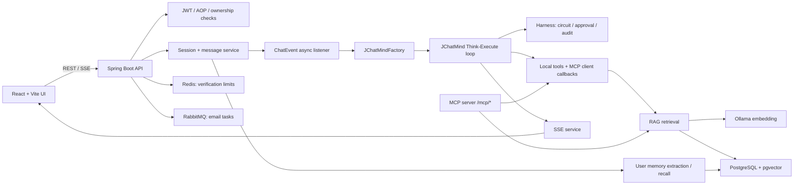
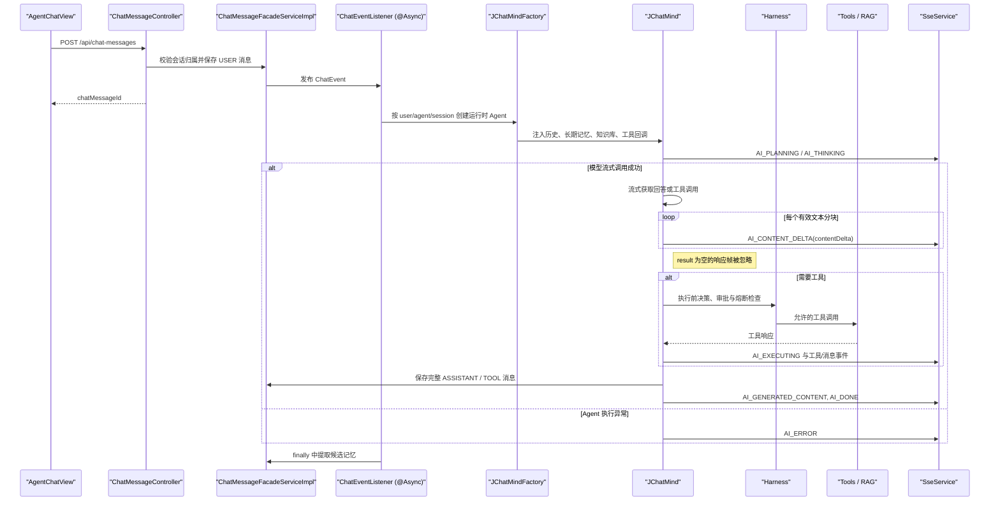
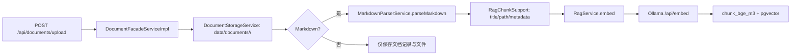
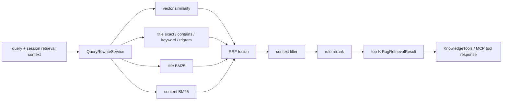
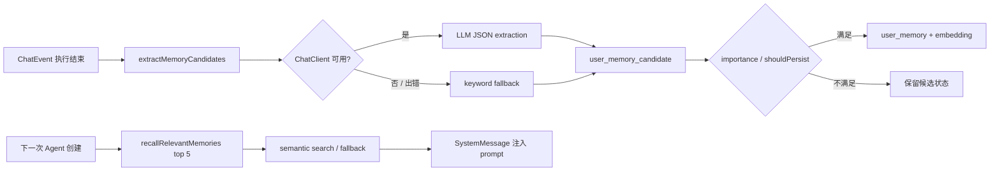
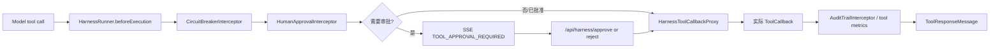

# JChatMind 项目架构与关键链路

> 文档定位：仓库的长期架构总览与源码导航。描述以当前代码为准；计划、实验结果和历史故障不在此重复，统一链接到相应专题文档。
>
> 最后核对：2026-08-13。修改涉及下列模块时，应同步更新本文件的“关键代码索引”和对应链路。

## 1. 项目定位与边界

JChatMind 是一个用于学习和二次开发的本地 Java Agent 项目。它提供用户认证、可配置 Agent、会话消息、知识库 RAG、工具调用、人审 Harness、用户记忆、SSE 推送及 MCP 服务端能力。

当前架构是**单个运行时 Agent + 可配置工具集合**，不是多 Agent 编排系统。RAG、记忆和外部 MCP 工具均作为 Agent 可调用或可注入的能力存在。后续是否引入 Verifier、Retriever 等专职 Agent，应以固定评测集上的质量、延迟和成本收益为依据，详见 [RAG 设计与评测分析](RAG设计与评测分析.md)。

### 1.1 已实现能力与事实边界

| 能力 | 当前实现 | 说明 |
| --- | --- | --- |
| 对话 Agent | 已实现 | `JChatMind` 以 Think-Execute 循环驱动模型与工具调用。 |
| 会话实时反馈 | 已实现 | 后端以会话 ID 管理 SSE 连接，前端订阅状态与新增消息事件。 |
| RAG | 已实现 | Markdown 分节、embedding、pgvector 向量召回、词法召回、RRF 融合和规则 rerank。 |
| 查询改写 | 已实现 | RAG 检索前生成 query/context 计划；可由评测开关关闭。 |
| 工具安全 Harness | 已实现 | 工具代理、审批、熔断、审计为运行时执行前后链路的一部分。 |
| 用户记忆 | 已实现 | 对话结束后异步提取候选记忆，按规则写入长期记忆并向量召回；失败时不阻断对话。 |
| 用户认证与验证码 | 已实现 | JWT 请求上下文、AOP 登录/管理员校验、Redis 限流、RabbitMQ 异步邮件。 |
| MCP 服务端 | 已实现 | 暴露知识库、邮件、数据库工具；可选 API Key 过滤。 |
| 真实 KB L2 RAG 评测 | 未完成 | 候选数据和运行器已就绪，但本地 PostgreSQL 连接被拒绝，尚无真实运行期指标。 |
| Release RAG 集 | 未完成 | 仍需一份未参与调参的完整真实 KB，以及 hard/no-answer/permission 样本的人工双人复核。 |

## 2. 总体架构



### 2.1 运行组件

| 层 | 组件 | 主要职责 |
| --- | --- | --- |
| 前端 | React 19、Vite、Ant Design | 登录、Agent/会话/知识库/记忆界面；REST 调用和 SSE 消费。 |
| Web 层 | Spring MVC Controllers | 提供 `/api/**`、`/sse/**` 与 `/mcp/**` 入口，统一返回 `ApiResponse`。 |
| 应用层 | Facade Services | 所有权校验、DTO/Entity 转换、会话与资源的 CRUD。 |
| Agent 层 | `JChatMind`、`JChatMindFactory` | 装配模型、历史、记忆、知识库、工具，并执行模型-工具循环。 |
| RAG 层 | `DocumentFacadeServiceImpl`、`RagServiceImpl` | Markdown 解析、分块、向量化、混合检索、融合、重排。 |
| 安全控制层 | Token/AOP、Harness | 建立请求用户上下文；保护工具执行而非只依赖模型自律。 |
| 基础设施 | PostgreSQL/pgvector、Redis、RabbitMQ、Ollama | 业务和向量持久化、缓存与限流、邮件队列、embedding 服务。 |

## 3. 目录与模块职责

```text
backend_v2/
  src/main/java/com/kama/jchatmind/
    agent/           Agent 循环、工具、Harness
    auth/            JWT、请求上下文、权限注解和切面
    config/          Web、安全、模型、消息队列、工具装配
    controller/      REST 与 SSE 接口
    event/           消息提交后的异步 Agent 事件
    mapper/          MyBatis 数据访问接口
    mcp/             MCP 服务端与检索工具
    model/           entity、DTO、request、response、VO
    service/         应用服务接口及实现
    util/            RAG chunk 结构与 metadata 支持
  src/test/java/.../rag/
                   RAG 指标、冻结数据集、replay、候选集治理与运行期评测
ui/src/
  api/              REST 客户端与接口类型
  components/       布局、会话、Agent、知识库、记忆视图
  contexts/         登录态、会话状态
  hooks/            页面数据加载与刷新
sql/
  auth/             用户与邮件失败表迁移
  user-memory/      记忆字段、状态、向量索引迁移
docs/
  项目架构与关键链路.md  当前唯一架构文档
  plans/active/      当前唯一跨模块计划
  spec/              当前唯一实施 Spec
  archive/           历史方案、记录和专题资料
```

## 4. 关键运行链路

### 4.1 用户提问到 Agent 回复



1. 前端 [AgentChatView.tsx](../ui/src/components/views/AgentChatView.tsx) 要求登录后才创建会话或发送既有会话消息，并连接 `/sse/connect/{chatSessionId}`。它累积 `AI_CONTENT_DELTA` 为临时回答气泡；收到 `AI_GENERATED_CONTENT` 后以持久化消息替换临时内容。无工具调用的 Assistant 最终消息会主动收起状态，避免 SSE 断连丢失 `AI_DONE` 后残留“思考中”；仍有工具调用的中间消息保持执行状态，并继续展示高层执行轨迹、错误状态和审批卡片。
2. [ChatMessageController.java](../backend_v2/src/main/java/com/kama/jchatmind/controller/ChatMessageController.java) 交给 `ChatMessageFacadeServiceImpl`。该服务先校验当前用户拥有会话，保存消息，再发布 `ChatEvent`。
3. [ChatEventListener.java](../backend_v2/src/main/java/com/kama/jchatmind/event/listener/ChatEventListener.java) 使用 `@Async` 创建 Agent 并执行；无论主执行是否结束，都会尝试提取候选记忆，记忆失败只记日志。
4. [JChatMindFactory.java](../backend_v2/src/main/java/com/kama/jchatmind/agent/JChatMindFactory.java) 加载 Agent 配置、最近会话消息、相关长期记忆、允许访问的 KB、固定/可选/外部工具，并用 Harness 代理包装每个工具回调。
5. [JChatMind.java](../backend_v2/src/main/java/com/kama/jchatmind/agent/JChatMind.java) 运行最多 20 步的 Think-Execute 循环。模型内部工具执行被关闭，工具由应用显式执行，便于审批、超时、审计和 SSE 反馈。每轮模型调用使用流式 `ChatResponse`；仅有效 `AssistantMessage` 分块可产生 `AI_CONTENT_DELTA`，`result == null` 空帧被忽略，最终完整文本和工具调用再聚合为持久化消息。
6. [SseServiceImpl.java](../backend_v2/src/main/java/com/kama/jchatmind/service/impl/SseServiceImpl.java) 以会话 ID 保存 `SseEmitter`，发送序列化 `SseMessage`；当前 UI 消费 `AI_PLANNING`、`AI_THINKING`、`AI_EXECUTING`、`AI_CONTENT_DELTA`、`AI_GENERATED_CONTENT`、`AI_DONE`、`AI_ERROR` 与 `TOOL_APPROVAL_REQUIRED`。断开、超时或发送失败后清理连接。

### 4.2 Agent 内部状态与工具执行

`JChatMind` 维护 `IDLE -> THINKING -> EXECUTING` 状态，主要保障如下：

- 会话消息窗口默认 20 条；总字符超过阈值时，压缩旧消息并保留最近消息。
- 压缩时会调整边界，避免把一次 Assistant tool call 与对应 `ToolResponseMessage` 拆开。
- 每个有效模型文本分块先以 `AI_CONTENT_DELTA` 发送；流结束后才聚合、持久化完整 Assistant 消息并发出 `AI_GENERATED_CONTENT`。中转站产生的空响应帧不得中断后续分块或工具调用聚合。
- 工具执行使用 30 秒默认超时；工具回包和合成的审批/熔断拒绝结果同样作为 `TOOL` 消息持久化。
- 相同工具调用签名会被记录，作为下一轮 prompt 的重复调用提示。
- `AI_THINKING` 仅表达 Agent 状态。当前链路不承诺向前端暴露或持久化独立模型 `reasoning_content`，流式正文取自 `AssistantMessage.getText()`。

关键入口：[`JChatMind.run`](../backend_v2/src/main/java/com/kama/jchatmind/agent/JChatMind.java)、[`JChatMind.think`](../backend_v2/src/main/java/com/kama/jchatmind/agent/JChatMind.java)、[`JChatMind.execute`](../backend_v2/src/main/java/com/kama/jchatmind/agent/JChatMind.java)。

### 4.3 文档上传与索引构建



- [DocumentController.java](../backend_v2/src/main/java/com/kama/jchatmind/controller/DocumentController.java) 接收 KB ID 和文件。
- [DocumentFacadeServiceImpl.java](../backend_v2/src/main/java/com/kama/jchatmind/service/impl/DocumentFacadeServiceImpl.java) 保存文档记录与文件。当前代码对 **Markdown** 调用解析器，并按 section 建 chunk；其他类型不会进入这条 Markdown 向量化路径。
- [RagChunkSupport.java](../backend_v2/src/main/java/com/kama/jchatmind/util/RagChunkSupport.java) 负责将 section 标题、层级路径、来源等信息组装为 embedding 输入和 metadata。
- [RagServiceImpl.java](../backend_v2/src/main/java/com/kama/jchatmind/service/impl/RagServiceImpl.java) 调用 Ollama `/api/embed` 获取向量，并由 `ChunkBgeM3Mapper` 写入 `chunk_bge_m3`。

**维护约束：** 任何影响 Markdown 解析、chunk 边界、metadata、embedding 模型或输入拼接方式的改动，必须升级 RAG 评测数据集/索引版本，不能直接与旧 chunk UUID 的结果对比。

### 4.4 RAG 检索与排序



[RagServiceImpl.java](../backend_v2/src/main/java/com/kama/jchatmind/service/impl/RagServiceImpl.java) 是当前检索核心：

1. 清洗 KB 范围，调用 [QueryRewriteServiceImpl.java](../backend_v2/src/main/java/com/kama/jchatmind/service/impl/QueryRewriteServiceImpl.java) 生成检索 query 与可选会话上下文约束。
2. 构造多个候选通道：向量相似度、标题精确/包含/关键词/Trigram、标题 BM25 和正文 BM25。
3. 用 RRF 合并不同分数空间的候选，再按上下文约束过滤。
4. 用规则 rerank 综合词面、结构、路径、向量和候选排名信号，输出最终 Top-K。
5. [KnowledgeTools.java](../backend_v2/src/main/java/com/kama/jchatmind/agent/tools/KnowledgeTools.java) 将 Agent 可访问 KB 绑定到运行时；[McpKnowledgeTool.java](../backend_v2/src/main/java/com/kama/jchatmind/mcp/McpKnowledgeTool.java) 则要求 MCP 调用方明确提供 `kbIds`，返回包含来源和路径的结构化文本。

检索质量不以单次回答主观判断为准，评测口径、数据集版本及 L1/L2/L3 分层见 [RAG 评测与数据集规范化推进计划](plans/active/rag-evaluation-dataset-governance-plan.md)。

### 4.5 用户记忆生命周期



- [UserMemoryFacadeServiceImpl.java](../backend_v2/src/main/java/com/kama/jchatmind/service/impl/UserMemoryFacadeServiceImpl.java) 提取用户消息中的记忆，优先使用模型输出 JSON；模型不可用或解析失败时回退关键词提取。
- 每项都会有候选记录。满足 `shouldPersist` 和重要性条件的候选会自动写入长期记忆、生成 embedding，并持久化到 `user_memory`。
- 创建 Agent 时，`JChatMindFactory` 对最新用户 query 召回最多 5 条相关已确认记忆，格式化为系统消息注入；向量召回异常时回退到最近确认记忆，全部失败则空集合继续对话。
- 对应迁移位于 [sql/user-memory/README.md](../sql/user-memory/README.md)。缺列会导致功能降级或错误，升级后必须执行该目录的迁移。

**当前集成观察：** 前端 API 定义了 `POST /api/users/memory-candidates/{candidateId}/confirm`，但当前 `UserMemoryController` 只提供记忆/候选查询和已确认记忆删除；仓库未检索到对应确认 Controller 路由。该前后端契约应在后续记忆治理工作中补齐或移除前端入口，不能在文档中宣称“用户确认接口已经可用”。

### 4.6 工具 Harness、人审与审计



- `JChatMindFactory` 以 [HarnessToolCallbackProxy.java](../backend_v2/src/main/java/com/kama/jchatmind/agent/harness/proxy/HarnessToolCallbackProxy.java) 包装本地工具与外部工具回调，避免仅依赖 Agent prompt 判断权限。
- [HarnessRunner.java](../backend_v2/src/main/java/com/kama/jchatmind/agent/harness/HarnessRunner.java) 汇总执行前决策、等待审批和工具结果。
- [HarnessInterceptorChain.java](../backend_v2/src/main/java/com/kama/jchatmind/agent/harness/interceptor/HarnessInterceptorChain.java) 按 order 执行拦截器；[HumanApprovalInterceptor.java](../backend_v2/src/main/java/com/kama/jchatmind/agent/harness/interceptor/HumanApprovalInterceptor.java) 会将同一步、同名工具调用合并为一个审批请求。
- [HarnessController.java](../backend_v2/src/main/java/com/kama/jchatmind/controller/HarnessController.java) 通过所属会话校验审批请求归属，再执行 approve/reject 或查询待审批项。
- `AgentChatView` 收到 `TOOL_APPROVAL_REQUIRED` 后读取待审批项，展示工具名称、参数和批准/拒绝操作；决策提交失败时保留卡片并提示错误。
- Harness 的审批、审计、熔断存储当前包含内存实现，服务重启不保证待审批和审计数据继续存在；持久化方案属于后续演进项。

### 4.7 认证、验证码与异步邮件

1. [TokenInterceptor.java](../backend_v2/src/main/java/com/kama/jchatmind/auth/TokenInterceptor.java) 从 `Authorization: Bearer <JWT>` 解析 token，并填充 `RequestScopeData`。
2. [NeedLoginAspect.java](../backend_v2/src/main/java/com/kama/jchatmind/auth/aspect/NeedLoginAspect.java) 与 `NeedAdminAspect` 在标注处执行登录和管理员检查；业务 Facade 也通过当前用户和资源所属关系控制访问。
3. [EmailServiceImpl.java](../backend_v2/src/main/java/com/kama/jchatmind/service/impl/EmailServiceImpl.java) 在 Redis 中执行邮箱冷却、IP、邮箱+IP 三层限流与失败次数控制，然后将验证码邮件任务投递到 RabbitMQ。
4. 消费端发送邮件并处理失败/死信，失败记录映射位于 `EmailFailureMapper`。

**安全边界：** [SecurityConfig.java](../backend_v2/src/main/java/com/kama/jchatmind/config/SecurityConfig.java) 当前允许 `/api/**` 与 `/sse/**` 进入 Spring MVC，以便 TokenInterceptor/AOP 与业务层自行决策；因此新增接口不得假设 SecurityFilterChain 已经默认保护它，必须明确使用既有 AOP 注解或服务层的用户与资源归属校验。

### 4.8 MCP 服务端

- [McpServerConfig.java](../backend_v2/src/main/java/com/kama/jchatmind/mcp/McpServerConfig.java) 将 `McpKnowledgeTool`、邮件工具和数据库工具注册为 MCP ToolCallback，并为 `/mcp/*` 配置 API Key 过滤器。
- 当 `mcp.api-key` 有值时，请求需携带 `X-API-Key`；为空时过滤器放行。这是本地开发便利策略，部署到可访问网络前必须配置强 API Key 并审查每个工具权限。
- 历史 MCP 双向集成方案见 [归档区](archive/2026-08-15/plans/active/mcp.md)，当前目标和取舍以唯一总计划为准。

## 5. 数据、持久化与运行依赖

| 资源 | 主要数据 | 代码入口 / 说明 |
| --- | --- | --- |
| PostgreSQL + pgvector | 用户、Agent、会话、消息、知识库、文档、chunk、记忆、工具指标 | MyBatis `mapper/`；向量由 `PgVectorTypeHandler` 处理。 |
| 本地文档目录 | 上传原文件 | `DocumentStorageServiceImpl`；目录结构以 `data/documents/<kbId>/<documentId>/` 为主。 |
| Redis | 验证码、限流计数 | `RedisKey`、`EmailServiceImpl`。 |
| RabbitMQ | 验证码邮件任务、重试/死信 | `RabbitMQConfig`、`EmailConsumer`、`EmailDeadLetterConsumer`。 |
| Ollama | RAG 与记忆 embedding | `RagServiceImpl` 访问 `/api/embed`。 |
| 外部模型 | DeepSeek、智谱 ChatClient | `MultiChatClientConfig` 和 `ChatClientRegistry`。 |

[docker-compose.yml](../docker-compose.yml) 可启动 PostgreSQL/pgvector、Redis、RabbitMQ 和 Ollama。密码、API Key、数据库地址和模型配置属于本地敏感配置，位于环境文件/运行配置中，不应写入文档或提交到仓库。

## 6. 接口与前端对应关系

| 业务 | 后端入口 | 前端主要入口 |
| --- | --- | --- |
| 用户注册/登录 | `UserController`、`EmailVerifyController` | `components/auth/`、`api/api.ts` |
| Agent 管理 | `AgentController` | `AgentTabContent`、`AddAgentModal` |
| 会话与消息 | `ChatSessionController`、`ChatMessageController` | `AgentChatView`、`useChatSessions` |
| 实时消息 | `SseController`、`SseServiceImpl` | `AgentChatView` 的 `EventSource`：状态/审批、回答分片、最终消息与错误事件 |
| 知识库/文档 | `KnowledgeBaseController`、`DocumentController` | `KnowledgeBaseView`、`useDocuments` |
| 用户记忆 | `UserMemoryController` | `UserMemoryView`、`api/api.ts` |
| 工具审批 | `HarnessController` | UI 需按 SSE 审批事件拉取并提交审批动作 |
| MCP | Spring AI MCP Server `/mcp/*` | 外部 MCP 客户端，不经当前 React UI |

## 7. RAG 评测体系与当前状态

| 层级 | 目的 | 当前状态 | 入口 |
| --- | --- | --- | --- |
| L0 | 指标公式和边界单测 | 已完成 | `RagAsMetricsTest` |
| L1 | 冻结 replay 快速回归 | 已完成，20 case | `RagFastRegressionEvaluatorTest` |
| L2 | 固定真实 KB 日常回归 | 候选集与运行器已完成；真实映射/replay 未完成 | `RagRegressionCandidateRuntimeEvaluationTest` |
| L3 | 完整阶段验收 | 待建立 release-v1 | 计划中 |
| L4 | 公开基准 | 待模型/策略重大变更时执行 | 计划中 |

目前 L1 replay 的价值是验证数据、指标公式和报告 schema，不是实时检索质量的结论。候选 L2 的就绪度为 58 条 case、57 条审核通过、40 条真实 KB 运行期候选；唯一自动阻塞是运行期 chunk UUID 映射尚未完成。详细数据和冻结条件见：

- 当前实施 Spec：[trusted-knowledge-agent-spec.md](spec/trusted-knowledge-agent-spec.md)
- 历史评测维护说明、数据集计划和候选审核清单见 [归档区](archive/2026-08-15/root/)。

## 8. 关键代码索引

| 主题 | 核心文件 | 修改时必须关注 |
| --- | --- | --- |
| Agent 调度 | [JChatMind.java](../backend_v2/src/main/java/com/kama/jchatmind/agent/JChatMind.java) | 状态转换、消息持久化、工具超时、压缩时工具对完整性。 |
| Agent 装配 | [JChatMindFactory.java](../backend_v2/src/main/java/com/kama/jchatmind/agent/JChatMindFactory.java) | 运行时 KB/工具范围、记忆注入、Harness 包装、模型选择。 |
| 消息异步启动 | [ChatMessageFacadeServiceImpl.java](../backend_v2/src/main/java/com/kama/jchatmind/service/impl/ChatMessageFacadeServiceImpl.java)、[ChatEventListener.java](../backend_v2/src/main/java/com/kama/jchatmind/event/listener/ChatEventListener.java) | 事件是否重复发布、异常隔离和所有权校验。 |
| RAG 检索 | [RagServiceImpl.java](../backend_v2/src/main/java/com/kama/jchatmind/service/impl/RagServiceImpl.java) | 通道变更、RRF、rerank、query rewrite、开关与报告可比性。 |
| RAG 入库 | [DocumentFacadeServiceImpl.java](../backend_v2/src/main/java/com/kama/jchatmind/service/impl/DocumentFacadeServiceImpl.java)、[RagChunkSupport.java](../backend_v2/src/main/java/com/kama/jchatmind/util/RagChunkSupport.java) | chunk schema、metadata、embedding 输入、索引版本。 |
| 用户记忆 | [UserMemoryFacadeServiceImpl.java](../backend_v2/src/main/java/com/kama/jchatmind/service/impl/UserMemoryFacadeServiceImpl.java) | 候选状态、自动持久化规则、回退、用户隔离、向量字段迁移。 |
| 工具安全 | [HarnessRunner.java](../backend_v2/src/main/java/com/kama/jchatmind/agent/harness/HarnessRunner.java)、[HarnessToolCallbackProxy.java](../backend_v2/src/main/java/com/kama/jchatmind/agent/harness/proxy/HarnessToolCallbackProxy.java) | 不得绕过代理；审批、熔断和审计需要保持同一条执行路径。 |
| 权限 | [TokenInterceptor.java](../backend_v2/src/main/java/com/kama/jchatmind/auth/TokenInterceptor.java)、[WebConfig.java](../backend_v2/src/main/java/com/kama/jchatmind/config/WebConfig.java) | 新接口必须有请求用户与资源归属控制。 |
| MCP | [McpServerConfig.java](../backend_v2/src/main/java/com/kama/jchatmind/mcp/McpServerConfig.java)、[McpKnowledgeTool.java](../backend_v2/src/main/java/com/kama/jchatmind/mcp/McpKnowledgeTool.java) | API Key、KB 范围与高风险工具权限。 |

## 9. 文档维护规则

### 9.1 文档职责

| 位置 | 保存什么 | 不保存什么 |
| --- | --- | --- |
| `docs/项目架构与关键链路.md` | 当前实现、关键链路、源码导航、已知边界 | 历史实验全过程、未落地设计细节。 |
| `docs/plans/active/trusted-knowledge-agent-roadmap.md` | 当前唯一跨模块计划、风险、下一步和决策 | 第二份平行总计划或已完成方案。 |
| `docs/spec/trusted-knowledge-agent-spec.md` | 当前实施范围、SDD/TDD 契约、数据 schema、配置和验收标准 | 过程日志与历史实验记录。 |
| `docs/archive/2026-08-15/` | 历史方案、完成计划、records 和专题资料 | 当前实现或当前计划的唯一依据。 |

### 9.2 必须同步更新的触发条件

| 代码变化 | 最低文档动作 |
| --- | --- |
| 新增/删除 Controller 或变更请求契约 | 更新本文件第 6 节，并在当前计划记录影响范围。 |
| 改变 Agent 循环、工具执行或 Harness | 更新第 4 节和当前计划的对应阶段。 |
| 改变 chunk、embedding、检索通道、rerank 或 query rewrite | 更新第 4.3、4.4、7 节和现有 Spec。 |
| 改变记忆 schema、候选状态或召回逻辑 | 更新第 4.6 节、现有 Spec 和迁移说明。 |
| 增加外部服务或环境变量 | 更新根 README 的启动说明和第 5 节；不得把敏感值写进文档。 |
| 阶段完成或方案废弃 | 在当前计划记录验收结果；历史细节移入归档区，不新增第二份 active 计划。 |

### 9.3 推荐检查顺序

1. 新成员：本文件 -> 根 [README](../README.md) -> 对应 Controller/Service/测试。
2. RAG 改动：本文件第 4.3、4.4、7 节 -> 现有 Spec -> 相关 `rag` 测试。
3. 生产故障：在当前计划记录影响和决策；需要保留的详细复盘放入归档区，持续有效的结论回填本文件。

## 10. 关联文档

- 当前唯一计划：[trusted-knowledge-agent-roadmap.md](plans/active/trusted-knowledge-agent-roadmap.md)。
- 当前唯一 Spec：[trusted-knowledge-agent-spec.md](spec/trusted-knowledge-agent-spec.md)。
- 历史 RAG、记忆、MCP、Harness、故障和评测资料：[归档区](archive/2026-08-15/)。
