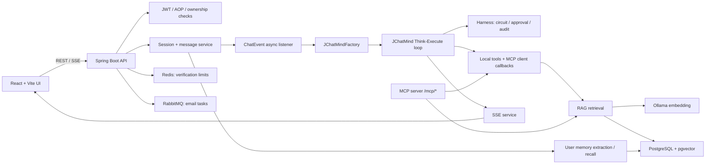
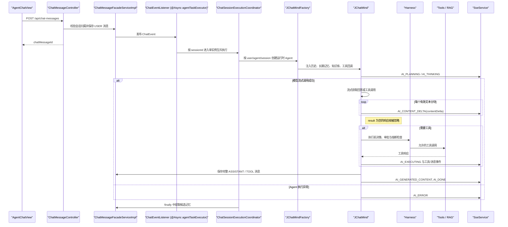
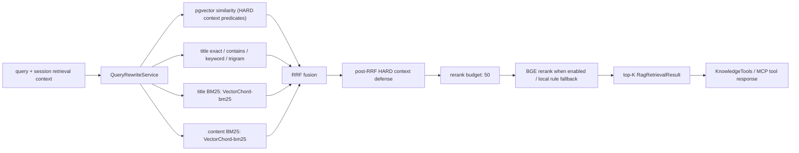
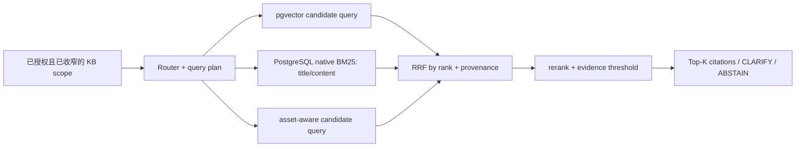
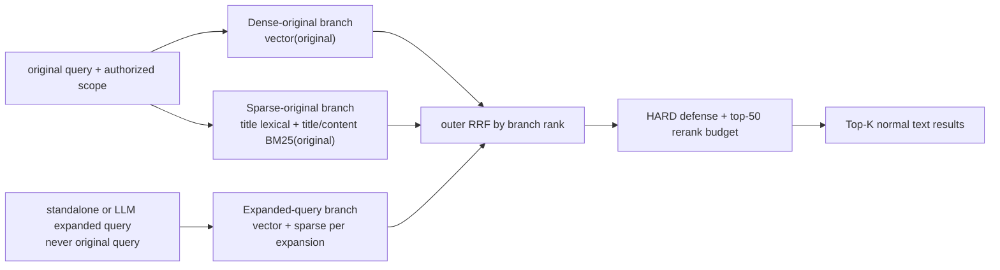
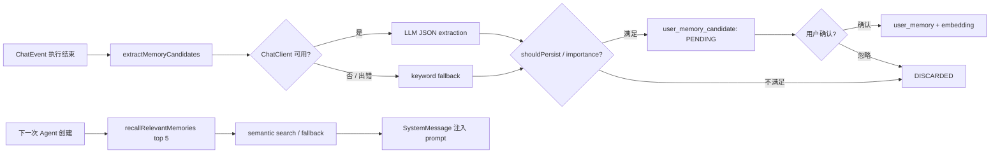
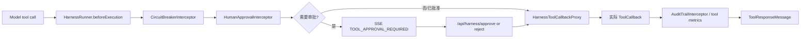

# JChatMind 项目架构与关键链路

> 文档定位：仓库的长期架构总览与源码导航。描述以当前代码为准；计划、实验结果和历史故障不在此重复，统一链接到相应专题文档。
>
> 最后核对：2026-08-25。修改涉及下列模块时，应同步更新本文件的“关键代码索引”和对应链路。

## 1. 项目定位与边界

JChatMind 是一个用于学习和二次开发的本地 Java Agent 项目。它提供用户认证、可配置 Agent、会话消息、知识库 RAG、工具调用、人审 Harness、用户记忆、SSE 推送及 MCP 服务端能力。

当前架构是**单个运行时 Agent + 可配置工具集合**，不是多 Agent 编排系统。RAG、记忆和外部 MCP 工具均作为 Agent 可调用或可注入的能力存在。后续是否引入 Verifier、Retriever 等专职 Agent，应以固定评测集上的质量、延迟和成本收益为依据，详见 [RAG 设计与评测分析](RAG设计与评测分析.md)。

### 1.1 已实现能力与事实边界

| 能力 | 当前实现 | 说明 |
| --- | --- | --- |
| 对话 Agent | 已实现 | `JChatMind` 以 Think-Execute 循环驱动模型与工具调用。 |
| 会话实时反馈 | 已实现 | 后端以会话 ID 管理 SSE 连接，前端订阅状态与新增消息事件。 |
| RAG | 已实现 | Markdown 分节、embedding、pgvector 向量召回、词法召回、RRF 融合和规则 rerank。 |
| 查询改写 | 已实现 | RAG 检索前生成 query/context 计划；可由评测开关关闭。 |
| 工具安全 Harness | 已实现 | 工具代理、审批、熔断、审计为运行时执行前后链路的一部分。 |
| 内置 Skill 契约 | L0/L1 部分实现 | `BuiltinSkillRegistry` 固定登记 `technical-decision-comparison@v1` 的输入、授权 KB 收窄、工具白名单、声明预算和结构化输出校验；`BuiltinSkillExecutor` 仅在 Harness 放行后经 `HarnessToolCallbackProxy` 执行绑定范围的只读知识检索，并将无证据或受阻执行收束为拒答。尚无 HTTP/队列入口、模型总结或独立预算调度。 |
| 工作流计划验证 | L0/L1 部分实现 | `WorkflowPlanVerifier` 校验 Planner 输出的预算、工具白名单、工具名无首尾空白、证据和矛盾；通过的工具名与 Harness 策略精确匹配。`WorkflowPlanExecutor` 仅对已验证计划按顺序经 Harness 代理执行，拒绝或异常立即停止后续步骤。当前未生成 Planner 计划、映射任务、持久化结果或实现实际超时/fallback。 |
| 用户记忆 | 部分治理已实现 | 对话结束后异步提取候选记忆；中高重要度候选须由用户确认后才写入长期记忆并参与召回，用户可忽略候选、编辑或删除单条长期记忆，或清空自己的长期记忆；编辑会更新 matching embedding，提取失败不阻断对话。冲突历史和可选到期时间已落地，G3 的反思与真实 Playwright 旅程仍待完成。 |
| 用户认证与验证码 | 已实现 | JWT 请求上下文、AOP 登录/管理员校验、Redis 限流、RabbitMQ 异步邮件。 |
| MCP 服务端 | V1 生产主体映射与 `STREAMABLE` 协议已启用 | 暴露知识库、邮件、数据库工具；仅已解析到内部用户且通过 KB owner 校验的调用可检索私有知识库。 |
| 多模态资产引用与候选 | 部分实现 | PDF 页文本和 Markdown `TABLE` 资产均与同文档 chunk 关联；`MULTIMODAL_RAG` 可在已授权 KB 与 `HARD` 会话范围内检索 `READY` 资产，Agent/MCP 按表格、PDF、普通候选顺序返回稳定资产 ID 与表格行号或页码。图片/OCR、公式、表格单元格关系、坐标回跳和真实运行时多模态验收未实现。 |
| 真实 KB L2 RAG 评测 | 未完成 | 候选数据、运行器与完整 UUID 映射门禁已就绪；独立 PostgreSQL/VectorChord 评测库已验证，但旧候选源文件和候选 KB chunk 均已缺失，尚无可复现的真实运行期指标。 |
| Release RAG 集 | 未完成 | 仍需一份未参与调参的完整真实 KB，以及 hard/no-answer/permission 样本的人工双人复核。 |

## 2. 总体架构



### 2.1 运行组件

| 层 | 组件 | 主要职责 |
| --- | --- | --- |
| 前端 | React 19、Vite、Ant Design | 登录、Agent/会话/知识库/记忆界面；REST 调用和 SSE 消费。 |
| Web 层 | Spring MVC Controllers | 提供 `/api/**`、`/sse/**` 与 `/mcp/**` 入口，统一返回 `ApiResponse`。 |
| 应用层 | Facade Services | 所有权校验、DTO/Entity 转换、会话与资源的 CRUD。 |
| Agent 层 | `JChatMind`、`JChatMindFactory` | 装配模型、历史、记忆、知识库、工具，并执行模型-工具循环。 |
| RAG 层 | `DocumentFacadeServiceImpl`、`RagServiceImpl` | Markdown 解析、分块、向量化、混合检索、融合、重排。 |
| 安全控制层 | Token/AOP、Harness | 建立请求用户上下文；保护工具执行而非只依赖模型自律。 |
| 基础设施 | PostgreSQL/pgvector、Redis、RabbitMQ、Ollama | 业务和向量持久化、缓存与限流、邮件队列、embedding 服务。 |

## 3. 目录与模块职责

```text
backend_v2/
  src/main/java/com/kama/jchatmind/
    agent/           Agent 循环、工具、Harness
    auth/            JWT、请求上下文、权限注解和切面
    config/          Web、安全、模型、消息队列、工具装配
    controller/      REST 与 SSE 接口
    event/           消息提交后的异步 Agent 事件
    mapper/          MyBatis 数据访问接口
    mcp/             MCP 服务端与检索工具
    model/           entity、DTO、request、response、VO
    service/         应用服务接口及实现
    skill/           内置 Skill 模板、受控检索执行及输入/输出契约校验
    util/            RAG chunk 结构与 metadata 支持
    workflow/        受限工作流计划及其验证器
  src/test/java/.../rag/
                   RAG 指标、冻结数据集、replay、候选集治理与运行期评测
ui/src/
  api/              REST 客户端与接口类型
  components/       布局、会话、Agent、知识库、记忆视图
  contexts/         登录态、会话状态
  hooks/            页面数据加载与刷新
sql/
  auth/             用户与邮件失败表迁移
  user-memory/      记忆字段、状态、向量索引迁移
docs/
  项目架构与关键链路.md  当前唯一架构文档
  plans/active/      当前唯一跨模块计划
  spec/              当前唯一实施 Spec
  archive/           历史方案、记录和专题资料
```

## 4. 关键运行链路

### 4.1 用户提问到 Agent 回复



1. 前端 [AgentChatView.tsx](../ui/src/components/views/AgentChatView.tsx) 要求登录后才创建会话或发送既有会话消息，并连接 `/sse/connect/{chatSessionId}`。它累积 `AI_CONTENT_DELTA` 为临时回答气泡；收到 `AI_GENERATED_CONTENT` 后以持久化消息替换临时内容。无工具调用的 Assistant 最终消息会主动收起状态，避免 SSE 断连丢失 `AI_DONE` 后残留“思考中”；仍有工具调用的中间消息保持执行状态，并继续展示高层执行轨迹、错误状态和审批卡片。[JChatMindLayout.tsx](../ui/src/components/JChatMindLayout.tsx) 对 `/chat` 与 `/chat/{chatSessionId}` 按会话 ID 设置 React `key`，并持有会话 ID 到执行轨迹的内存映射：新会话重挂载时隔离初始化防重标记、SSE 临时分片和审批状态，切回同一会话时恢复此前已收到的轨迹。离开期间的 SSE 事件当前没有后端回放，刷新页面也不保留该内存轨迹。
2. [ChatMessageController.java](../backend_v2/src/main/java/com/kama/jchatmind/controller/ChatMessageController.java) 交给 `ChatMessageFacadeServiceImpl`。该服务先校验当前用户拥有会话，保存消息，再发布 `ChatEvent`。[ChatEventListener.java](../backend_v2/src/main/java/com/kama/jchatmind/event/listener/ChatEventListener.java) 通过 `@Async("agentTaskExecutor")` 使用独立的 core=2、max=4、queue=50 有界池，并先委派给 [ChatSessionExecutionCoordinator.java](../backend_v2/src/main/java/com/kama/jchatmind/event/listener/ChatSessionExecutionCoordinator.java)：同一会话在当前进程内互斥运行 Agent 及 finally 中的候选记忆提取，不同会话可以并行。该池与邮件所用通用 `taskExecutor` 分离；协调器在等待前保留会话引用，最后一个执行或等待任务退出后释放。它不承诺跨异步线程提交排序，也没有跨实例、重启恢复或持久化队列语义。
3. [ChatEventListener.java](../backend_v2/src/main/java/com/kama/jchatmind/event/listener/ChatEventListener.java) 使用该专用池创建 Agent 并执行；无论主执行是否结束，都会尝试提取候选记忆，记忆失败只记日志。工具、文档索引和 Webhook 投递的专用执行器尚未实现。
4. [JChatMindFactory.java](../backend_v2/src/main/java/com/kama/jchatmind/agent/JChatMindFactory.java) 加载 Agent 配置、最近会话消息、相关长期记忆、允许访问的 KB、固定/可选/外部工具，并用 Harness 代理包装每个工具回调。
5. [JChatMind.java](../backend_v2/src/main/java/com/kama/jchatmind/agent/JChatMind.java) 运行最多 20 步的 Think-Execute 循环。模型内部工具执行被关闭，工具由应用显式执行，便于审批、超时、审计和 SSE 反馈。每轮模型调用使用流式 `ChatResponse`；仅有效 `AssistantMessage` 分块可产生 `AI_CONTENT_DELTA`，`result == null` 空帧被忽略，最终完整文本和工具调用再聚合为持久化消息。
6. [SseServiceImpl.java](../backend_v2/src/main/java/com/kama/jchatmind/service/impl/SseServiceImpl.java) 以会话 ID 保存 `SseEmitter`，发送序列化 `SseMessage`；当前 UI 消费 `AI_PLANNING`、`AI_THINKING`、`AI_EXECUTING`、`AI_CONTENT_DELTA`、`AI_GENERATED_CONTENT`、`AI_DONE`、`AI_ERROR` 与 `TOOL_APPROVAL_REQUIRED`。断开、超时或发送失败后清理连接。

`TC-G0-02` 以最小 Spring 容器的真实 `ApplicationEventPublisher` 覆盖上述消息边界：消息服务保存用户消息后，`ChatEventListener` 创建并运行 Agent，随后提取记忆候选，历史消息按 Mapper 返回顺序读取。该 L1 测试替换外部模型、数据库与异步执行器，不把同步测试调度误写为生产 `@Async` 的线程语义。

### 4.2 Agent 内部状态与工具执行

`JChatMind` 维护 `IDLE -> THINKING -> EXECUTING` 状态，主要保障如下：

- 会话消息窗口默认 20 条；总字符达到 8000 时压缩旧消息并保留最近 8 条。`conversationSummary` 最多 4000 字符，超出时丢弃较旧前缀、保留末尾的新近内容；决策提示和下一轮摘要提示都只读取这个受限值。
- 压缩时会调整边界，避免把一次 Assistant tool call 与对应 `ToolResponseMessage` 拆开。
- 每个有效模型文本分块先以 `AI_CONTENT_DELTA` 发送；流结束后才聚合、持久化完整 Assistant 消息并发出 `AI_GENERATED_CONTENT`。中转站产生的空响应帧不得中断后续分块或工具调用聚合。
- 工具执行使用 30 秒默认超时；工具回包和合成的审批/熔断拒绝结果同样作为 `TOOL` 消息持久化。
- 相同工具调用签名会被记录，作为下一轮 prompt 的重复调用提示。
- `AI_THINKING` 仅表达 Agent 状态。当前链路不承诺向前端暴露或持久化独立模型 `reasoning_content`，流式正文取自 `AssistantMessage.getText()`。

关键入口：[`JChatMind.run`](../backend_v2/src/main/java/com/kama/jchatmind/agent/JChatMind.java)、[`JChatMind.think`](../backend_v2/src/main/java/com/kama/jchatmind/agent/JChatMind.java)、[`JChatMind.execute`](../backend_v2/src/main/java/com/kama/jchatmind/agent/JChatMind.java)。

### 4.3 文档上传与索引构建

```mermaid
flowchart LR
    A["POST /api/documents/upload"] --> B["DocumentFacadeServiceImpl"]
    B --> C["DocumentStorageService: data/documents/<kb>/<doc>"]
    C --> D["IngestionTaskService: create/replay task"]
    D --> E["after-commit publish"]
    E --> F["RabbitMQ ingestion queue"]
    F --> G["IngestionTaskConsumer: claim QUEUED"]
    G --> H["DefaultIngestionTaskProcessor transaction"]
    H --> I["MarkdownParserService / RagChunkSupport"]
    I --> J["RagService.embed -> Ollama /api/embed"]
    J --> K["replace chunk_bge_m3 + pgvector"]
```



- [DocumentController.java](../backend_v2/src/main/java/com/kama/jchatmind/controller/DocumentController.java) 接收 KB ID、文件和必填 `Idempotency-Key`。
- [DocumentFacadeServiceImpl.java](../backend_v2/src/main/java/com/kama/jchatmind/service/impl/DocumentFacadeServiceImpl.java) 在一个上传事务内先校验 owner 和非空幂等键，再保存文档记录与文件；它不再在 HTTP 请求中同步解析或 embedding，而是提交摄入任务并返回 `documentId`、`taskId`。
- [DocumentStorageServiceImpl.java](../backend_v2/src/main/java/com/kama/jchatmind/service/impl/DocumentStorageServiceImpl.java) 在 `Files.copy` 中途失败时立即删除该次尚未返回给上层的目标文件，并仅删除为空的文档和 KB 目录；任务/数据库异常发生在文件已成功写入后，则仍由上传门面按返回的相对路径补偿。两条分支都不删除已有成功上传文件。
- [IngestionTaskServiceImpl.java](../backend_v2/src/main/java/com/kama/jchatmind/service/impl/IngestionTaskServiceImpl.java) 以任务 owner + 幂等键创建或重放同一任务：预检先取得 PostgreSQL 事务级 advisory lock，再查询既有任务，因此同一 owner+key 的并发上传不会在文档/文件副作用前同时越过预检。它校验文档属于已授权 KB，并在事务提交后发布消息。取消只允许 `QUEUED` 或 `RETRYING`；已领取的 `RUNNING` 任务必须通过完成、失败或重试收束，避免“已取消仍写入”。任务查询、取消和重试仅允许 owner，经 [IngestionTaskController.java](../backend_v2/src/main/java/com/kama/jchatmind/controller/IngestionTaskController.java) 输出时不暴露 `ownerId` 或幂等键。
- [IngestionTaskConsumer.java](../backend_v2/src/main/java/com/kama/jchatmind/ingestion/IngestionTaskConsumer.java) 从独立 RabbitMQ 摄入队列领取任务，并显式使用 `ingestionRabbitListenerContainerFactory`：工厂先应用现有 Spring Boot Listener 配置，再固定每实例两个消费者、每消费者预取一条未确认消息，因此阻塞解析或 embedding 不会使同一消费者囤积更多消息。该本地并发限制不实现任务超时、动态扩缩、队列监控或跨实例协调。RabbitTemplate 的 JSON 字符串任务 ID 在消费者入口解包后才进入 UUID 查询，避免带引号值使任务永久停在 `QUEUED`。[DefaultIngestionTaskProcessor.java](../backend_v2/src/main/java/com/kama/jchatmind/ingestion/DefaultIngestionTaskProcessor.java) 在数据库事务内重建目标文档的 chunk，任一 `insert` 未落库即抛错回滚本次数据库替换。2026-08-20 的独立 PostgreSQL/RabbitMQ 真实测试在旧 chunk 删除 trigger 失败时观察到该事务回滚，消费者将任务推进到 `RETRYING`，三次后投递 DLQ；文档、任务、chunk 和物理文件没有重复或残留。Markdown 保留既有 section 分块；HTML 由同一解析服务提取标题结构；PDF 由 PDFBox 逐页提取非空文本并把 `pageNumber` 写入 chunk metadata。PDF 每页还会在同一事务内创建 `PDF_PAGE_TEXT` 资产和同文档关系，并将相同资产 ID、类型与页码 locator 写回该 chunk metadata；`txt` 或无章节内容作为单文档原文 chunk。独立 PostgreSQL/RabbitMQ/Ollama 测试中，两页 PDF 直调断言两个 chunk、非空 embedding 与 `pageNumber=1/2`；Rabbit 摄入另验证 `sourceType=pdf`、1024 维 embedding 和 `SUCCEEDED`。损坏 PDF 首次投递进入 retry queue，测试手工重投到真实消费者后观察第二次重试和最终死信，DLQ 有消息，且 document/task/物理文件保持单份、chunk 无残留；未验证 retry TTL/DLX 自动回投。
- [IngestionTaskSseController.java](../backend_v2/src/main/java/com/kama/jchatmind/controller/IngestionTaskSseController.java) 提供 `GET /sse/ingestion/{taskId}`，先通过 `IngestionTaskServiceImpl.getTask` 复用任务 owner 校验，再交给 [IngestionTaskProgressServiceImpl.java](../backend_v2/src/main/java/com/kama/jchatmind/ingestion/IngestionTaskProgressServiceImpl.java) 管理单实例任务级 emitter 集合、最新事件和有限事件历史。消费者在领取、成功、重试、死信时发布带单调 `id` 的 `ingestion-progress`；任务级锁串行化回放、连接注册和实时发送，Controller 接受 `Last-Event-ID` 并回放当前进程内的后续事件。每个任务最多保留 64 条事件，终态且没有连接 30 分钟后在后续任务活动中清理；四参生产构造器由 Spring 注入真实进度服务。真实成功摄入已观察最终 `SUCCEEDED`，独立 HTTP/JWT 测试也验证同一 owner 的两条连接均收到后续 `RUNNING`，另一 owner 不获得资源标识。前端已实现 `fetch + ReadableStream` 消费任务事件，只接受递增序号后断线重连，切换 KB、卸载或终态时取消连接，并保留轮询作为跨实例/长断线兜底；Edge 严格用例已签收预先建立的第二条 Bearer SSE 在真实重试后收到 `RUNNING`。该服务不持久化事件，也不提供多实例分发或进程重启后的恢复。
- 文档列表、创建、上传、更新和删除均先校验当前用户拥有所属 KB；删除获授权文档时会先删除关联 `chunk_bge_m3` 记录，再删除文件和文档记录。
- [RagChunkSupport.java](../backend_v2/src/main/java/com/kama/jchatmind/util/RagChunkSupport.java) 负责将 section 标题、层级路径、来源等信息组装为 embedding 输入和 metadata；[RagServiceImpl.java](../backend_v2/src/main/java/com/kama/jchatmind/service/impl/RagServiceImpl.java) 调用 Ollama `/api/embed` 获取向量，并由 `ChunkBgeM3Mapper` 写入 `chunk_bge_m3`。

**维护约束：** 任何影响 Markdown 解析、chunk 边界、metadata、embedding 模型或输入拼接方式的改动，必须升级 RAG 评测数据集/索引版本，不能直接与旧 chunk UUID 的结果对比。

### 4.3.1 G1 知识库硬权限范围

G1 当前实现为单用户私有 KB 的 owner-only 模型：`knowledge_base.owner_id` 是后端授权依据，创建 KB 时由 `RequestScopeData.userId` 写入；列表、读取、更新、删除、文档 CRUD、上传和索引副作用均通过 `KnowledgeBaseAccessService` 校验 owner。不存在、历史无 owner 或非 owner 的 KB 均返回统一拒绝，不把资源存在性暴露给调用方。

范围按以下顺序收敛，后层只能缩小前层：

1. **后端硬权限**：owner 必须等于当前用户。当前本地库已验证 `owner_id` 外键、检查约束和 `NOT NULL`；不存在无 owner 的默认放行路径。
2. **Agent 默认范围**：`agent_knowledge_base` 是绑定的唯一持久化事实来源。API DTO/VO 的 `allowedKbs` 只是该关系表的读写投影，创建和更新时服务端校验 KB 存在、可访问并去重；它不是资源授权模型。
3. **会话/工具临时范围**：`KnowledgeTools` 只能从已注入的默认集合继续收窄，传入任意 `kbIds` 不会扩大范围。

`JChatMindFactory` 会先校验 Agent owner，再从关系表读取绑定并按运行时用户过滤；失权或已删除 KB 不会进入 `JChatMind.availableKbs` 或 `KnowledgeTool`。`agent_knowledge_base` 的 `agent_id`、`kb_id` 均有 `ON DELETE CASCADE`，删除 Agent 或 KB 时会清理当前绑定。表内 `bound_by_user_id`、`bound_at` 仅记录当前绑定的操作者和时间，尚不是保留历史事件的完整审计。

摄入任务也遵循同一硬权限层：上传和任务提交均先由当前用户的 KB owner 权限约束，任务记录再以 `owner_id` 限制查询、取消和重试。前端只显示当前 KB 任务，对 SSE 事件与轮询结果均再次核对 `kbId`；活动任务优先尝试携带 `Last-Event-ID` 的 Bearer SSE，轮询仅作跨实例或长断线兜底；取消和重试失败保留本地任务状态并提示错误。2026-08-19 的独立 Docker PostgreSQL、RabbitMQ vhost 和 `18080` 后端实际执行五份 G1 迁移：当时不支持的 PDF 经真实消费者进入 `RETRYING`、三次后 `DEAD_LETTER`，隔离 DLQ 有消息；现在损坏或无文本 PDF 具有相同的稳定失败语义，正常 PDF 可按页入库。删除测试 KB 后无 orphan 任务、文档、chunk 或 Agent 绑定。两名临时用户经 JWT 验证了文档读/写/删/上传、任务和 Agent 绑定的 owner-only 拒绝且无资源泄露。advisory lock 的真实映射曾触发 MyBatis 500，现返回锁哨兵值；独立 PostgreSQL 已进一步验收高并发持锁等待、回滚释放与无持久化残留。任务创建失败后的已落盘文件补偿，以及 `Files.copy` 中途失败后的部分文件和空目录补偿也均已在独立目录验证。该历史运行时检查曾发现业务库缺少任务/MCP 表，现已由本轮受控生产迁移 supersede，当前 `ingestion_task` 与 MCP 主体/审计表均已存在；跨组件恢复仍未验收。

本地迁移已按顺序执行 [2026-08-18-add-knowledge-base-owner.sql](../sql/knowledge-base/2026-08-18-add-knowledge-base-owner.sql)、[2026-08-18-migrate-agent-knowledge-base.sql](../sql/knowledge-base/2026-08-18-migrate-agent-knowledge-base.sql) 与 [2026-08-18-enforce-knowledge-base-owner-not-null.sql](../sql/knowledge-base/2026-08-18-enforce-knowledge-base-owner-not-null.sql)。确认保留评测 KB 后，已删除其余 17 个候选 KB 及其 46,979 条文档、49,152 个 chunk 和本地候选文件目录；唯一保留的 `RAG Recall Fixture KB`（`a57df226-122b-481f-992a-935c5cc72a81`）归属测试账号 `user_id=9`。该账号不在文档记录密码、JWT 或其他凭据。

当前未实现 tenant、共享 ACL、角色授权、完整绑定历史审计，以及 KB 删除时文件的通用应用层物理级联。MCP V1 的调用者到本地用户映射、生产迁移和 `STREAMABLE` `/mcp` 协议已完成；真实主体仅映射单一内部用户，凭据只以指纹落库，协议已验证主体认证、工具发现、owner 范围检索和审计。共享、角色授权或 tenant 出现前，必须先扩展授权模型；不得把关系表或 API `allowedKbs` 投影误作 KB 授权模型。补充的隔离 Spring 运行时探针以真实 PostgreSQL 关系数据调用 `JChatMindFactory.create`，确认 A 的运行时只含 A1/A2，B 的 KB 不会进入 `availableKbs`；从 Factory 生成的本地 `KnowledgeTool` 获取的会话范围默认收窄到 A1，A2/B 请求只保留 A2，空绑定或 B-only 请求均在调用 RAG 前停止。该探针先暴露 `ChatSessionMapper.selectByIdAndUserId` 对 `BIGINT user_id` 使用字符串参数的 PostgreSQL 类型错误，现将该 owner 参数显式转换为 `BIGINT`。真实模型运行时已完成 Agent 工具调用与会话临时范围收窄验收；跨组件恢复、多实例 SSE 和重连恢复仍未验收。

**2026-08-21 模型驱动范围补充验收。** `G1ModelDrivenSessionScopeRuntimeL2Test` 在安全复审后两次使用真实 DS、真实 `JChatMindFactory`/Harness/`KnowledgeTools` 和临时 PostgreSQL：A1/A2 同时绑定而会话锁定 A1 时，模型实际工具参数只含 `query`，记录到的后端有效范围仅为 A1，持久化顺序至少为 `user -> assistant(tool call) -> tool -> assistant`，最后一个工具消息后的最终 Assistant 含 A1 标记且不含 A2 标记。数据源只接受回环地址的动态端口 `49152-65535` 与 `g1_model_scope_<12 位十六进制 nonce>` 数据库，数据库名后缀必须与本次 `g1.pg.nonce` 精确匹配；临时 Docker 以 trust 认证运行，不读取 PostgreSQL 凭据。记录型 `RagService` 仅用于固定授权边界，未替代真实向量召回质量、模型显式越权参数、跨组件恢复或多实例 SSE 的验收。

### 4.3.2 受控知识库删除

`DELETE /api/knowledge-bases/{knowledgeBaseId}` 不再直接只删除 KB 行。`KnowledgeBaseDeletionTaskServiceImpl` 先按当前用户和稳定幂等键取得 PostgreSQL advisory lock；同 owner 的重放返回既有删除任务，即使 KB 已不存在。首次请求在同一事务中写入 `knowledge_base_deletion_task` 和 `knowledge_base_deletion_audit`，再以 `id + owner_id` 删除 KB，由现有外键清理绑定、文档、chunk 和摄入任务；任务表不引用 KB，因此文件清理状态不会随级联删除而丢失。

提交后 [RabbitKnowledgeBaseDeletionTaskPublisher.java](../backend_v2/src/main/java/com/kama/jchatmind/deletion/RabbitKnowledgeBaseDeletionTaskPublisher.java) 投递独立 queue。[KnowledgeBaseDeletionTaskConsumer.java](../backend_v2/src/main/java/com/kama/jchatmind/deletion/KnowledgeBaseDeletionTaskConsumer.java) 在单消费者、单预取下领取任务，调用 [DocumentStorageServiceImpl.java](../backend_v2/src/main/java/com/kama/jchatmind/service/impl/DocumentStorageServiceImpl.java) 仅删除 `document.storage.base-path/<kbId>` 下的规范化目录；目录不存在成功，越出基目录拒绝。失败的清理依次进入重试和死信，查询 `GET /api/knowledge-base-deletion-tasks/{taskId}` 只向任务 owner 返回状态。该实现已有 L0/L1 契约和单元覆盖；迁移执行、真实 Rabbit/PostgreSQL、跨账号和浏览器旅程尚未验收。

### 4.4 RAG 检索与排序



[RagServiceImpl.java](../backend_v2/src/main/java/com/kama/jchatmind/service/impl/RagServiceImpl.java) 是当前检索核心：

1. 清洗 KB 范围，调用 [QueryRewriteServiceImpl.java](../backend_v2/src/main/java/com/kama/jchatmind/service/impl/QueryRewriteServiceImpl.java) 生成检索 query 与可选会话上下文约束。
2. 构造多个候选通道：向量相似度、标题精确/包含/关键词/Trigram、标题 BM25 和正文 BM25。两个 BM25 现经 `VchordBm25QueryService` 与 PostgreSQL VectorChord-bm25 查询，应用层只接收候选 rank、必要展示字段和 provenance，不再调用 `selectLexicalCandidatesByKbIds` / `selectContentLexicalCandidatesByKbIds` 将整库文本拉回 JVM 打分。
3. 用 RRF 合并不同分数空间的候选，再按上下文约束过滤。向量与两个 BM25 通道均将 `HARD` 的 KB、来源、类型和路径过滤下推到数据库 `LIMIT` 前；标题精确/包含/关键词/Trigram 保持独立行为。
4. 在 RRF 和 `HARD` 过滤后只对前 50 个候选执行 rerank；默认使用既有规则 rerank，显式开启 `rag.rerank.enabled` 后改为调用本地 TEI 的 `BAAI/bge-reranker-v2-m3` cross-encoder。TEI 超时、不可用或响应非法时回退规则 rerank；候选排名 penalty 封顶为 `0.15`，预算外候选保留原 RRF 顺序，再输出最终 Top-K。
5. [KnowledgeTools.java](../backend_v2/src/main/java/com/kama/jchatmind/agent/tools/KnowledgeTools.java) 只在已由 Factory owner 过滤后的 Agent 默认范围内检索，模型提供的 `kbIds` 只能继续收窄；[McpKnowledgeTool.java](../backend_v2/src/main/java/com/kama/jchatmind/mcp/McpKnowledgeTool.java) 只以服务端解析出的 MCP 主体 `user_id` 走同一 owner 校验，调用方传入的 `kbIds` 不能扩权；无主体、无有效凭据或越权均不进入 RAG。两个入口先在该授权范围内执行 `RagRouter` 计划；仅 `MULTIMODAL_RAG` 调用 `RagService.retrieveMarkdownTableAssets` 和 `retrievePdfPageAssets`，两个服务均通过 `chunk_bge_m3 -> document_asset_chunk -> document_asset` 只检索 `READY` 的相应资产，并在 SQL `LIMIT` 前保留 KB、来源、类型和路径的 `HARD` 过滤。表格候选 SQL 以当前关系行的资产 ID、类型和 locator 覆盖输出 metadata。入口按表格、PDF、普通检索优先级、chunk ID 去重、运行时异常回退和 `route.topK()` 截断合并结果。metadata 包含完整 `asset.id` 与 `asset.type` 时，chunk 引用后附加 `资产: <type>:<id>`；PDF 继续显示页码。图片/OCR、公式、表格单元格关系和坐标回跳尚未实现。

**2026-08-22 迁移前扫描基线。** [RagG2PreBm25BaselineL2Test.java](../backend_v2/src/test/java/com/kama/jchatmind/rag/RagG2PreBm25BaselineL2Test.java) 使用 5,000 条隔离合成候选复现上述正文词法全量读取路径。PostgreSQL 14.22 在 `ANALYZE` 后的计划为 `Seq Scan -> Sort -> WindowAgg`，估算 4,975 行、实际 5,000 行；完成一次预热后，20 次 JDBC 全量读取的 p95 为 22ms。明细仅写至构建产物 `target/rag-eval/g2-pre-bm25-v1-pre-migration-l2.json`，并非业务数据库或端到端 Agent 性能结论；它作为 G2-1/G2-2 替换 JVM BM25 全量候选路径的可比迁移前证据。

`QueryRewriteServiceImpl` 保留原问和最多一个受控 standalone query；向量与标题通道的 query/source provenance 会写入 `RagRetrievalResult.retrievalProvenance`，同源标题和多 query 向量通道在参与跨组 RRF 前已组内去重。`RagRouter` 已在 Agent 与 MCP 生产入口执行 route、拒答、外部许可和 `topK` 计划；`MULTIMODAL_RAG` 的表格与 PDF 候选 provenance 分别为 `asset_table_<query-source>` 与 `asset_pdf_page_text_<query-source>`。当前没有受控外部工具，也未通过冻结集证明相对固定链路或资产优先合并的质量、p95 或成本收益。

当前 G2 的主要生产边界是：PDF 页文本与 Markdown `TABLE` 资产已进入独立的资产感知向量候选通道，并仅在多模态路由下优先合并；Markdown 表格以原始表格所在 chunk 和行号定位，不提供单元格级语义或坐标回跳。图片/OCR、公式和坐标回跳均未实现。默认未传 `kbIds` 时搜索 Agent 全部授权 KB，历史 context 只作为本次 `SOFT` 排序偏置；短新标题、API/Windows 路径、同源通道校准和低置信 Top-1 的 context 污染均已有回归保护。G2 的其余质量、延迟和成本结论仍须由后续冻结集验收，当前不以局部单测宣称阶段完成。

G2 的目标架构如下，已实现 Router 入口计划、原生 BM25、PDF 页文本与 Markdown `TABLE` 资产候选和基础引用；evidence threshold、受控外部工具、图片/OCR、表格单元格关系、公式及冻结集验收仍未实施：



其中原生 BM25 已按 `kb_id` 和 `HARD` 上下文过滤再取 Top-N，应用层只融合 rank/provenance，业务事实仍保留在 `chunk_bge_m3`。PDF 页文本与 Markdown 表格资产候选均通过关系表读取同一 chunk 事实，分别使用 `asset_pdf_page_text_*` 与 `asset_table_*` provenance 的向量 RRF，不与普通通道的原始分数混算；仅由多模态入口按表格、PDF、普通结果顺序合并。唯一生产 provider 为 VectorChord-bm25；其选型和迁移门禁见当前[总计划](plans/active/trusted-knowledge-agent-roadmap.md)与[实施 Spec](spec/trusted-knowledge-agent-spec.md)。对 [RAG-Anything](https://github.com/HKUDS/RAG-Anything) 的借鉴限定为层级/位置保留、图表公式分流和模态感知证据检索；当前系统未接入 LightRAG 图谱，PDF 和 Markdown 表格已实现稳定资产引用与候选，尚没有图片/OCR、表格单元格关系或公式资产检索。它不替代本项目既有的用户记忆生命周期。

#### 4.4.1 独立三路召回实现与默认放行边界（G2-3b）

G2-3b 已将普通文本检索从平铺候选通道重构为三个有明确输入、组内排序和输出边界的分支；资产候选仍由 `MULTIMODAL_RAG` 按既有资产优先规则单独合并：



1. **Dense-original** 只对原问执行 pgvector 检索，输出 chunk 去重后的单一分支排名。
2. **Sparse-original** 只对原问执行标题精确/包含/关键词/Trigram、标题 BM25 和正文 BM25；分支内只按 rank 融合，不混合 lexical score 与 vector distance，并对同一 chunk 输出一次最佳分支排名。
3. **Expanded-query** 只消费 `retrievalQuerySources != original` 的受控扩展 query。当前规则最多提供一个 standalone 或 LLM query，因此本阶段不增加新的高扇出生成器；每个扩展 query 可同时调用向量和 sparse 检索，先按 query、再按整个分支去重。无扩展 query 时该分支为空，不能回填原问。
4. 外层 RRF 只接收三个分支的标准化 rank list；同一 chunk 在同一分支最多贡献一次，在不同分支最多贡献三次。保留 `RRF_K=60` 作为初始可比参数，所有通道和分支 provenance 必须保留到 `RagRetrievalResult` 及评测报告。
5. 所有叶子查询都必须在数据库 `LIMIT` 前执行已授权 KB 与 `HARD` 的来源、类型、路径过滤。三个分支共享总候选和 rerank 预算，不能以三倍候选量绕过现有前 50 条 rerank 上限；具体候选配额只能通过冻结 development split 决定。

该节描述已实现的检索架构，不将多 Query 误称为独立索引或新的检索算法。TC-G2-10 的结构消融尚未满足默认放行门禁，因此当前默认检索仍保持 R0；是否切换默认结构只由与当前链路可比的冻结评测决定。

检索质量不以单次回答主观判断为准，评测口径、数据集版本及 L1/L2/L3 分层见 [RAG 评测与数据集规范化推进计划](plans/active/rag-evaluation-dataset-governance-plan.md)。

### 4.5 用户记忆生命周期



- [UserMemoryFacadeServiceImpl.java](../backend_v2/src/main/java/com/kama/jchatmind/service/impl/UserMemoryFacadeServiceImpl.java) 提取用户消息中的记忆，优先使用模型输出 JSON；模型不可用、响应空白或 JSON 解析失败时回退关键词提取。
- 每次提取先由 [ChatMessageFacadeServiceImpl.java](../backend_v2/src/main/java/com/kama/jchatmind/service/impl/ChatMessageFacadeServiceImpl.java) 在 owner 校验后统计会话全部 `user` 消息。首次事件立即提取，之后同一 session 累计 3 条新用户消息才再次进入提取；通过后才读取最近 8 条消息。若删除历史使总数低于上次成功提取计数，则立即重提取并以新总数重新建立阈值。状态只存在当前 `UserMemoryFacadeServiceImpl` 实例并按 session 锁串行；`ChatSessionFacadeServiceImpl` 与 Agent 运行复用同一协调器，成功删除会话后发布 `ChatSessionDeletedEvent` 移除该状态。删除前已提交的旧事件若在 owner/session 消息计数失败，也会条件移除状态后抛出原异常，避免残留计数抑制后续首次提取。它不提供跨实例分发、重启恢复或时间防抖。
- `ChatEventListener` 在 Agent 执行的 finally 中根据提取结果处理失败诊断：LLM 空白或解析失败会先回退关键词提取，回退完成为 `EXTRACTED`；回退日志只输出稳定异常类型，不包含模型原文、异常 message 或堆栈。`EXTRACTED` 才清除该 `(userId, sessionId)` 的旧记录，`SKIPPED` 不清除。无法完成回退的提取或候选持久化异常只记录稳定异常类型、累计次数和最后失败时间，不保存异常 message 或用户正文，也不阻断对话主链路。失败不会推进节流计数，下一条同会话事件会重新尝试。该 `MemoryExtractionFailureRegistry` 仅为当前进程内存状态，不提供诊断查询 API、重启恢复、跨实例同步、定时/指数退避重试或 DLQ。
- 每项都会有候选记录。满足 `shouldPersist` 和重要性条件的候选保留为 `PENDING`；用户确认后才写入长期记忆、尝试生成 embedding 并持久化到 `user_memory`，用户也可忽略候选而将其转换为 `DISCARDED`。低价值候选同样标记为 `DISCARDED`，两类终态候选均不在待确认列表显示。
- 普通候选确认时，在精确文本去重后只比较当前用户、同一记忆类型的已有长期记忆；候选正文向量与已有同维、分量有限且非零向量余弦距离 `<= 0.05` 时不再新插入长期记忆，但候选仍完成确认。不同类型、超阈值、无效向量或 embedding/读取失败保持正常写入；正文向量只生成一次并复用于去重和写入。`更新：` 候选仍替代同类型、当前最新记忆，但先插入新行，再由旧行的 `superseded_by_memory_id` 指向新行；`selectByIdAndUserId`、列表、精确去重和向量召回均排除已替代行，因此 UI 与 Agent 只见当前记忆。替代标记未成功会回滚确认事务；关系以自引用 `ON DELETE CASCADE` 保持删除当前记忆时旧行不重新可见。本项不自动删除候选、不保存候选向量，也不建立跨类型关系。
- 新确认的普通候选、`更新：` 产生的新当前版本和手动正文编辑均将当前记忆有效期重置为操作时间后 365 天；历史 `expires_at IS NULL` 行不自动回填，仍作为历史兼容行存在。创建 Agent 时，`JChatMindFactory` 对最新用户 query 召回最多 5 条未过期的已确认记忆，格式化为系统消息注入；向量召回异常时回退到最近未过期记忆，全部失败则空集合继续对话。
- 对应迁移位于 [sql/user-memory/README.md](../sql/user-memory/README.md)。缺列会导致功能降级或错误，升级后必须执行该目录的迁移。

**当前集成观察：** 前端与后端均使用 `POST /api/users/memory-candidates/{candidateId}/confirm` 与 `/discard`。`UserMemoryController` 委派 `UserMemoryFacadeServiceImpl` 按当前用户读取候选；只有 `PENDING` 可通过 owner + PENDING 条件更新确认或忽略。确认在一个事务内写入或复用长期记忆；`更新：` 冲突确认会保存旧行到新行的替代关系，读取路径只返回当前行。忽略只转换为 `DISCARDED`，不写入长期记忆或物理删除候选。`PATCH /api/users/memories/{memoryId}` 仅接受非空内容，先按 owner 读取、再以 `id + user_id` 更新内容与新 embedding；生成失败写入 `null`，不保留旧向量，也不改变候选、类型、来源会话或证据，同时将有效期重置为当前时间加 365 天。`PATCH /api/users/memories/{memoryId}/expiration` 只允许本人为当前记忆设置明确的未来 `expiresAt`，拒绝 `null`；已过期记忆仍显示在本人管理页，可重新设定期限、删除或清空，但 Agent 上下文、精确去重和向量召回均在 SQL 层排除已过期行。`DELETE /api/users/memories/{memoryId}` 删除本人的单条长期记忆并级联其替代历史；`DELETE /api/users/memories` 只删除当前用户的全部 `user_memory` 行，不触碰任何候选，空集合成功。前端以受控弹窗编辑正文和有效期并在成功后刷新；历史空期限行首次编辑有效期时默认填入当前时间加 365 天；清空仅在长期记忆非空时显示，执行前二次确认并在成功后刷新。候选确认前不参与召回，缺失、越权或终态候选统一拒绝。Playwright 旅程仍属于后续 G3 工作。

### 4.6 工具 Harness、人审与审计



- `JChatMindFactory` 以 [HarnessToolCallbackProxy.java](../backend_v2/src/main/java/com/kama/jchatmind/agent/harness/proxy/HarnessToolCallbackProxy.java) 包装本地工具与外部工具回调，避免仅依赖 Agent prompt 判断权限。
- [HarnessRunner.java](../backend_v2/src/main/java/com/kama/jchatmind/agent/harness/HarnessRunner.java) 汇总执行前决策、等待审批和工具结果。
- [HarnessInterceptorChain.java](../backend_v2/src/main/java/com/kama/jchatmind/agent/harness/interceptor/HarnessInterceptorChain.java) 按 order 执行拦截器；[HumanApprovalInterceptor.java](../backend_v2/src/main/java/com/kama/jchatmind/agent/harness/interceptor/HumanApprovalInterceptor.java) 会将同一步、同名工具调用合并为一个审批请求。
- [HarnessController.java](../backend_v2/src/main/java/com/kama/jchatmind/controller/HarnessController.java) 通过所属会话校验审批请求归属，再执行 approve/reject 或查询待审批项。
- `AgentChatView` 收到 `TOOL_APPROVAL_REQUIRED` 后读取待审批项，展示工具名称、参数和批准/拒绝操作；决策提交失败时保留卡片并提示错误。
- Harness 的审批、审计、熔断存储当前包含内存实现，服务重启不保证待审批和审计数据继续存在；持久化方案属于后续演进项。

### 4.7 认证、验证码与异步邮件

1. [TokenInterceptor.java](../backend_v2/src/main/java/com/kama/jchatmind/auth/TokenInterceptor.java) 从 `Authorization: Bearer <JWT>` 解析 token，并填充 `RequestScopeData`。
2. [NeedLoginAspect.java](../backend_v2/src/main/java/com/kama/jchatmind/auth/aspect/NeedLoginAspect.java) 与 `NeedAdminAspect` 在标注处执行登录和管理员检查；业务 Facade 也通过当前用户和资源所属关系控制访问。
3. [EmailServiceImpl.java](../backend_v2/src/main/java/com/kama/jchatmind/service/impl/EmailServiceImpl.java) 在 Redis 中执行邮箱冷却、IP、邮箱+IP 三层限流与失败次数控制，然后将验证码邮件任务投递到 RabbitMQ。
4. 消费端发送邮件并处理失败/死信，失败记录映射位于 `EmailFailureMapper`。

**安全边界：** [SecurityConfig.java](../backend_v2/src/main/java/com/kama/jchatmind/config/SecurityConfig.java) 当前允许 `/api/**` 与 `/sse/**` 进入 Spring MVC，以便 TokenInterceptor/AOP 与业务层自行决策；因此新增接口不得假设 SecurityFilterChain 已经默认保护它，必须明确使用既有 AOP 注解或服务层的用户与资源归属校验。

### 4.8 MCP 服务端

- [McpServerConfig.java](../backend_v2/src/main/java/com/kama/jchatmind/mcp/McpServerConfig.java) 将 `McpKnowledgeTool`、邮件工具和数据库工具注册为 MCP ToolCallback，并以最高优先级为 `STREAMABLE` `/mcp` 与 `/mcp/*` 配置 API Key 过滤器；`SecurityConfig` 仅放行到该过滤器，避免 Security 先返回 `403` 而跳过 MCP `401` 与审计。
- `X-API-Key` 仅用于计算 SHA-256 指纹并查找启用、未撤销、有效期内的主体凭据及其单一有效 `user_id` grant；它不再作为共享配置的授权来源。Filter 为成功请求写入主体和关联 ID，为认证允许/拒绝追加 `AUTHENTICATE` 审计；不记录原始凭据。
- `McpKnowledgeTool` 使用该请求主体的 `user_id` 调用 `KnowledgeBaseAccessService`。允许检索和 owner 校验拒绝分别追加 `KNOWLEDGE_QUERY/ALLOW` 或 `KNOWLEDGE_QUERY/DENY`，仅记录目标 KB ID、决定、原因码和关联 ID，不记录查询正文；无主体或无效凭据时不查询 KB/RAG。
- V1 迁移 [2026-08-18-create-mcp-principal-access.sql](../sql/mcp/2026-08-18-create-mcp-principal-access.sql) 定义 `mcp_principal`、仅存凭据指纹/状态的 `mcp_principal_credential`、每主体至多一个未撤销内部用户 grant 的 `mcp_principal_user_grant`，以及只追加的 `mcp_access_audit`。生产业务库已执行该迁移并建立主体 `1 -> user_id=10`；真实 `STREAMABLE` MCP 协议已验证主体认证、grant、owner 范围、工具调用和审计。审计查询、保留策略、审批工作流与 tenant/共享 ACL 不在 V1 范围。
- 当前没有 tenant 模型，V1 不伪造 tenant 字段。调用方不得自报用户或扩大 KB 范围；未来引入共享、角色或 tenant 前，必须先迁移独立的授权与审计模型。
- 历史 MCP 双向集成方案见 [归档区](archive/2026-08-15/plans/active/mcp.md)，当前目标和取舍以唯一总计划为准。

## 5. 数据、持久化与运行依赖

| 资源 | 主要数据 | 代码入口 / 说明 |
| --- | --- | --- |
| PostgreSQL + pgvector | 用户、Agent、会话、消息、知识库、文档、chunk、记忆、工具指标 | MyBatis `mapper/`；向量由 `PgVectorTypeHandler` 处理。 |
| 本地文档目录 | 上传原文件 | `DocumentStorageServiceImpl`；目录结构以 `data/documents/<kbId>/<documentId>/` 为主。 |
| Redis | 验证码、限流计数 | `RedisKey`、`EmailServiceImpl`。 |
| RabbitMQ | 验证码邮件任务、重试/死信 | `RabbitMQConfig`、`EmailConsumer`、`EmailDeadLetterConsumer`。 |
| Ollama | RAG 与记忆 embedding | `RagServiceImpl` 访问 `/api/embed`。 |
| TEI reranker | 可选 cross-encoder 重排序 | `BgeRerankerService` 访问本地 `/rerank`；Compose 使用已验证摘要 `ghcr.io/huggingface/text-embeddings-inference@sha256:ad950d30878eceb72aaf32024d26fa2b1d04a75304fa0b4776b49aa1941fea07` 和 `BAAI/bge-reranker-v2-m3`，后端默认关闭。 |
| 外部模型 | DeepSeek、智谱 ChatClient | `MultiChatClientConfig` 和 `ChatClientRegistry`。 |

[docker-compose.yml](../docker-compose.yml) 可启动 PostgreSQL/pgvector、Redis、RabbitMQ、Ollama 和默认不接入后端的本地 TEI reranker。密码、API Key、数据库地址和模型配置属于本地敏感配置，位于环境文件/运行配置中，不应写入文档或提交到仓库。

## 6. 接口与前端对应关系

| 业务 | 后端入口 | 前端主要入口 |
| --- | --- | --- |
| 用户注册/登录 | `UserController`、`EmailVerifyController` | `components/auth/`、`api/api.ts` |
| Agent 管理 | `AgentController` | `AgentTabContent`、`AddAgentModal` |
| 会话与消息 | `ChatSessionController`、`ChatMessageController` | `AgentChatView`、`useChatSessions` |
| 实时消息 | `SseController`、`SseServiceImpl` | `AgentChatView` 的 `EventSource`：状态/审批、回答分片、最终消息与错误事件 |
| 知识库/文档 | `KnowledgeBaseController`、`DocumentController` | `KnowledgeBaseView`、`useDocuments` |
| 用户记忆 | `UserMemoryController`：候选确认/忽略、`PATCH /api/users/memories/{memoryId}` 本人编辑、单条删除与 `DELETE /api/users/memories` 本人清空 | `UserMemoryView`、`api/api.ts` |
| 工具审批 | `HarnessController` | UI 需按 SSE 审批事件拉取并提交审批动作 |
| MCP | Spring AI MCP Server `/mcp/*` | 外部 MCP 客户端，不经当前 React UI |

## 7. RAG 评测体系与当前状态

| 层级 | 目的 | 当前状态 | 入口 |
| --- | --- | --- | --- |
| L0 | 指标公式和边界单测 | 已完成 | `RagAsMetricsTest` |
| L1 | 冻结 replay 快速回归 | 已完成，20 case | `RagFastRegressionEvaluatorTest` |
| L2 | 固定真实 KB 日常回归 | 候选集、运行器、来源核验与 UUID 一对一门禁已完成；真实源、映射/replay 未完成 | `RagRegressionCandidateRuntimeEvaluationTest` |
| L3 | 完整阶段验收 | 待建立 release-v1 | 计划中 |
| L4 | 公开基准 | 待模型/策略重大变更时执行 | 计划中 |

目前 L1 replay 的价值是验证数据、指标公式和报告 schema，不是实时检索质量的结论。候选 L2 的就绪度为 58 条 case、57 条审核通过、40 条真实 KB 运行期候选；运行期 chunk UUID 映射仍未完成。映射验收现在要求已恢复的原始 Markdown 先通过 SHA-256/标题锚点核验，随后在同一 KB 中覆盖全部运行期 gold logical chunk，且每个 logical chunk 恰映射一个不重复 UUID；候选源文件与原候选 KB chunk 均不在当前本地环境，因此该阻塞不能通过空 mapping 解除。独立运行资源、来源登记和恢复步骤位于 [rag-eval/README.md](../rag-eval/README.md)。详细数据和冻结条件见：

G2 开始前必须把现有 L1/L2 证据扩展为标题、正文精确术语、中文/代码、follow-up、topic switch、无答案、越权和 PDF 页码的冻结集，并记录 PostgreSQL 扩展/索引版本、查询计划、候选通道 provenance 与 p95。`Recall@5=1.0` 的 4 文档 fixture 只可作回归哨兵，不能作为 PostgreSQL BM25 或 Router 已有生产收益的依据。

G0 另有一条隔离 fixture 检索验收：2026-08-18 的 `RagRecallEvaluationTest` 使用四份 Markdown（32 个分节）、隔离 PostgreSQL 与本机 Ollama `bge-m3:latest` 完成真实 embedding/检索，主汇总 64 个 case 中 56 个可评估、8 个预期空 rewrite 排除，`Recall@5=1.0`，报告位于 `backend_v2/target/rag-eval/report.json`。该结果只证明当前受控 gold 集的 Top-5 覆盖和 fixture 链路可回归；不替代真实 KB 候选映射与日常 replay，也不证明真实用户问题下的召回泛化、权限隔离、引用准确性或答案忠实性。

- 当前实施 Spec：[trusted-knowledge-agent-spec.md](spec/trusted-knowledge-agent-spec.md)
- 历史评测维护说明、数据集计划和候选审核清单见 [归档区](archive/2026-08-15/root/)。

## 8. 关键代码索引

| 主题 | 核心文件 | 修改时必须关注 |
| --- | --- | --- |
| Agent 调度 | [JChatMind.java](../backend_v2/src/main/java/com/kama/jchatmind/agent/JChatMind.java) | 状态转换、消息持久化、工具超时、压缩时工具对完整性。 |
| Agent 装配 | [JChatMindFactory.java](../backend_v2/src/main/java/com/kama/jchatmind/agent/JChatMindFactory.java) | 运行时 KB/工具范围、记忆注入、Harness 包装、模型选择。 |
| 消息异步启动 | [ChatMessageFacadeServiceImpl.java](../backend_v2/src/main/java/com/kama/jchatmind/service/impl/ChatMessageFacadeServiceImpl.java)、[ChatEventListener.java](../backend_v2/src/main/java/com/kama/jchatmind/event/listener/ChatEventListener.java)、[ChatSessionExecutionCoordinator.java](../backend_v2/src/main/java/com/kama/jchatmind/event/listener/ChatSessionExecutionCoordinator.java)、[MemoryExtractionFailureRegistry.java](../backend_v2/src/main/java/com/kama/jchatmind/event/listener/MemoryExtractionFailureRegistry.java) | 事件是否重复发布、单实例会话互斥、记忆失败诊断/下一事件重试、异常隔离和所有权校验。 |
| RAG 检索 | [RagServiceImpl.java](../backend_v2/src/main/java/com/kama/jchatmind/service/impl/RagServiceImpl.java) | 通道变更、RRF、rerank、query rewrite、开关与报告可比性。 |
| RAG 入库 | [DocumentFacadeServiceImpl.java](../backend_v2/src/main/java/com/kama/jchatmind/service/impl/DocumentFacadeServiceImpl.java)、[RagChunkSupport.java](../backend_v2/src/main/java/com/kama/jchatmind/util/RagChunkSupport.java) | chunk schema、metadata、embedding 输入、索引版本。 |
| KB 授权 | [KnowledgeBaseAccessService.java](../backend_v2/src/main/java/com/kama/jchatmind/service/KnowledgeBaseAccessService.java)、[KnowledgeBaseFacadeServiceImpl.java](../backend_v2/src/main/java/com/kama/jchatmind/service/impl/KnowledgeBaseFacadeServiceImpl.java) | owner-only 判定、历史无 owner 的 fail-closed 语义、Agent 默认范围与会话收窄不得扩大硬权限。 |
| 用户记忆 | [UserMemoryFacadeServiceImpl.java](../backend_v2/src/main/java/com/kama/jchatmind/service/impl/UserMemoryFacadeServiceImpl.java) | 候选状态、自动持久化规则、回退、用户隔离、向量字段迁移。 |
| 内置 Skill | [BuiltinSkillExecutor.java](../backend_v2/src/main/java/com/kama/jchatmind/skill/BuiltinSkillExecutor.java) | 仅登记服务端固定模板；KB 范围只能收窄，工具、预算和输出证据契约不得由调用方放宽；放行后的只读检索必须继续经过 Harness 代理。 |
| 工作流验证 | [WorkflowPlanExecutor.java](../backend_v2/src/main/java/com/kama/jchatmind/workflow/WorkflowPlanExecutor.java) | 计划预算、工具白名单、证据和矛盾必须在 Executor 前拒绝；已验证步骤只能通过 Harness 代理执行，拒绝或异常停止后续步骤；它不替代 Planner、持久化审计或实际超时。 |
| 入站 Webhook | [InboundWebhookVerifier.java](../backend_v2/src/main/java/com/kama/jchatmind/webhook/InboundWebhookVerifier.java) | 任务映射前验证来源、HMAC-SHA256 签名和正负 5 分钟时间窗，并以进程内 `(sourceId, eventId)` 去重；不提供配置、Controller、投递、重试或跨实例幂等。 |
| 工具安全 | [HarnessRunner.java](../backend_v2/src/main/java/com/kama/jchatmind/agent/harness/HarnessRunner.java)、[HarnessToolCallbackProxy.java](../backend_v2/src/main/java/com/kama/jchatmind/agent/harness/proxy/HarnessToolCallbackProxy.java) | 不得绕过代理；审批、熔断和审计需要保持同一条执行路径。 |
| 权限 | [TokenInterceptor.java](../backend_v2/src/main/java/com/kama/jchatmind/auth/TokenInterceptor.java)、[WebConfig.java](../backend_v2/src/main/java/com/kama/jchatmind/config/WebConfig.java) | 新接口必须有请求用户与资源归属控制。 |
| MCP | [McpServerConfig.java](../backend_v2/src/main/java/com/kama/jchatmind/mcp/McpServerConfig.java)、[McpKnowledgeTool.java](../backend_v2/src/main/java/com/kama/jchatmind/mcp/McpKnowledgeTool.java) | API Key、KB 范围与高风险工具权限。 |

## 9. 文档维护规则

### 9.1 文档职责

| 位置 | 保存什么 | 不保存什么 |
| --- | --- | --- |
| `docs/项目架构与关键链路.md` | 当前实现、关键链路、源码导航、已知边界 | 历史实验全过程、未落地设计细节。 |
| `docs/plans/active/trusted-knowledge-agent-roadmap.md` | 当前唯一跨模块计划、风险、下一步和决策 | 第二份平行总计划或已完成方案。 |
| `docs/spec/trusted-knowledge-agent-spec.md` | 当前实施范围、SDD/TDD 契约、数据 schema、配置和验收标准 | 过程日志与历史实验记录。 |
| `docs/archive/2026-08-15/` | 历史方案、完成计划、records 和专题资料 | 当前实现或当前计划的唯一依据。 |

### 9.2 必须同步更新的触发条件

| 代码变化 | 最低文档动作 |
| --- | --- |
| 新增/删除 Controller 或变更请求契约 | 更新本文件第 6 节，并在当前计划记录影响范围。 |
| 改变 Agent 循环、工具执行或 Harness | 更新第 4 节和当前计划的对应阶段。 |
| 改变 chunk、embedding、检索通道、rerank 或 query rewrite | 更新第 4.3、4.4、7 节和现有 Spec。 |
| 改变记忆 schema、候选状态或召回逻辑 | 更新第 4.6 节、现有 Spec 和迁移说明。 |
| 增加外部服务或环境变量 | 更新根 README 的启动说明和第 5 节；不得把敏感值写进文档。 |
| 阶段完成或方案废弃 | 在当前计划记录验收结果；历史细节移入归档区，不新增第二份 active 计划。 |

### 9.3 推荐检查顺序

1. 新成员：本文件 -> 根 [README](../README.md) -> 对应 Controller/Service/测试。
2. RAG 改动：本文件第 4.3、4.4、7 节 -> 现有 Spec -> 相关 `rag` 测试。
3. 生产故障：在当前计划记录影响和决策；需要保留的详细复盘放入归档区，持续有效的结论回填本文件。

## 10. 关联文档

- 当前唯一计划：[trusted-knowledge-agent-roadmap.md](plans/active/trusted-knowledge-agent-roadmap.md)。
- 当前唯一 Spec：[trusted-knowledge-agent-spec.md](spec/trusted-knowledge-agent-spec.md)。
- 历史 RAG、记忆、MCP、Harness、故障和评测资料：[归档区](archive/2026-08-15/)。

### 10.1 G1 运行时强化事实（2026-08-19）

**2026-08-21 外部 embedding 自动恢复补充验收。** `G1EmbeddingRecoveryRuntimeL2Test` 在随机 PostgreSQL 数据库、RabbitMQ 容器/vhost/用户和上传目录中，首次将 `RagService.embed` 指向明确不可达端点，随后只允许本机 Ollama `bge-m3:latest` 完成 embedding。首次真实消费者处理后任务为 `RETRYING(1)`，retry queue 有消息、chunk 为 0、物理文件仍为 1 份；测试不手工重投，由 RabbitMQ TTL/DLX 自动回投。回投后的真实处理写入两个非空 1024 维 embedding 并将任务置为 `SUCCEEDED(1)`。测试配置通过 Spring 属性把 `g1.storage.dir` 映射给真实 `DocumentStorageServiceImpl`，避免测试写入目录与处理器读取目录偏离；临时容器、数据库、vhost、用户和目录均在 `finally` 删除。该结论只覆盖 embedding 短暂不可用后的自动恢复，不涵盖其他外部依赖、多实例 SSE 或持久化事件恢复。

2026-08-21 的后续模型运行时验收已签收会话临时范围收窄：`G1ModelDrivenSessionScopeRuntimeL2Test` 以 DS Chat 和隔离 PostgreSQL 连续两次运行，断言模型调用 `KnowledgeTool` 时不传 `kbIds`、后端实际检索范围只为会话 A1，工具与最终消息只含 A1 标记，并将完整工具消息对持久化为 `user -> assistant(tool call) -> tool -> assistant`。它使用记录型 `RagService`，不宣称覆盖真实 embedding/召回质量或跨组件恢复。

2026-08-21 的补充隔离验收将 PDF 成功与失败路径签收：`G1IngestionSuccessRuntimeL2Test` 使用测试内生成的两页 PDF，在真实 PostgreSQL、RabbitMQ 和 Ollama 中验证直调得到两个 chunk、非空 embedding 与 `pageNumber=1/2`；Rabbit 摄入另验证 `sourceType=pdf`、1024 维 embedding 和 `SUCCEEDED`。损坏 PDF 经真实 PDFBox 解析失败后首次进入 `RETRYING(1)` 并有 retry queue 消息，测试手工重投到真实消费者后观察 `RETRYING(2)` 和 `DEAD_LETTER(3)`；DLQ 有消息，document/task/物理文件各为单份且 chunk 为 0，不外推为 retry TTL/DLX 自动回投。脱敏运行摘要为 `backend_v2/target/g1-runtime-l2/pdf-ingestion-l2-summary.txt`。`IngestionTaskProgressServiceTest` 同时固定单实例边界：终态、无连接且超过 30 分钟的任务会在下一次活动时清理 latest/history/sequence/lock。跨组件恢复、多实例分发和持久化恢复仍未验收。

`IngestionTaskServiceImpl.submitDocumentIngestion` 在事务入口取得 owner+key advisory lock；独立 PostgreSQL 并发测试真实观察到等待、提交后幂等重放、跨资源冲突和回滚释放。`DocumentFacadeServiceImpl.uploadDocument` 在任务/数据库异常后补偿删除本次已落盘文件，并返回固定错误摘要；同键成功重试/重放不会误删已提交文件。`DocumentStorageServiceImpl.saveFile` 还会在输入流已写入部分字节、`Files.copy` 抛出 `IOException` 时清理目标文件及为空的本次文档/KB 目录；相同真实 L2 测试确认数据库没有文档、任务或 chunk 残留。`G1RabbitConsumerDatabaseRecoveryRuntimeL2Test` 使用真实 Rabbit 消费入口和 PostgreSQL 受控失败确认处理器事务回滚、两次重试后死信及文档/任务/chunk/物理文件单份；同一测试重复两次均通过（每次 `1 test, 0 failures, 0 errors`）。`G1IngestionSuccessRuntimeL2Test` 先 RED 暴露 HTML 只落一个原始 fallback chunk，最小 HTML 标题解析后 GREEN：Markdown/HTML 真实 Rabbit 摄入均生成两个结构化 chunk、非空 1024 维 embedding，并发布最终 `SUCCEEDED` 的内存进度事件。`G1IngestionTaskSseHttpRuntimeL2Test` 又先 RED 暴露第二 SSE 连接覆盖第一连接，改为任务级 emitter 集合后 GREEN：两条已认证 owner HTTP 连接均收到 `RUNNING`，另一 owner 无资源标识。Edge 浏览器随后先 RED 暴露 Spring 选择三参消费者构造器，导致预先建立的第二条流在真实重试后只保留 `DEAD_LETTER` 快照；`@Autowired` 移至四参生产构造器后，洁净隔离全栈因临时 schema 缺少 UUID 默认值而先阻止 KB 创建，仅补齐临时库默认值并重跑相同严格用例后退出码 `0`，第二条已连接 Bearer SSE 收到真实重试后的 `RUNNING`。真实外部聊天模型驱动 Agent 已完成 KnowledgeTool 调用，生产 MCP `STREAMABLE` `/mcp` 已完成 initialize、tools/list 和授权 tools/call；外部 embedding 短暂不可用后的自动恢复已覆盖，SSE 多实例分发和重连恢复仍未覆盖。
